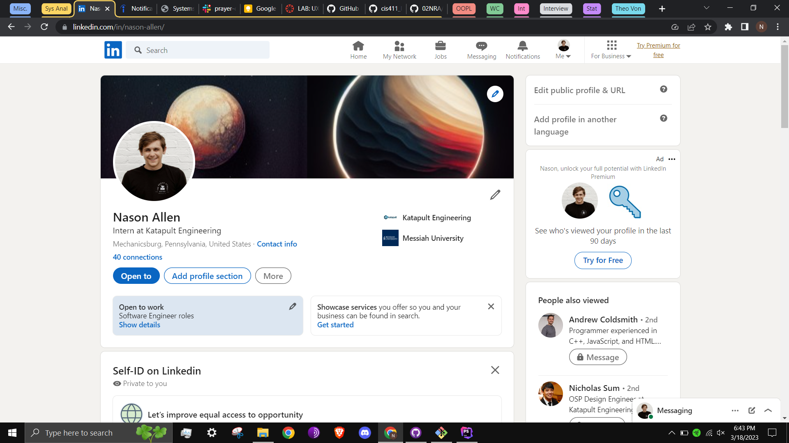
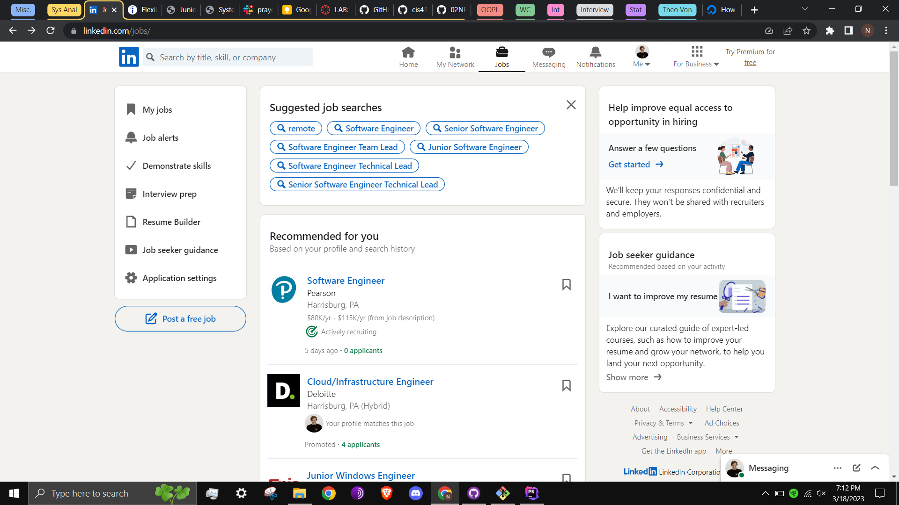
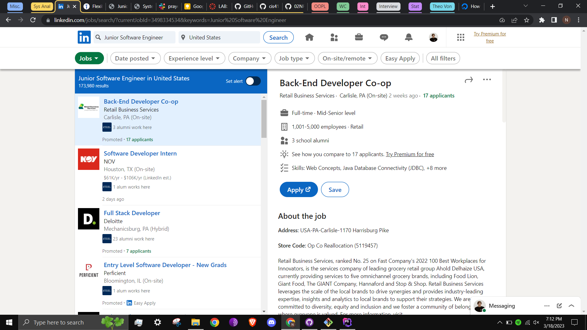
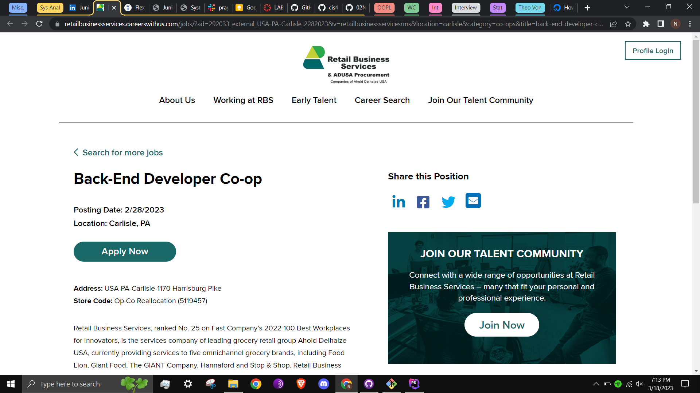
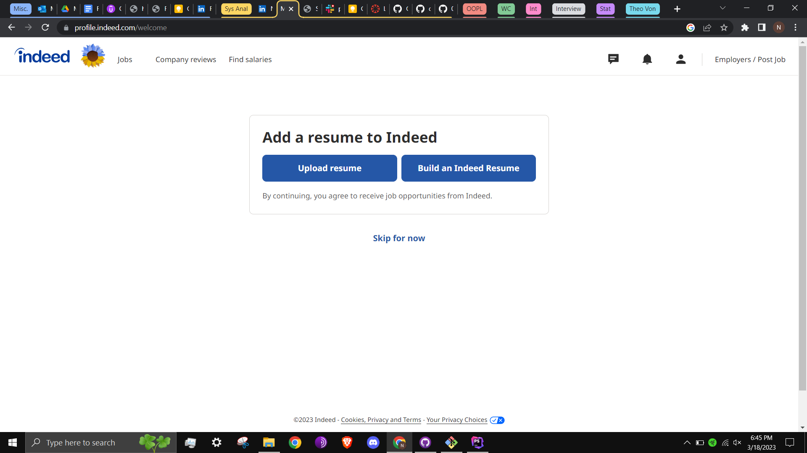
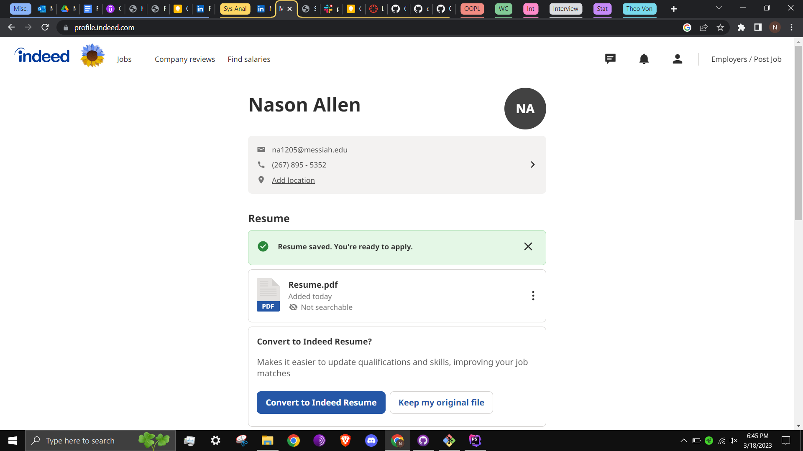
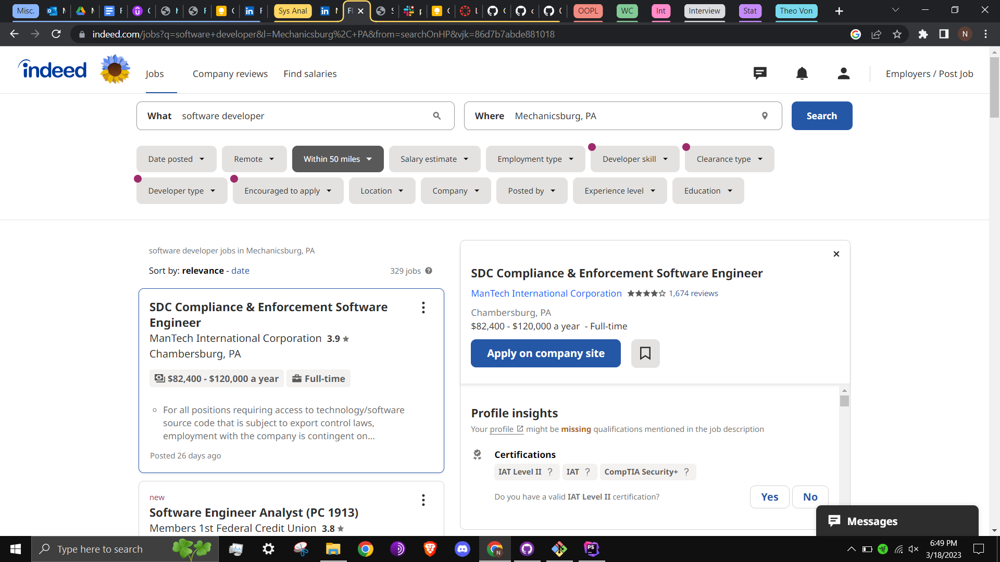
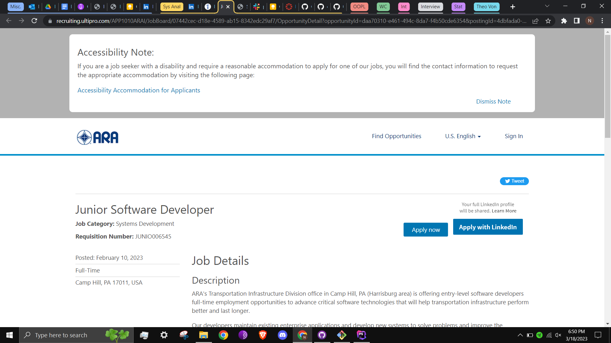

# Lab Report: UX/UI
___
**Course:** CIS 411, Spring 2021  
**Instructor(s):** [Trevor Bunch](https://github.com/trevordbunch)  
**Name:** Nason R. Allen  
**GitHub Handle:** 02NRA  
**Repository:** [https://github.com/02NRA/cis411_lab3_uiux](url)  
**Collaborators:**   Aidan Hubley (aidan-hubley), Justin Ayres (JDAyres), Andrew Roberti (Statmosphere), Jonothan Gaston (jg1579)
___

# Step 1: Confirm Lab Setup
- [x] I have forked the repository and created my lab report
- [x] If I'm collaborating on this project, I have included their handles on the report and confirm that my report is informed, but not copied from my collaborators.

# Step 2: Evaluate Online Job Search Sites

## 2.1 Summary
| Site     | Score | Summary |
|----------|-------|---|
| LinkedIn | 14    | Summary 1 |
| Indeed   | 20    | Summary 2 |

## 2.2 Site 1 - LinkedIn

I already had an account on LinkedIn, shown above. I do not like the multiple "edit" buttons on this page, I would prefer one to take me to a separate edit page, rather than working with pop-ups for each element.

The LinkedIn "Jobs" tab gives many options for narrowing searches. I would like more direction on this page; multiple items seem to have the same importance.

After clicking one of the tiles of suggested searches, I am led to the job listings page.

After pressing the "Apply" button, I was taken to the soliciting company's separately hosted job application page.

| Category | Grade (0-3) | Comments / Justification                                                                                           |
|---|-------------|--------------------------------------------------------------------------------------------------------------------|
| 1. **Don't make me think:** How intuitive was this site? | 3           | The designated tabs work as expected based on their visual design.                                                 |
| 2. **Users are busy:** Did this site value your time?  | 1           | The social aspect of LinkedIn makes it feel like it is trying to get me to spend more time than necessary with it. |
| 3. **Good billboard design:** Did this site make the important steps and information clear? How or how not? | 2           | LinkedIn uses color well.                                                                                          |
| 4. **Tell me what to do:** Did this site lead you towards a specific, opinionated path? | 1           | No; related to it not respecting my time, LinkedIn appears to encouraging endless scrolling and wandering.         |
| 5. **Omit Words:** How careful was this site with its use of copy? | 2           | LinkedIn used more text than its competitor below, though it generally observes the principle.                     |
| 6. **Navigation:** How effective was the workflow / navigation of the site? | 3           | The navigation is effective in achieving its purposes, though those purposes are not always aligned with mine.     |
| 7. **Accessibility:** How accessible is this site to a screen reader or a mouse-less interface? | 2           | I nagiated the website using a mousepad and do not require a screen reader                                         |
| **TOTAL** | 14/21       | I would describe LinkedIn overall as bloated or feature crept.                                                     |

## 2.3 Site 2 - indeed

I had to create an account on indeed for this project. Above is the profile menu after logging in using my Messiah Google account.

Uploading my resume took me to the profile page.

After clicking the "Jobs" tab and entering basic searh parameters, here is the results page. I do not like that the additional filter elements here are hidden in the initial search menu, before the page depicted here.

Through the search results, I was taken to the company's (third party's) website to actually apply. LinkedIn does something similar, but I would love to see an inductry standardized apllication form.

| Category | Grade (0-3) | Comments / Justification                                                                         |
|---|-------------|--------------------------------------------------------------------------------------------------|
| 1. **Don't make me think:** How intuitive was this site? | 3           | UI was very clean and clear.                                                                     |
| 2. **Users are busy:** Did this site value your time?  | 3           | I would say that it did value my time, as it did not waste it.                                   |
| 3. **Good billboard design:** Did this site make the important steps and information clear? How or how not? | 3           | Gave prompt screens when necessary, highlighted expected next actions with color.                |
| 4. **Tell me what to do:** Did this site lead you towards a specific, opinionated path? | 3           | I don't know if opinionated is the word that I would use, but it was specific, as denoted above. |
| 5. **Omit Words:** How careful was this site with its use of copy? | 3           | Words were used only when necessary.                                                             |
| 6. **Navigation:** How effective was the workflow / navigation of the site? | 3           | Excellently, it used tabs AND had few tabs at that.                                              |
| 7. **Accessibility:** How accessible is this site to a screen reader or a mouse-less interface? | 2           | I nagiated the website using a mousepad and do not require a screen reader.                      |
| **TOTAL** | 20/21       | Overall, indeed is one of the easiest and most effective websites I hve ever used.               |

# Step 3 Competitive Usability Test

## Step 3.1 Product Use Case

| Use Case #1 |                                                                                                                                              |
|---|----------------------------------------------------------------------------------------------------------------------------------------------|
| Title | Joining a Circle                                                                                                                             |
| Description / Steps | User receieves a join link via third party communication, navigates to it, and presses the "Join" button                                     |
| Primary Actor | A personal user                                                                                                                              |
| Preconditions | User already has a registered account, and is signed into that account on the device that they use to click the link. Circle already exists. |
| Postconditions | User is now a listed member of the circle, and can receieve notifications from it                                                            |

## Step 3.2 Identifier a competitive product

List of Competitors
1. [faithmeet](https://www.faithmeet.com)
2. [PrayerChainOnline](https://www.prayerchainonline.net)
3. [biblefolk](http://biblefolk.com)
4. [101ChristianSocialNetwork](https://www.101christiansocialnetwork.com)
5. [IndieGospel](https://indiegospel.net)

PrayerChainOnline is the subject of the below usability test.
## Step 3.3 Write a Useability Test

| Step | Tasks                                                            | Notes                                                                 |
|------|------------------------------------------------------------------|-----------------------------------------------------------------------|
| 1    | Donate to Prayer Chain Online                                    | Under the Donate tab, or under Help, both of which redirect to PayPal |
| 2    | Discover how to submit a prayer request                          | This is one of the first dropdowns under the Help tab                 |
| 3    | Find an estimate of how many prayer requests they have processed | Under the about tab, in blocks of text                                |
| 4    | Discover how to reset your password                              | Log In tab, then select "Forgot your password?"                       |
| 5   | Find the different methods of contacting the organization        | No phone number listed, only email  under Contact tab                 |

## Step 3.4 Observe User Interactions

| Step | Tasks | Observations                                                                                                    |
|------|---|-----------------------------------------------------------------------------------------------------------------|
| 1    | Donate to Prayer Chain Online  | Tester was able to find the donate page, but found it somewhat off putting that it did not prompt an amount.    |
| 2    | Discover how to submit a prayer request  | Tester was blocked from actually submitting a prayer request without logging in, but was able to find the menu. |
| 3    | Find an estimate of how many prayer requests they have processed  | Tester did not find this information to be intuitively placed, and felt he had to read too much to find it.     |
| 4    | Discover how to reset your password  | Tester was able to find this easily, as it was located where other websites normally locate it.                 |
| 5   | Find the different methods of contacting the organization  | No phone number listed, only email  under Contact tab. Tester found this odd                                    |

## Step 3.5 Findings
Website areas to improve:
1. Almost no interactive elements
2. Does not promote user confidence in security or functionality
3. Has too much text 
Website positives:
1. Has a straightforward structure
2. No bugs (overlapping HTML elements, loading screens, etc.)
3. Is approachable, which aligns with site goals (community, faith, etc.)

Team areas to improve:
1. Begin work sooner
2. Upon doing the above, ask clarifying questions about the instructions in class.
Team positives:
1. Speedy and clear communication
2. No disagreement on tasks

I believe that the elements evaluated in usability tests are things discovered in day-to-day usage of the internet, even if subconciously. I did not find this part too difficult, though this is likely a combination of good education and solid industry standards.

# 4. Your UX Rule (Extra Credit)
I mentioned in class: the layman loves color.
Even if the end user is unable to understand analyses or technical speak, people are attracted to colorful charts and menus.