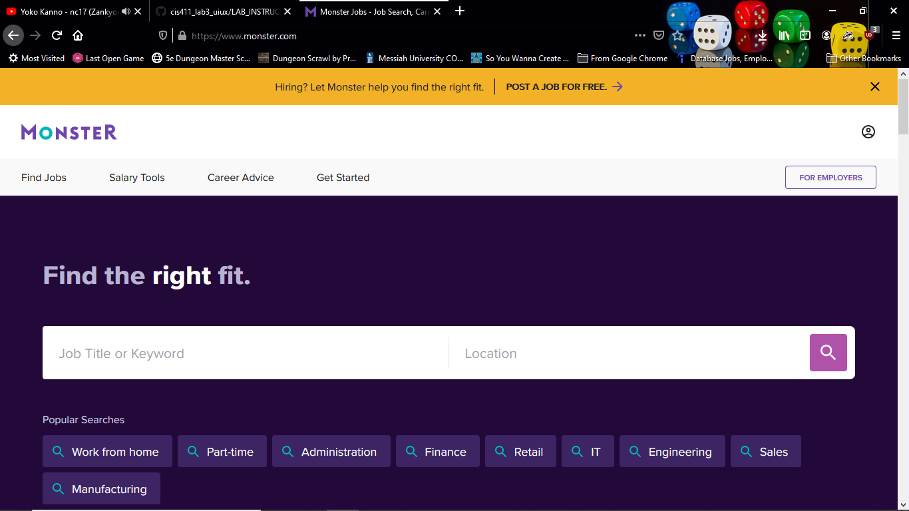
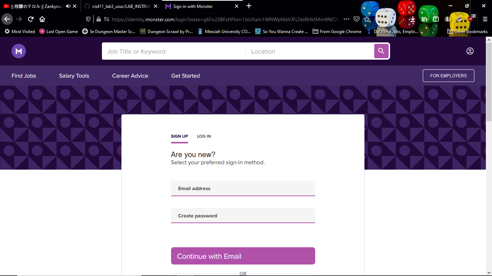
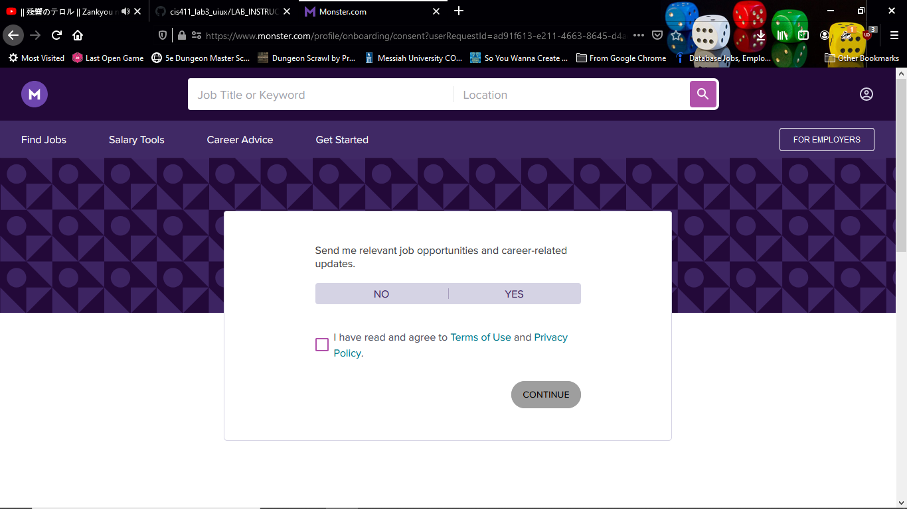
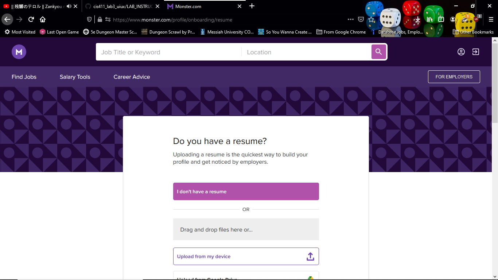
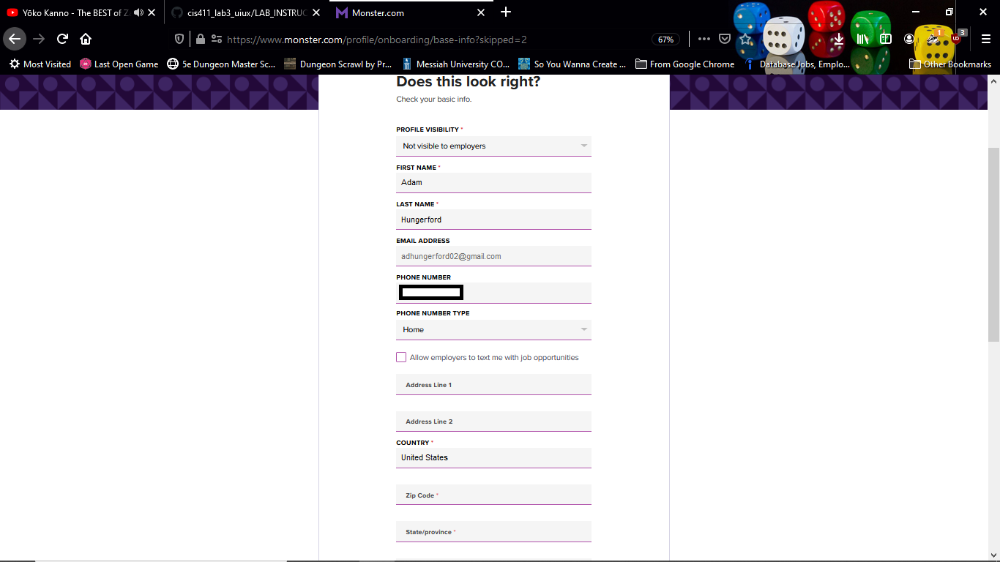
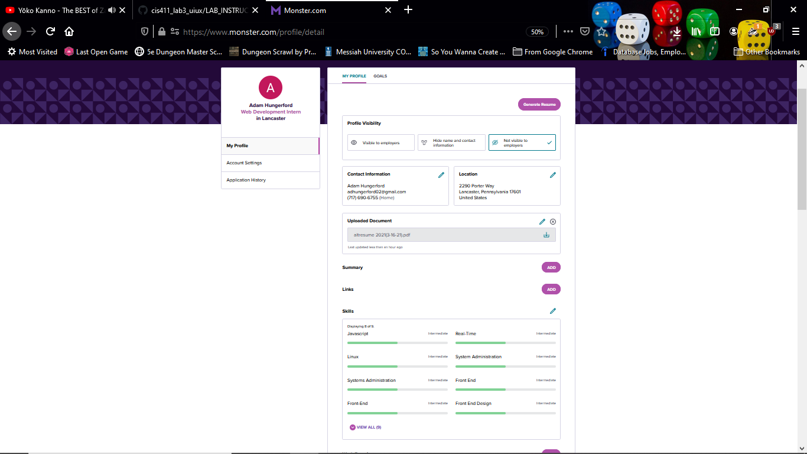

# Lab Report: UX/UI
___
**Course:** CIS 411, Spring 2021  
**Instructor(s):** [Trevor Bunch](https://github.com/trevordbunch)  
**Name:** Adam Hungerford
**GitHub Handle:** [Adamhungerford](https://github.com/adamhungerford)
**Repository:** https://github.com/adamhungerford/cis411_lab3_uiux
**Collaborators:** [Hallie Nicholas](https://github.com/hallienicholas), [Artur Donnelly](https://github.com/ArturD0nnelly)
___

# Step 1: Confirm Lab Setup
- [x] I have forked the repository and created my lab report
- [x] If I'm collaborating on this project, I have included their handles on the report and confirm that my report is informed, but not copied from my collaborators.

# Step 2: Evaluate Online Job Search Sites

## 2.1 Summary
| Site | Score | Summary |
|---|---|---|
| Monster.com | 14 | Not as bad as I expected, but lacking comparatively. |
| Indeed.com | 18 | Indeed doesn't dissapoint. |

## 2.2 Site 1

I had heard that Monster.com wasn't a great choice.

The landing page. Can't help but feel like something's missing here, but I'm not sure what it is. It feels like it lacks a cohesive site identity. https://www.monster.com/

The sign-in screen. https://monster.com/profile/detail redirects here.

After signing in with Google, I have to decide if I want to get emails from Monster. I refuse to be contacted. https://www.monster.com/profile/onboarding/consent?userRequestId=526578ff-dba3-451b-870e-b769d6e77aee&monsterProps=eyJsYW5ndWFnZVRhZyI6ImVuLVVTIiwicHJvbXB0TW9kZSI6IkxvZ2luIn0&state=g6Fo2SBaMFU0aVd4RHdwYjZ2UDVKTDNGUmctMW44YXAxQXM4cKN0aWTZIFMwZWZrTDZnelVkekQyZnFvX2FBM2JMc2Z2bTZJY01Ho2NpZNkgc0JudzcybTRPNkExYXh1T2dRcVAwRmg4bkg1enJEcmU

I can (and did) upload my resume. https://www.monster.com/profile/onboarding/resume

My resume has been turned into a profile. I've zoomed way out here to show you as much of the form as possible. https://www.monster.com/profile/onboarding/base-info?skipped=2

I've updated my profile with what I feel is necessary. Once again, I've zoomed out a bit. I think both this and the previous screen could benefit from some menus, instead of packing it all into one screen. https://www.monster.com/profile/detail

Searched for a front-end job. Besides name and location, there's no way to really filter these results as far as I can tell. https://www.monster.com/jobs/search?q=front-end+developer&where=Pennsylvania

I've selected a job. There's a lot of densely-packed text here - the bold helps some, but it's still difficult to parse. Also, a lot of it is redundant. I'm not sure how much of this is the fault of Monster and how much is the fault of the employer. https://www.monster.com/jobs/search?q=front-end+developer&where=Pennsylvania

| Category | Grade (0-3) | Comments / Justification |
|---|---|---|
| 1. **Don't make me think:** How intuitive was this site? | 2 | Despite what I had heard, I found Monster relatively intuitive, albeit lacking in some filtering options. |
| 2. **Users are busy:** Did this site value your time?  | 3 | The process was quick and I didn't feel as though I'd wasted my time. |
| 3. **Good billboard design:** Did this site make the important steps and information clear? How or how not? | 3 | At no point did I feel like the lede was buried. |
| 4. **Tell me what to do:** Did this site lead you towards a specific, opinionated path? | 3 | I felt guided along the whole process. |
| 5. **Omit Words:** How careful was this site with its use of copy? | 2 | Not terrible, but at times it almost felt too sparse. |
| 6. **Navigation:** How effective was the workflow / navigation of the site? | 2 | Fairly effective, but the persistent feeling that something was off distracted me. |
| 7. **Accessibility:** How accessible is this site to a screen reader or a mouse-less interface? | 2 | You can certainly do it. The biggest bump on the road was that I can't seem to get job descriptions to display on the job search. |
| **TOTAL** | 14 | Monster was better than I was expecting. |

## 2.3 Site 2

I already use Indeed.com.

Indeed's landing page. 

I already have an account with Indeed, so it's navigable from the landing. This menu, by the way, is very efficient.

My Indeed profile. Unlike Monster, this does have a separate "About Me" section.

Here's what searching for a job looks like. Plenty of filters; much more customizable than Monster search.

| Category | Grade (0-3) | Comments / Justification |
|---|---|---|
| 1. **Don't make me think:** How intuitive was this site? | 3 | I've always found Indeed very easy to use. |
| 2. **Users are busy:** Did this site value your time?  | 3 | You can hop right on Indeed and start looking; plus, the filters help you find what you're looking for even faster. |
| 3. **Good billboard design:** Did this site make the important steps and information clear? How or how not? | 3 | Everything you need to see is in a large font. |
| 4. **Tell me what to do:** Did this site lead you towards a specific, opinionated path? | 2 | There are a lot of side options on Indeed, which can be useful, but can also be a bit distracting. |
| 5. **Omit Words:** How careful was this site with its use of copy? | 3 | Indeed's copy is minimal and concise. |
| 6. **Navigation:** How effective was the workflow / navigation of the site? | 2 | Everything is light colors on white, which usually works, but sometimes obfuscates. |
| 7. **Accessibility:** How accessible is this site to a screen reader or a mouse-less interface? | 2 | It's difficult to use the filters with only a keyboard. Narrator, although it's not the ideal screen reader, is able to read mostly everything - except it stumbles on the filters as well. |
| **TOTAL** | 18  |   |

# Step 3 Competitive Usability Test

## Step 3.1 Product Use Case

| Use Case #1 | |
|---|---|
| Title | U.1 Calling an Engineer |
| Description / Steps | 1. User logs into interface, notices an issue.\2. User locates some kind of emergency button that connects them with a maintenance service.\3. A maintenance team is notified that there is an emergency.\4. An available engineer is dispatched to fix the issue.|
| Primary Actor | Water-drinker |
| Preconditions | 1. Interface is up and running.\2. Interface has one or more maintenance teams on call.\3. An engineer is available. |
| Postconditions | 1. The issue remains documented on the interface until the engineer reports it fixed, at which point it disappears.\2. Further issues require this process to repeat - in other words, multiple issues can be observed at the same time. |

## Step 3.2 Identifier a competitive product

List of Competitors
1. [Suez](https://www.suez-na.com/en-us)

Suez is the closest we could find to a competitor - they do water-related work in North America, including water towers.

## Step 3.3 Write a Useability Test

| Step | Tasks | Notes |
|---|---|---|
| 1 | Go to Suez in North America's landing page. | Different users may get different results without qualifying "North America." |
| 2 | Locate the "Contact" button and click it. | It's big and green - hard to miss. |
| 3 | Fill out the form with a request to service your local water tower - don't submit it. | Relatively speaking, this is a sizable form. |

## Step 3.4 Observe User Interactions

| Step | Tasks | Observations |
|---|---|---|
| 1 | Googled "suez water" first and found a slightly different site. Adding "north america" to the terms found the correct result. | This isn't really Suez's fault, though it's interesting that they have three different websites (parent company, MySuezWater, and corporate). |
| 2 | Located the Contact button easily. | We agreed it's a hard thing to miss. |
| 3 | Filled out the form to the furthest extent we could without submitting. | It's a comprehensive form. It wasn't clear exactly what the form would do after submission, but that may not necessarily be a UI/UX problem. |

## Step 3.5 Findings

### Improvements
1. I tried to go through this with a screen reader afterwards and it was a nightmare. Jumping up and down the page, reading random things...a whole mess.
2. There's a stray "Read Also" button at the bottom of the page that doesn't do anything.
3. No matter what you choose on "Your request concerns," the form asks you for your job title, which seems irrelevant in some cases.

### Praise
1. Color-coded UI elements (red warnings, green contact button). Each color-coded element is also usable by color-blind people because they come with accompanying symbols (a yield sign for warnings, for example) that conveys the appropriate information.
2. Site was extremely good at getting you where you need to go quickly - it took no more than two clicks to get to the contact form when starting from a search engine.

### Team Usability Test
1. The instructions were concise enough to be followed quickly.
2. It felt very short. It was unclear exactly how to lengthen it without writing an entirely new use case and usability test (and we were short on time). 
3. I feel prepared enough to write a longer one for the next time. Usability tests aren't as dry as I thought they would be, and I enjoy the feeling of writing concise instructions that are clear without being redundant.

# 4. Your UX Rule (Extra Credit)
**Cherish whitespace.** A UI that's too dense makes your users stop and read - the last thing they want to do. Effective use of whitespace helps clear your site up and forces you to put the most important things above the fold.