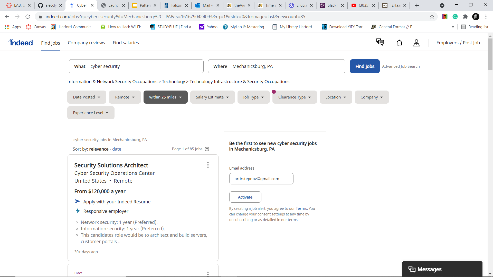
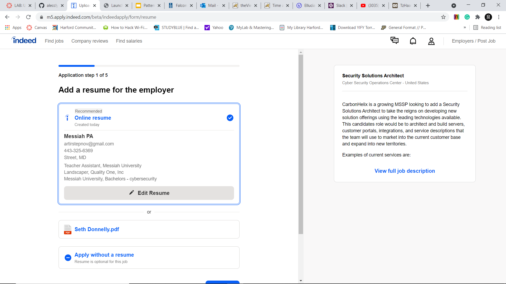
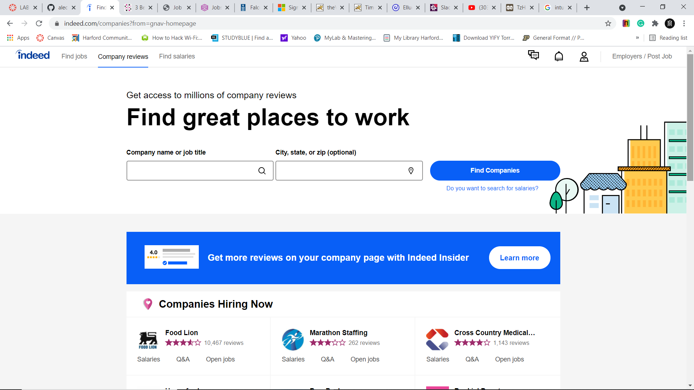
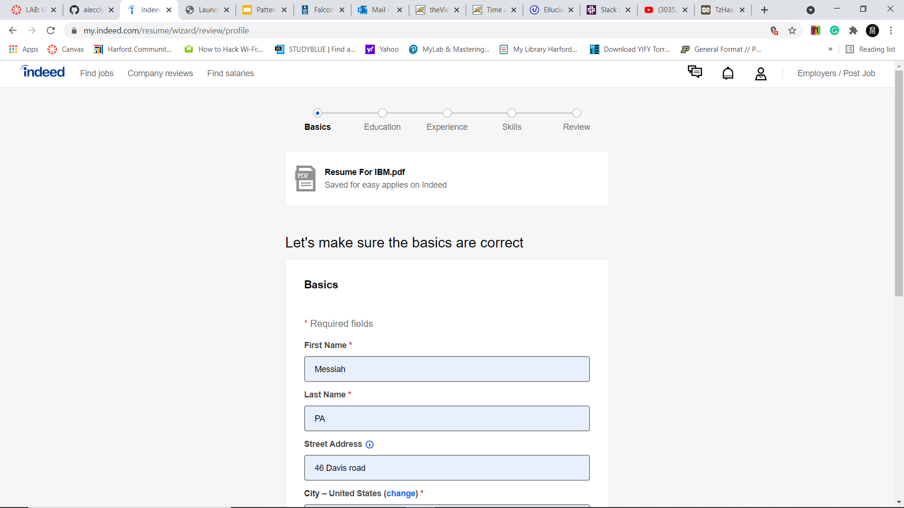
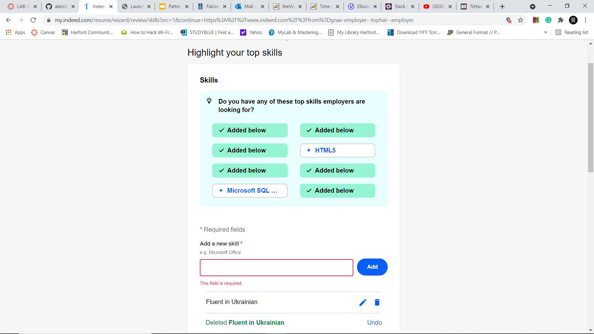
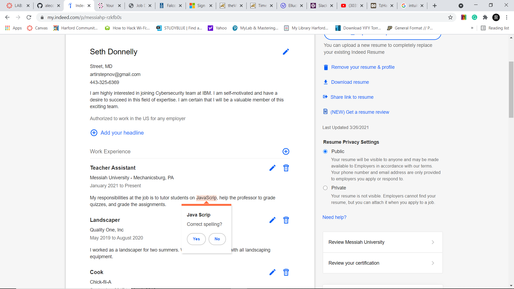
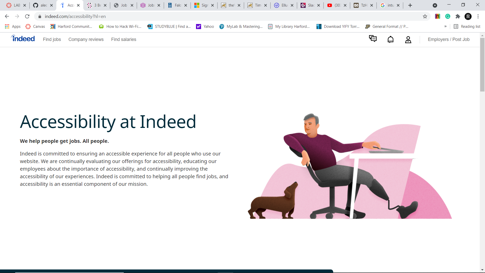
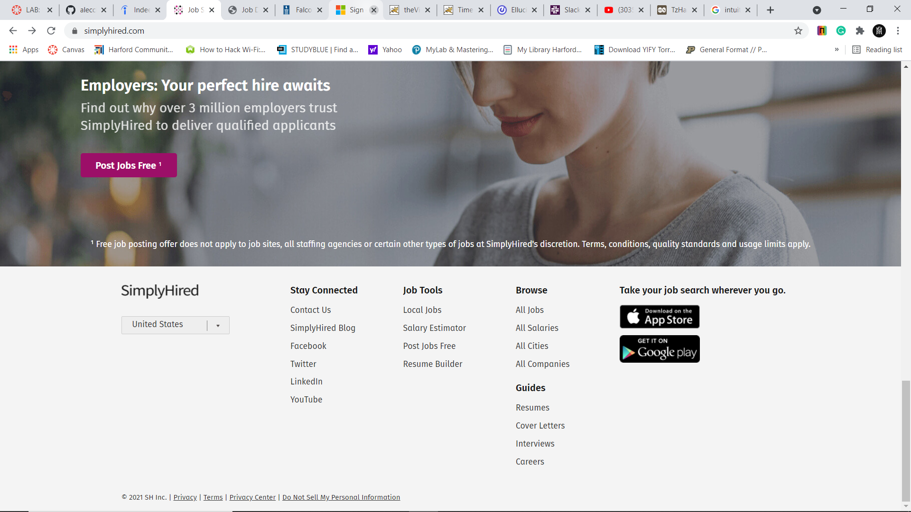
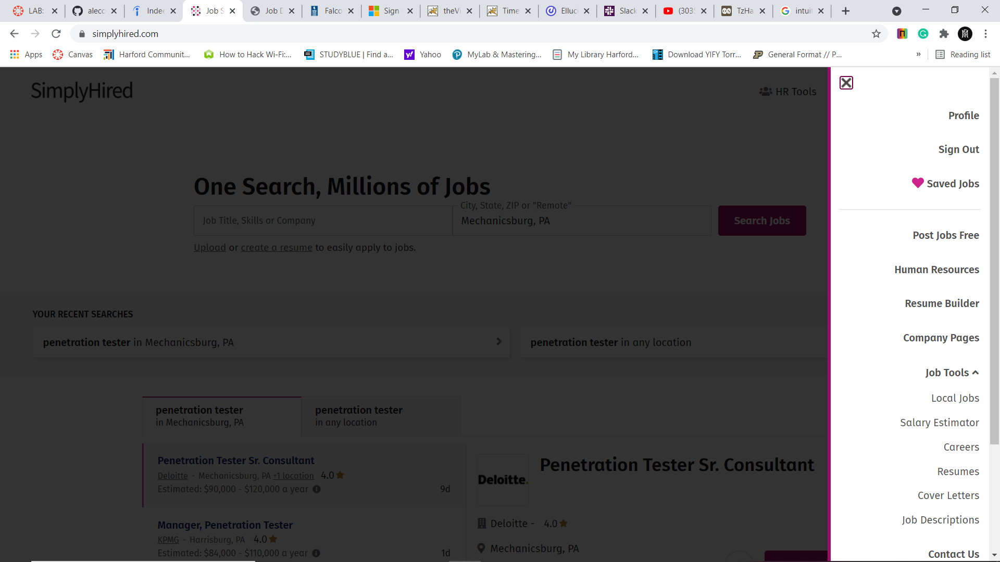
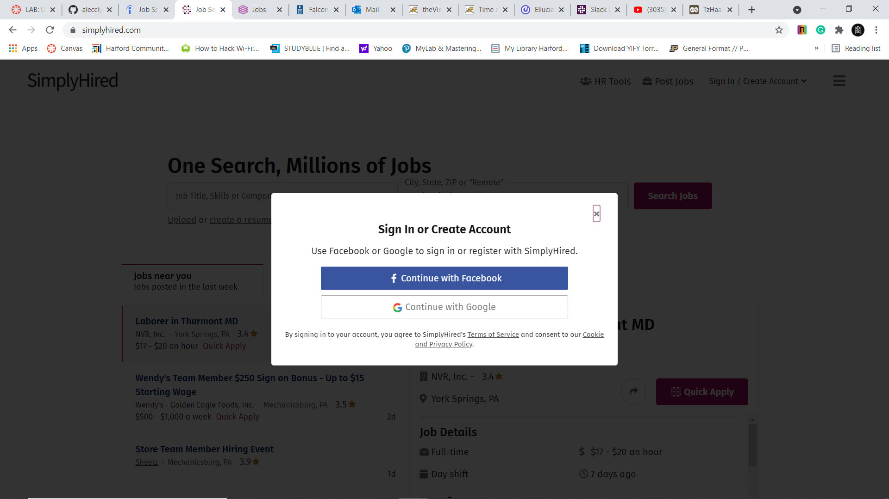

# Lab Report: UX/UI
___
**Course:** CIS 411, Spring 2021  
**Instructor(s):** [Trevor Bunch](https://github.com/trevordbunch)  
**Name:** Artur Donnelly  
**GitHub Handle:**  [@ArturD0nnelly](https://github.com/ArturD0nnelly)  
**Repository:** [Forked Repository](https://github.com/ArturD0nnelly/cis411_lab3_uiux)   
**Collaborators:**
___

# Step 1: Confirm Lab Setup
- [x] I have forked the repository and created my lab report
- [x] If I'm collaborating on this project, I have included their handles on the report and confirm that my report is informed, but not copied from my collaborators.

# Step 2: Evaluate Online Job Search Sites

## 2.1 Summary
| Site | Score | Summary |
|---|---|---|
| indeed.com | 21 | indeed.com is clean looking website with eassy sign up prosess and many futures. When signning up, it provides you visual anderstanding of how long it will take to sign in, by showing you the tabs that would need to be complete. There is no problmes signing up and by uploading the resume it will feel in some blanks using the information from resume. Searching for the jobs is couple step process and the results are most relevent with all information that is needet, like salary , location, ratings, discription. The website is also really clean without extra working or unneeded information. |
| simplyhired.com | 16 | simplyhired.com is well designed website that takes only couple minuts to sign up. On the begginning there is unnesesery information on the buttom. It shows the jobs around you. Without knowing what the person is looking for, thins information in unrelevent and not needet. When searching for the job it provides all information that is needet, like salary, location, ratings, discription. The website is really clean looking, has no unnesesery information, and provides most useful tabs. Unfortunatly navigation prosses is not perfoct and can be improwed. |

## 2.2 Site 1

1. 

Something that I really liked about indeed is that in allowed alot of options of how to search for the job. So, the user would have better experince looking for the job that is wanted.
 
2. 

One future that I have found interesting and I think really usefull is that indeed could create resume for you. The resume is created from the information that is entered during the sign-up.

3. 

I have found the companies reviews really helpfull. I really like that indeed has a tab where the user can look up the reviews on different companies. This future can be really helpful if the user doesn't have the company in mined.

4. 

When I was signing up, I really liked that it had a scale on the top that says what you need to complete to finish. This is really hepful if the person is really inpatient or doesn't have much time.

5. 

There was one thing that I found to be really annoying. When I was entering the skills I clicked enter without having the skill entered, and after that it would not let me move on to the next step without reloading the page. There is nothing much that I would do besids fixing this error.

6. 

One little thing that I thought was really interesting, is that indeed has it's owen speling check. This is really helpful, since many can make simple mistakes when feeling out the profile and the spelling errors would make the user look bad.

7.

I think that everyone deserves to be treated well. So, I really like that indeed is dedicated to provide enjoible experince to every user.

| Category | Grade (0-3) | Comments / Justification |
|---|---|---|
| 1. **Don't make me think:** How intuitive was this site? |  3 | Indeed is well intuitive website that provides a lot of choices and functions. Everything on the website is acceseble and there is not problem with figuaring out how things work. everything is clear and easy to uderstand. |
| 2. **Users are busy:** Did this site value your time?  |  3 | This website does values the time of the user. The sign up prosses is quick and easy. Even if the user is not signed up user can still search for the job positions without spending time on the sign up procces.   |
| 3. **Good billboard design:** Did this site make the important steps and information clear? How or how not? |  3 | Indeed did a great job presenting only information that is needet. When cleaking the search button, it shows only information that is needet for the job search. When the resolt list is up only needet information about the position in providet.  |
| 4. **Tell me what to do:** Did this site lead you towards a specific, opinionated path? | 3  |  Indeed is great with leading the person through the steps. When signing-up indeed leads you through the sign-up steps. Also, indeed leads you though the steps when applying for the job. |
| 5. **Omit Words:** How careful was this site with its use of copy? | 3  |  Indeed used as little words as posible while still covering all important information that user needs to know. |
| 6. **Navigation:** How effective was the workflow / navigation of the site? | 3  | Indeed has a menu bar on top of the site that is really useful to navigate yourself from job search to your ptofile, from your profile to salaries tab. Also, when applying fo the job, it is easy to go back ti make changes to the application.   |
| 7. **Accessibility:** How accessible is this site to a screen reader or a mouse-less interface? |  3 |  Indeed is great as supporting those with accessibility needs. The webside has the page that is dedicated to accessibility at indeed. On that page user can find everything that is needed to know if there is any accessibility chalenges. Also, indeed higly encoraging the users to give a feedback if tehre is something in accessibility area that they should work on. |
| **TOTAL** |  21 |   |

## 2.3 Site 2

1. 

Something that I have found to be really cool and helpful is the fact that simplyhired changed my email visualy, so no one who in not intended to see it would have acces to it. 

2. 

simplyhired has the resume builder that helps the user to build the resume. I really like that this webside helps the user to build the resume, so they can seccesfully ge the job.

3. 

simplyhired is really hlepful to find the job you are looking for, but I'm really disopointed that it doesn't show great accessibility. If I could do something about I would implement screen readers, also build the support group that would be able to help the user that has special needs.

4. 

A lot of things on the website were hiden on the top right corner tab. I would take some things like, company pages, and saved jobs to the top for better access.

5. 

I have found that it did not let me to connect my email. If I would like to get notefications on the email about potential jobs oppening, it could be problemetic. I would definatly allaw the email to be connected. Without the email user woudn't be able to to get notified about jobs oppenings or notefications from simplyhired.

6. 

When I was trying to sign up I have found that there was a proble with signing up using google account. So, all that was left is using faccebook account. This is really problemetic, especialy if the user doesn't have facebook acount. I would probably add more sign up opptions like, using emails, phone number, username and password, and many others. 

| Category | Grade (0-3) | Comments / Justification |
|---|---|---|
| 1. **Don't make me think:** How intuitive was this site? | 2  |  simplyhired.com is well intuitive website and there should be no problem finding things, or figuring out how something works. One thing that could be improved is to take some tabs out from the top right corner unroling tab, and place some of them on top foe essier access. |
| 2. **Users are busy:** Did this site value your time?  |  3 |  simplyhired has really fast sign up procces. Also, users are still able to search for the jobs even without signing-up. |
| 3. **Good billboard design:** Did this site make the important steps and information clear? How or how not? |  3 | simplyhired.com is really clean website where there is not much extra information or ditails at all. When searching for the jobs, only important information about the position is presented.  |
| 4. **Tell me what to do:** Did this site lead you towards a specific, opinionated path? |  2 |  simplyhired.com does really good job with sign-up proccess, where it takes just couple steps and job search. When searching for the job it tells you what to enter where and so on. One thing that simplyhired could have done better is take the user through the steps to set up the profile for comfterable use. After the user have sign-up, they are on their owen. |
| 5. **Omit Words:** How careful was this site with its use of copy? | 3  | simplyhired.com does not use much words while still still explaining everithing that they need to. The most words it uses on one page is all the way on the buttom where it includes sections like contect us, social medias, and so on.  |
| 6. **Navigation:** How effective was the workflow / navigation of the site? |  3 | The navigation on the webside felt pretty good. The website has the menu bar that is alway on the top, and if teh user is stuck, there is always the way back.  |
| 7. **Accessibility:** How accessible is this site to a screen reader or a mouse-less interface? | 0  | The website doesn't look to be working with people that have accessibility issues.   |
| **TOTAL** |  16 |   |

# Step 3 Competitive Usability Test

## Step 3.1 Product Use Case

| Use Case #1 | |
|---|---|
| Title | See the ditails of broken pump |
| Description / Steps | The Maintenance worker would have to open the tab with damaged hand water pumps, and select the one that is in thier area. |
| Primary Actor | Maintenance worker |
| Preconditions | The Maintenance Worker needs to be a member of maintenance Organization. The Maintenance worker is signed-up. The Maintenance worker autorized to view the data.  |
| Postconditions | The maintenance worker is able to view the list of broken water pumps in thier location. The maitenance worker was also able to view the details about selected water pump  |

## Step 3.2 Identifier a competitive product

List of Competitors
1. Competitor 1 [charity: water](https://www.charitywater.org/)
2. Competitor 2 [World Vision](https://www.worldvision.org/)

## Step 3.3 Write a Useability Test

### Charity: Water
| Step | Tasks | Notes |
|---|---|---|
| 1 | Find the fundraise page |  The user should open the fundraise page through involvement tab |
| 2 |  Sign up | The user needs to sign up in order to creat fundraiser campain  |
| 3 |  Create the campain |  The user needs to come up with the name and amount of money that they wish ro come up with |
| 4 | Make first donation to created campaign |  To make a donation user has to enter the bank card information or use paypal |
| 5 |  Invite more people into the campaine | To invite more people to the campain user is providet with the options to use facebook, twitter. User also can use their owen options of spreding the word about this campain  |

## Step 3.4 Observe User Interactions

### Charity: Water
| Step | Tasks | Observation |
|---|---|---|
| 1 | Find the fundraise page |  After making visual observation of the page partisipent have choce to click on "Get Involved Tab". From there partisipent choce to click on Fundraiser tab. Participant coment that it was wairly eassy to find.|
| 2 |  Sign up | After I told the participant to sign up, he quickly clicked sign-in tab. After asking him why he did that, he said: "I clicked sign-in knowing that if I don't have an account, it will give me the opptions to sign-up". The participant was pleased to know that his predicament was right. After entering email, name, and password, participant was instenly signed up. The participant said that he expected it to have more uptions of how the user could sign-up. |
| 3 |  Create the campain |  After i told the participant to create the campain, it took couple seconds to remember that he have saw the button to creat the campain on fundraiser page. The participant said that It probably would have take him longer to find where to create the campain at, if he would visit the fundraiser page before. After finding were to create the campaign all that participant had to do is enter the name for the campaign and amount of money the he would like to rais. The participant was pleasantly suprised how little it requiered to create the campaign. He said: "I though it would take a lot more steps than that, and that I would need to provide a lot more information. |
| 4 | Make first donation to created campaign |  To make first donnation into earlier created campaign participant have first clicked on the donate button. Where he have found that donation to his campaign can not be made from there. After that participant nevigated to "Get Involved tab" where from he navigated to "Support a Campaign". After that he have searched the name of early created campaign, which was "Need water for summer", and have found one that he have created. To donate he entered the amount and hist name, where from he proccede to entering banking information or chosing PayPal. The participant have said that it was somewhat frustrated that he had to look hard for the campaign that he have created. Also, he said that donation procces was really simple and easy, and that after knowing where the campaign is stored it is no problem to get to it. |
| 5 |  Invite more people into the campaine | To invite more people to the campain user is providet with the options to use facebook, twitter. User also can use their owen options of spreding the word about this campain  |

## Step 3.5 Findings
Organize your findings here.

# 4. Your UX Rule (Extra Credit)
If you opt to do extra credit, then include it here.