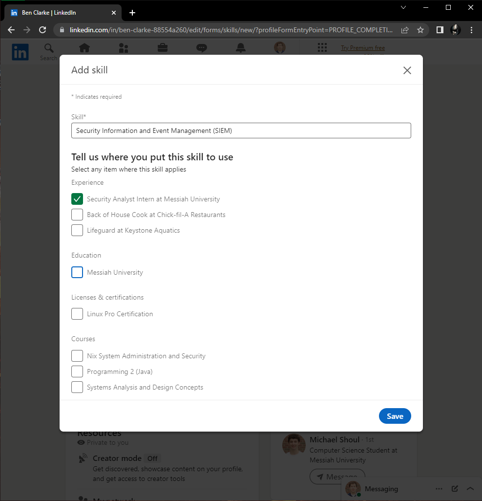

# Lab Report: UX/UI
___
**Course:** CIS 411, Spring 2023  
**Instructor(s):** [Trevor Bunch](https://github.com/trevordbunch)  
**Name:** Ben Clarke  
**GitHub Handle:** BenOfTheOneRing  
**Repository:** [Forked Repository](https://github.com/BenOfTheOneRing/cis411_lab3_uiux)  
**Collaborators:** m-shoul, jp1478, R-B1509, timkratz, Sturty75
___

# Step 1: Confirm Lab Setup
- [x] I have forked the repository and created my lab report
- [x] If I'm collaborating on this project, I have included their handles on the report and confirm that my report is informed, but not copied from my collaborators.

# Step 2: Evaluate Online Job Search Sites

## 2.1 Summary
| Site | Score | Summary |
|---|---|---|
| LinkedIn | 3 | Very well made and usable |
| Handshake | 1 | Has promise but also has a view major issues that have a major negative affect.  |

## 2.2 Site 1
### Captions and steps: 

I already had a LinkedIn account before this lab. 

I navigated to my main page [LinkedIn](https://www.linkedin.com/in/ben-clarke-88554a260/) using a bookmark on Chrome. 

 
I clicked on the add profile section, clicked on the "core" button, and then hit the add skills button. 

 
I clicked on the SIEM button. 

 
I clicked where I use the skill which is in my Security Analyst internship.

 
I clicked save and clicked the far top right exit button.

 
I clicked on the jobs button at the top nav bar which took me to the [job page](https://www.linkedin.com/jobs/). Then clicked on one of my recent job searches.

 

It took me to that previous job search. I clicked on the of the listed jobs and hit apply. 

 
That took me to the [application website](https://www.linkedin.com/jobs/)

| Category | Grade (0-3) | Comments / Justification |
|---|---|---|
| 1. **Don't make me think:** How intuitive was this site? | 2 |The site was generally very intuitive, no major issues and the layout was fine.    |
| 2. **Users are busy:** Did this site value your time?  |3   |The site did not have unnecessary pages or popups that distracted from my tasks.    |
| 3. **Good billboard design:** Did this site make the important steps and information clear? How or how not? |3   |Everything is clearly labeled and stands out.   |
| 4. **Tell me what to do:** Did this site lead you towards a specific, opinionated path? |2   |This site lead me to where I wanted to go. I believe there are multiple ways to complete what I did, but I would have had to search for those other ways.   |
| 5. **Omit Words:** How careful was this site with its use of copy? |3   |No long paragraphs of information. Kept things simple and precise   |
| 6. **Navigation:** How effective was the workflow / navigation of the site? |3   |Very easy to use and visible nav bar made navigation easy |
| 7. **Accessibility:** How accessible is this site to a screen reader or a mouse-less interface? |2   |While I cannot have 100% certainty as I do not use those systems, the app seems to use alt attributes for its pictures which would at least allow for a screen reader to work well. |
| **TOTAL** | 3  |Very intuitive and easy to use website   |

## 2.3 Site 2
### Captions and steps: 

I already had a Handshake account before this lab. I googled handshake and clicked on the 2nd to last recommendation that popped up. 

That link took me to my [inbox](https://app.joinhandshake.com/stu/conversations#334554864). It actually took me a while to figure out where my actual profile/skills section may be under as the username circle is small and is in the very far top right of the page. This could be easily fixed my creating a section of the main left nav bar entitled "Profile". 

After clicking my username circle I clicked My profile on the drop-down.

That took me to my [Profile Page](https://app.joinhandshake.com/stu/users/25363308) 

I scrolled down to find my skills. 

I typed SIEM in the search bar and clicked add SIEM skill. 

SIEM was then added to my skills. 

I clicked on the Jobs part of the top nav bar and was taken [here](https://app.joinhandshake.com/stu/postings).

 
I scrolled down the right bar to find the Apply Externally button. 

 
Clicking the button created this popup which I could then use to attach/submit my resume and move to the external site. 

| Category | Grade (0-3) | Comments / Justification |
|---|---|---|
| 1. **Don't make me think:** How intuitive was this site? | 1   |While the other aspects were fine, attempting to find my profile took me a lot longer then it really should have. I had to actively think and look for my profile page.    |
| 2. **Users are busy:** Did this site value your time?  |3   |Aside from making me search for my profile page this site did not waste my time   |
| 3. **Good billboard design:** Did this site make the important steps and information clear? How or how not? | 1 | It did not make my profile page clear at all. The other steps were fine.    |
| 4. **Tell me what to do:** Did this site lead you towards a specific, opinionated path? | 2  |Yes, it very clearly and easily lead me to the jobs page.   |
| 5. **Omit Words:** How careful was this site with its use of copy? | 3   |No issues with copy. No paragraph long buttons or anything that stood out negatively.   |
| 6. **Navigation:** How effective was the workflow / navigation of the site? |1  |Once again, my profile picture/name being such a small part and in such a distant part of the screen made it hard to navigate where I wanted. The other aspects of the nav bar are clear.   |
| 7. **Accessibility:** How accessible is this site to a screen reader or a mouse-less interface? | 1   |Once again I do not know the in and outs of accessibility as I do not use those programs, however Handshake does not have alt attribute tags for screen readers. This makes it less accessible than LinkedIn.   |
| **TOTAL** | 1 | Bad, has promise and the clear ability to be a good website, but it has a few major drawbacks that make it more of a chore to use  |

# Step 3 Competitive Usability Test

## Step 3.1 Product Use Case

| Use Case #1 | |
|---|---|
| Title | Listing an item|
| Description / Steps | 1. User clicks on the Sell button.   2. User chooses a category from a list that corresponds to the type of item they are selling.   3. User uploads photos of the items.   4. The user will add a title, description, and price of the item they want to sell.   5. User can review the listing and then click the post button to officially post it.   |
| Primary Actor |Messiah student |
| Preconditions |1. Have a Messiah Account   2. User must be logged into the app   3. User must have a item to list and a photo and a description. |
| Postconditions |User will have an item listed and available to sell |

## Step 3.2 Identifier a competitive product

List of Competitors
1. Competitor 1 [Facebook Marketplace]([https://www.facebook.com/marketplace])
2. Competitor 2 [Craigslist]([https://harrisburg.craigslist.org/])

## Step 3.3 Write a Useability Test

| Step | Tasks | Notes |
|---|---|---|
| 1 |Open the Facebook marketplace|   |
| 2 |login or create an account|   |
| 3 |Find a lawn mower that is being sold|   |
| 4 |Save the listing|   |
| 5 |Return to home|    |
| 6 |Find the saved listing|   |

## Step 3.4 Observe User Interactions
### Important notes: 
This was completed on an iPhone 13 pro and user has already used Facebook Marketplace in the past. 
 

| Step | Tasks | Observations |
|---|---|---|
| 1 |Open the Facebook marketplace|Sees the bottom row of options which includes the marketplace symbol and she knows she needs to touch it. Hits button and is taken to marketplace home page. **Reaction:** Hitting the marketplace button was quick and easy.
   |
| 2 |login or create an account|Was already logged into app  |
| 3 |Find a lawn mower that is being sold|Easily accomplished.  Sees a search symbol of a magnifying glass at the top of the mobile page. Clicks magnifying glass.   **Reaction:** Action was simple and obvious. Sees the search bar and knows she needed to type in lawn mower and then hit the bright blue search button. Types in and presses search button. |
| 4 |Save the listing|Easily accomplished.  Sees several listings for lawn mowers, they have pictures, touching one increases the details she can see, after scrolling she can see info and the symbol to save.  The save button is obvious in the middle. Clicked save button, it tells her the item is saved by coloring in the button with blue from its normal grey.     |
| 5 |Return to home|Hits back button, and is taken to the search page for lawn mowers. Hits back button again, is taken to the search bar which automatically brings up the keyboard.  Hits the back button again. Is taken to the marketplace home page.   |
| 6 |Find the saved listing|Some frustration.  Sees the account person symbol, touches it, is taken to the "you" page and sees a saved items button. She presses the button and is taken to the "saved" page.  The marketplace saved area has collection categories which she does not like because she did not set those up and they still take up place.  She can see the top 2 latest saved items but would like to be able to see more.   The latest saved are under the “your latest saved listings” header, but to see the full list you have to hit the "more" button under the “latest from your wishlist”. She doesn’t like that Facebook uses the terms wishlist and saved listing for the same list. That makes her confused and frustrated because it requires effort and would be an easy change to make.    |
## Step 3.5 Findings
### Improvements
I believe there are a few improvements that could be made to the process finding, saving an item, and then viewing said item.  

1st The "saved" page needs to show more saved items. It only showed two on the page which frustrated the user. By removing the "collections" section, especially when the user does not utilize that section, more saved items could be shown. 

2nd The "saved" page needs to change it wording. To reach the full list of saved items, you have to click on the "see full list" button underneath the "latest from your wishlist" header. This is confusing since the app is using different terms to refer to the same things. This would be a very easy fix, just change wishlist to saved list. 

3rd Having to click three times and go through two pages to go from a listing to the homepage seems unnecessary. The app could include a click and hold feature on the back button to take the user to the homepage to solve this problem. 

### Benefits 
The majority of the Facebook Marketplace is well-made. Having the saved icon turn to a different color helped the user to know that her action happened and was recorded. 

Also, having symbols for the marketplace and other pages on the bottom nav bar made navigation understandable and easy. 

### Thoughts
I think my team did a great job at creating the usability test. We came up with a simple six step test which successfully tested the app's usability.

I think my team could improve by having slightly clearer communication about what device we are supposed to use for the test. I was unsure of whether I should use a mobile or PC device until I directly contacted the Team Lead. 

Surprisingly easy yet complicated. Actually giving the commands was easy. However, recording the users numerous thoughts and comments took some concentration. I found myself sometimes having to stop them so I could adequately process what they had just said. 
Overall, it was a positive experience. 

# 4. Your UX Rule (Extra Credit)
### The less clicks the better
Often when I am navigating the website, the more clicks I have to make to reach where I want to go the more frustrated I become. 

Clicks seem to be a great measurable metric for how long or complicated it is for someone to reach something. I would rather click once and go to my profile page, then click once, then get a drop-down menu, and then click again, get another drop-down, and then have to click again to get to my profile page. 