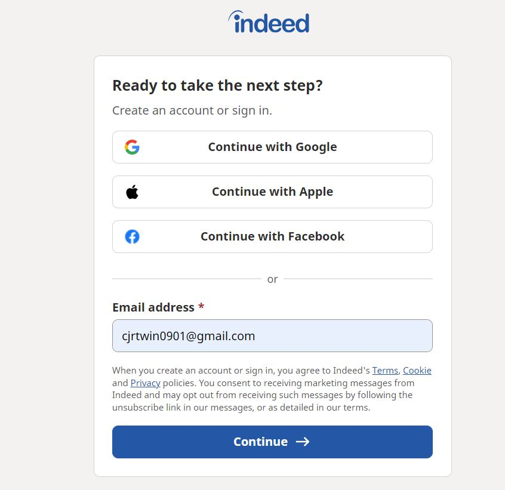

# Lab Report: UX/UI
___
**Course:** CIS 411, Spring 2021  
**Instructor(s):** [Trevor Bunch](https://github.com/trevordbunch)  
**Name:** Colin Robson  
**GitHub Handle:** @CRobson9000  
**Repository:** [Your Forked Repository](https://github.com/CRobson9000/cis411_lab3_uiux/blob/main/LAB_INSTRUCTIONS.md)  
**Collaborators:**
    @loganossman
    @eg1272
    @ay1191
    @GlorKehmH
___

# Step 1: Confirm Lab Setup
- [x] I have forked the repository and created my lab report
- [x] If I'm collaborating on this project, I have included their handles on the report and confirm that my report is informed, but not copied from my collaborators.

# Step 2: Evaluate Online Job Search Sites

## 2.1 Summary
| Site | Score | Summary |
|---|---|---|
| Indeed | 18.5 | Overall, this site was very user-friendly and easy to use.  Its simplicity made my experience great, but sometimes it was lacking in features.  There were also a couple of areas where I wasn't sure quite what steps to take to use a feature.  The job search pages were fantastic because they utilized whitespace very well and the information was precise.     |
| Glassdoor | 17.8 | This site felt a little cluttered and there was a lot of navigation that felt useless, but I felt more in control of my experience as a whole.  The steps were more organized and I knew exactly what I needed to do and they flowed better.  I could find all of the features I was looking for (after some digging) because they were mostly where I expected them to be. |

## 2.2 Site 1: Indeed
### Screenshots of Indeed
#### Sign Up Page

#### Profile Creation Page

#### Job Preferences Page

#### Job Search Page

| Category | Grade (0-3) | Comments / Justification |
|---|---|---|
| 1. **Don't make me think:** How intuitive was this site? | 2.5   | This site was very easy to use and follows the structure of a lot of similar recruiting sites, which definately makes it more intuitive. The journey to get to a lot of the most important parts of the sites is simple, and this is shown by the fact that I don't have a lot of screenshots.  The only unintuitive thing I saw was on the job preferences page, I couldn't figure out a way to add things to the "Not Interested" section of the page.  |
| 2. **Users are busy:** Did this site value your time?  | 2.7  | Like I said before, the navigation in this site is very good which makes the experience a lot faster.  Sometimes, I feel like websites have too many "in between" pages, but this website didn't, which helped me accomplish my task quicker.  Also, there were many places where you could use other pre-existing accounts to login or fill in information, which also helped me save time.   |
| 3. **Good billboard design:** Did this site make the important steps and information clear? How or how not? | 2.8  | I feel like this site had good "road signs" to direct me where to go.  The home screen has a big "billboard" which says 'We help all people get jobs' which clearly shows their mission. The next thing you see is a search bar to search for jobs, which also highlights the main point of the site. |
| 4. **Tell me what to do:** Did this site lead you towards a specific, opinionated path? | 2.2 | This site very obviously wants me to search for a job from the very beginning and this is seen in my previous response as well.  When I was creating my profile, it gave me steps to follow in order to complete all of the parts, which really helped improve my experience.  As I stated before, I couldn't figure out how to add things to the section I wasn't interested in.  I would've also really liked to be able to add more than one job title I'm interested in.    |
| 5. **Omit Words:** How careful was this site with its use of copy? | 2.8 | This site was very simple, so they did a very good job at only including the information that I really needed.  The pages didn't feel cluttered with text.  They also made very good use of white space which my eyes were thankful for.   |
| 6. **Navigation:** How effective was the workflow / navigation of the site? | 2.7 | Like I've stated before, I feel like this site has a very clean navigation, which is streamlined to provide the user with the best experience.  They don't bury the most important parts of the site under layers of navigation, which I appreciate as a user.  |
| 7. **Accessibility:** How accessible is this site to a screen reader or a mouse-less interface? | 2.8 | This site is accessible and organized in a way that everyone could use the information.   |
| **TOTAL** | 18.5 / 21  |   |

## 2.3 Site 2
Insert Recorded Screenshots with captions and steps.

#### Home Page: Account Creation

#### After Sign-in Page: Home Page

#### Profile Creation: Start

#### Profile Creation: Import LinkedIn Profile

#### Job Preferences Page

#### Initial Job Search Page

#### In-Depth Page for a Job

| Category | Grade (0-3) | Comments / Justification |
|---|---|---|
| 1. **Don't make me think:** How intuitive was this site? | 2.7  |  This site was also very intuitive.  I knew where to find everything I would need because certain kinds of elements just belong in certain places.  They did a really nice job at playing to where users expect things to be.  I could find everything I was looking for and was able to accomplish my tasks without question. |
| 2. **Users are busy:** Did this site value your time?  | 2.3  |  This site also had places where you could use previous work or different accounts to fill in specifc items, which helped me save time.  Overall, I felt that sometimes, this site's features were sometimes buried under too many confirmation screens or "in-between" screens, which added more time to my experience. |
| 3. **Good billboard design:** Did this site make the important steps and information clear? How or how not? | 2.7 | This site was similar to Indeed in that it was very good at showing you that it was a job searching site at its core.  It also had tutorial screens, which showed me exactly what I needed to complete in order to finish my profile.  Overall, I feel that Indeed did a bit of a better job at articulating a more specific message where as with this site, you can tell what it's used for, but it doesn't have a particular message or thing that it tries to do different from other sites. |
| 4. **Tell me what to do:** Did this site lead you towards a specific, opinionated path? | 2.9 | I feel like this site was a bit more user friendly because it gave me complete control over how I could create my profile.  I could have multiple job titles I was interested in and I could just overall be more specific with this site than with Indeed on my profile.  This was probably because I felt like this site's instructions were a little more thought out and the process of creating a profile was better streamlined and organized.   |
| 5. **Omit Words:** How careful was this site with its use of copy? | 2.1 | The job searching page was a little more crowded with information than I wanted it to be.  It didn't use as much whitespace as Indeed and, even though it was organized well, I thought that the job previews could've been a little more concise. |
| 6. **Navigation:** How effective was the workflow / navigation of the site? | 2.3 | As I said before, it felt like some of the important features were hard to get to because I had to click through a lot of screens.  Sometimes the user journey felt longer than it needed to be, which means that maybe there was a bit too much navigation. |
| 7. **Accessibility:** How accessible is this site to a screen reader or a mouse-less interface? | 2.8 | This site was very organized.  I liked that the overall page didn't scroll, but the two columns of information on the job search page did.  I felt like this was cleaner and easy to use, which makes it more palletable for all kinds of users. |
| **TOTAL** | 17.8 / 21  |   |

## Step 3.1 Product Use Case
Project: Spark Worship (formally named Worship Together)

Note: Group members handles included above 
 
| Use Case #1 |  |
|---|---|
| Title | Personal Contacts |
| Description / Steps | &nbsp; -Internally, navigate to the event page in our app to find people willing to play for your event within the area.  Externally, people can scour social media platforms for people who play instrumentments, find their social media handles, then share the event with them through the app.   &nbsp; -Navigate to the event’s primary page to share worship events to all of your friends on social media in order to gain more attention and market your event.   &nbsp; -Establish connections between team members through messaging by navigating to the messaging tab on the specific event's home page.   &nbsp; -Add people to a created worship event by searching for their name or account id in the "Add Instrumentalists" tab on the event's main page.
| Primary Actor | Individual user engaged with the app |
| Preconditions | &nbsp; -Event leader has to download the app   &nbsp; -Event leader has to create an account   &nbsp; -Event leader has to connect social media handles to their account or connect their own social media account to their spark worship account.  
| Postconditions | &nbsp; -People who were reached out to can either accept the invitation or decline.  &nbsp; -Then, they need to download the app and make an account to be put into the event.   &nbsp; -Once they’ve downloaded the app and made an account, they’ll have access to the event resources and features like messaging.  
 
## Step 3.2 Identifier a competitive product
 
List of Competitorss
1. Competitor 1: [Services](https://www.planningcenter.com/services)
2. Competitor 2: [Vessel Worship](https://www.vesselworship.org/)
3. Competitor 3: [Church Center](https://churchcenter.com/setup)
 
## Step 3.3 Write a Useability Test
### Tested Site: Vessel Worship 

| Step | Tasks | Notes |
|---|---|---|
| 1 | Creating an account | -The steps the user must go through to create their account.   -Registration/Login, possible email verification.
| 2 | Creating a team | -Adding team members to your team   -Gathering team members info   -Communicating with them through some kind of message platform.
| 3 | Creating a service | -Setting a time for the service   -Setting a date for a service   -Selecting team members/roles for the service.
 
## Step 3.4 Observe User Interactions
### Tested Site: Vessel Worship
#### Some helpful images of Vessel 

#### Sample of participant info: unalligned buttons

#### Adding a service to your event:  as you can see, the placeholder text looks like it's "locked in", which caused some confusion

#### This is where you add people to a team.  When our tester clicked on the plus button on this page, it wouldn't work.  We could only add a team member from the homepage.  

| Step | Tasks | Observations |
|---|---|---|
| 1 | Creating an account  | -Confusion with confirmation placeholder   -After selecting your role, it gave an option to add people or services, but this wasn’t intuitive and he didn’t really know what this part wanted him to do so he skipped it.   -On the home page, there was text that made it seem like you were locked into being just a leader, but in reality there are other roles that you can be. |
| 2 | Creating a team | -He tried to search for people he wanted to add to his team.  When this search was unsuccessful, he realized that you first have to manually create profiles for your team members, then add these to your team.  This was not intuitive from the start.   -For most of the pages, Android’s back button did not function as intended   -Some buttons are off-center when you press the team tab when you’re on the team page.   -He didn’t know where to find the people that he’s added on the team page.  He tried adding a person, but then he coudldn't find where that person was.   -Design is not intuitive at all, probably requires organizational training for anyone to use it. 
| 3 | Creating a service | -When creating a service, he felt confused because he kept clicking the date that he wanted his service to be on and then when he tried to create the service, it wouldn’t let him.  He quickly realized that the service time looked like it was set because of the placeholder text’s color but it wasn’t, which is why it wasn’t letting him create his service.   -When this was happening, there wasn’t any feedback about what he was doing wrong, it just highlighted the entire box red. |

## Step 3.5 Findings
1. Prove at least 3 improvements that can be made to usability/workflow
     * Sign-up Clarity: 
       * Add simple confirmations like “Your email is invalid” or “You left ‘x’ field blank”.
       * More accurate placeholder text that describes what they want the user to do better.
     * Beneficial Feedback: 
       * When creating a service, giving more specific feedback about what the user is doing wrong.
       * Creating a basic tutorial for first-time users.
     * Streamlined Communication:
       * The main form of communication in this app as it stands now is mass emails to every team member.
       * A solution to this is utilizing instant messaging capabilities like an in-app group chat or channel of some kind.  
  
2. Outline at least 2 experiences in the usability/workflow that were beneficial
   * All the team managing features we were looking for were present and this app was the best competitor that we found, which was helpful because it took a while to find an app that was like ours.
   * There was a dark mode and it overall had a clean aesthetic even though all the functionality wasn’t there.
3. What do you believe your team did well in conducting a usability test?
   * We tried to see ourselves as one of our personas or an average user for the app instead of as a very experienced software user.
   * We did a good job at breaking down the app into its three main functions, expressing the primary avenues a user would go down.  
  
3. Offer a brief statement about your experience conducting a usability test.
   * Conducting a usability test really opened our eyes into how we will need to develop our app’s ui. Based on what we noticed in our competitor, it will be very important to have a clean design that ensures an intuitive user journey without tremendous roadblocks. 