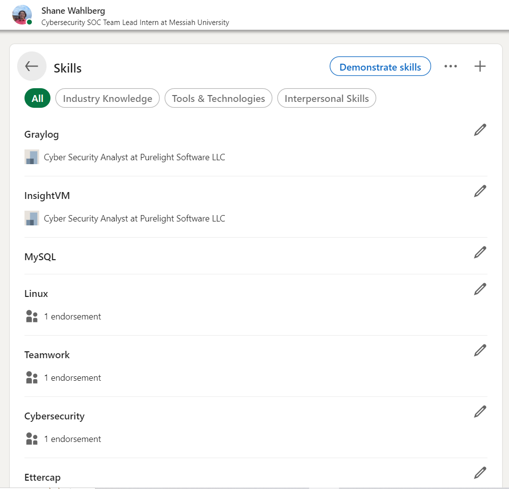
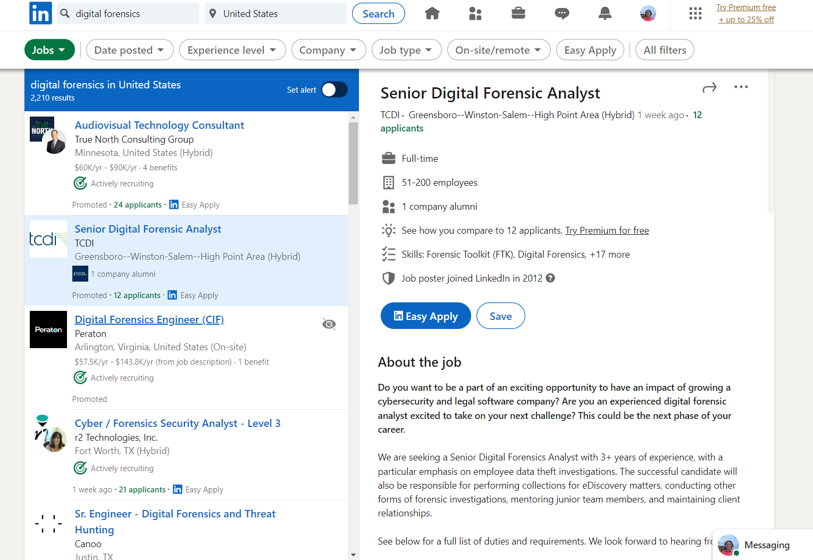
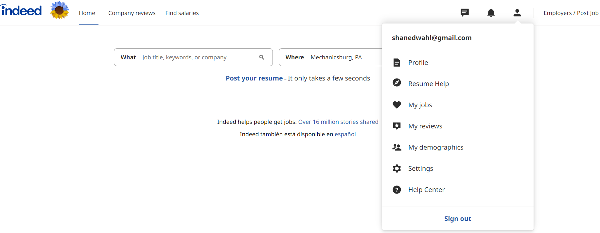
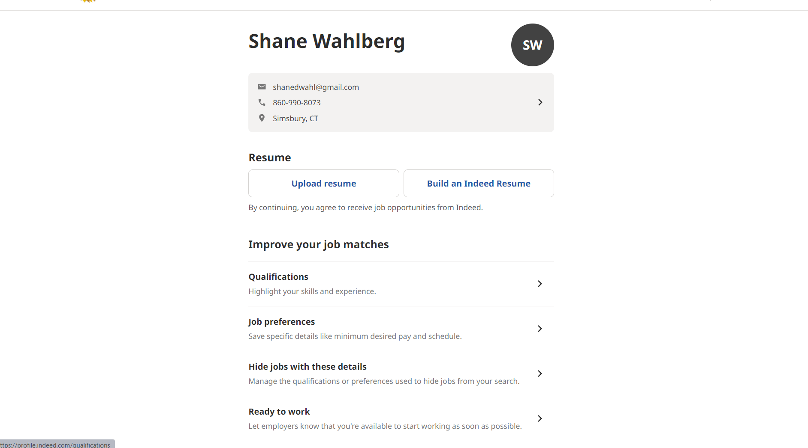
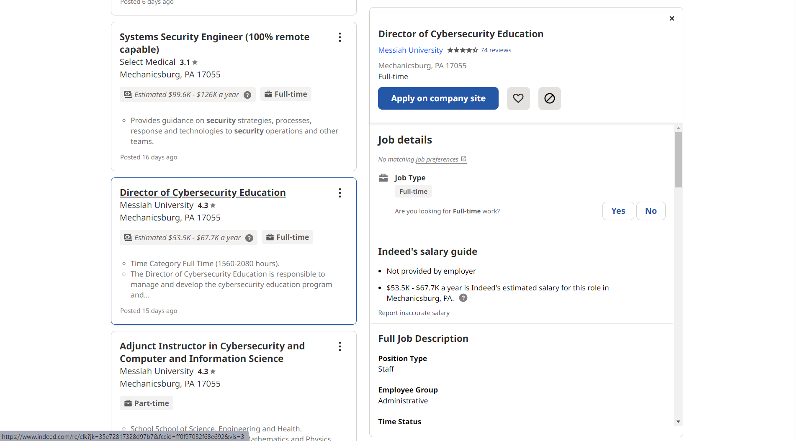

# Lab Report: UX/UI
___
**Course:** CIS 411, Spring 2021  
**Instructor(s):** [Trevor Bunch](https://github.com/trevordbunch)  
**Name:** Shane Wahlberg
**GitHub Handle:** CuriousOcean 
**Repository:** Your Forked Repository  
**Collaborators:**   
___

# Step 1: Confirm Lab Setup
- [X] I have forked the repository and created my lab report
- [ ] If I'm collaborating on this project, I have included their handles on the report and confirm that my report is informed, but not copied from my collaborators.

# Step 2: Evaluate Online Job Search Sites

## 2.1 LinkedIn Summary Summary
| Site | Score | Summary |
|---|---|---|
| LinkedIn | Score 1 | Summary 1 |
| Indeed | Score 2 | Summary 2 |

## 2.2 LinkedIn

Step 1: Since I already had a LinkedIn profile, I displayed the ease of accessibility to find my profile. As one can see, in the top right there is a drop-down menu that gives me multiple options for my accounts, such as "View Profile", "Settings and Privacy", "Help" and much more. 

Step 2: Here I am able to add/remove/change any skills that I have learned during my career. I also have the ability to add certifications, and reviews from co-workers. 

Step 3: Here I was able to type into the search bar on the top and search for a job. I had a multitude of options within my search, such as location, experience level, job type, company, date the job was posted, and even if the job was on site or remote. 

LinkedIn has a unique feature where you can apply with your LinkedIn account, which includes your resume. This is one of its best features, as it cut back on time that would be wasted filling in information already on your resume.

| Category | Grade (0-3) | Comments / Justification |
|---|---|---|
| 1. **Don't make me think:** How intuitive was this site? | 3 | It was very intuitive. Everything felt natural and enjoyable.  |
| 2. **Users are busy:** Did this site value your time?  | 3  | It very much did. I felt like LinkedIn was clear and concise about every feature and what they did. |
| 3. **Good billboard design:** Did this site make the important steps and information clear? How or how not? | 3  | It did. Like I said earlier, they were very clear with what everything did and how it could help me.  |
| 4. **Tell me what to do:** Did this site lead you towards a specific, opinionated path? | 2 | Kinda. It jobs specific to my query, but also offered similar jobs.  |
| 5. **Omit Words:** How careful was this site with its use of copy? | 3  | Very careful.  |
| 6. **Navigation:** How effective was the workflow / navigation of the site? |  3 | I was able to navigate with ease. Even if I could get lost, I would be able to read and figure out where I was.  |
| 7. **Accessibility:** How accessible is this site to a screen reader or a mouse-less interface? |  3 | It was very accessible to both screen reader and mouse-less interface.  |
| **TOTAL** | 21  | A+  |

## 2.3 Indeed
Insert Recorded Screenshots with captions and steps.

Step 1: Right off the back, the website blasts me with so much white space. The icons are all in a soft grey, struggling to stand out and become noticable. It offers me a position to create a profile and add it, and get help for my resume and saved jobs or demographics.

Step 2: Again, quite an ugly page. I'm blasted with white space, hurting my eyes. I have the ability to edit my profile and upload resume, or build a unique Indeed Resume... which eats away at my time. 

Step 3: Once again, Indeed loves the brightness of their website. I think in total the only bright thing is the sunflower by their logo on the first picture. Here I was able to find several jobs for my search query of "cyber security". I had the option of deciding my location. Interestingly enough, Indeed does not have their own unique application system. They merely point me in the right direction for the role of "Director of Cybersecurity Education", offering a link to Messiah's website. 

| Category | Grade (0-3) | Comments / Justification |
|---|---|---|
| 1. **Don't make me think:** How intuitive was this site? | 2  | It was clear and concise.  |
| 2. **Users are busy:** Did this site value your time?  |  1 | No it did not. It wanted me to make a unique Indeed resume.  |
| 3. **Good billboard design:** Did this site make the important steps and information clear? How or how not? | 2  |  The website was boring and bland. It had extra options for stuff like demographics and reviews, but they do not seem important to me. |
| 4. **Tell me what to do:** Did this site lead you towards a specific, opinionated path? | 1.5 | Yes, it provided me with a position. But it did not offer filtering by experience.  |
| 5. **Omit Words:** How careful was this site with its use of copy? |  1 | Not at all   |
| 6. **Navigation:** How effective was the workflow / navigation of the site? |  1 |  It was terrible. It wastes my time and hurts my eyes. |
| 7. **Accessibility:** How accessible is this site to a screen reader or a mouse-less interface? |  3 |  For all its faults, this is the one thing that Indeed is successful at. |
| **TOTAL** | 11.5  | F  |

# Step 3 Competitive Usability Test

## Step 3.1 Product Use Case

| Use Case #1 | |
|---|---|
| Title | Finding a Recipe |
| Description / Steps | The user is hungry and bold, deciding to try something new. They log into their account and search in the query "Grilled Reuben Sandwich". RecipeForSuccess will display a recipe with its skill level(If the skill level is higher than the users, it will warn the user). The user will follow the directions and steps and have the option of leaving a review, sharing the recipe, and taking a photo of their final product. |
| Primary Actor | User who is hungry and wants to try a new recipe. |
| Preconditions | User has an account and ingredients for desired recipe. |
| Postconditions | User is able to create the recipe. |

## Step 3.2 Identifier a competitive product

List of Competitors
1. Competitor 1 [www.bbcgoodfood.com](www.bbcgoodfood.com)
2. Competitor 2 [www.paprikaapp.com](www.paprikaapp.com)
3. Competitor 3 [tasty.co](tasty.co)

## Step 3.3 Write a Useability Test

| Step | Tasks | Notes |
|---|---|---|
| 1 |   |   |
| 2 |   |   |
| 3 |   |   |
| ... |   |   |
| n |   |   |

## Step 3.4 Observe User Interactions

| Step | Tasks | Observations |
|---|---|---|
| 1 |   |   |
| 2 |   |   |
| 3 |   |   |
| ... |   |   |
| n |   |   |

## Step 3.5 Findings
Organize your findings here.

# 4. Your UX Rule (Extra Credit)
If you opt to do extra credit, then include it here.