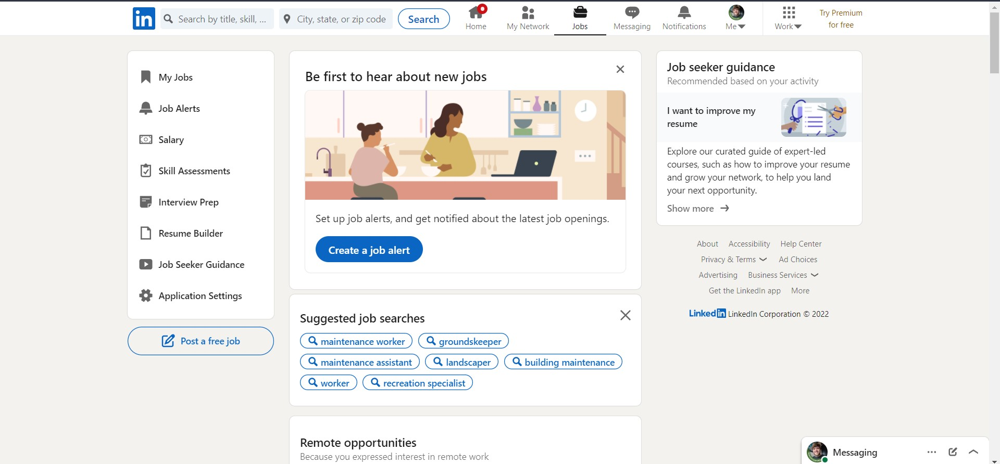
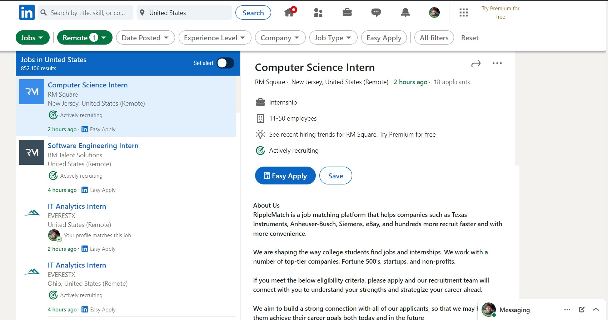
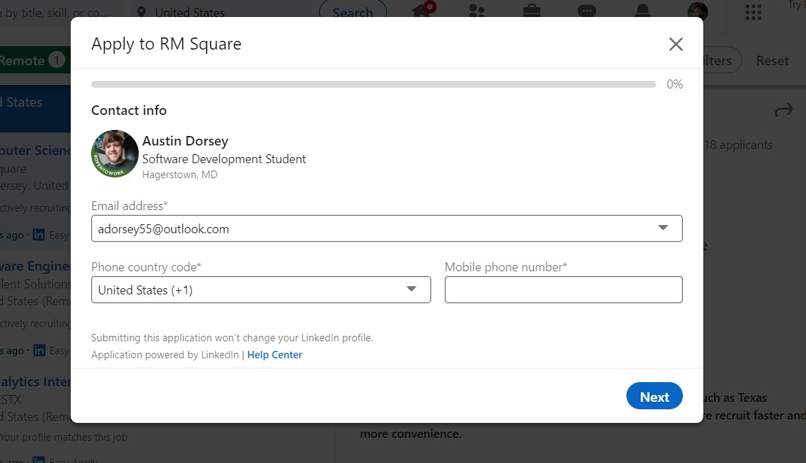
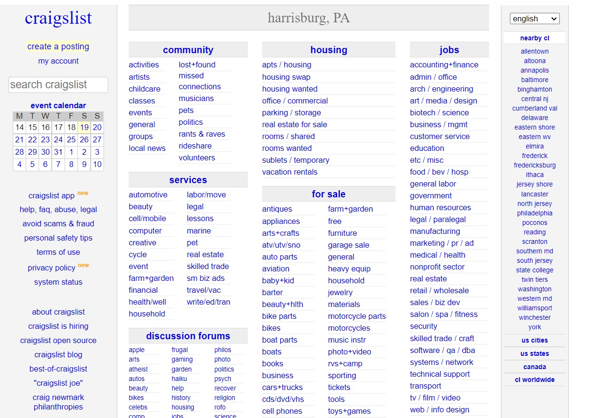
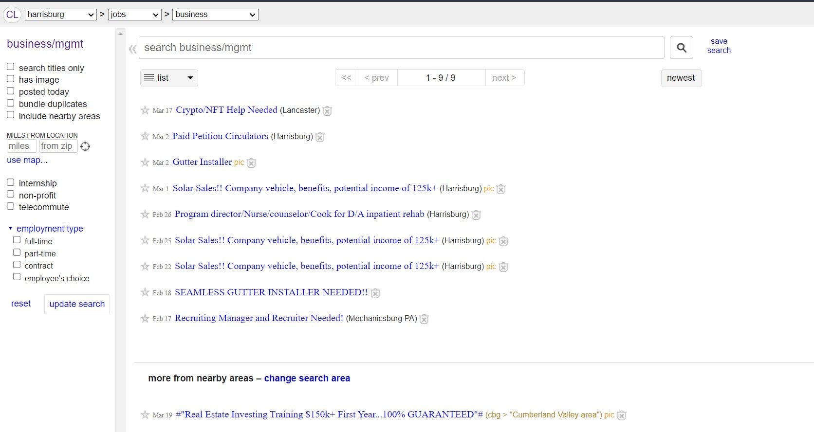
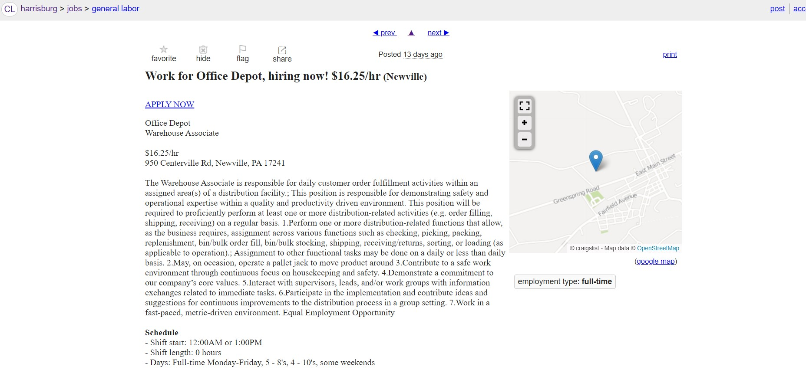
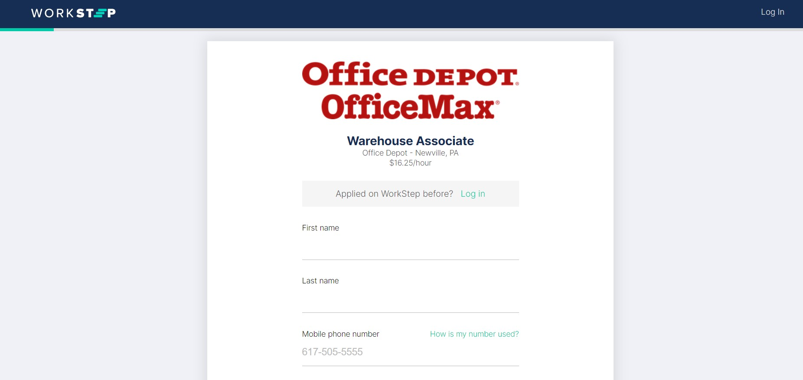

# Lab Report: UX/UI
___
**Course:** CIS 411, Spring 2021  
**Instructor(s):** [Trevor Bunch](https://github.com/trevordbunch)  
**Name:** Austin Dorsey  
**GitHub Handle:** Dorsecles 
**Repository:** https://github.com/Dorsecles/cis411_lab3_uiux 
**Collaborators:**  kfirestone25, ag1454, ryandonat 
___

# Step 1: Confirm Lab Setup
- [X] I have forked the repository and created my lab report
- [X] If I'm collaborating on this project, I have included their handles on the report and confirm that my report is informed, but not copied from my collaborators.

# Step 2: Evaluate Online Job Search Sites

## 2.1 Summary
| Site | Score | Summary |
|---|---|---|
| LinkedIn | 21 | LinkedIn is a great site to find jobs and make connections. |
| Craigslist | 7 | Craigslist is a terrible site filled with scammers where the user can buy and sell. It also allows users to find and post jobs. |

## 2.2 LinkedIn

Firstly the user should navigate to the Jobs section on the navigation bar.

Then the user should click on a job they are interested in.

Finally the user should go through the steps provided on the job's application.

| Category | Grade (0-3) | Comments / Justification |
|---|---|---|
| 1. **Don't make me think:** How intuitive was this site? |  3 | LinkedIn is very easy to use.  |
| 2. **Users are busy:** Did this site value your time?  | 3  |  The site is easy to navigate and values the user's time. |
| 3. **Good billboard design:** Did this site make the important steps and information clear? How or how not? |  3 |  LinkedIn is well organized and it is easy to navigate so the user can find what they need |
| 4. **Tell me what to do:** Did this site lead you towards a specific, opinionated path? | 3  | LinkedIn brings the user through the steps and uses progress bars to show the user where they are in the process  |
| 5. **Omit Words:** How careful was this site with its use of copy? | 3  | Everything is straightforward.  |
| 6. **Navigation:** How effective was the workflow / navigation of the site? | 3  |  A user can easily navigate the site. |
| 7. **Accessibility:** How accessible is this site to a screen reader or a mouse-less interface? |  3 | LinkedIn has a mobile app and helps increase accessibility.  |
| **TOTAL** | 21  |   |

## 2.3 Craigslist

Firstly the user needs to navigate to jobs on the site.

Then the user needs to look for a job that interests them.

The user should navigate to the job's page.

Finally the user should find the application and fill it out.

| Category | Grade (0-3) | Comments / Justification |
|---|---|---|
| 1. **Don't make me think:** How intuitive was this site? |  1 |  The site was cluttered and while the user can find what they need it requires a bit of thinking. |
| 2. **Users are busy:** Did this site value your time?  |  1 | The clutter of the site causes the user to lose time.  |
| 3. **Good billboard design:** Did this site make the important steps and information clear? How or how not? |  1 | The site does not help the user to find anything on their site.  |
| 4. **Tell me what to do:** Did this site lead you towards a specific, opinionated path? | 1  | The site makes the user find things for themselves.  |
| 5. **Omit Words:** How careful was this site with its use of copy? |  1 | The site is cluttered.  |
| 6. **Navigation:** How effective was the workflow / navigation of the site? | 1  |  Navigation was terrible because of all the clutter and links. |
| 7. **Accessibility:** How accessible is this site to a screen reader or a mouse-less interface? | 1  |  This site is not very accessible. |
| **TOTAL** |  7 |   |

# Step 3 Competitive Usability Test

## Step 3.1 Product Use Case

| Use Case #1 | |
|---|---|
| Title |Finding a Location |
| Description / Steps |1. User logs onto account. 2. User will navigate to community map if not there. 3. User will filter results. 4. Users will choose desired location   |
| Primary Actor |Hiker |
| Preconditions |1. User must have an account 2.Locations are already on the app 3. Connection to internet|
| Postconditions |1. After the location is picked the user should be able to see more information on the location.  |

## Step 3.2 Identifier a competitive product

List of Competitors
1. Competitor 1 [alltrails.com](https://www.alltrails.com/)
2. Competitor 2 [Gaia GPS](https://www.gaiagps.com/)

## Step 3.3 Write a Useability Test

| Step | Tasks | Notes |
|---|---|---|
| 1 | Search for a location  | The user should be able to search for trails by their city |
| 2 | Log in  |  The user should be able to log into their account |
| 3 | Navigate to Alltrails shop  |  The user should be able to press the button to get to the shop |
| 4 | Filter difficulty of trails  | User should navigate to explore page and select difficulty of the trail.  |

## Step 3.4 Observe User Interactions

| Step | Tasks | Observations |
|---|---|---|
| 1 |Search for a location   |   They were able to do it|
| 2 |  Log In | They were able to do it  |
| 3 | Navigate to Alltrails shop  | They were able to do it  |
|4  | Filter difficulty  |  They were able to do it with some trouble |

## Step 3.5 Findings
It is important for things to be intentionally placed in a website to help users navigate it easier.

# 4. Your UX Rule (Extra Credit)
Have a balance of positive and negative space. Too much negative space is boring. Too much positive space is overwhelming.