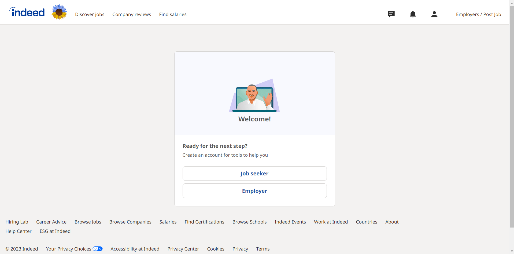

# Lab Report: UX/UI
___
**Course:** CIS 411, Spring 2021  
**Instructor(s):** [Trevor Bunch](https://github.com/trevordbunch)  
**Name:** Justin Ayres 
**GitHub Handle:** JDAyres  
**Repository:** https://github.com/JDAyres/cis411_lab3_uiux  
**Collaborators:** ChatGPT, aidan-hubley, Statmosphere, 02NRA, jg1579
___

# Step 1: Confirm Lab Setup
- [x] I have forked the repository and created my lab report
- [x] If I'm collaborating on this project, I have included their handles on the report and confirm that my report is informed, but not copied from my collaborators.

# Step 2: Evaluate Online Job Search Sites

## 2.1 Summary
| Site | Score | Summary |
|---|---|---|
| LinkedIn | 18/21 | Overall, LinkedIn's Job application UI experience is well-designed and user-friendly, with a few areas for improvement in terms of overwhelming layouts and limited filter options. However, the site values the user's time and provides a straightforward application process, and is designed to be accessible to all users. |
| Indeed | 17/21 | Overall, Indeed's job application UI experience is generally user-friendly and effective, but there are some areas for improvement, such as the cluttered job listing page and the confusing profile completion form. The site could also be more accessible to users with disabilities.|

## 2.2 Site 1: LinkedIn

**Step 1:** Navigate to the Jobs tab

What to do: At the top of the screen just to the right right of the center select the "Jobs" tab which is also shown with a brief case logo.

Notes: The LinkedIn UI is generally user-friendly, and this step is straightforward. However, I find the top navigation menu to be a little cluttered.

**Step 2:** Begin Job Search

What to do: Once In the "Jobs" tab, type in the specific job title or field you are interested in, as well as the location where you want to work.

Notes: The search function works well and provides useful suggestions for job titles and locations. However, the search results can be overwhelming, especially for popular job titles, and may require further filtering.

**Step 3:** Viewing Search Result

 What to do: Click the "Search" button to see a list of job openings that match your search criteria.

 Notes: The search results page is well-organized and provides relevant job openings. However, some might find the page layout a little overwhelming or cluttered.

**Step 4:** Narrow Down Your Search

What to do: Use the filters on the left-hand side of the page to narrow down your search results by company, experience level, job function, industry, and more.

Notes: The filters are useful and provide a convenient way to refine search results. However, some users might find the filter options limited or not specific enough.

**Step 5:** Select and View Job

What to do: Click on a job listing to learn more about the position, including the job description, qualifications, and application instructions.

Notes: The job listing page is well-designed and provides relevant information about the job. However, since that this is controlled  by the company the format can vary.

**Step 6:** Start Application Process

What to do: If you are interested in applying for the job, click the "Apply" button and follow the application instructions provided by the employer.

Notes: The application process is straightforward, and the "Apply" button is easy to find. However,since the application process is created by the company the application experience may vary between applications.
| Category | Grade (0-3) | Comments / Justification |
|---|---|---|
| 1. **Don't make me think:** How intuitive was this site? | 2  | The site is generally intuitive, but some users might find the search results page and job listing page overwhelming or cluttered. Additionally, the filter options might be limited for some users. |
| 2. **Users are busy:** Did this site value your time?  | 3  |  	The site is designed to help users find job openings quickly and efficiently, and the search and filter functions are useful and convenient. The application process is straightforward and doesn't waste the user's time. |
| 3. **Good billboard design:** Did this site make the important steps and information clear? How or how not? | 2  |  The important steps and information are generally clear, but some users might find the layout of the search results page and job listing page overwhelming or cluttered. Additionally, the filter options might be limited for some users. |
| 4. **Tell me what to do:** Did this site lead you towards a specific, opinionated path? |  3 |  	The site is designed to help users find job openings quickly and efficiently, and the search and filter functions lead users towards specific job listings. |
| 5. **Omit Words:** How careful was this site with its use of copy? |  3 | The copy on the site is clear and concise, and doesn't use unnecessary words or jargon. |
| 6. **Navigation:** How effective was the workflow / navigation of the site? |  2 | The workflow and navigation of the site are generally effective, but some users might find the search results page and job listing page overwhelming or cluttered. Additionally, the filter options might be limited for some users.  |
| 7. **Accessibility:** How accessible is this site to a screen reader or a mouse-less interface? | 3  | The site is designed to be accessible to users with screen readers or mouse-less interfaces, and includes helpful accessibility features such as alt tags and keyboard shortcuts. |
| **TOTAL** | 18/21  | Overall, LinkedIn's Job application UI experience is well-designed and user-friendly, with a few areas for improvement in terms of overwhelming layouts and limited filter options. However, the site values the user's time and provides a straightforward application process, and is designed to be accessible to all users. |

## 2.3 Site 2: Indeed

**Step 1:** Begin the Process to Create an Indeed Account

What to do: Go to Indeed's website at www.indeed.com and click on the "Sign In" button in the top right corner of the homepage.

Notes: The "Sign In" button is prominently displayed, but it might confuse users who are trying to create a new account.

**Step 2:** Create Your Indeed Account

What to do: Enter your email address and create a password for your account, or sign in with your Google account. You can also choose to sign up using your Google or Facebook account (Thats what I did).

Notes: It's not very clear whether or not you are signing in or creating an account, this can cause users confusion.

**Step 3:** Finish Job Creation

What to do: Complete your profile by stating whether or not you are a Job seeker or and employer, and either upload your resume (what I did) or create an indeed resume.

Notes: The form for completing your profile is somewhat long and might deter users from completing it fully. Additionally, some of the questions might be unclear or confusing to users.

**Step 4:** Begin Searching for Jobs

What to do: Navigate to the "Discover Jobs" tab in the top left of the screen.

Notes: There is a lot of unused  wasted space on this page.

**Step 6:** Search for Jobs

What to do: Start searching for jobs by entering a job title, keyword, or company name in the search bar on the homepage.

Notes: The search bar is prominent and easy to use, but some users might find the search results page overwhelming or cluttered.

**Step 5:** Narrow Down Search

What to do: Use the filters on the left-hand side of the search results page to narrow down your search by location, salary, job type, and more.

Notes: The filters are useful, but some users might find them limited or difficult to use.

**Step 6:** Select Job

What to do: click on a job listing to view the full job description and requirements.

Notes: The job listing page is cluttered with ads and sponsored job postings, which might make it difficult for users to focus on the actual job posting.

**Step 7:**

What to do: Apply for the job by clicking on the "Apply Now" button or following the application instructions provided in the job listing.

Notes: The application process varies depending on the employer, which might cause confusion for some users. Additionally, some users might find the application process too time-consuming or complex.
| Category | Grade (0-3) | Comments / Justification |
|---|---|---|
| 1. **Don't make me think:** How intuitive was this site? |  2 |  The site is generally intuitive and easy to use, but the profile completion form could be clearer and more streamlined. Additionally, the application process varies depending on the employer, which might cause confusion for some users. |
| 2. **Users are busy:** Did this site value your time?  | 3 |  The site values users' time by providing a straightforward search function and application process. However, the cluttered job listing page and long profile completion form might be time-consuming for some users. |
| 3. **Good billboard design:** Did this site make the important steps and information clear? How or how not? |  2 |  The site makes the important steps and information clear, but the cluttered job listing page and limited filter options might make it difficult for users to find the information they need. Additionally, some of the questions on the profile completion form might be unclear or confusing to users. |
| 4. **Tell me what to do:** Did this site lead you towards a specific, opinionated path? |  2 |  	The site does lead users towards a specific path, but the application process varies depending on the employer, which might cause confusion for some users. Additionally, some users might find the profile completion form too long and complex. |
| 5. **Omit Words:** How careful was this site with its use of copy? | 3  | The site is generally careful with its use of copy, but some of the questions on the profile completion form might be confusing or unclear to users.  |
| 6. **Navigation:** How effective was the workflow / navigation of the site? |   3|  	The site has a clear and effective workflow and navigation, with a prominent search bar and useful filter options. However, the cluttered job listing page and limited filter options might make it difficult for users to navigate the site. |
| 7. **Accessibility:** How accessible is this site to a screen reader or a mouse-less interface? | 2  |  The site is generally accessible, but some of the input fields might be small and difficult to use for users with poor eyesight or mobility issues. Additionally, the cluttered job listing page might make it difficult for screen reader users to navigate the site. |
| **TOTAL** |  17/21 |  Overall, Indeed's job application UI experience is generally user-friendly and effective, but there are some areas for improvement, such as the cluttered job listing page and the confusing profile completion form. The site could also be more accessible to users with disabilities. |

# Step 3 Competitive Usability Test

## Step 3.1 Product Use Case

| Use Case #1 | |
|---|---|
| Title | Creating an account in Prayer Circle|
| Description / Steps |This use case describes the steps to create an account in Prayer Circle after receiving a link to join a prayer group from a friend.   1. User receives a link to join a prayer group from a friend.   2. User clicks on the link. 3. User is redirected to the app's sign-up page. 4. User enters their email address and creates a password. 5. User agrees to the app's terms and conditions and privacy policy. 6. User clicks on the "Sign Up" button.  7. User is taken to their profile page where they can customize their profile picture, display name, and other details. 8. User is automatically added to the prayer group and can start participating in prayers with the group members.|
| Primary Actor |New user who received the link|
| Preconditions | 1. User has received a link to join a prayer group from a friend.   2. User has not previously created an account in the prayer app.   3. The prayer group has already been created|
| Postconditions | 1. User has successfully created an account in the prayer app.  2. User is automatically added to the prayer group. |

## Step 3.2 Identifier a competitive product

List of Competitors
1. [faithmeet](https://www.faithmeet.com)
2. [PrayerChainOnline](https://www.prayerchainonline.net)
3. [biblefolk](http://biblefolk.com)
4. [101ChristianSocialNetwork](https://www.101christiansocialnetwork.com)
5. [IndieGospel](https://indiegospel.net)
6. [PrayerMate](https://www.prayermate.net/app)

## Step 3.3 Write a Useability Test

| Step | Tasks | Notes |
|---|---|---|
| 1 | Navigate to the homepage of indiegospel.net  |  Observe how long it takes for the user to locate the homepage button or link |
| 2 | Search for a specific artist or song  | Evaluate the search function's ease of use and accuracy  |
| 3 |  Click on a song or artist to view their page | Assess how easily the user is able to navigate to the desired page and if the page is visually appealing and user-friendly  |
| 4 | Navagate to and explore the community section  | Assess the user's ability io navigate to the community section and easily locate and view groups  |
| 5 |  Listen to a song or watch a video |  Assess the ease of playing media on the site, including the availability of playback controls |
| 6 |  Explore the events section and view an upcoming event | Evaluate the user's ability to navigate to the events section and easily locate and view an upcoming event |
| 7 |  Overall evaluation | Ask the user for their overall impression of the site, including likes, dislikes, and suggestions for improvement  |

## Step 3.4 Observe User Interactions

| Step | Tasks | Observations |
|---|---|---|
| 1 | Navigate to the homepage of indiegospel.net  | The landing page of the site is different from the homepage. |
| 2 | Search for a specific artist or song  | The search function is not super accurate and the page for viewing search results is cluttered and confusing. |
| 3 |  Click on a song or artist to view their page | some artist pages can be confusing. |
| 4 | Navigate to and explore the community section  | Absurdly huge footer, there is also a different navigation bar from the home page.|
| 5 |  Listen to a song or watch a video | The site stops the song once you exit the tab, wish there was an option to keep the song playing in the background. |
| 6 |  Explore the events section and view an upcoming event | There were upcoming events that had already occurred and were not removed from the page. |
| 7 |  Overall evaluation | 4.5/10 Confusing amount of navigation features, doesn't maintain selected song throughout site. Overall, design feels outdates and navigation is clunky. |

## Step 3.5 Findings
**Improvements:**

1. Improve the accuracy of the search function and make the search results page less cluttered and confusing.
2. Simplify the artist pages to make them more user-friendly and less confusing.
3. Streamline the navigation features to make them more intuitive and less overwhelming.

**Experiences:**

1. The ability to listen to songs and watch videos is a benefit to the user, as it allows them to experience the music firsthand and get a better sense of the artist's style.
2. The community section provides a space for users to connect with other fans and share their thoughts and opinions about the music.

**What did our Team do Well:**

I believe that we did a great job communicating with each other and clarifying exactly what we were all looking for in terms of qualities in the site as well as what kind of navigation we want to be looking at.

**How can We Improve:**

One main we I think our team could improve is jumping on group assignments like this sooner. Everything worked out fine this time thankfully, however with future projects it would be a good Idea not to work on the team portion of assignments as a group the last day to work on them.

**My Experience Conducting a Usability Test:**

Overall I really like conducting this, it was fun to hang out with my buddies to figure out what we want to test. It was also just an interesting experience to explore competitors applications, or future applications, and compare them to what we will be doing. I also just enjoyed exploring webpages and finding both good and bad qualities and thinking of ways to improve them. Also, Aidan gave me free pizza which was pretty dope.

# 4. Your UX Rule (Extra Credit)
Usability Rule: "Consistency is Key."

Consistency in design is important because it allows users to easily recognize and understand how to interact with a product. When a user sees the same design elements and patterns repeated throughout a product, they can quickly build mental models of how the product works and how to navigate it. This reduces cognitive load and makes the product feel more intuitive and user-friendly. Consistency can be applied to various design elements, such as typography, color schemes, layout, and interaction patterns. By applying consistency in design, we can create a better user experience that is easier to use and more efficient. Inconsistent design can be frustrating and confusing, leading to user frustration and ultimately a poor user experience. Therefore, it is important to strive for consistency in design to create a cohesive and user-friendly product.