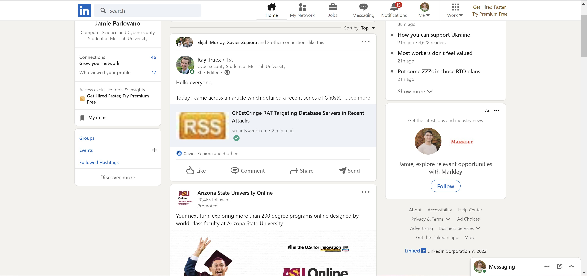
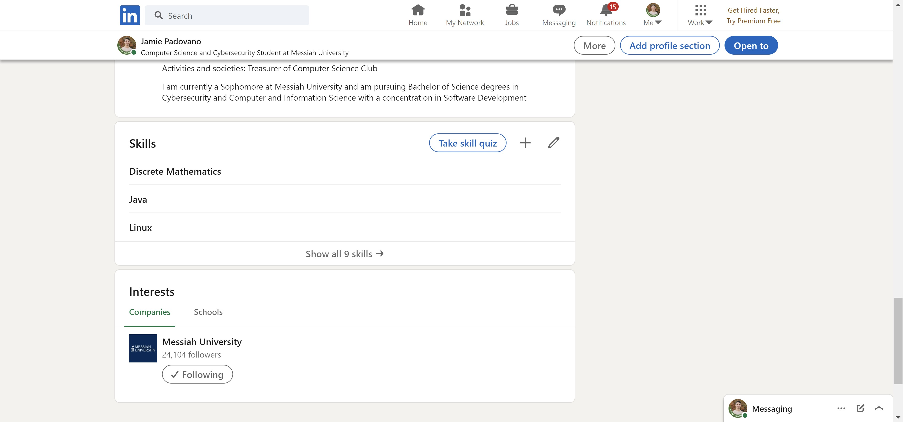
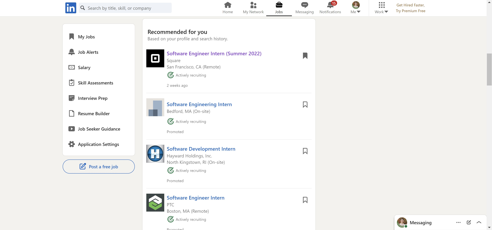
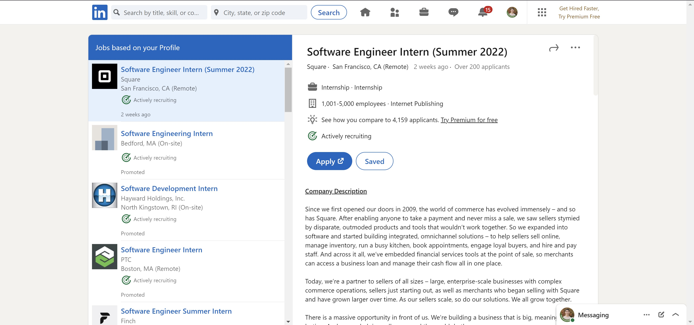
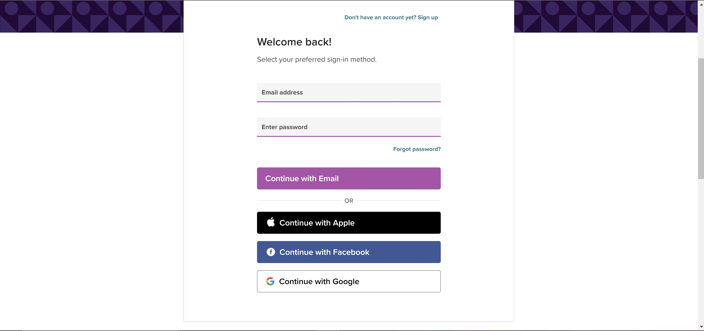
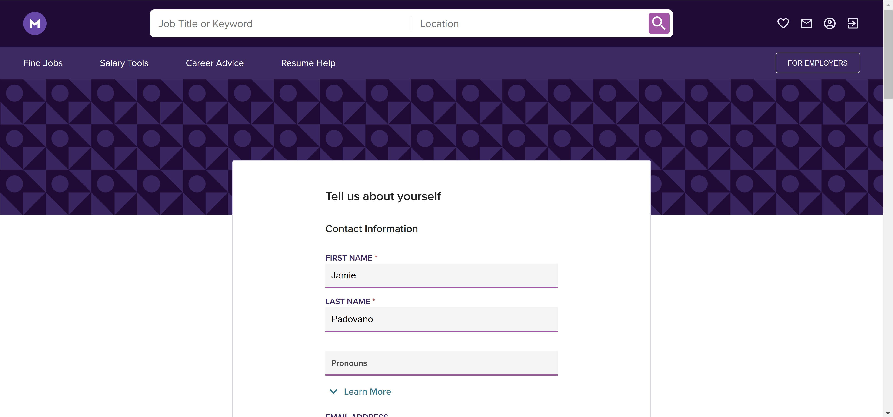
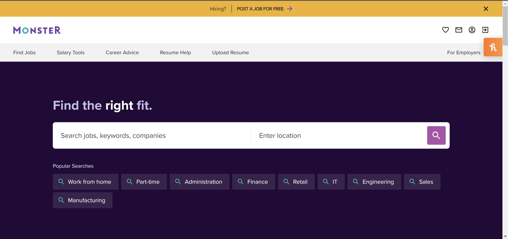
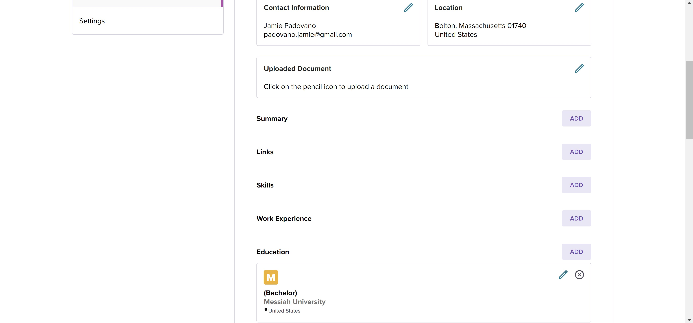
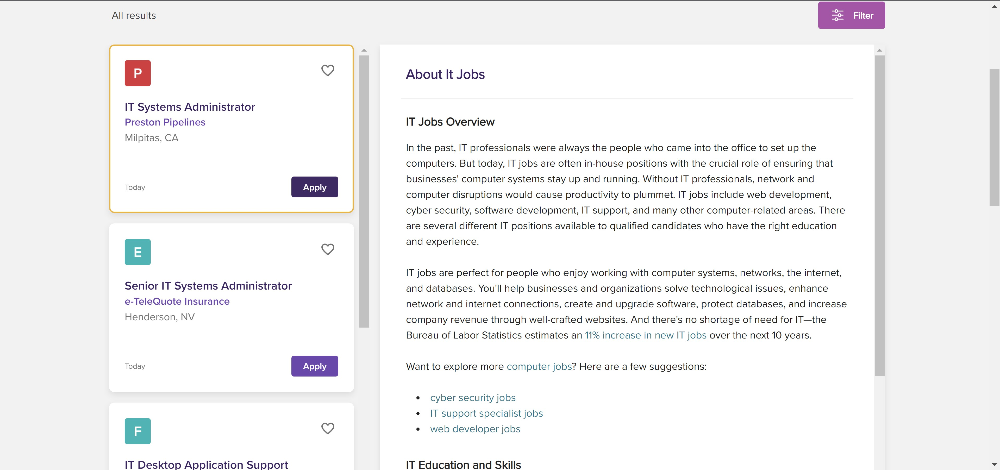

# Lab Report: UX/UI
___
**Course:** CIS 411, Spring 2022  
**Instructor(s):** [Trevor Bunch](https://github.com/trevordbunch)  
**Name:** Jamie Padovano  
**GitHub Handle:** JPadovano1483  
**Repository:** https://github.com/JPadovano1483/cis411_lab3_uiux  
**Collaborators:**   Adam Lenker (@al1412), Andrew Coldsmith (@andrewcoldsmith), Ricky Pokrivka (@Richard-Pokrivka)
___

# Step 1: Confirm Lab Setup
- [x] I have forked the repository and created my lab report
- [x] If I'm collaborating on this project, I have included their handles on the report and confirm that my report is informed, but not copied from my collaborators.

# Step 2: Evaluate Online Job Search Sites

## 2.1 Summary
| Site | Score | Summary |
|---|---|---|
| LinkedIn | 18 | Overall, this site is extremely user-friendly and easy to navigate. |
| Monster | 12 | Overall, the site was not too difficult to navigate, but I did not feel as though it was guiding me to where I was supposed to go. |

## 2.2 Site 1

<h2>LinkedIn</h2>
I had previously created an account.

 
The home page is easy to navigate. It is easy to use the navigation bar at the top of the page to get to your profile or to a job search.

 
Adding a skill to your profile is an easy task. You simply need to go to your profile and scroll down to the skill section. Then you just click the plus button and type in what skill you would like to add.

 
Searching for a job is rather straightforward. You simply need to click the job tab on the navigation bar and you will be taken to the job search page. From there, you will get recommended jobs based on the skills you added to your profile and jobs you have viewed in the past. You also have the option of searching for a job or type of job in the search bar in the top left.

 
After selecting a job you want to apply for, you can simply hit the apply button. This will take you to the company's external site where you can put in your application. You will generally have the option to manually apply or to "apply with LinkedIn." This will automatically fill in an application with the information in your LinkedIn profile.

| Category | Grade (0-3) | Comments / Justification |
|---|---|---|
| 1. **Don't make me think:** How intuitive was this site? | 3 | I had no difficulty navigating the site. It was a straightforward process of creating an account, adding skills, and looking for a job. |
| 2. **Users are busy:** Did this site value your time?  | 3 | This site did value my time as it was a quick process to navigate and find a job. It offered recommendations so I did not have to spend time looking for jobs I would be interested in. It also has a quick apply option. |
| 3. **Good billboard design:** Did this site make the important steps and information clear? How or how not? | 2 | I don't think the important steps are necessarily clear. Adding skills may not be something a new user would initially see or realize they should do. These are, however, quite important in the job recommendation process. |
| 4. **Tell me what to do:** Did this site lead you towards a specific, opinionated path? | 1 | There is not necessarily one path the user is led to. Part of the reason for this is that LinkedIn is not only a job search site. It also functions as a social media platform. Because of this, you are not always guided towards the steps you should take in order to apply for a job. |
| 5. **Omit Words:** How careful was this site with its use of copy? | 3 | This site did not seem to have unnecessary words. Whenever possible, it seems everything is limited to one or two words. This makes it easy for the user to skim the page and know what each link does and what options they have.  |
| 6. **Navigation:** How effective was the workflow / navigation of the site? | 3 | I found the navigation to be intuitive and easy to follow. I did not feel lost at any point in time. |
| 7. **Accessibility:** How accessible is this site to a screen reader or a mouse-less interface? | 3 | This site is quite accessible to a mouse-less interface. I would anticipate no difficulty navigating this site on a mobile device.  |
| **TOTAL** | 18  | Overall, this site is extremely user-friendly and easy to navigate.  |

## 2.3 Site 2

<h2>Monster</h2>

The account creation was simple. I was given the option to sign up with Google so I did not have to spend as much time typing my information in. I was then prompted to add some more personal information such as where I attend school. 

After being sent to the home page, I quickly located my account button in the top right corner of the page. I navigated here to add some more personal information and experience.

It was easy to find the add skill section in my profile. I simply had to scroll down. Adding a skill was easy. All I had to do was click add and search for a skill I wanted to add.

The find job tab was easy to find in the navigation bar on the home page. From there, I was able to search for a job or click on a few different job type recommendations based on the skills I added to my profile.

The site gave me some recommendations to browse through based on my skills and my search. After selecting a job to apply to, you simply need to hit the apply button and it will take you to the company's external application page.

| Category | Grade (0-3) | Comments / Justification |
|---|---|---|
| 1. **Don't make me think:** How intuitive was this site? | 2 |  This site was overall very intuitive. I did not have difficulty finding where I needed to go. |
| 2. **Users are busy:** Did this site value your time?  |  2 |  For the most part, the site seems to value my time. You do need to put in a bit of effort though when searching for jobs and adding skills as there are not as many recommendations as there could be. Specifically in the skills section, it does not recommend any to you based on previous skills you have added. |
| 3. **Good billboard design:** Did this site make the important steps and information clear? How or how not? | 1 |  The site does not do an amazing job making important steps clear. While you can see some important steps when you open up your profile, it does not do much in the way of prompting you to get there. |
| 4. **Tell me what to do:** Did this site lead you towards a specific, opinionated path? |  1 |  I did not feel as though I was being guided towards a specific path, but rather I needed to figure out where specifically I needed to go.|
| 5. **Omit Words:** How careful was this site with its use of copy? |  1 | This site was a little verbose in some places. On some pages, I did not feel as though I could easily scan the page and find everything I needed to know without further reading.  |
| 6. **Navigation:** How effective was the workflow / navigation of the site? |  2 |  The navigation of the site was not bad. It was nothing special. I did not have much difficulty navigating the site, but I did feel that I needed to put in some effort. |
| 7. **Accessibility:** How accessible is this site to a screen reader or a mouse-less interface? |  3 |  I see no reason why a user would have difficulty using the site on a mouse-less interface. |
| **TOTAL** | 12  | Overall, the site was not too difficult to navigate, but I did not feel as though it was guiding me to where I was supposed to go. |

# Step 3 Competitive Usability Test

## Step 3.1 Product Use Case

| Use Case #1 | |
|---|---|
| Title | User Creating an 8-semester plan |
| Description / Steps | Messiah student creates and saves an 8-semester course plan |
| Primary Actor | Student User |
| Preconditions | 1. User signs in to application through the CAS system  2. User drags and drops the courses they wish to take into the semester of their choosing  3. User has no errors in course scheduling  4. User hits the save button |
| Postconditions | 1. User is able to sign back in at a later time to find the saved course plan  2. User is able to change their plan at any time |

## Step 3.2 Identifier a competitive product

Competitor: [ECARPS](http://huggs.messiah.edu/ecarps/)

## Step 3.3 Write a Useability Test

| Step | Tasks | Notes |
|---|---|---|
| 1 | Sign in as a guest to the application | Simply select I am not a robot and hit the guest sign in button |
| 2 | Specify your major | Choose your major and/or minor from the list of majors/minors  |
| 3 | Rearrange courses as necessary | Drag and drop courses that are already in the default plan to other places as you see fit |
| 4 | Add any desired courses to the schedule | Drag and drop courses from the course list on the right side of the page to any semester |
| 5 | If necessary, fix any errors in scheduling | Correct any errors the system catches in your plan |
| 6 | Sign out | Click the log out button |

## Step 3.4 Observe User Interactions

| Step | Tasks | Observations |
|---|---|---|
| 1 | Sign in as a guest to the application | The sign in process was simple. The user simply needs to check off the "I am not a robot" button and hit the "sign in" button. If you are not signing in as guest and are an engineering major, you are able to simply sign in through Messiah's CAS system.|
| 2 | Specify your major | This was a simple process. The user simply has to select their major and/or minor from a check box list. They can also specify if they are in the honors program.|
| 3 | Rearrange courses as necessary | There is no problem when working with just a major, but when a minor is added, there is a large red banner on the course list. This is because the application has a default plan loaded in for the majors, but not the minors. The issue with this was that when logging in for the first time to start planning your schedule, it is quite off-putting to see a large red flag on your screen. It is a bit confusing and disorienting at first.|
| 4 | Add any desired courses to the schedule | The large list of all the classes on the right side of the screen is difficult to manage and sort through. It takes a while to scroll through all of your options and there is no easy way to find the course you are looking for. It is also a bit overwhelming to see such a large number of courses right off the bat when you are first starting the planning process. The actual drag and drop mechanic is rather straightforward, so there were no problems in that respect. |
| 5 | If necessary, fix any errors in scheduling | The error messages were straightforward and easy to understand. For example, if a course is prerequisite for a course and is moved after it, there is a red banner on the semester with the conflict that says both which course is missing a prerequisite as well as what the prerequisite course is. |
| 6 | Sign out | The sign out process was simple and straightforward. The user simply needs to click the log out button on the left side of the page. |

## Step 3.5 Findings
Improvements for Usability:
1. Change course list layout
2. Add filter/search function for the courses
3. Fix red flags with first time sign in when a minor is selected

Beneficial Experiences:
1. Having a default plan for each major
2. Having all your major requirements in one place
3. Prerequisite flagging and error messages

Things we did well in usability test:
1. Asked question about how the user felt and how they were doing at certain points

Things we could improve on in test:
1. Getting someone that has never heard of the ECARPS system before to test it to see a different perspective. Having an incoming freshman use it would be ideal.

Statement about conducting the test: 
Being able to conduct a test that matches our desired product was an issue. There are certain functions and mechanics we wish to add that differ from how ECARPS is structured. We could not test some functions such as saving and signing back in since we were forced to sign in as a guest. The test made us outline what information we wanted so we got better information than if we asked for unprompted feedback.