# Lab Report: UX/UI
___
**Course:** CIS 411, Spring 2021  
**Instructor(s):** [Trevor Bunch](https://github.com/trevordbunch)  
**Name:** Luke Hardman
**GitHub Handle:** LAHardman
**Repository:** [Forked Repository](https://github.com/LAHardman/cis411_lab3_uiux)
**Collaborators:**   
___

# Step 1: Confirm Lab Setup
- [X] I have forked the repository and created my lab report
- [X] If I'm collaborating on this project, I have included their handles on the report and confirm that my report is informed, but not copied from my collaborators.

# Step 2: Evaluate Online Job Search Sites

## 2.1 Summary
| Site | Score | Summary |
|---|---|---|
| Indeed | 20 | The classic website for job search, and for good reason. Parts can be wordy, but overall does a fantastic job of letting the user do what they are trying to accomplish. |
| CareerBuilder | 18 | Overall, better than I expected but definitely still has room for improvement. |

## 2.2 Site 1: Indeed

**Account Update (Already had account):**
  1. 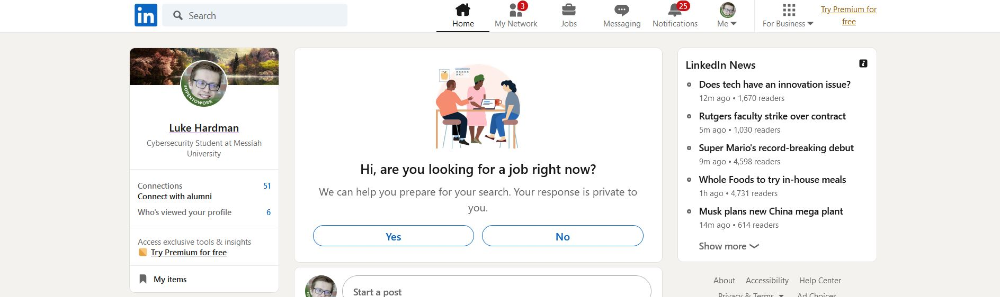 
     *After logging into your account you will need to click on the "Me" dropdown in the top right.*

  2. 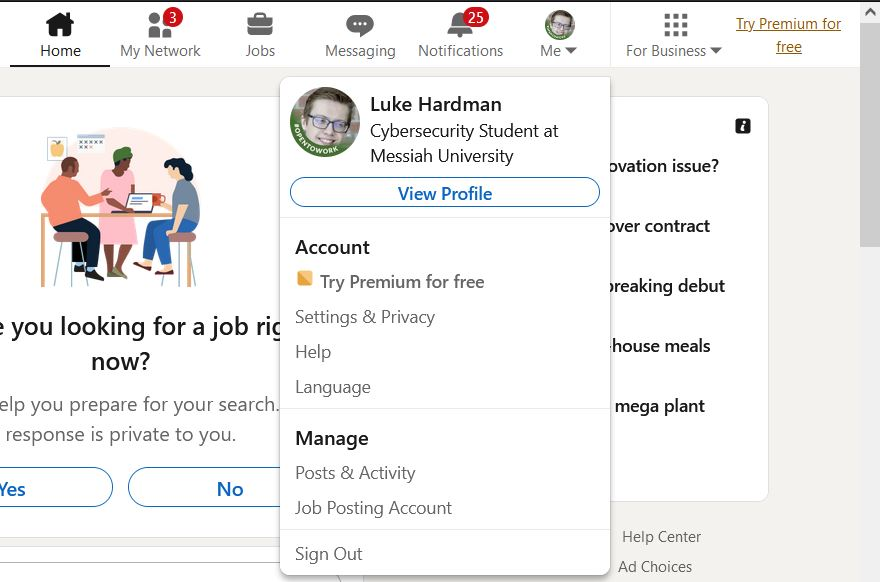
     *Once the dropdown is open, you will want to click on "View Profile".*

  3. 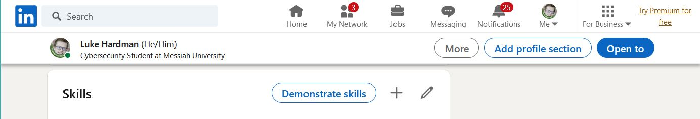
     *Once your profile is open, you will want to scroll down to the "Skills" section and click on the "+".*

  4. 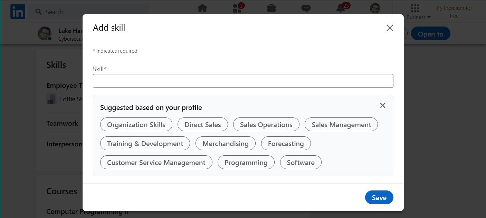
     *After clicking the "+", a Add skill menu will pop up in which you can input a skill, or choose from a list of options.*

  5. 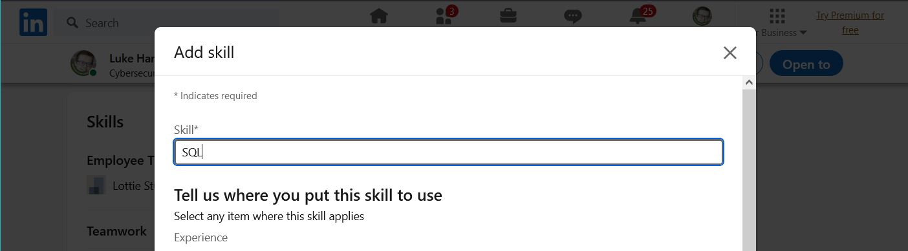
     *After selecting you skill you just need to click any boxes next to where you have applied the skill, and then click "Save".*

**Job Search:**
  1. 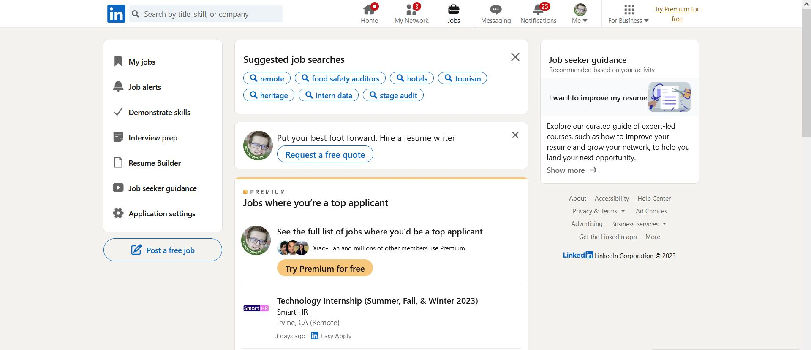
     *Click on the "Jobs" tab in the navigation bar.*

  2. 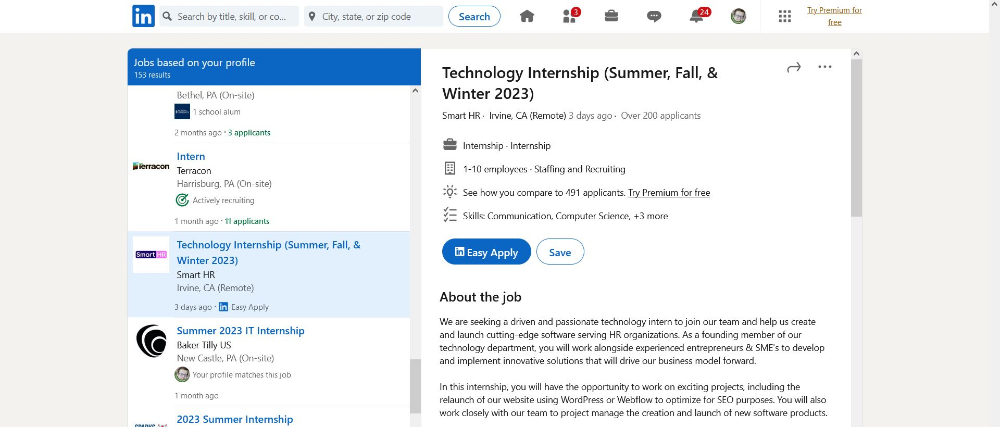
     *Click on one of the listed jobs to learn more information.*

  3. 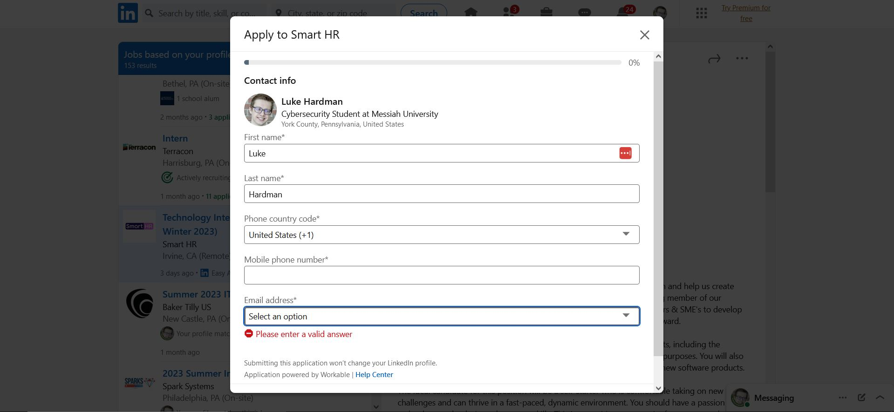
     *If available you can click on "Easy Apply" to get access to a form that will take you through the application process.*

| Category | Grade (0-3) | Comments / Justification |
|---|---|---|
| 1. **Don't make me think:** How intuitive was this site? | 3 | Very intuitive, everything was were I guessed it would be. |
| 2. **Users are busy:** Did this site value your time?  | 3 | The site got me to where I was trying to go quickly, and didn't require excessive steps. |
| 3. **Good billboard design:** Did this site make the important steps and information clear? How or how not? | 3 | Important info is separated and often outlined in some manner from other text. |
| 4. **Tell me what to do:** Did this site lead you towards a specific, opinionated path? | 3 | The site did well of leading me through what I needed to do to pick a job and apply to it. |
| 5. **Omit Words:** How careful was this site with its use of copy? | 2 | The site was a bit wordy at points, but not too bad overall. |
| 6. **Navigation:** How effective was the workflow / navigation of the site? | 3 | The navigation allowed me to easily get to and from each section of the website in multiple ways. |
| 7. **Accessibility:** How accessible is this site to a screen reader or a mouse-less interface? | 3 | The site seems to work well with a screen reader and mouse-less interface. |
| **TOTAL** | 20 | The classic website for job search, and for good reason. Parts can be wordy, but overall does a fantastic job of letting the user do what they are trying to accomplish. |

## 2.3 Site 2: CareerBuilder

**Account Update:**
   1. 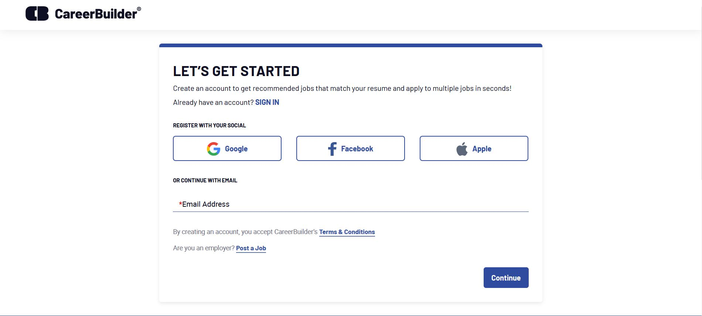
      *Start by creating your account using one of the provided SSO options, or by creating an account through your email.*

   2. 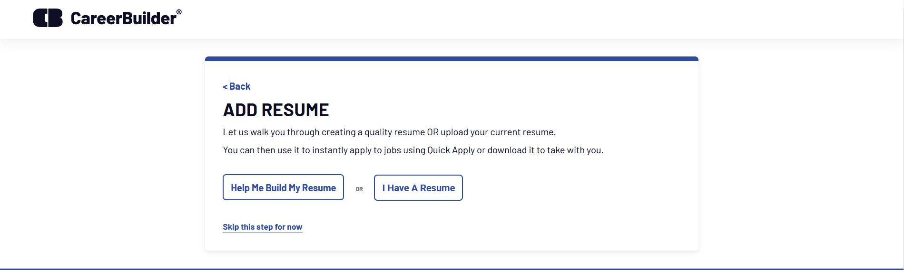
      *Next you must add some sort of resume to access the relevant section of your profile by either uploading a resume or going through their resume builder.*  

   3. 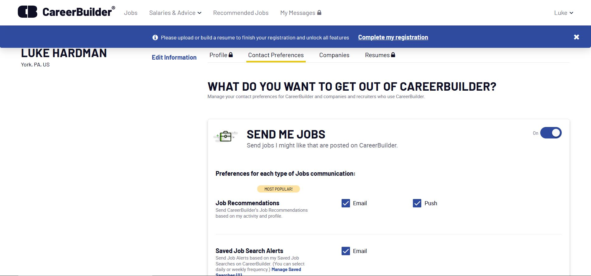
      *If you skip adding a resume, there will be locks are parts of the navigation, like the profile section. After you add your resume you can click on the "Profile" section of the account navigation bar.*

   4. 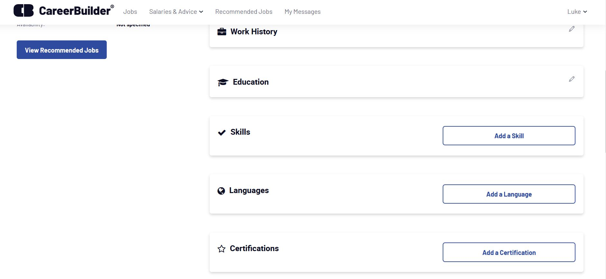
      *After clicking on the "Profile" section you need to scroll down to "Skills", and click on "Add a Skill".*

   5. 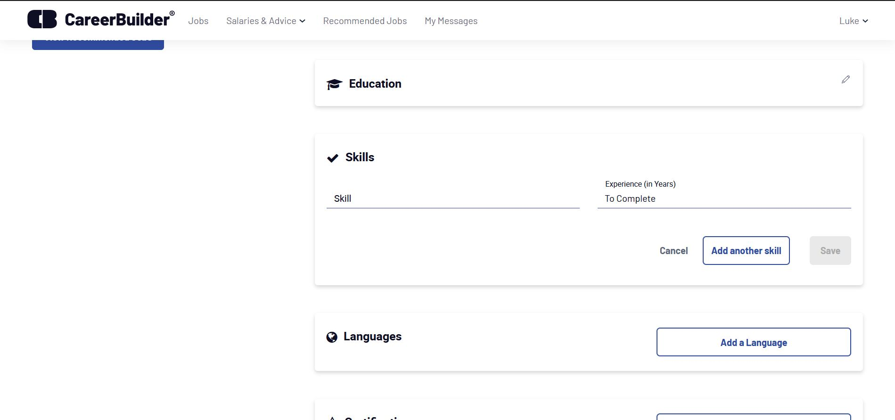
      *After clicking "Add a Skill", you will be able to enter the name of the skill and how many years of experience you have, after which you can click on "Save" to finish adding the skill.*

**Job Search:**
   1. 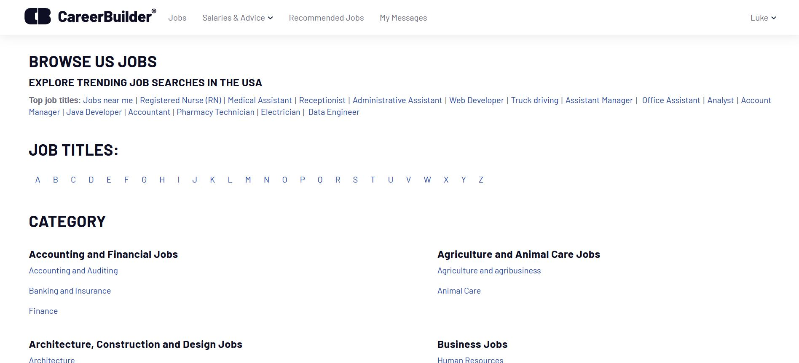
      *Click on the "Jobs" tab in the navigation bar to see lists of categories for jobs.*

   2. 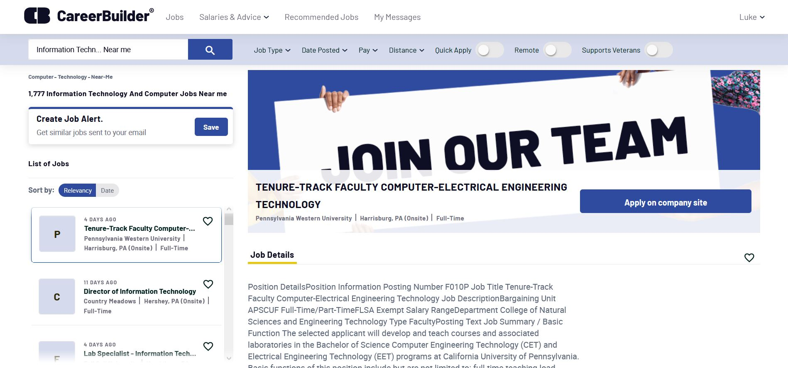
      *After clicking on one of the categories like "Information Technology and Computer" to individual job listings.*

   3. 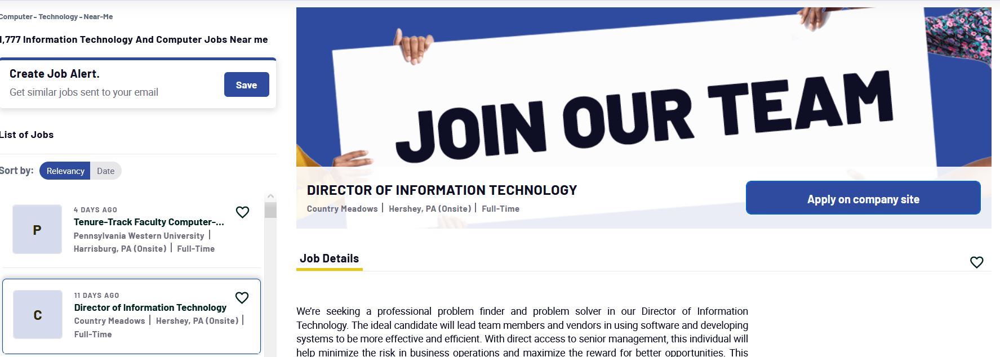
      *From this page you can click on specific job listings on the left side, and then click on "Apply on company site" on the right side of the page.*

| Category | Grade (0-3) | Comments / Justification |
|---|---|---|
| 1. **Don't make me think:** How intuitive was this site? | 2 | Decently intuitive, with items roughly where you would expect them to be. The number of items on screen at a time can make it difficult to figure out what to click quickly. |
| 2. **Users are busy:** Did this site value your time?  | 3 | Interactions were quick, and there were minimal steps to get where I needed to go. |
| 3. **Good billboard design:** Did this site make the important steps and information clear? How or how not? | 3 | Important items tend to be in blue buttons that make them easy to notice. |
| 4. **Tell me what to do:** Did this site lead you towards a specific, opinionated path? | 2 | The categories of jobs did take a second to figure out where I wanted to go. |
| 5. **Omit Words:** How careful was this site with its use of copy? | 2 | The page was quite wordy at points. |
| 6. **Navigation:** How effective was the workflow / navigation of the site? | 3 | Navigation worked well, got me where I was trying to go, and let me easily get back. |
| 7. **Accessibility:** How accessible is this site to a screen reader or a mouse-less interface? | 3 | The page seems to work well with both a screen reader and a mouse-less interface. |
| **TOTAL** | 18 | Overall, better than I expected but definitely still has room for improvement. |

# Step 3 Competitive Usability Test

## Step 3.1 Product Use Case

| Use Case #1 | |
|---|---|
| Title | Checking Chapel Credits |
| Description / Steps | 1. Locate and click on the Chapel Attendance module. 2. If necessary, log in again for reauthentication. 3. Click on "Show Details" to view chapel attendance dates and associated card scanner numbers.  |
| Primary Actor | Student |
| Preconditions |  Student must have an authenticated and active Messiah account. |
| Postconditions | Student knows how many chapel credits they have, and how many they still need. |

## Step 3.2 Identifier a competitive product

Only one real competitor or adjacent tool:

[FalconLink](falconlink.webapps.messiah.edu/)

## Step 3.3 Write a Usability Test

| Step | Tasks | Notes |
|---|---|---|
| 1 | Log into FalconLink. | The browser may already be logged in if it was used with an account recently. |
| 2 | Find and click on the module for checking chapel credits. | Chapel Attendance is the proper module, not Chapel Schedule or Personal Information (which also shows up when "chapel" is searched) |
| 3 | Log in again. | The user may be required to reauthenticate themselves at this time as they redirected to a different page. |
| 4 | Click on "Show Details" to see the dates of chapels. | For some reason this refreshes the page and gives the numbers associated with the card scanner used. |

## Step 3.4 Observe User Interactions

| Step | Tasks | Observations |
|---|---|---|
| 1 | Log into FalconLink. | The user seemed to be able to log in relatively well, but noted that some elements were spaced oddly on mobile. |
| 2 | Find and click on the module for checking chapel credits. | The user felt the filters were unclear, unhelpful, and took up too much of the screen. They also were slightly confused about why "Personal Information" showed up when the finally searched for "chapel". |
| 3 | Log in again. | The user was able to log in fine, but confused why they needed to reauthenticate themselves so soon after. |
| 4 | Click on "Show Details" to see the dates of chapels. | Could figure out what they were reading eventually, but confused by the large amounts of empty space and the small text. |

## Step 3.5 Findings
Through the usability test, we gained valuable insights into the user experience and identified areas for improvement. The following summarizes our findings and recommendations:

Suggested improvements:
   1. Optimize the layout and design for mobile devices to ensure proper spacing and readability.
   2. Improve the search filters to make it easier for users to find relevant modules without confusion.
   3. Streamline the authentication process to minimize the need for reauthentication, especially during the same session.

Beneficial experiences:
   1. Users were able to successfully log in to FalconLink and access the Chapel Attendance module.
   2. The "Show Details" option provided useful information on chapel attendance dates.

Our team's performance:
   1. We effectively identified issues with the mobile layout, search filters, and reauthentication process.
   2. For future tests, we should provide more detailed instructions and tasks for users to explore a wider range of functionalities within the app.

Overall, the usability test was an enlightening experience, enabling us to pinpoint areas for enhancement to ensure that students can efficiently access the information they need. We will use these insights to refine the user experience and make the necessary improvements to the app.

# 4. Your UX Rule (Extra Credit)

**Rule: Prioritize Clarity and Simplicity**

The importance of maintaining clarity and simplicity in a website or application's design cannot be overstated. Users should be able to navigate effortlessly and find the information they are looking for without getting overwhelmed by excessive visual elements or complicated features. An uncomplicated design not only reduces the cognitive load on users but also helps them accomplish their tasks more efficiently. By focusing on clarity and simplicity, designers can create an intuitive user experience that caters to a wide range of users, regardless of their technical proficiency. When users can seamlessly interact with a website or application, their overall satisfaction and trust in the platform increase, leading to higher user retention and positive word-of-mouth.