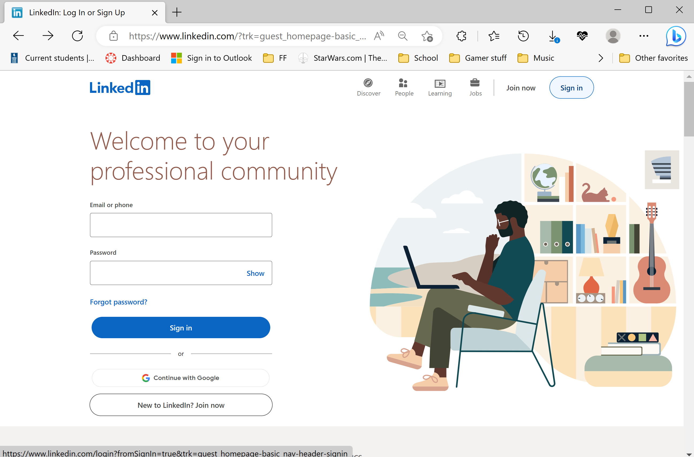
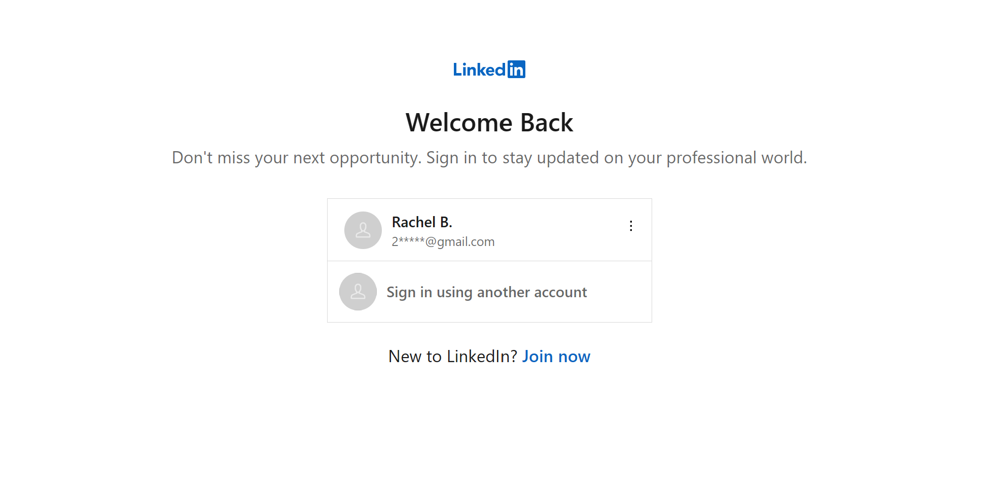
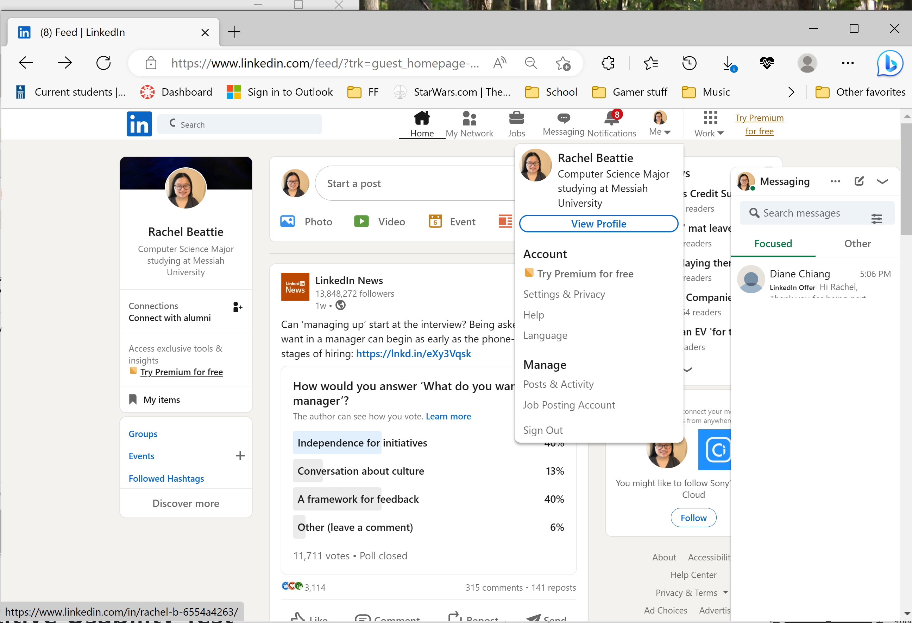
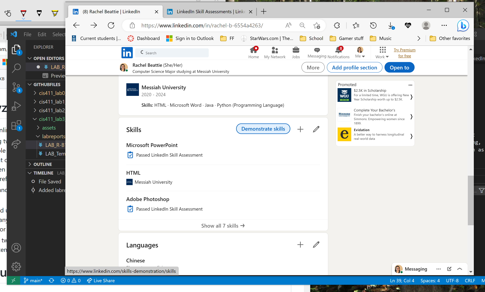
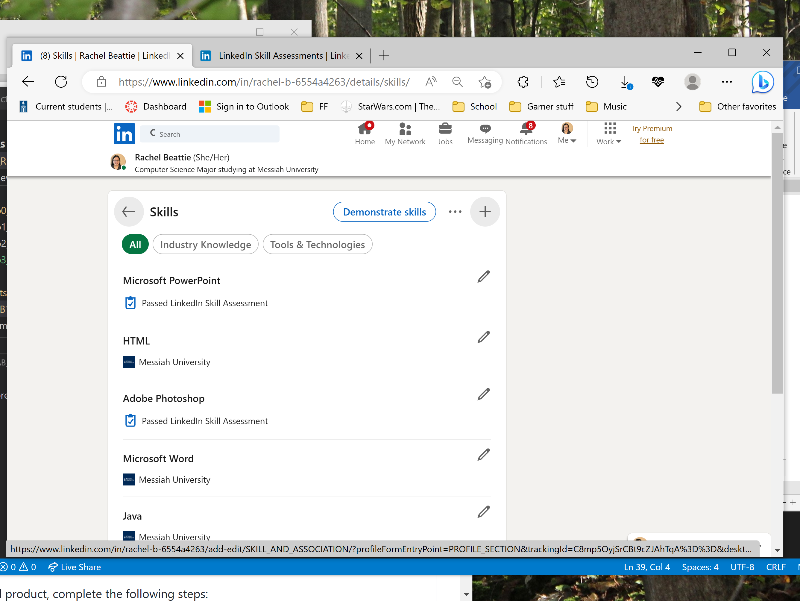
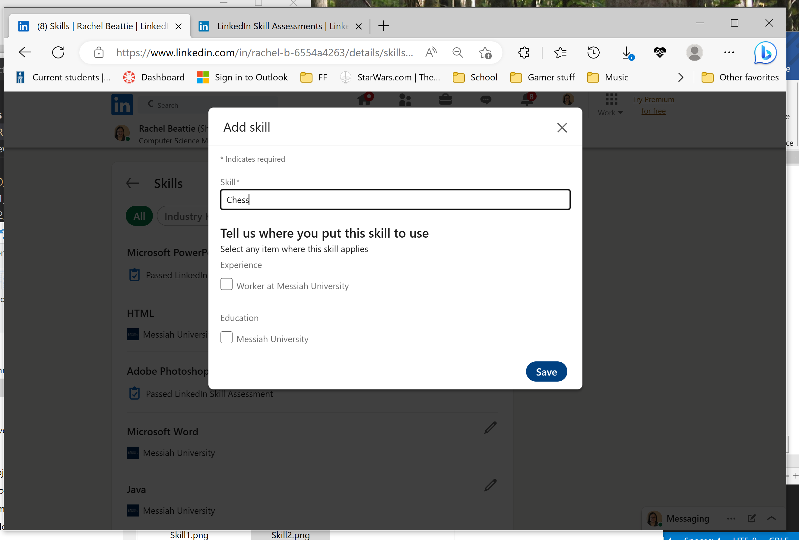
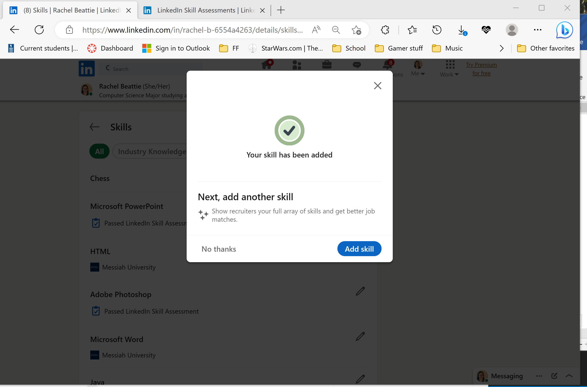
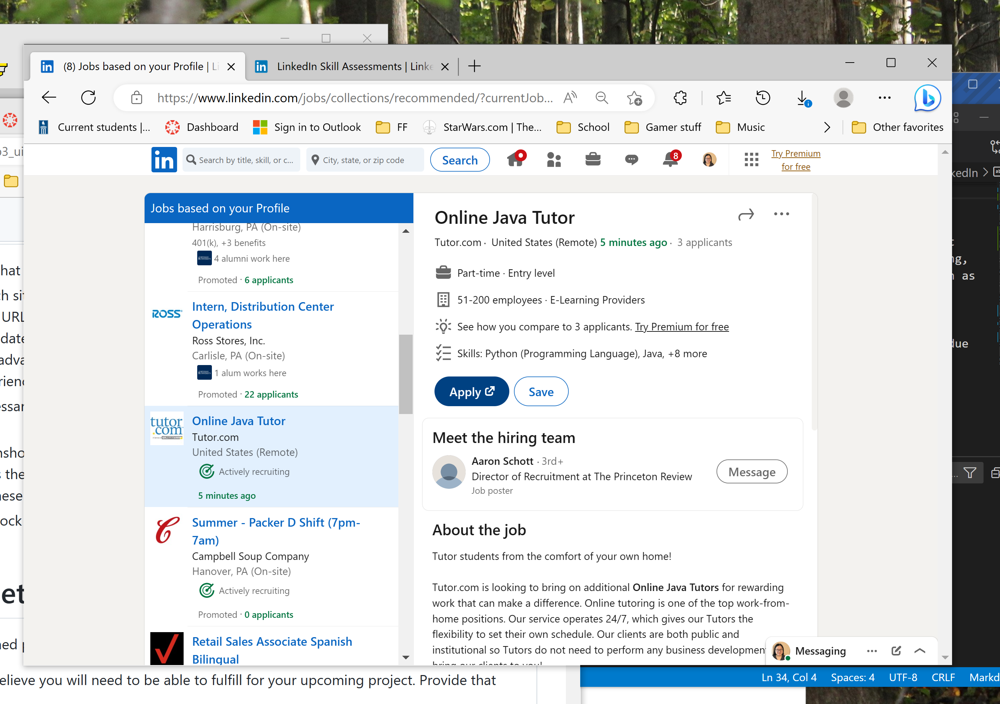
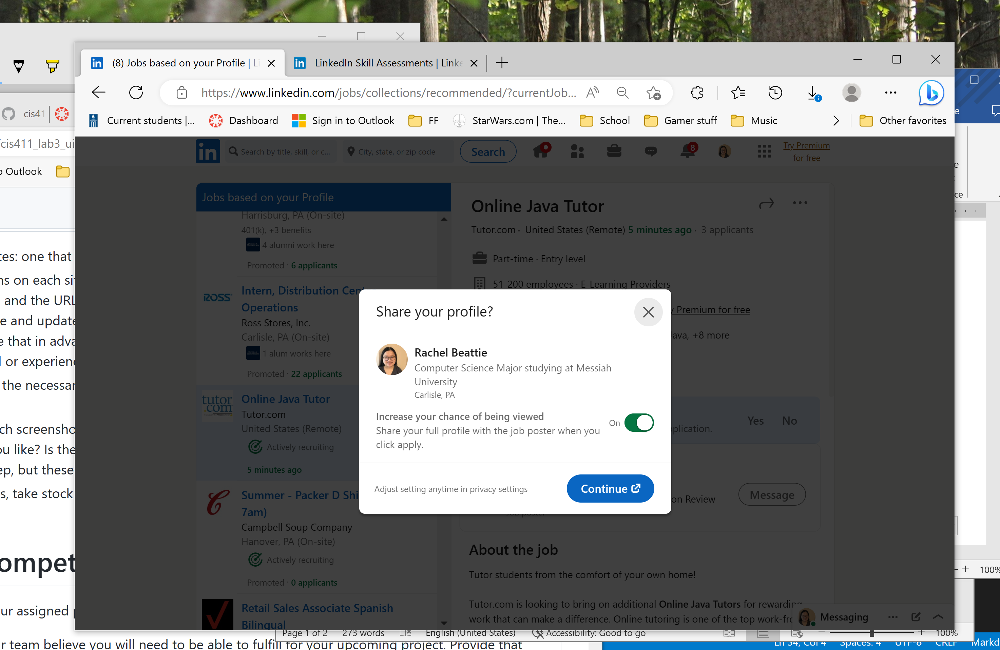
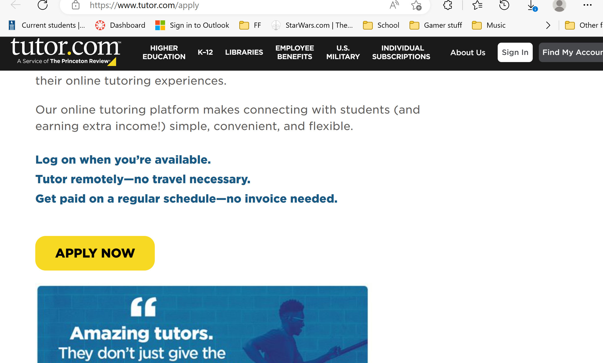

# Lab Report: UX/UI
___
**Course:** CIS 411, Spring 2021  
**Instructor(s):** [Trevor Bunch](https://github.com/trevordbunch)  
**Name:** Rachel Beattie 
**GitHub Handle:** [Your GitHub Handle](https://github.com/R-B1509) 
**Repository:** [Your Forked Repository](https://github.com/R-B1509/cis411_lab3_uiux) 
**Collaborators:**   
[Zach Booher](https://github.com/Sturty75),
[Ben Clarke](https://github.com/BenOfTheOneRing),
[Michael Shoul](https://github.com/m-shoul),
[Josh Phillipes](https://github.com/jp1478),
[Tim Kratz](https://github.com/timkratz)
___

# Step 1: Confirm Lab Setup
- [x] I have forked the repository and created my lab report
- [x] If I'm collaborating on this project, I have included their handles on the report and confirm that my report is informed, but not copied from my collaborators.

# Step 2: Evaluate Online Job Search Sites

## 2.1 Summary
| Site | Score | Summary |
|---|---|---|
| Site 1 | Score 1 | Summary 1 |
| Site 2 | Score 2 | Summary 2 |

## 2.2 Site 1
Insert Recorded Screenshots with captions and steps.

### LinkedIn
#### Steps
Account was already created in advance
<br>




1. Navigate to site and login
   - Logging in is easy because of the information saved after logging out. However, the fact that saved information sign in is different than the regular sign in is confusing, especially since the regular sign in also contains a link to a third-party service sign in as well as the usual sign up area.
  


2. Navigating to profile is easy, but the amount of pop-up views is a bit of a nuisance.






3. Added skill, though I couldn't decide which one to add, so I used Chess as an example of tactical strength.



4. To apply for a job is not easy, even if we are not required to complete the application, due to the fact that it feels wrong to apply for something you don't want to do regardless of it being a hypothetical.



5. Settings change is a good feature, but for me doing this lab, I'd rather not



6. Links to external site, checked with other applications, they are the same.


| Category | Grade (0-3) | Comments / Justification |
|---|---|---|
| 1. **Don't make me think:** How intuitive was this site? | 2  | Intuitive for jobs, yes, but Profile login is just a little confusing, and how skills are listed and tested is something else |
| 2. **Users are busy:** Did this site value your time?  |  3 |  Definitely quick to link to another site, matches job skills with job listings |
| 3. **Good billboard design:** Did this site make the important steps and information clear? How or how not? | 2  | Not the best, to be honest, first theirs the central alignment of three sections they think would interest you, then there is the selection of looking into more detail. The alignment changes from a center based scroll feed to that of left-right, but description of the job is underneath an overall summary block|
| 4. **Tell me what to do:** Did this site lead you towards a specific, opinionated path? | 2  |  Yep  |
| 5. **Omit Words:** How careful was this site with its use of copy? | 2  | If talking of the different backlinks towards one specific feature, than there are multiple ways, however most of them aren't redundant, the message section that is a pop-up does appear even when the message in the navigation bar is selected though. |
| 6. **Navigation:** How effective was the workflow / navigation of the site? | 1  | In jobs, once you're looking at details the scroll bar for the div looks almost identical to the background color behind it. |
| 7. **Accessibility:** How accessible is this site to a screen reader or a mouse-less interface? | 2  | In some aspects it is easier to navigate the website via touchscreen, the scrolling of the job description does not involve looking for the scroll bar because you can touch and drag. However, it also seems to register as trying to scroll down the whole webpage rather than a specific division more often than not.  |
| **TOTAL** | 14  |   |

## 2.3 Site 2
Insert Recorded Screenshots with captions and steps.


1. Navigate to site and registered
   - I used my google account, but one of the steps was repetatitve
   - If they are logging us in via Google account, shouldn't they know the First and Last name, or can't they ask permission to get the information?
   - The required Title desired leaves much to <strong>be</strong> desired.
  


2. Profile building was long... and kind of pointless with repeat things to skip


3. It's easy to tell that the main focus of the site is solely job hunting, that being said... If I were to judge LinkIn in comparison to this I would take back a few complaints on the divider's placement there. Here it's building itself like Pinterest.


4. To apply for a job is not easy, even if we are not required to complete the application, due to the fact that it feels wrong to apply for something you don't want to do regardless of it being a hypothetical


5. Settings change is a good feature, but for me doing this lab, I'd rather not


6. Links to external site, checked with other applications, they are the same.


| Category | Grade (0-3) | Comments / Justification |
|---|---|---|
| 1. **Don't make me think:** How intuitive was this site? |   |   |
| 2. **Users are busy:** Did this site value your time?  |   |   |
| 3. **Good billboard design:** Did this site make the important steps and information clear? How or how not? |   |   |
| 4. **Tell me what to do:** Did this site lead you towards a specific, opinionated path? |   |   |
| 5. **Omit Words:** How careful was this site with its use of copy? |   |   |
| 6. **Navigation:** How effective was the workflow / navigation of the site? |   |   |
| 7. **Accessibility:** How accessible is this site to a screen reader or a mouse-less interface? |   |   |
| **TOTAL** |   |   |


# Step 3 Competitive Usability Test

## Step 3.1 Product Use Case

| Use Case #1 | |
|---|---|
| Title | Listing item |
| Description / Steps | 1. User clicks on ```sell``` <br>2. Selects category for listed item type <br>3. uploads images of selected merchandise <br>4. User adds in title, description and price <br>5. User reviews listed information of item and submits it for others viewing via ```post ```|
| Primary Actor | Messiah Student (Current, former) |
| Preconditions | 1. Obtained Messiah Authenticated Account <br>2. Application User Profile is logged in <br>3. Holds an Item to list along with photos and a description in mind|
| Postconditions | Item listed for sale uploaded|

## Step 3.2 Identifier a competitive product

List of Competitors
1. Competitor 1 [Facebook Marketplace](https://www.facebook.com/marketplace/)
2. Competitor 2 [Craigs List](https://harrisburg.craigslist.org)

## Step 3.3 Write a Useability Test

| Step | Tasks | Notes |
|---|---|---|
| 1 |  Navigate to Facebook Marketplace |   |
| 2 | Login/Create account  |   |
| 3 |  Find lawn mower for sale  |   |
| 4 |  Save selected item on listings |   |
| 5 |  Return to Home Page |   |

| 6 | Navigate to saved listing  |   |

## Step 3.4 Observe User Interactions

| Step | Tasks | Observations |
|---|---|---|
| 1 |  Navigate to Facebook Marketplace |   |
| 2 | Login/Create account  |   |
| 3 |  Find lawn mower for sale  |   |
| 4 |  Save selected item on listings |   |
| 5 |  Return to Home Page |   |
| 6 | Navigate to saved listing  |   |

## Step 3.5 Findings
Organize your findings here.

# 4. Your UX Rule (Extra Credit)
If you opt to do extra credit, then include it here.