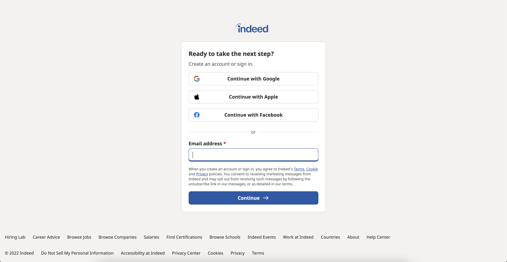
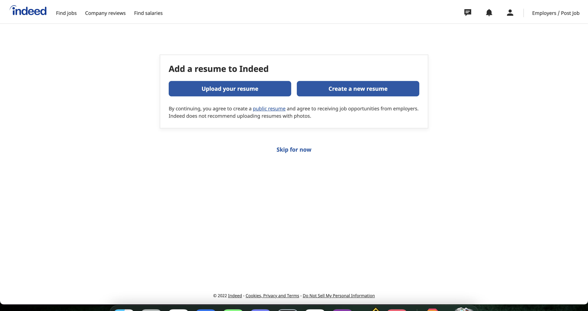
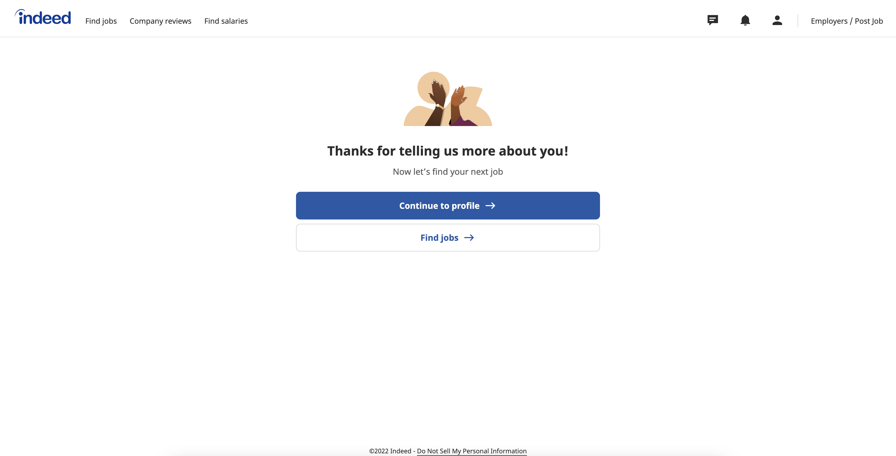
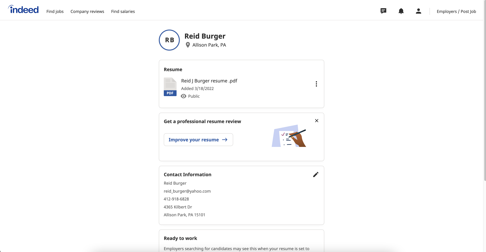
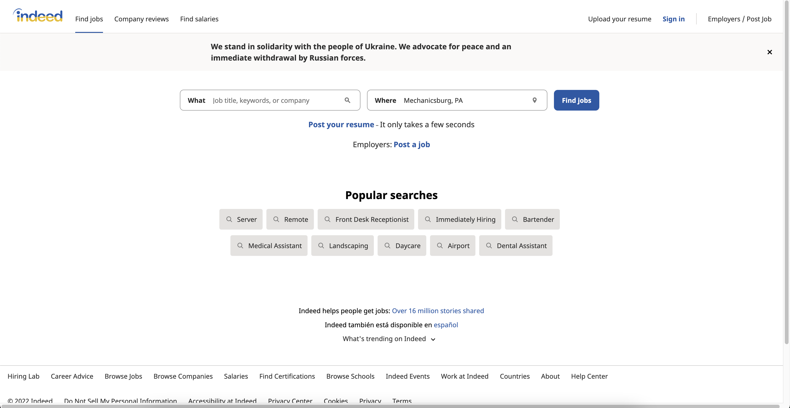
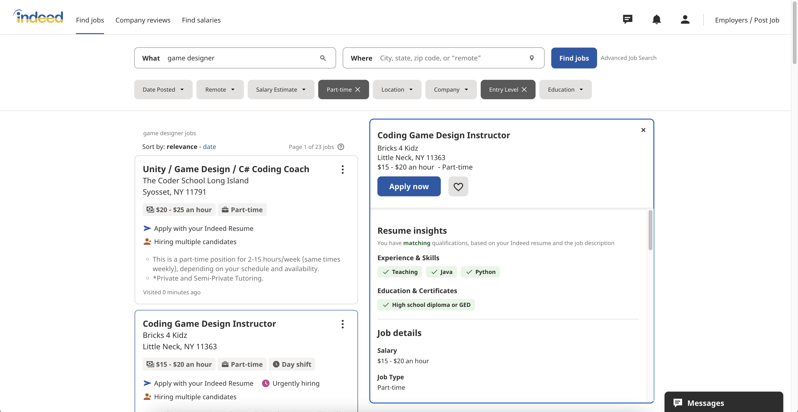
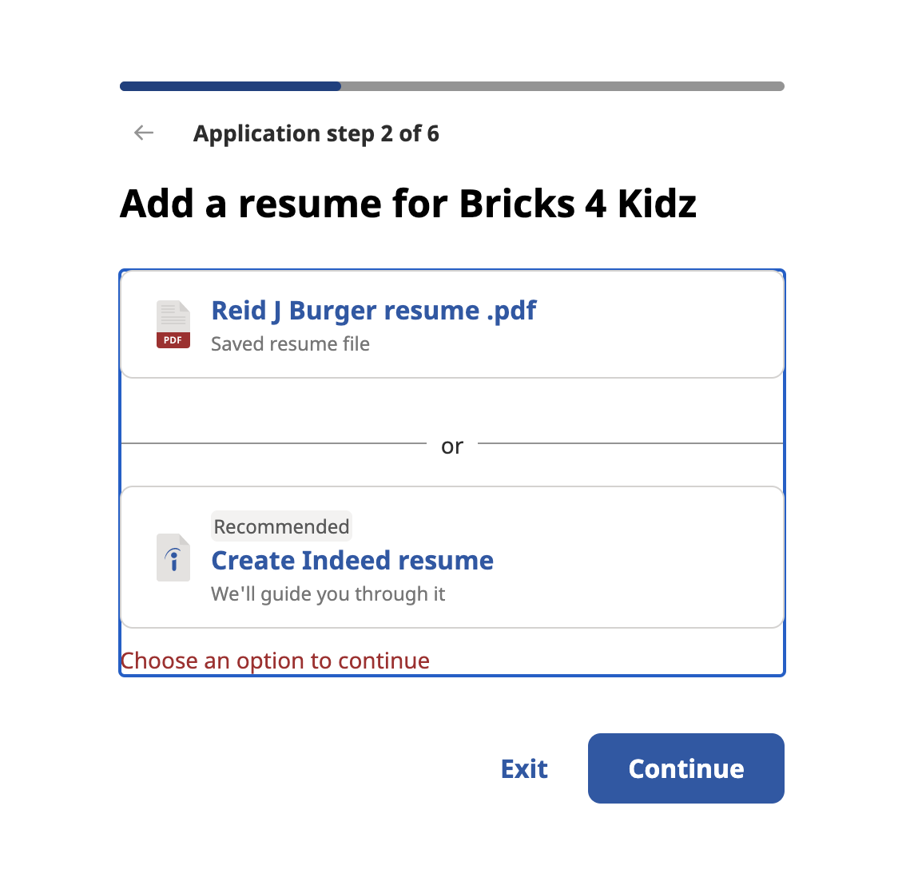
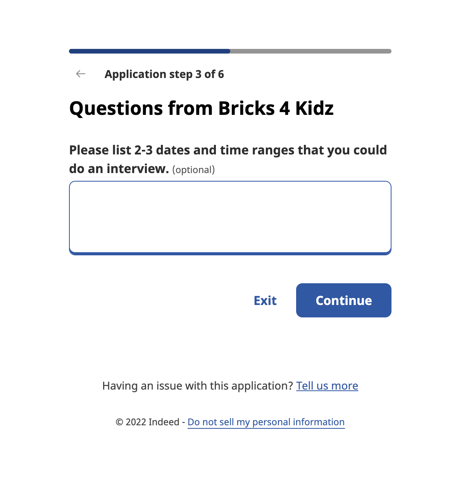
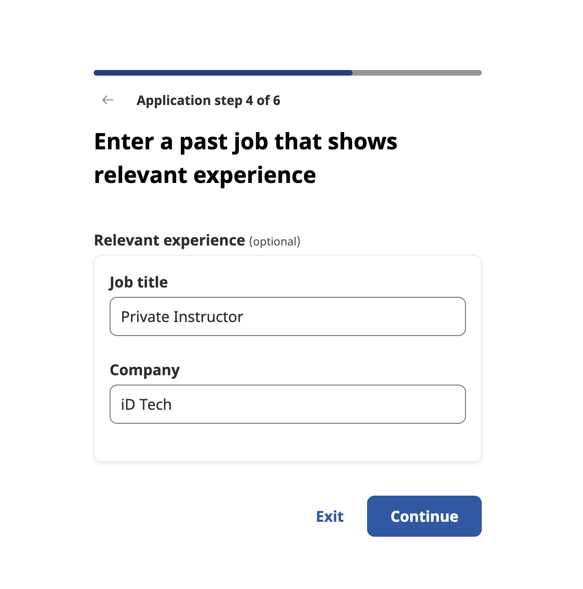

# Lab Report: UX/UI
___
**Course:** CIS 411, Spring 2021  
**Instructor(s):** [Trevor Bunch](https://github.com/trevordbunch)  
**Name:** Reid Burger   
**GitHub Handle:** [ReidBurger](https://github.com/ReidBurger)   
**Repository:** [My Forked Repo](https://github.com/ReidBurger/cis411_lab3_uiux)   
**Collaborators:**   
[Name](https://github.com/)   
[Name](https://github.com/)   
[Name](https://github.com/)   
[Name](https://github.com/)   
___

# Step 1: Confirm Lab Setup
- [x] I have forked the repository and created my lab report
- [x] If I'm collaborating on this project, I have included their handles on the report and confirm that my report is informed, but not copied from my collaborators.

# Step 2: Evaluate Online Job Search Sites

## 2.1 Summary
| Site | Score | Summary |
|---|---|---|
| Indeed | 17 | Summary 1 |
| Site 2 | Score 2 | Summary 2 |

## 2.2 Site 1
### Indeed.com

The first three pictures correspond to the [creation of my account.](https://www.indeed.com/)

This is what [my profile](https://my.indeed.com/resume?from=login&continue=https%3A%2F%2Fwww.indeed.com%2F) looks like on Indeed.

The previous two pictures show how the [job search](https://www.indeed.com/?from=gnav-resume--myind) feature works.

THe previous three pictures show the most important steps from my [job application process.](https://www.indeed.com/jobs?q=game%20design&l&vjk=b3221370c0c04ac2)

| Category | Grade (0-3) | Comments / Justification |
|---|---|---|
| 1. **Don't make me think:** How intuitive was this site? | 3 | Each step was easy to follow and clearly laid out, there was a good use of white space to make each step clear. |
| 2. **Users are busy:** Did this site value your time?  | 2 | Some of the forms fail to save your info and make you retype things, such as reset password or search jobs. This was slightly irksome, but it didn't take much extra time to find jobs that suited me. The only thing that brings this from a 1 to a 2 is the fact that it let me upload my own resume to submit so that I wouldn't have to go through a bunch of extra steps. |
| 3. **Good billboard design:** Did this site make the important steps and information clear? How or how not? | 3 | Each step had a very clear signal on what to click next, and the job search had filters which were easy to use. |
| 4. **Tell me what to do:** Did this site lead you towards a specific, opinionated path? | 3 | It held my hand through each step of the sign up process and application process, which is good since that's a place that I wouldn't want to make a wrong turn. |
| 5. **Omit Words:** How careful was this site with its use of copy? | 2 | On some pages, there was a lot of copy, only some of which I read, but for others, there was only what was necessary and it was easy to follow. |
| 6. **Navigation:** How effective was the workflow / navigation of the site? | 3 | The site was easy to get around and it worked very simply, operating mostly on the use of a single search bar and lots of filters. |
| 7. **Accessibility:** How accessible is this site to a screen reader or a mouse-less interface? | 2 | The job listings would take a long time for screen readers to get through, but there isn't an excess of non-readable content, so it's doable. |
| **TOTAL** | 17 |   |

## 2.3 Site 2
Insert Recorded Screenshots with captions and steps.

| Category | Grade (0-3) | Comments / Justification |
|---|---|---|
| 1. **Don't make me think:** How intuitive was this site? |   |   |
| 2. **Users are busy:** Did this site value your time?  |   |   |
| 3. **Good billboard design:** Did this site make the important steps and information clear? How or how not? |   |   |
| 4. **Tell me what to do:** Did this site lead you towards a specific, opinionated path? |   |   |
| 5. **Omit Words:** How careful was this site with its use of copy? |   |   |
| 6. **Navigation:** How effective was the workflow / navigation of the site? |   |   |
| 7. **Accessibility:** How accessible is this site to a screen reader or a mouse-less interface? |   |   |
| **TOTAL** |   |   |

# Step 3 Competitive Usability Test

## Step 3.1 Product Use Case

| Use Case #1 | |
|---|---|
| Title | |
| Description / Steps | |
| Primary Actor | |
| Preconditions | |
| Postconditions | |

## Step 3.2 Identifier a competitive product

List of Competitors
1. Competitor 1 [www.awesomesauce.com](www.awesomesauce.com)
2. Competitor 2 [Bangarang Peter](https://www.youtube.com/watch?v=4PNOccSUb1Q)

## Step 3.3 Write a Useability Test

| Step | Tasks | Notes |
|---|---|---|
| 1 |   |   |
| 2 |   |   |
| 3 |   |   |
| ... |   |   |
| n |   |   |

## Step 3.4 Observe User Interactions

| Step | Tasks | Observations |
|---|---|---|
| 1 |   |   |
| 2 |   |   |
| 3 |   |   |
| ... |   |   |
| n |   |   |

## Step 3.5 Findings
Organize your findings here.

# 4. Your UX Rule (Extra Credit)
If you opt to do extra credit, then include it here.