# Lab Report: UX/UI

___
**Course:** CIS 411, Spring 2021  
**Instructor(s):** [Trevor Bunch](https://github.com/trevordbunch)  
**Name:** Sebastian Alejos
**GitHub Handle:** SebastianAlejos  
**Repository:** <https://github.com/SebastianAlejos/cis411_lab3_uiux>  
**Collaborators:**
___

# Step 1: Confirm Lab Setup

- [x] I have forked the repository and created my lab report
- [ ] If I'm collaborating on this project, I have included their handles on the report and confirm that my report is informed, but not copied from my collaborators.

# Step 2: Evaluate Online Job Search Sites

## 2.1 Summary

| Site | Score | Summary |
|---|---|---|
| Indeed|18 | The site is easy to use and the interface makes it easy to create a profile and apply for a job.|
| ZipRecruiter | 17 |This site is well designed. More clarity is neede when submitting a job application. |

## 2.2 Site 1

### Indeed

This image shows the process of editing your profile and addign more information. It is a very easy process to do.
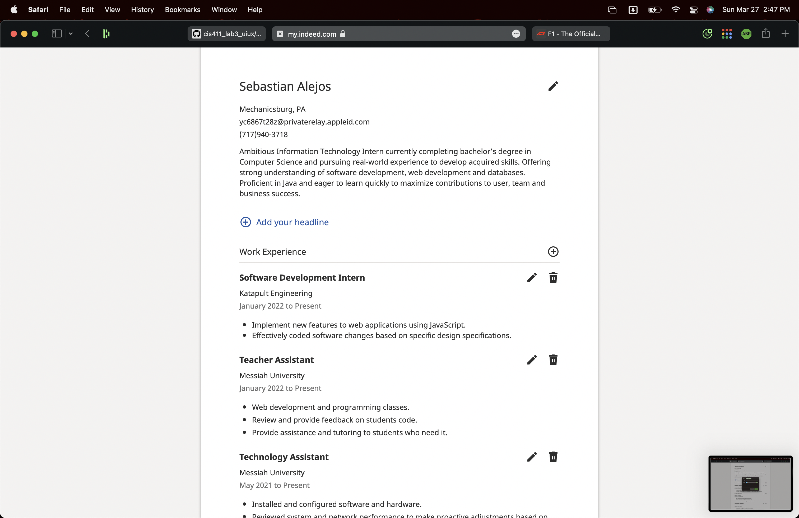
The process of finding job postings is handled by a search with filters.
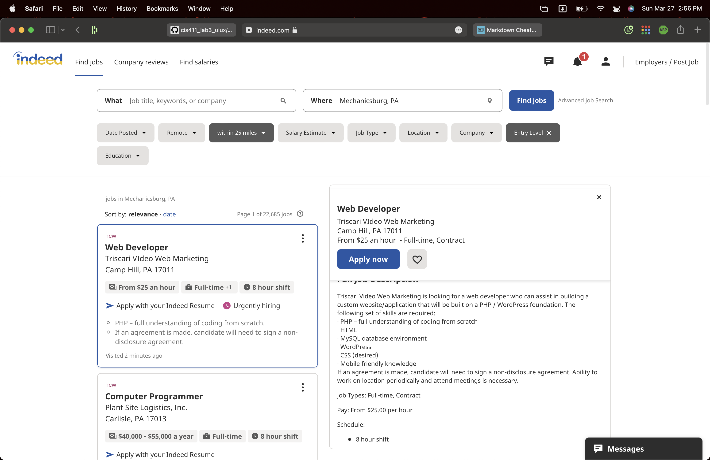
Some of the oportunities offered in the site take you to an external application, but when it doesn't the process requires 4 easy steps. You can edit your resume before submitting.
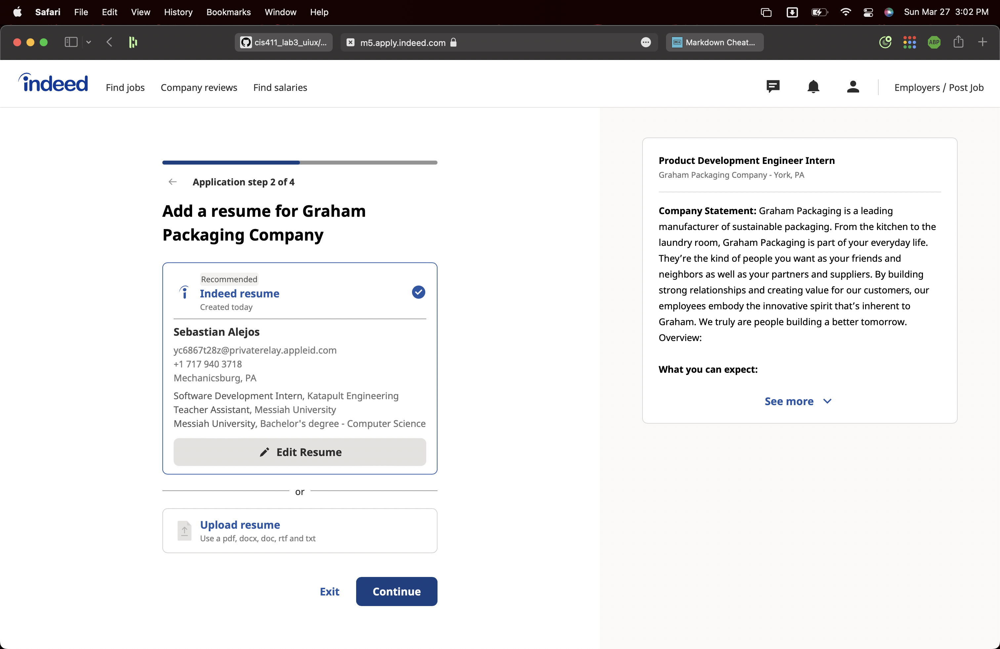
To submit, you just click the submit button.
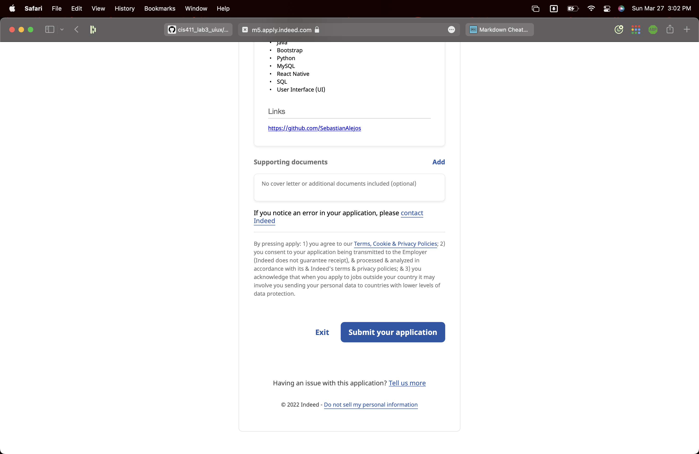

| Category | Grade (0-3) | Comments / Justification |
|---|---|---|
| 1. **Don't make me think:** How intuitive was this site? | 3  | I was able to upload my resume and with minimun tweaking, my profile was ready.|
| 2. **Users are busy:** Did this site value your time?  |3   |Creating a profile and applying for a job was a very simple process that in total took less than 10 minutes.|
| 3. **Good billboard design:** Did this site make the important steps and information clear? How or how not? | 3  |Every step taken was clearly indicated and I was never left confused. It clearly indicated how far away from being done I was.    |
| 4. **Tell me what to do:** Did this site lead you towards a specific, opinionated path? | 3  |It made it easy to make decisions and it guided me from creating the profile to finding a job that suited me and applying to that job.  |
| 5. **Omit Words:** How careful was this site with its use of copy? | 3  |There where no uneccessary and long text to read, everything is simple.  |
| 6. **Navigation:** How effective was the workflow / navigation of the site? |  3 |The navigation is seamless to the point that there is no thinking required or searching of stuff.   |
| 7. **Accessibility:** How accessible is this site to a screen reader or a mouse-less interface? | 0|Reader showed no valuable information   |
| **TOTAL** | 18  |   |

## 2.3 Site 2

### ZipRecruiter

To create your profile you start ansering basic questions.
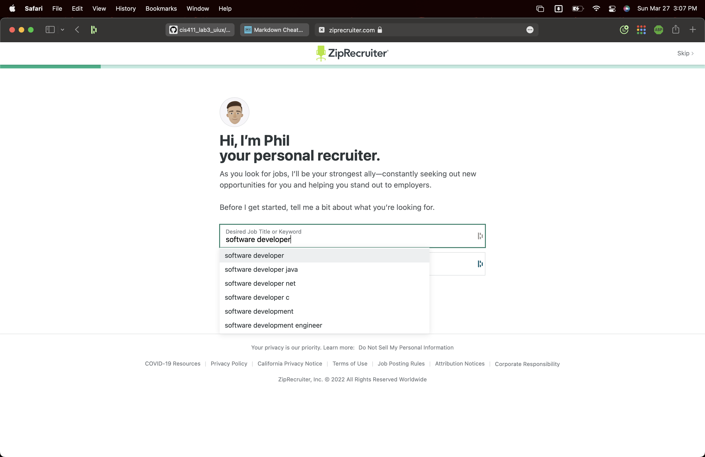
Then you can upload a resume.
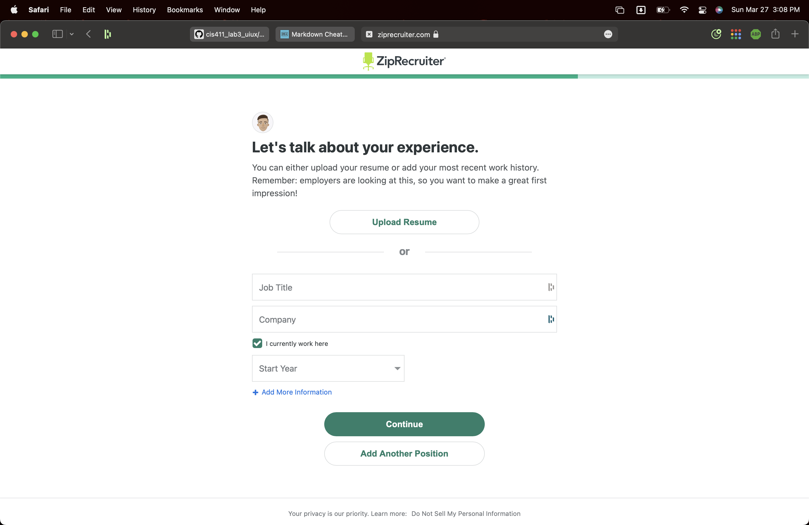
After uploading your profile, you can edit your work experience.
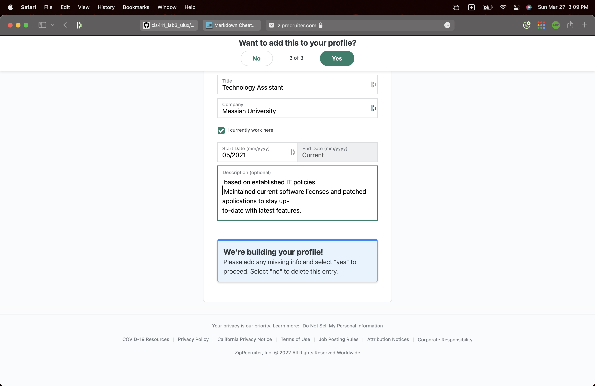
After adding your experience, you get to review your profile.
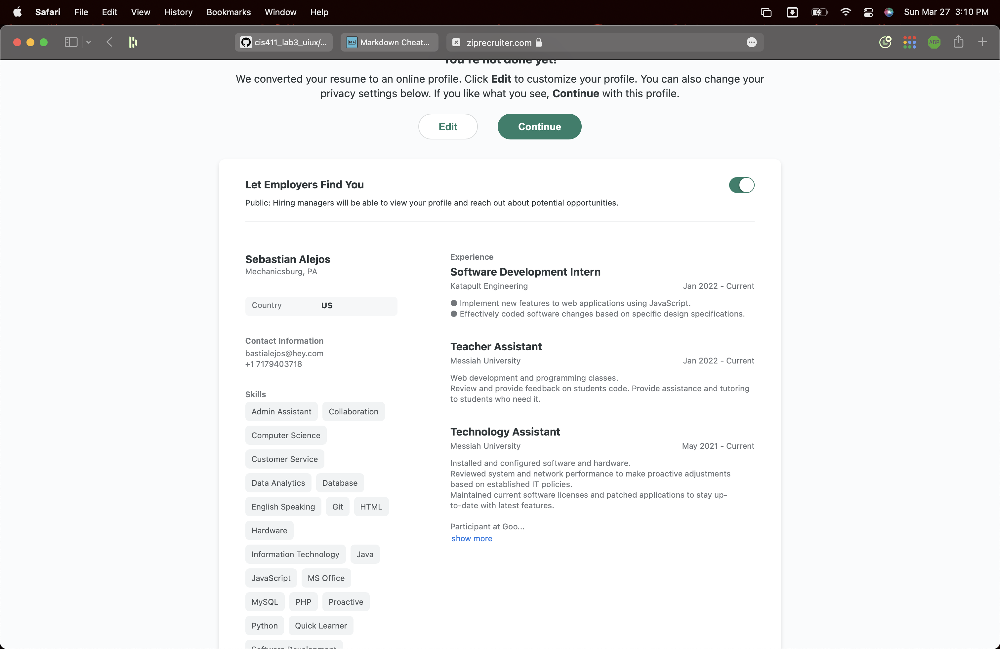
To search you can use several filters.
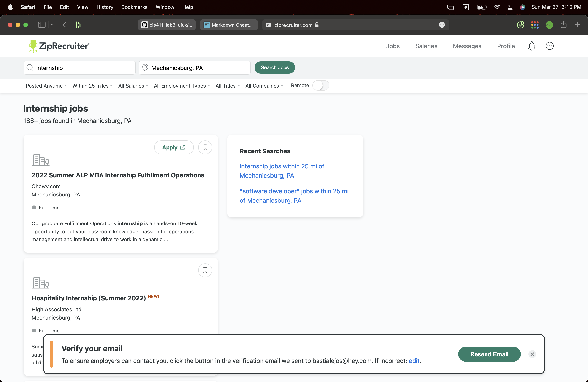
To apply, you have to re-enter some of the information you added to your profile.
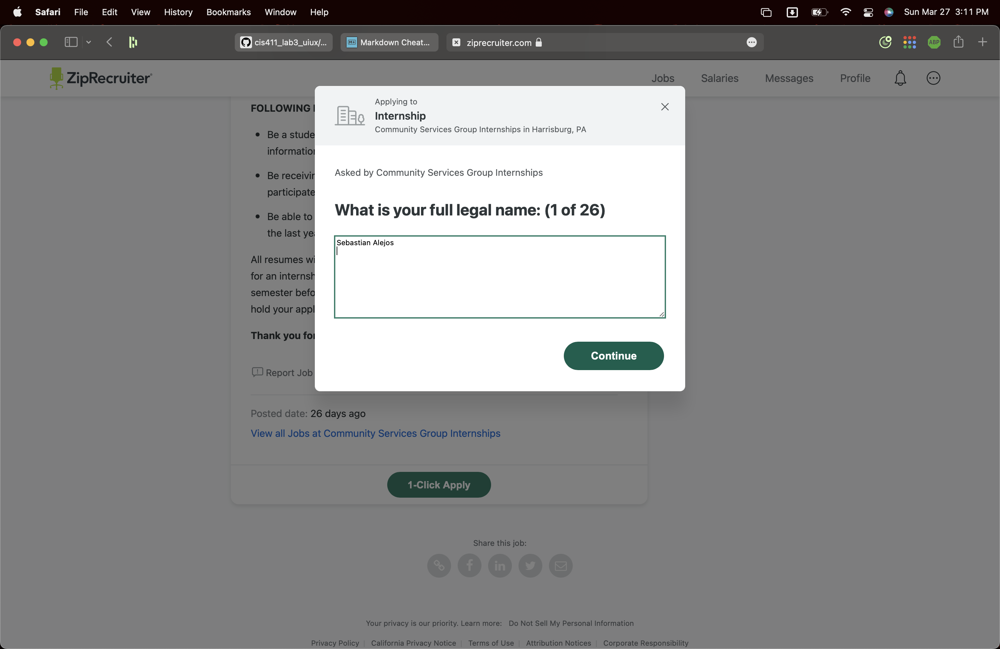
It isn't completely clear when you have finished the application, which made me apply by mistake.
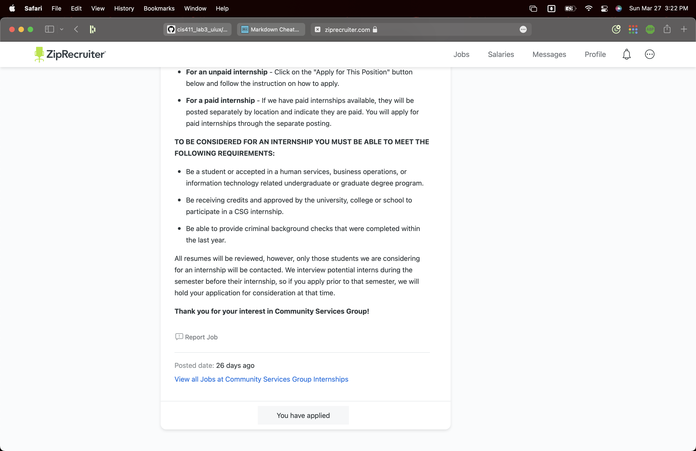

| Category | Grade (0-3) | Comments / Justification |
|---|---|---|
| 1. **Don't make me think:** How intuitive was this site? |  2 |   User inteface was clear when creating a profile. It lacks clarity when applying for a job|
| 2. **Users are busy:** Did this site value your time?  | 2  |You have to write things twice sometimes.    |
| 3. **Good billboard design:** Did this site make the important steps and information clear? How or how not? | 1  | It wasn't clear when an application is submitted  |
| 4. **Tell me what to do:** Did this site lead you towards a specific, opinionated path? |  3 | The transition from creating a profile to applying for a job is seamless.   |
| 5. **Omit Words:** How careful was this site with its use of copy? |  3 | No use of unecessary text  |
| 6. **Navigation:** How effective was the workflow / navigation of the site? |  3 | navigation is something we are familiar with.  |
| 7. **Accessibility:** How accessible is this site to a screen reader or a mouse-less interface? | 3  |Reader shows information for the job postings.   |
| **TOTAL** |   17|   |

# Step 3 Competitive Usability Test

 ## Step 3.1 Product Use Case

 | Use Case | |
 |---|---|
 | Title | Add Subscription Service |
 | Description / Steps | User must verify their credentials on YourTV as well as the desired subscription service. |
 | Primary Actor | User |
 | Preconditions | User has an account and is currently logged in |
 | Postconditions | The subscription service is added and accessible to user preferences |

 ## Step 3.2 Identifier a competitive product

 Competitor: [Truebill](www.truebill/feature/manage-subscriptions.com)  

 ## Step 3.3 Write a Useability Test

 | Step | Tasks | Notes |
 |---|---|---|
 | 1 | Creating Account/Logging In | Create a truebill account or login with an existing one. |
 | 2 | View Recurring Subscription Costs | Navigate to the recurring tab of the dashboard |
 | 3 | View Spending Costs | Navigate to the spendings tab of the dashboard |

 ## Step 3.4 Observe User Interactions

 | Step | Tasks | Observations |
 |---|---|---|
 | 1 | Creating Account/Logging In |Simple account creation with very clear steps. |
 | 2 | View Recurring Subscription Costs |Subscription costs shows all recurring bills as well as offering the ability to view only the upcoming ones.|
 | 3 | View Spending Costs    |Spending shows a very useful table to view your spending habits.|

 ## Step 3.5 Findings
 Pros:

- User Friendly
- Shows a summary of everything as well as a breakdown of spending habits.

 Cons:

- No hability to customize dashboard.
- I don't see the value of the premium subscription.

 Overall:

 -Truebill is a very useful tool to helop you with your spending habits. It is very user friendly and the breakdowns offered allows you to view relevant information and take action
  

# 4. Your UX Rule (Extra Credit)

If you opt to do extra credit, then include it here.
