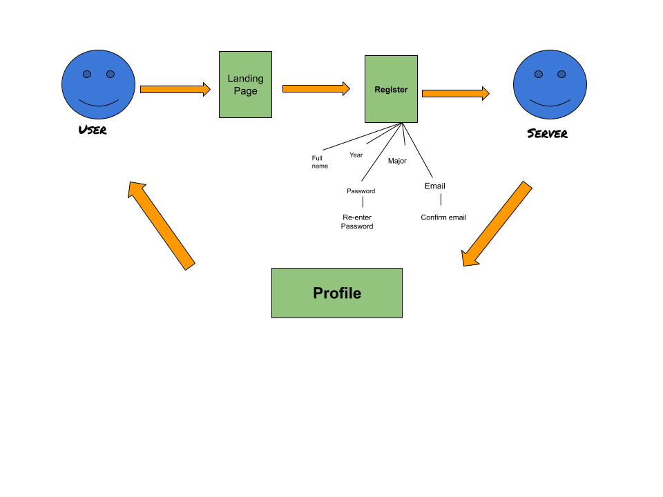

# Lab Report: UX/UI
___
**Course:** CIS 411, Spring 2021  
**Instructor(s):** [Trevor Bunch](https://github.com/trevordbunch)  
**Name:** Bryan Chang  
**GitHub Handle:** Triggum  
**Repository:** [Your Forked Repository](https://github.com/Triggum/cis411_lab3_uiux.git)  
**Collaborators:**
 @el1303
, @felixzrte, @JoeV22, @ RomanSearle  
___

# Step 1: Confirm Lab Setup
- [/] I have forked the repository and created my lab report
- [ ] If I'm collaborating on this project, I have included their handles on the report and confirm that my report is informed, but not copied from my collaborators.

# Step 2: Evaluate Online Job Search Sites

## 2.1 Summary
| Site | Score | Summary |
|---|---|---|
|Dice | 
12
 | Altogether pretty useful, but there were a few pages that were not clear or repetitive. |
| Glasdoor | Score 2 | Summary 2 |

## 2.2 Site 1
**Home page with registration as the first thing I see.**
1R.png)

**Registration has good account creation practices like re-typing password and a captcha**
2captcha.png)

**Skills tabs do not allow for proof of skills**
4unhelpful.png)

**Search page does not have a lot of useful information like salary or user reviews**
6searchpage.png)

**Easy to apply, but information has to be restated**
7easyapplication.png)

| Category | Grade (0-3) | Comments / Justification |
|---|---|---|
| 1. **Don't make me think:** How intuitive was this site? | 
2
 | Everything button was big and bright blue which caught my attention.  |
| 2. **Users are busy:** Did this site value your time?  |
1
   | The app required multiple inputs of the same information.   |
| 3. **Good billboard design:** Did this site make the important steps and information clear? How or how not? | 
1
  | The headings were difficult to understand and did not have a clear importance.  |
| 4. **Tell me what to do:** Did this site lead you towards a specific, opinionated path? | 
3
  |  It led me to applying for a job. |
| 5. **Omit Words:** How careful was this site with its use of copy? | 
2
  | There was a lot of clutter and words that do not have a clear meaning |
| 6. **Navigation:** How effective was the workflow / navigation of the site? | 
2
  | It was effective but required a lot of reading  |
| 7. **Accessibility:** How accessible is this site to a screen reader or a mouse-less interface? | 
1
  |  A lot of words could lead to an overload of information |
| **TOTAL** |  
12
 | Altogether pretty useful, but there were a few pages that were not clear or repetitive.  |

## 2.3 Site 2
**Landing Page with registration easily accessible**
1register.png)

**Registration page with easy to follow instructions**
2registrationpage.png)

**Email Verification process**
3twoauthentication.png)

**Helpful search page with lots of relevant information and user reviews**
4searchpage.png)

**Application links lead to the company's website to apply**
5leads.png)
6applythroughcompany.png)

| Category | Grade (0-3) | Comments / Justification |
|---|---|---|
| 1. **Don't make me think:** How intuitive was this site? | 
3
  | The site was intuitive and didn't require me to think much. |
| 2. **Users are busy:** Did this site value your time?  | 
1
  | The site was to the point for the most part but there were some surveys that appeared during the registration process.  |
| 3. **Good billboard design:** Did this site make the important steps and information clear? How or how not? |  
3
 | The important information was clear and easy to read  |
| 4. **Tell me what to do:** Did this site lead you towards a specific, opinionated path? | 
3
  | This site with it's user reviews helped make a decision.  |
| 5. **Omit Words:** How careful was this site with its use of copy? | 
2
  | The site did not have a lot of white space, but the information was relevant.  |
| 6. **Navigation:** How effective was the workflow / navigation of the site? |  
3
 |  Navigation was simple and easy to use |
| 7. **Accessibility:** How accessible is this site to a screen reader or a mouse-less interface? | 
2
  | The site was accessible to a mouse-less interface |
| **TOTAL** | 
17
  |   |

# Step 3 Competitive Usability Test

## Step 3.1 Product Use Case

| Use Case #1 | |
|---|---|
| Title | Register |
| Description / Steps |<ol><li>User goes to landing page for registration.</li><li>User clicks on registration page.</li><li>User inputs the required information.</li><li>User confirms their information.</li><li> Server stores the users information.</li></ol> |
| Primary Actor |The user|
| Preconditions |<ol><li> User is a valid student of Messiah University.</li>  |
| Postconditions |<ol><li>User is able to log in and out of the app</li><li>User is able to access more information on the site.</li><li>User is able to sign-up for events.</li></ol>  |

**Use Case Diagram**

## Step 3.2 Identifier a competitive product

List of Competitors
1. Competitor 1 [Instagram](www.instagram.com)
2. Competitor 2 [Discord](www.discord.com)

## Step 3.3 Write a Useability Test

| Step | Tasks | Notes |
|---|---|---|
| 1 | Go to discord.com/register  | Leads straight into the registration process.  |
| 2 | Fill out the information require to register  | Required information: Email, Username, Password, Date of Birth.  |
| 3 | Follow the account creation process  | Requires a valid email address and password. |
|4| Verification|Email verification or Mobile verification|
| 5 | User can show that they are logged in on the application.  |  User is successfully able to log into the app. |

## Step 3.4 Observe User Interactions

| Step | Tasks | Observations |
|---|---|---|
| 1 | Go to discord.com/register  |  Sees a create an account page. |
| 2 | Fill out the information require to register  | Could not set their password as "password".  |
| 3 | Follow the account creation process | Captcha and date of birth. Two-factor authentication. The User disliked having to do multiple captchas throughout the creation process.|
| 4 | Verification | Verification by email or phone (email was chosen). |
| 5| User can show that they are logged in on the application  | User succesfully logged in to discord. User was delighted that the process didn't take more than a few minutes and felt very fast. |

## Step 3.5 Findings

**Findings**
<ol><li>User was delighted at the smooth sign up procedure</li><li>
User was mildly frustrated at the multiple captchas required.</li><li>User felt like the whole process was under a minute.</li><li>
Security factor in the form of an email verification was implemented.</li></ol>

**Improvements that could be made.**
<ol><li> Re-typing password and password strength checker should be implemented.</li><li> Required too many captchas during the registration process which the user did not like. Cutting down on them or requiring one at the end of the process would be an improvement.</li><li>The terms and conditions were automatically confirmed and was in very small print. Having a dedicated window for it would be an improvement.</li></ol>

**Beneficial experiences**
<ol><li>Fast and smooth sign-up procedure</li><li>Email verification</li></ol>

**Team Summary**
<ol><li>Created a well defined usability test on a relevant and required feature of the app.</li> <li> Worked together cohesively as a team without any conflicts.</li><li>The team has room to improve on note taking.</li></ol>

**Brief Statement**  
It was an interesting experience seeing someone go through a process that I myself have gone through multiple times and It was easy to see the flow thanks to defining the Useability test

# 4. Your UX Rule (Extra Credit)
Murphy's Law. Anything that can go wrong will go wrong. A button that is clearly for registration might be missed by someone or someone might have inputed wrong data. Having multiple buttons to lead to where you want the user to go will help. Also being ready for users to not be unable to follow simple instructions is good practice.