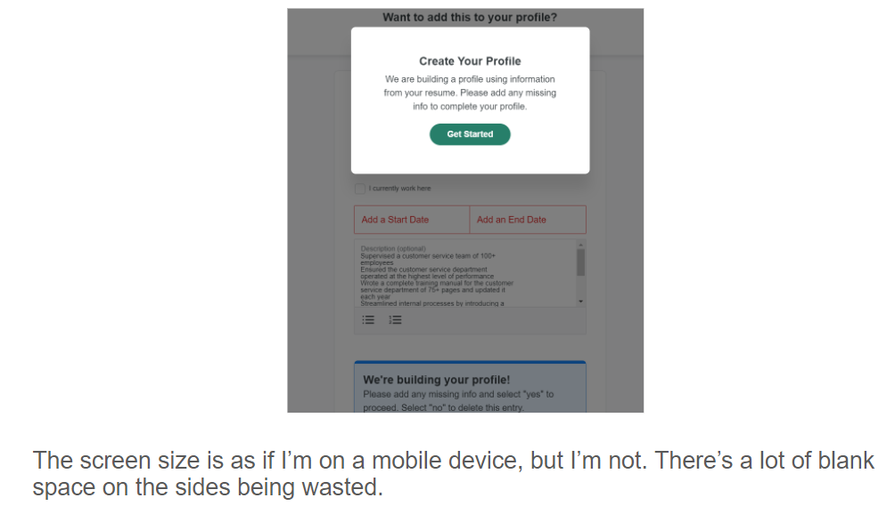

# Lab Report: UX/UI
___
**Course:** CIS 411, Spring 2021  
**Instructor(s):** [Trevor Bunch](https://github.com/trevordbunch)  
**Name:** Julina Metz  
**GitHub Handle:** julinametz  
**Repository:**  https://github.com/julinametz/cis411_lab3_uiux     
___

# Step 1: Confirm Lab Setup
- [X] I have forked the repository and created my lab report
- [X] If I'm collaborating on this project, I have included their handles on the report and confirm that my report is informed, but not copied from my collaborators.

# Step 2: Evaluate Online Job Search Sites

## 2.1 Summary
| Site | Score | Summary |
|---|---|---|
| Monster.com | 19 | My experience on monster was good overall. The design was intuitive and clean. The sign-up process was quick and easy. My only criticism is the size of the job listing as you will see in the screenshots below. When you select a job posting to be expanded form the search results, you have to scroll too much to view the entire posting. |
| Ziprecruiter.com | 12 | My experience on ziprecruiter was overall slightly below average. The biggest drawback was the amount of time and screens I had to click through to get anything done. The setup of the job search results and expanded postings was also odd as you can see in the screenshots below. The fact that I had to look around for the apply button on a job site is an obvious problem. The overall visual appeal of the site was decent. |

## 2.2 Site 1 Monster.com
1.
  
2.

3.

4.

5.

| Category | Grade (0-3) | Comments / Justification |
|---|---|---|
| 1. **Don't make me think:** How intuitive was this site? | 3 | The design is similar to many popular sites so I knew where to click.   |
| 2. **Users are busy:** Did this site value your time?  |  3 | The feature that pulled information from my resume to create my profile worked very well. Usually when a website tries to do that, the formatting is off. This worked perfectly and saved me the time of typing everything in.  |
| 3. **Good billboard design:** Did this site make the important steps and information clear? How or how not? | 2  | Mostly, however when I selected a job listing to be expanded from the search results, it only showed me a small portion of it and I had to scroll too much to see the entire thing. I wish I could view more of a single job listing in one screen.  |
| 4. **Tell me what to do:** Did this site lead you towards a specific, opinionated path? | 3  | The home page leads you straight into searching for and then applying for a job. If you scroll down you can find more resources, but the main purpose is upfront and clear.   |
| 5. **Omit Words:** How careful was this site with its use of copy? | 3  | The site struck a good balance between omitting words and still being clear with site navigation cues.  |
| 6. **Navigation:** How effective was the workflow / navigation of the site? |  3 | The navigation was smooth, especially through the process of creating my profile. It was clear each step had a purpose and I always knew where to click next.  |
| 7. **Accessibility:** How accessible is this site to a screen reader or a mouse-less interface? | 2  | Works well with a mouse-less interface. Unsure about a screen reader.  |
| **TOTAL** |  19 |   |

## 2.3 Site 2 Ziprecruiter.com
1.

2.

3.

4.

5.

6.

7.

8.

9.

10.

11.

12.

13.

14.

| Category | Grade (0-3) | Comments / Justification |
|---|---|---|
| 1. **Don't make me think:** How intuitive was this site? | 1  | There were a few times I had to look around to find the button I was looking for. When I selected a job listing, I had trouble finding the apply button. It turns out I needed to scroll to the bottom and the apply button didn't stand out enough to catch my attention.  |
| 2. **Users are busy:** Did this site value your time?  |  0 | I had to click through a lot of unnecessary screens. After I created my account, I wasn't allowed to do ANYTHING until I verified my email address. There was a section that showed me some features of the site, but each feature was on a different page and I had to click "continue" to go through all of them. As soon as I made my first job search, there was a pop-up that wanted me to rate the results. |
| 3. **Good billboard design:** Did this site make the important steps and information clear? How or how not? | 2  | The steps clarity of steps was okay, but could have been better. One area of improvement would be making the apply button more prominent.  |
| 4. **Tell me what to do:** Did this site lead you towards a specific, opinionated path? | 3  | The site directed me to create an account as soon as I got to the homepage. Now that I have an account, the homepage leads me directly to job listings based on my past searches.  |
| 5. **Omit Words:** How careful was this site with its use of copy? |  2 | There were a fair amount of unnecessary words on the site.   |
| 6. **Navigation:** How effective was the workflow / navigation of the site? |  2 | The navigation was okay. I did not like that when I selected a job listing from the search results, the rest of my search results went away and were replaced with random job suggestions.  |
| 7. **Accessibility:** How accessible is this site to a screen reader or a mouse-less interface? | 2  | Works well with a mouse-less interface. Unsure about a screen reader.  |
| **TOTAL** | 12  |   |

# Step 3 Competitive Usability Test

## Step 3.1 Product Use Case

| Use Case #1 | |
|---|---|
| Title | Water pump needs repairs |
| Description / Steps | 1.	Repair person receives notification of a necessary repair. The notification will include the water pump location and any available data on the type of repair needed.
|  |2.	Repair person logs into the app to view the details. |
|  |3.	Repair person updates the status of the pump with information on when they will complete the repair.|
|  |4.	Repair person goes to the water pump and fixes it.|
| Primary Actor | Repair Person|
| Preconditions | Water pump is in need of repair and has transmitted the necessary data. |
| Postconditions | Repair person logs data about the type of repair completed and updates the status of the pump to “fixed”. |

## Step 3.2 Identifier a competitive product

List of Competitors
1. Competitor 1 [Charity Water](https://www.charitywater.org/)
2. Competitor 2 [World Vision](https://www.worldvision.org/)

## Step 3.3 Write a Useability Test: World Vision

| Step | Tasks | Notes |
|---|---|---|
| 1 | Locate the monthly donation page  | Select the "Donate" button on the top left of the screen and then click the "Giving monthly..." link  |
| 2 | Find contact information for World Vision  | Scroll to the bottom on any page  |
| 3 | Find the map of locations helped by World Vision  | Navigate to the "Our Work" tab and scroll down  |
| 4 | Create an account  | Click "sign-in" and then select the "Don't have a sign-in" link  |

## Step 3.4 Observe User Interactions: World Vision

| Step | Tasks | Observations |
|---|---|---|
| 1 | Locate the monthly donation page  | The user clicked the "Donate" button right away. After a minute, they found the "give monthly" link. They said it was clear where to do a one-time donation, but more difficult to find the recurring donation option.   |
| 2 | Find contact information for World Vision  | The user said the contact information was probably at the bottom of the page or under the "About Us" tab. They decided to try scrolling to the bottom first, which was correct. The contact information is located at the bottom of all pages, including "About Us".  |
| 3 | Find the map of locations helped by World Vision  |  User selected the "Our Work" tab after quickly scanning the possible tabs. Scrolled down to find the map. The user stated this was easy to locate. |
| 4 | Create an account  | The user went straight to the "sign-in" link at the top of the page. There was not a link that said "sign-up" and the user was confused. There was a link that said "Don't have a sign-in", but the user thought this was for people who had lost their sign-in information. The user finally clicked the "Don't have a sign-in" link and was directed to a page that said "Let's see if we have your information on file". There was a field for an email address, account number, and zip code. The user did not have an account number, so they entered email and zip code. The information was erased when the user tried to continue and the user became frustrated. After trying several times, the user realized the site was asking for email OR account number AND zip code. The user entered email and was able to continue. The site said it could not locate an account under that email and finally directed them to sign-up for an account. The user was unhappy with the amount of steps it took to create a new account.  |

## Step 3.5 Findings
**Three Improvements**
1.	 There should be a clear option to “Sign-Up” for an account, rather than just an option to “Sign-In”. Normally, a website will allow you to easily sign-up from the sign-in page, but this website did not have an easy was to do that.
2.	The option to make a recurring donation should certainly be more prominent on the site. Encouraging users to make a recurring donation, rather than one-time, should be a clear goal for the designers. The one-time donation option should still be easy to find, but the recurring donation should be promoted more. 
3.	The exact purpose of the charity should be more clearly stated on the home page of the site.  

**Two Benefits to the User**
1.	The user learned to better navigate the site and the lessons learned can be applied to other similar websites.
2.	The user learned that they should just keep clicking through options if they are unsure where to go on the site. 

The steps in the usability test were designed well to get a full picture of the user experience on the world vision site. 
Next time, the test would be easier to analyze if we record the usability test. 

The overall experience was interesting. When creating the test and trying each action for myself, I did not foresee the user having any confusion. I was surprised to find the points of confusion and frustration for the user and it helped me realize each user will come to the site with a different mindset and a path that is clear to one person, will not be clear to others. 

# 4. Your UX Rule (Extra Credit)
Balance in design is important

The design on each screen should be at least somewhat balanced. If there’s a large image on the left side of the screen, then there should be something on the right side, whether it be a small amount of text, or another image. If you have an image in the middle, then balance what you put on the left and right of the image. Don’t leave one side blank, put an image in the middle and put text on the other side. The page doesn’t always need to be 100% balanced on each side, but if it’s too unequal then it will feel awkward to the user. 
