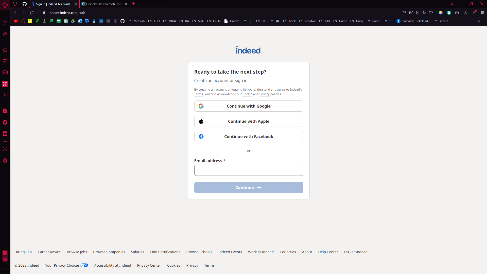
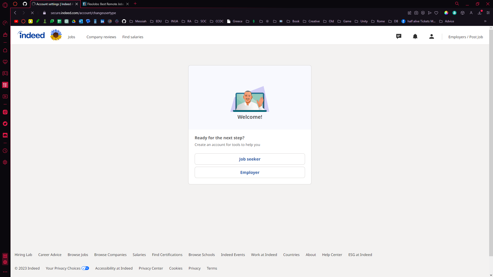
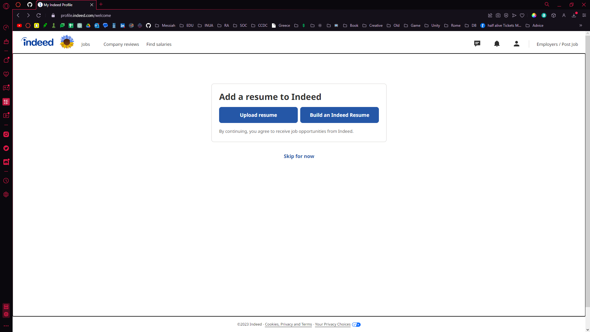
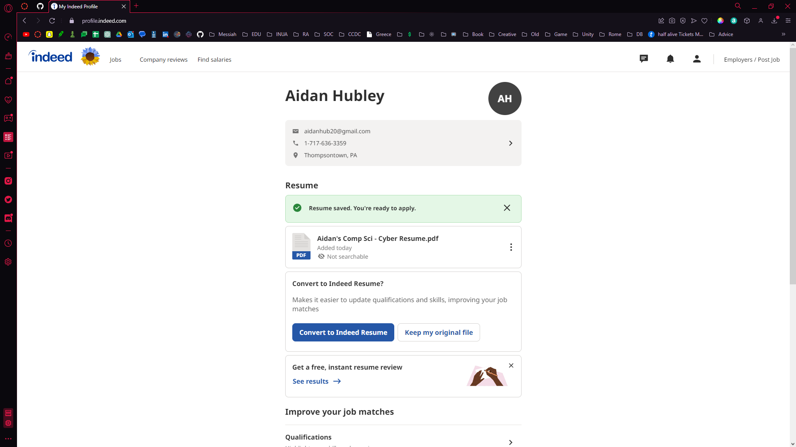
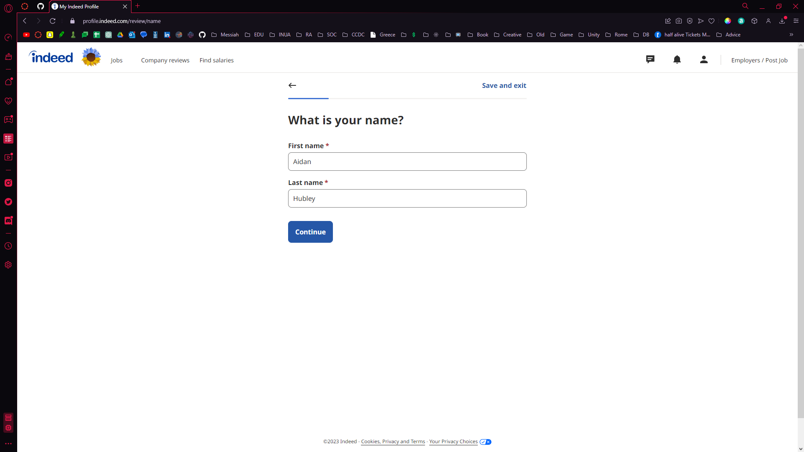
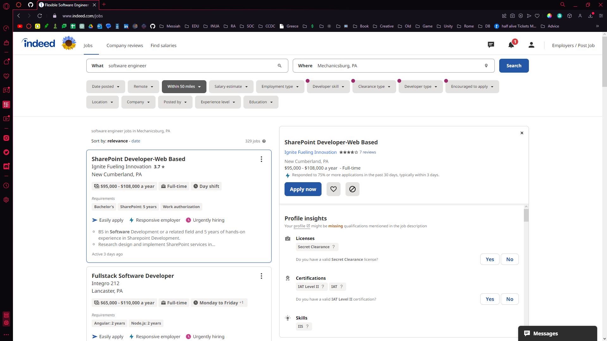
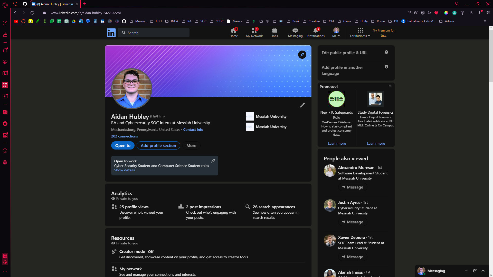
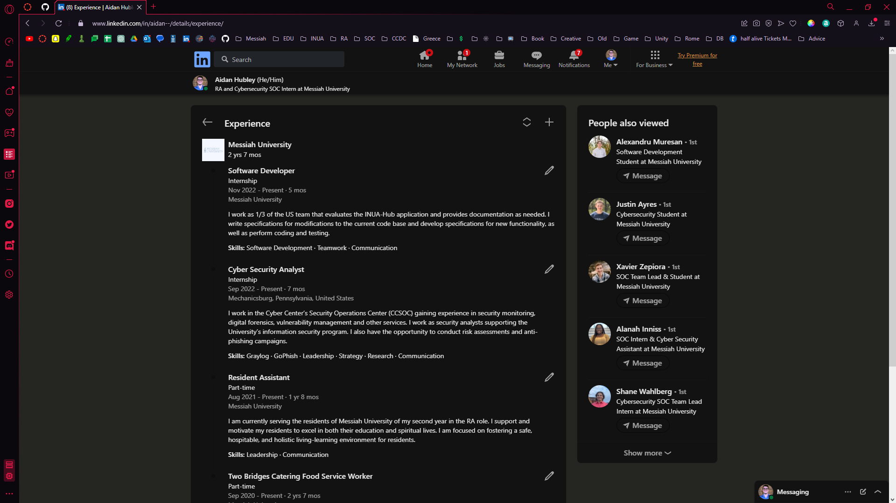
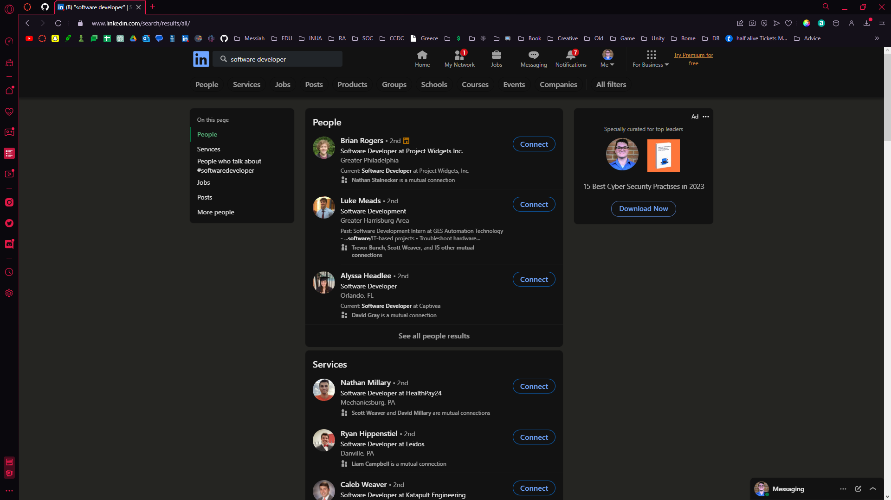
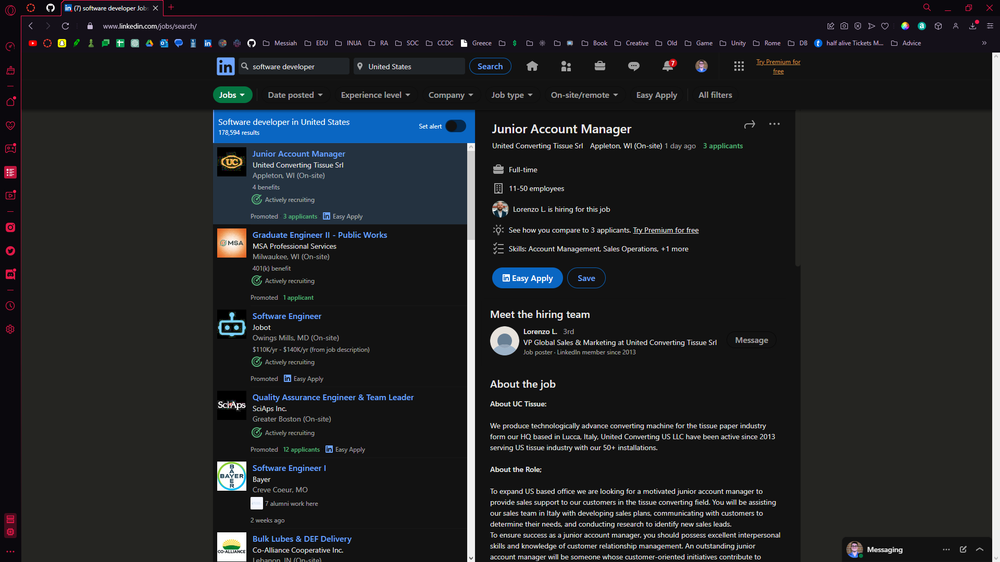

# Lab Report: UX/UI
___
**Course:** CIS 411, Spring 2021  
**Instructor(s):** [Trevor Bunch](https://github.com/trevordbunch)  
**Name:** Aidan Hubley  
**GitHub Handle:** [aidan-hubley](https://github.com/aidan-hubley)  
**Repository:** [Your Forked Repository](https://github.com/aidan-hubley/cis411_lab3_uiux)  
**Collaborators:** ChatGPT - JDAyers - Statmosphere - jp1579 - 02NRA
___

# Step 1: Confirm Lab Setup
- [X] I have forked the repository and created my lab report
- [X] If I'm collaborating on this project, I have included their handles on the report and confirm that my report is informed, but not copied from my collaborators.

# Step 2: Evaluate Online Job Search Sites

## 2.1 Summary
| Site     | Score | Summary                                                                                                   |
|----------|-------|-----------------------------------------------------------------------------------------------------------|
| Indeed   | 19    | Shockingly intuitive and clear in leading a user through the account creation and job searching features. |
| LinkedIn | 12    | Reliable while quite wordy, with a remarkable amount of features to waste time learning.                  |

## 2.2 Site 1 - Indeed
### Account Creation
1. Create account - Continue with Google

   - I have always appreciated the ability to log in and/or sign up through a Google account.
2. Select account type

    - Self-explanatory enough but I can see the helpfulness of more description. Especially if one email can only be a single type of account.
3. Upload resume

    - I really appreciate the option to skip this step, although I did not select that.
4. Convert to Indeed Resume

5. Fill Form

    - Overall, I am quite happy with the process of converting my resume to an Indeed Resume. It was 'intelligent' enough to recognize categories. Very user-friendly.

### Job Search / Application
1. Search for field / keyword

 - The search seems simple enough to navigate, and the varied categories/tags below the search feature offer a great range of customizability. 

| Category                                                                                                    | Grade (0-3) | Comments / Justification                                                                                          |
|-------------------------------------------------------------------------------------------------------------|-------------|-------------------------------------------------------------------------------------------------------------------|
| 1. **Don't make me think:** How intuitive was this site?                                                    | 3           | I found the site very user friend with a modern navigation layout.                                                |
| 2. **Users are busy:** Did this site value your time?                                                       | 3           | Both the account creation and search features were impressively streamlined and took me less time and I expected. |
| 3. **Good billboard design:** Did this site make the important steps and information clear? How or how not? | 2           | The account creation steps are quite hard cut, offering little room for misinterpretation.                        |
| 4. **Tell me what to do:** Did this site lead you towards a specific, opinionated path?                     | 3           | Overall that path to create an account and to find a job is simple and hard to "step off the path".               |
| 5. **Omit Words:** How careful was this site with its use of copy?                                          | 3           | The steps while creating a site use minimal words.                                                                |
| 6. **Navigation:** How effective was the workflow / navigation of the site?                                 | 2           | I find that the landing page's navigation is passable but also lackluster.                                        |
| 7. **Accessibility:** How accessible is this site to a screen reader or a mouse-less interface?             | 3           | I did not use a screen reader, I use a mouse and it works well for me.                                            |
| **TOTAL**                                                                                                   | 19          |                                                                                                                   |

## 2.3 Site 2 - LinkedIn
### Account
1. I already have a LinkedIn account created.

2. The Experience Page offers the ability to update/edit each experience.

    - This page provides a simple form to update professional experiences, although slightly wordy.

### Job Search / Application
1. Search for field / keyword

    - Upon using the searchbar to search for field/keyword does not default the query to look for jobs.
    - You must select the "Jobs" filter to accurately see jobs instead of people.
2. Select the Job filter

   - The Easy Apply button grabs my attention well. I find the use of color and layout of this page works well.

| Category                                                                                                    | Grade (0-3) | Comments / Justification                                                                                               |
|-------------------------------------------------------------------------------------------------------------|-------------|------------------------------------------------------------------------------------------------------------------------|
| 1. **Don't make me think:** How intuitive was this site?                                                    | 2           | Overall, the site is relatively intuitive to use, but slightly clunky at times.                                        |
| 2. **Users are busy:** Did this site value your time?                                                       | 2           | I find that this site does not waste my time, but the vast amount of features pulls me to spend more time on the site. |
| 3. **Good billboard design:** Did this site make the important steps and information clear? How or how not? | 2           | Lots of words, this tends to muddy the water when it comes to making information clear.                                |
| 4. **Tell me what to do:** Did this site lead you towards a specific, opinionated path?                     | 0           | No, this site seems to prioritize a variable path/use case system.                                                     |
| 5. **Omit Words:** How careful was this site with its use of copy?                                          | 1           | This site was more than willing to implement words over icons or simplified explanations.                              |
| 6. **Navigation:** How effective was the workflow / navigation of the site?                                 | 2           | The workflow is quite streamlined, but only after you find yourself overwhelmed by the vast amount of features.        |
| 7. **Accessibility:** How accessible is this site to a screen reader or a mouse-less interface?             | 3           | I did not use a screen reader, I use a mouse and it works well for me.                                                                                                                       |
| **TOTAL**                                                                                                   | 12          |                                                                                                                        |

# Step 3 Competitive Usability Test

## Step 3.1 Product Use Case

| Use Case #1         |                                                                                                                                                                                                                                                                        |
|---------------------|------------------------------------------------------------------------------------------------------------------------------------------------------------------------------------------------------------------------------------------------------------------------|
| Title               | New User Joining a Circle                                                                                                                                                                                                                                              |
| Description / Steps | 1. User receives link to join a prayer circle from a friend. 2. Upon clicking the link, the user is directed to the app's sign on view. 3. User creates an account, and signs into the application. 4. User is prompted to join the circle. |
| Primary Actor       | New Personal User                                                                                                                                                                                                                                                      |
| Preconditions       | Circle Creation                                                                                                                                                                                                                |
| Postconditions      | User receives notifications from prayer circle                                                                                                                                                                                                                         |

## Step 3.2 Identifier a competitive product

List of Competitors
1. [faithmeet](https://www.faithmeet.com)
2. [PrayerChainOnline](https://www.prayerchainonline.net)
3. [biblefolk](http://biblefolk.com)
4. [101ChristianSocialNetwork](https://www.101christiansocialnetwork.com)
5. [IndieGospel](https://indiegospel.net)

## Step 3.3 Write a Useability Test - FaithMeet

| Step | Tasks                                     | Notes                                                               |
|------|-------------------------------------------|---------------------------------------------------------------------|
| 1    | Navigate to faithmeet.com                 |                                                                     |
| 2    | Watch "Introducing FaithMeet" Intro Video | View complete video                                                 |
| 3    | View App Features Table                   | Select and View both the Church/Ministry tab and the Individual tab |
| 4    | View Pricing Plans                        | Select and View both the Individual tab and Church/Ministry tab     |
| 5    | Navigate to the Features tab              | Interact with the navigation bar and select the Features tab        |

## Step 3.4 Observe User Interactions

| Step | Tasks                                     | Observations                                                                                                                                                                                                     |
|------|-------------------------------------------|------------------------------------------------------------------------------------------------------------------------------------------------------------------------------------------------------------------|
| 1    | Navigate to faithmeet.com                 | Simple, site is up and accessible.                                                                                                                                                                               |
| 2    | Watch "Introducing FaithMeet" Intro Video | Upon reaching the home page, the Watch Video button grabbed their attention. The video was open but easily clicked off. They sped the video to 2x speed.                                                         |
| 3    | View App Features Table                   | The multi-tabbed App Features table was initially scrolled passed and overlooked. They data between the different tabs is nearly identical.                                                                      |
| 4    | View Pricing Plans                        | The colored buttons in the Pricing Plans table caught their attention. The secondary tab was ignored on the table. Emotions were displayed upon reading the cost of the Pro subscription.                        |
| 5    | Navigate to the Features tab              | Navigation menu was familiar and used with ease. The headers on the Features page was complained about and the overall design was unintriging.                                                                   |
|6     | Overall Evaluation                        | 7.5/10, I think that the site was made relatively well, there were some poor design choices  I wish that it wasn't as easy to accidentally click out of the video, and I think there needs to be more pages. |

## Step 3.5 Findings
**Improvements**
- Fullscreen the video to remove the potential of accidental click off.
- Simplify the pricing plan table.
- Improve design of Feature page.

**Experiences**
- The easy accessibility and simple navigation of the site. This allows users to quickly find informative content 
without feeling overwhelmed.
- The introduction video play button grabs attention well. 

**Team Improvement**
- I believe the team could have begun the process earlier in the week. This would have allowed us to dive deeper into
the usability test.
- Next time we should shoot for more steps and an earlier start date.

**My Experience**
- I recognize the importance in a usability test. I find it helpful that we tested the usability of our potential 
competitor's sites. Listing steps ahead of time felt unnatural, but I can see it being helpful when you are overly 
familiar with a site, or if it is your application. I look forward to conducting usability tests on Prayer Circle.

# 4. Your UX Rule (Extra Credit)
## Usability Rule: Keep Navigation Simple, Forget Fancy Design
To avoid confusion and potential lack of interest, streamline navigation. Every page on your site should have visible 
and accessible navigation links, with descriptive labels that accurately describe what users can expect to find by 
clicking on them. Style of navigation should never come at the expense of clear navigation of the application.