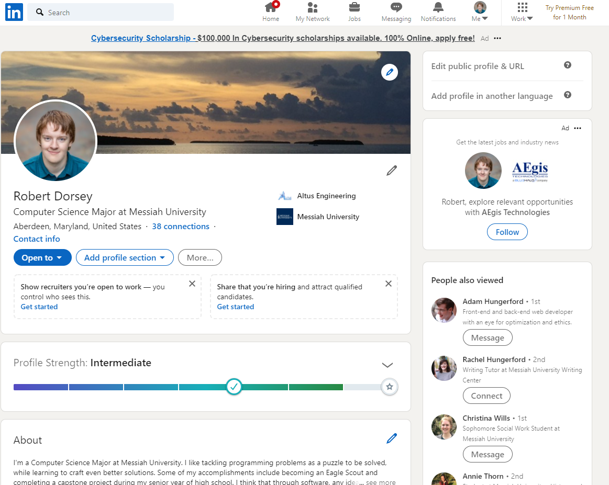
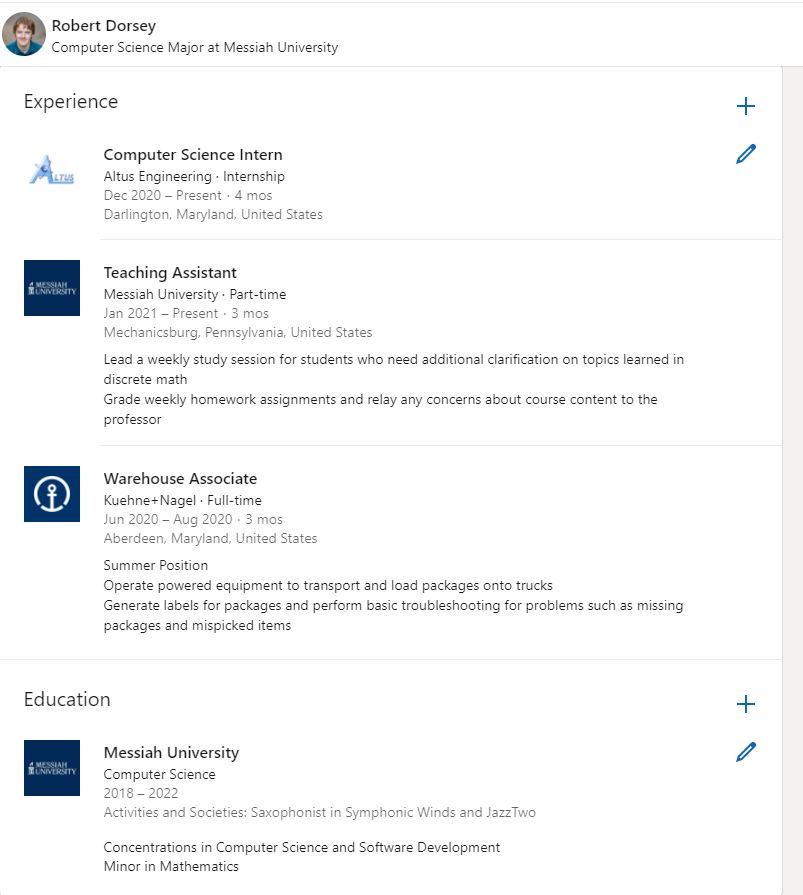
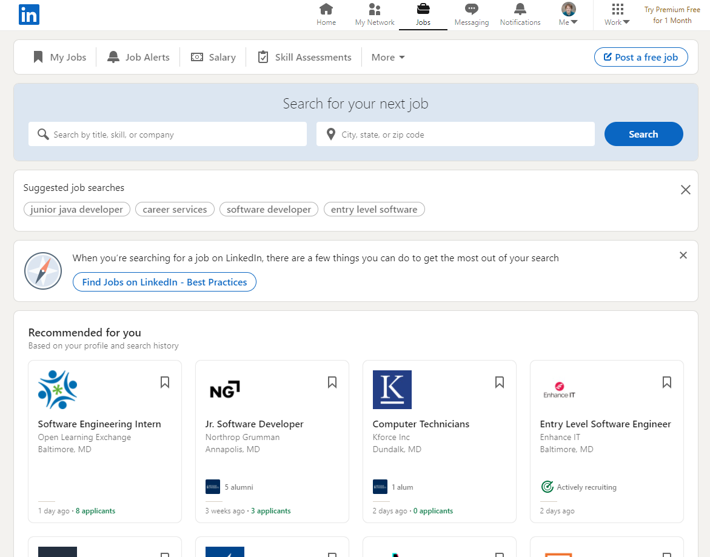
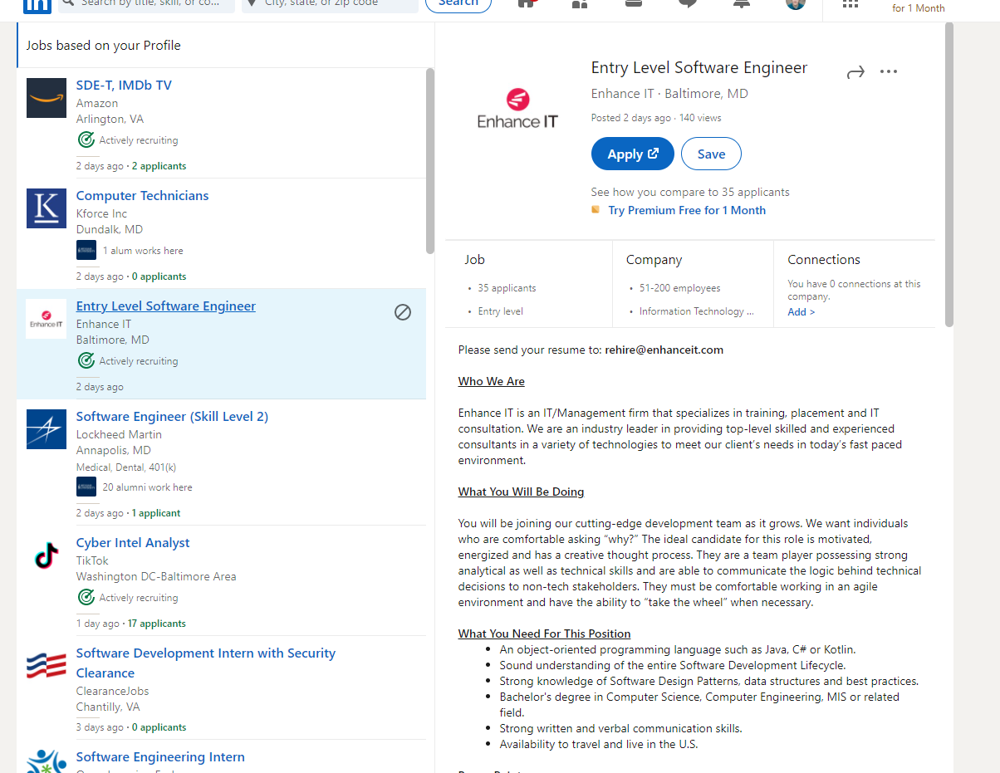
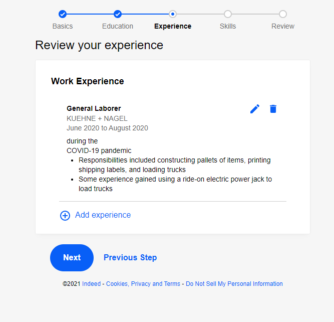
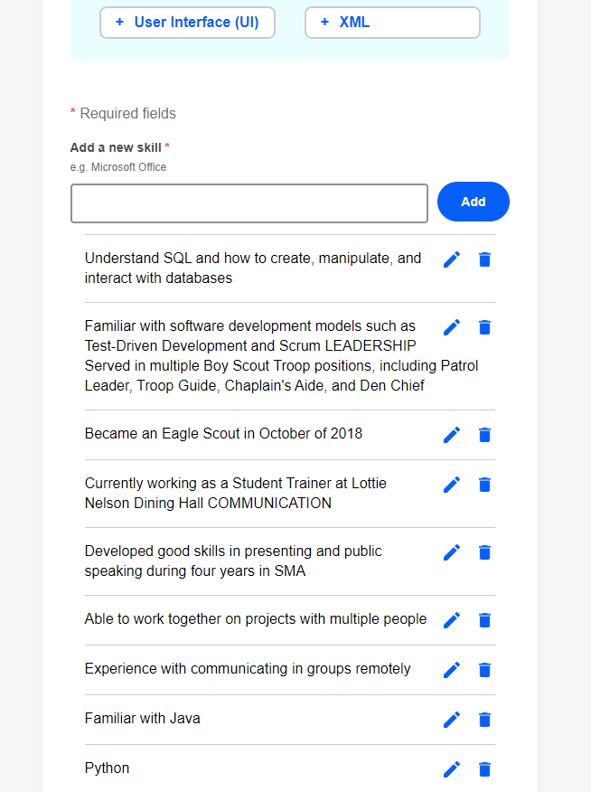
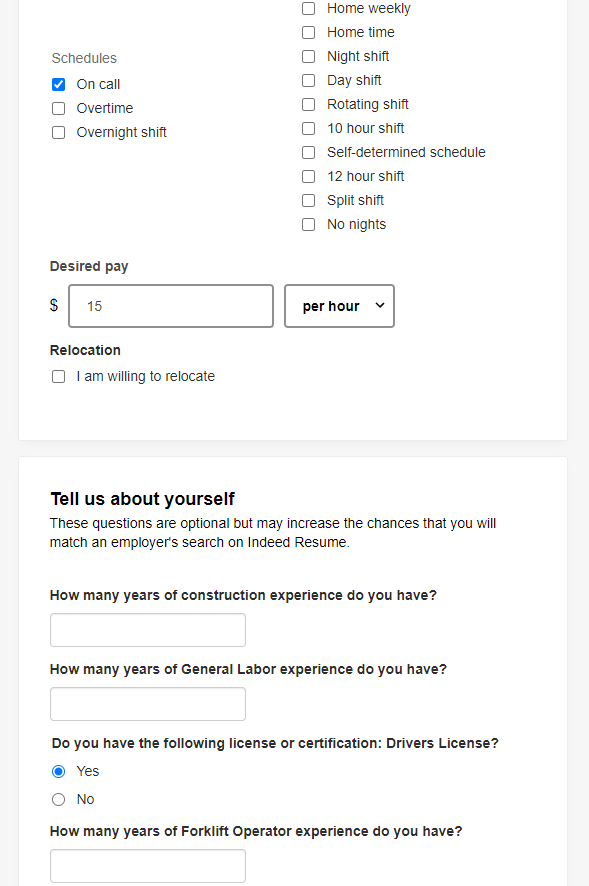
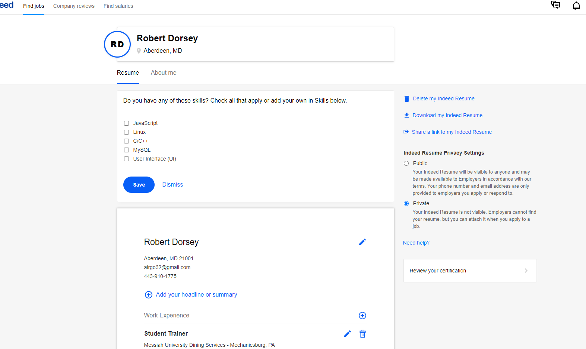
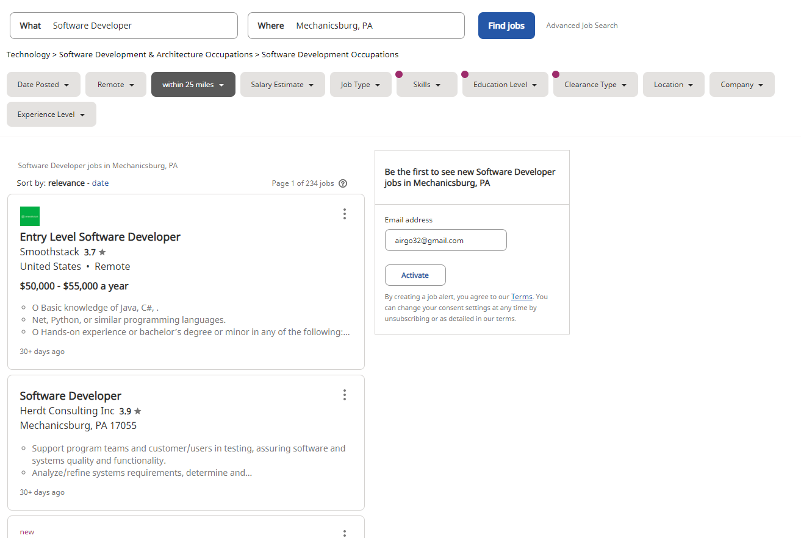
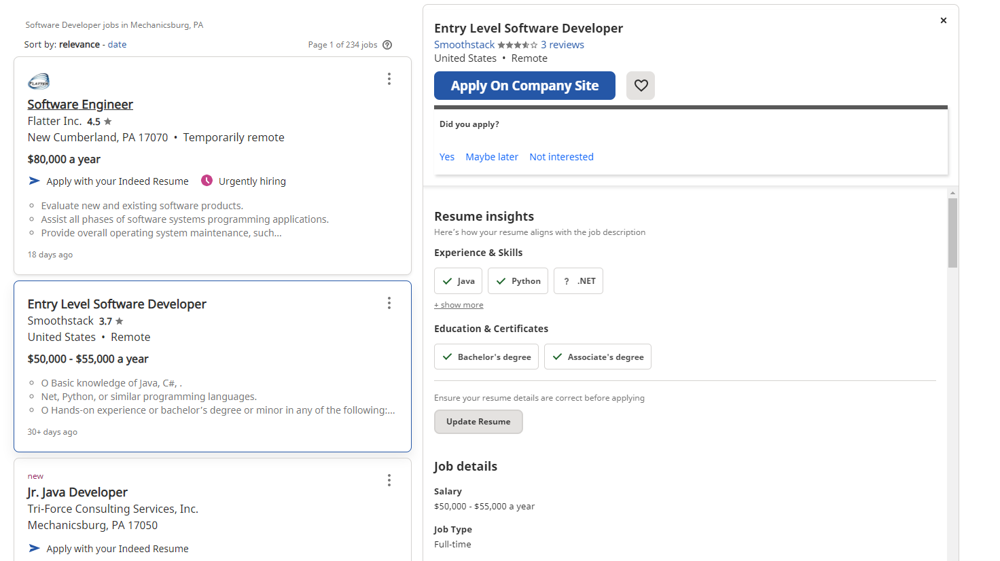

# Lab Report: UX/UI
___
**Course:** CIS 411, Spring 2021  
**Instructor(s):** [Trevor Bunch](https://github.com/trevordbunch)  
**Name:** Robbie Dorsey  
**GitHub Handle:** airgo32  
**Repository:** https://github.com/airgo32/cis411_lab3_uiux  
**Collaborators:**   
___

# Step 1: Confirm Lab Setup
- [X] I have forked the repository and created my lab report
- [X] If I'm collaborating on this project, I have included their handles on the report and confirm that my report is informed, but not copied from my collaborators.

# Step 2: Evaluate Online Job Search Sites

## 2.1 Summary
| Site | Score | Summary |
|---|---|---|
| LinkedIn | 15 | Much bigger focus on networking, which is obvious. Good at suggesting jobs before searching. Search is not as customizable, but it does show if people who have something in common with me work there (such as being an alumni from Messiah). |
| Indeed | 15 | More streamlined for finding jobs. The account creation process was a little tedious with fixing information scanned from my resume, but the customizable search and comparing my Indeed Resume with jobs makes it easier to see at a glance if a job is a good fit. |

## 2.2 LinkedIn

   
The LinkedIn profile page has a lot of information and things to click on. It's easy to get to this screen, just click "Me" at the top right and go to profile page. [Link](https://www.linkedin.com/in/robert-c-dorsey/)

   
Adding new information and customizing your page is easy. Just click the + on which section you want to add information to. [Link](https://www.linkedin.com/in/robert-c-dorsey/)

   
The "Jobs" page is automatically filled in with jobs that might suit me, based on information I put on my profile. I can also search for a job and am given a few keyword suggestions. [Link](https://www.linkedin.com/jobs/)

   
Selecting a job to apply to gives some basic statistics such as company size and gives the option to apply on the company's website or bookmark the position. [Link](https://www.linkedin.com/jobs/search/?currentJobId=2477822883&geoId=103644278&keywords=entry%20level%20software%20engineer%20enhance%20it&location=United%20States)

| Category | Grade (0-3) | Comments / Justification |
|---|---|---|
| 1. **Don't make me think:** How intuitive was this site? |  3 | Everything I needed to access was easy to find on top  |
| 2. **Users are busy:** Did this site value your time?  |  3 | I only had to click "Jobs" and The site instantly started displaying positions  |
| 3. **Good billboard design:** Did this site make the important steps and information clear? How or how not? | 2  | LinkedIn would often link to other companies' websites to apply, so there weren't any breadcrumbs to follow |
| 4. **Tell me what to do:** Did this site lead you towards a specific, opinionated path? |  2 | Some of the automatic recommendations didn't match my skillsets  |
| 5. **Omit Words:** How careful was this site with its use of copy? | 2  | The profile screen in particular was hard to tell what was important to edit and what wasn't  |
| 6. **Navigation:** How effective was the workflow / navigation of the site? | 1  | Many application links forced me to apply directly on the company's website, not through LinkedIn   |
| 7. **Accessibility:** How accessible is this site to a screen reader or a mouse-less interface? |  2 |   |
| **TOTAL** | 15  |   |

## 2.3 Indeed
   
The Indeed profile creation screen asked for my resume to start. The information it automatically parsed is a good timesave, but needs some adjusting. 

   
Here, Indeed tried to add skills that appeared on my resume. This is a more egregious example of things I had to fix when creating my Indeed Resume. 

   
This screen had some more information about what kind of job I want. The questions at the bottom of the page seem to relate to the work experience I put on one of the previous pages, but I don't exactly know how responding to these questions connects me with employers better. 

   
Here's the final account page. Compared to LinkedIn, Indeed seems to be focused more on connecting users with jobs, not so much on networking.  [Link](https://my.indeed.com/p/robertd-zwhez0t)

   
Indeed doesn't come up with recommended jobs like LinkedIn, so here's a search for "Software Developer." There's a lot of options to tweak for location, experience, and salary. [Link](https://www.indeed.com/jobs?q=Software%20Developer&l=Mechanicsburg%2C%20PA&ts=1616976476037&rq=1&rsIdx=1&fromage=last&newcount=234)

   
Job screen on Indeed. I really like how the skills on my resume are cross referenced with the ones listed for the job in order to help find if this job would be a good fit for me. [Link](https://www.indeed.com/jobs?q=Software%20Developer&l=Mechanicsburg%2C%20PA&ts=1616976476037&rq=1&rsIdx=1&fromage=last&newcount=234&advn=8566145888455880&vjk=5f913bcfecb065a5)

| Category | Grade (0-3) | Comments / Justification |
|---|---|---|
| 1. **Don't make me think:** How intuitive was this site? | 2  | The site allowed me to upload a resume to convert to an Indeed resume, but a lot of the text it pulled removed the context and needed to be fixed  |
| 2. **Users are busy:** Did this site value your time?  | 1  | The site filled in a few things on my Indeed resume, but most of it had to be adjusted or corrected  |
| 3. **Good billboard design:** Did this site make the important steps and information clear? How or how not? | 3  | The Indeed resume creation process very clearly said what step I was on  |
| 4. **Tell me what to do:** Did this site lead you towards a specific, opinionated path? | 2  | Unlike LinkedIn, I didn't get recommendations straight away baseed on my profile. I do like how it parses the job descriptions for the required skills and cross references with your profile to see what you have or lack |
| 5. **Omit Words:** How careful was this site with its use of copy? | 3  | All text was very brief  |
| 6. **Navigation:** How effective was the workflow / navigation of the site? | 2  | The website is very bland looking, nothing stands out. It took me a second to find the "Find Jobs" button  |
| 7. **Accessibility:** How accessible is this site to a screen reader or a mouse-less interface? | 2  | Lots of the icons are very small  |
| **TOTAL** | 15  |   |

# Step 3 Competitive Usability Test

## Step 3.1 Product Use Case

| Use Case #1 | |
|---|---|
| Title | Schedule a Soccer Game |
| Description / Steps | The user must schedule an event in the appropriate loop, select a date, time and location, and be able to communicate with attendees |
| Primary Actor | Event Scheduler (any user) |
| Preconditions | Must have an account on The Loop, must already know a time and place |
| Postconditions | An event is created, people are able to view event details and plan to attend |

## Step 3.2 Identifier a competitive product

List of Competitors
1. Competitor 1: [Facebook](https://www.facebook.com/)
2. Competitor 2: [Meetup](https://www.meetup.com/)

I will conduct my test using Facebook.

## Step 3.3 Write a Useability Test

| Step | Tasks | Notes |
|---|---|---|
| 1 | Log in to Facebook | If you don't have an account, you'll need to make one  |
| 2 | Create a new event for a soccer game | Do so with the + icon at the top right. Must complete the event creation process. Specify that it should be on April 3rd at 1pm.  |
| 3 | Add a location  | also possible to do so during the event creation process      |
| 4 | Invite at least one friend to the game  | Easiest way is through the tab on the side      |
| 5 | Ask if someone can bring a ball  | Possible through making a post on the page  |

## Step 3.4 Observe User Interactions
I asked my sister to follow the steps of creating a soccer game event on Facebook
| Step | Tasks | Observations |
|---|---|---|
| 1 | Log in to Facebook | She was logged in automatically because it was on her own computer.   |
| 2 | Create a new event for a soccer game | She navigated to the events tab on the left side first, then created an event from there. She said it was frustrating to pick a time. Facebook's system is a big dropdown that has time intervals of 15 minutes (12:00AM, 12:15AM, 12:30AM, etc.) so it was tedious to find 1:00PM.   |
| 3 | Add a location  | She did this during the creation process, so she didn't have to add it later |
| 4 | Invite at least one friend to the game  | She used the invite friends option on the side to invite me |
| 5 | Ask if someone can bring a ball  | She simply created a post on the event page asking if someone could bring a ball  |

## Step 3.5 Findings
* One obvious improvement I think could be made is simplifying picking a time. On mobile this is really easy using some spinner system, and on a computer this can be done with basic HTML. Another improvement would be to highlight which sections need to be finished so the user doesn't get stuck when they realize they need to set the privacy. A third improvement could be to more clearly label the page preview area, as I saw my sister trying to click a few things on the page preview.
* I think the progress bar at the bottom helped the user track how far along in the process they were, even though the process itself is very short. Also, having multiple ways to get to the event creation screen is helpful for different types of users.
* I think the usablility test was good for letting the user figuring out the steps. It was a good test to evaluate how intuitive Facebook's system for creating events is.
* I think a more thorough usability test would be better for next time. However, I'm not sure what the best way to approach that would be, since scheduling events is a process that tends to occur over time.