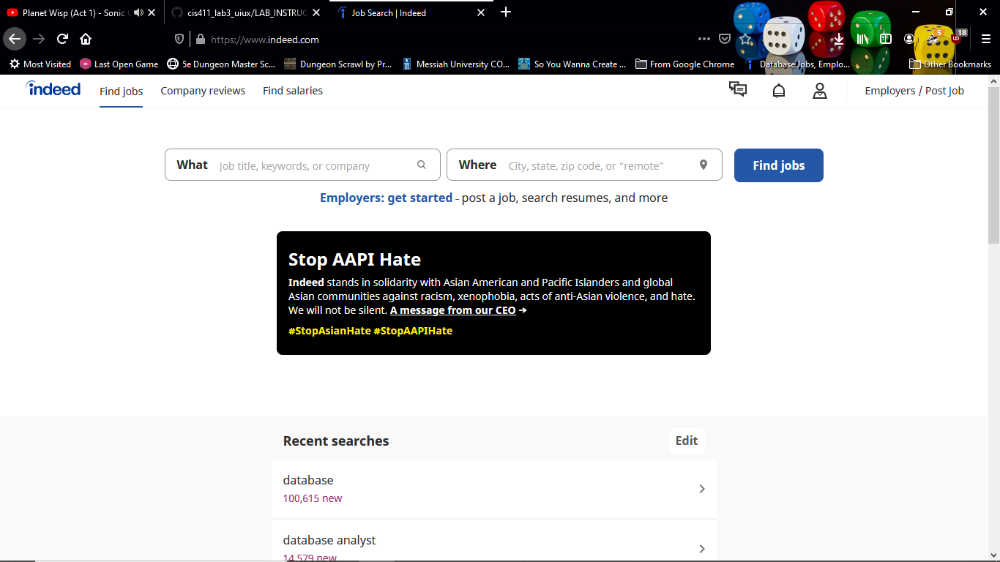
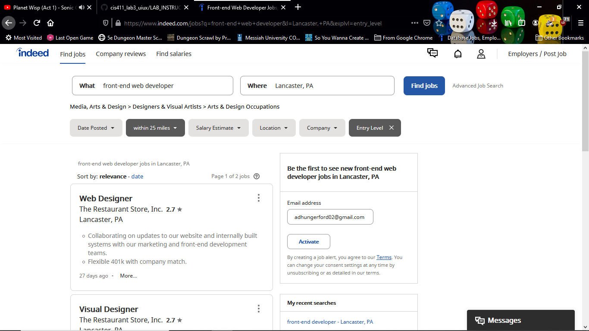
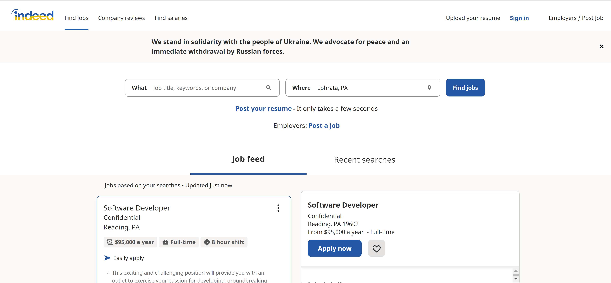
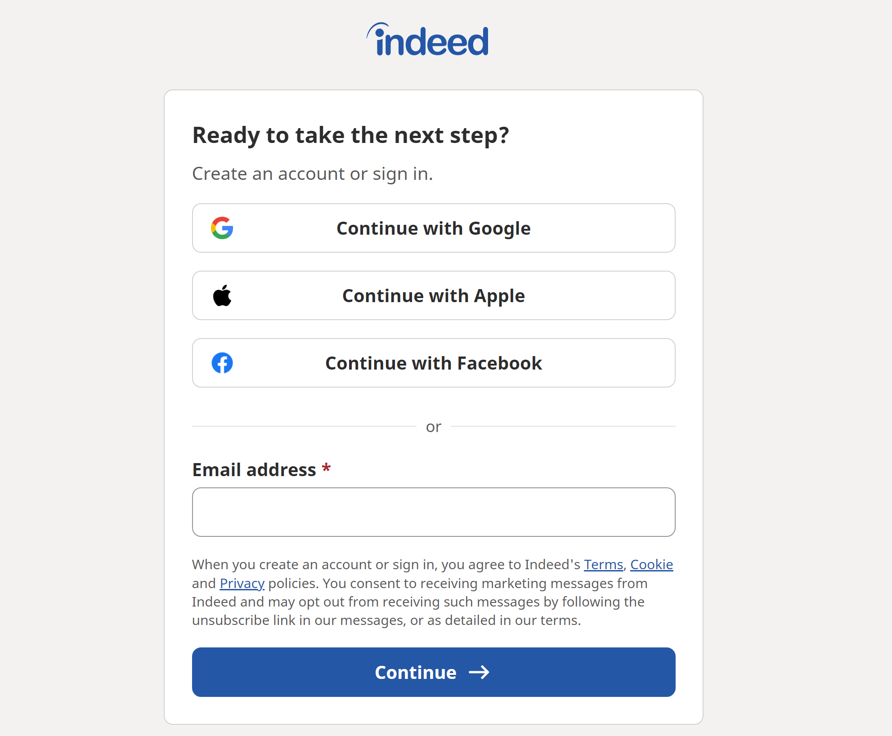
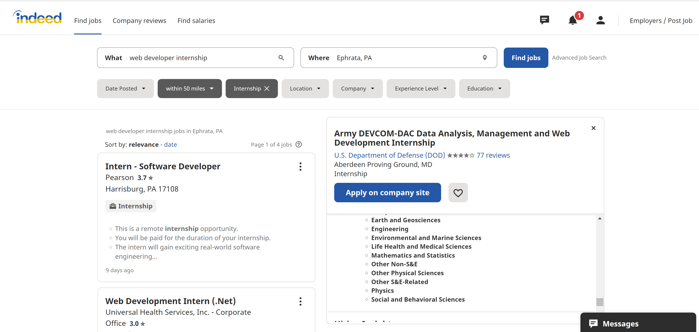

# Lab Report: UX/UI
___
**Course:** CIS 411, Spring 2021  
**Instructor(s):** [Trevor Bunch](https://github.com/trevordbunch)  
**Name:** Azianna Yang  
**GitHub Handle:** ay1191  
**Repository:** Your Forked Repository  
**Collaborators:** Collin [CRobson9000], Logan [loganossman], Elias [eg1272], Gloria [GlorKemH] helped with part 3 of this lab.
___

# Step 1: Confirm Lab Setup
- [x] I have forked the repository and created my lab report
- [x] If I'm collaborating on this project, I have included their handles on the report and confirm that my report is informed, but not copied from my collaborators.

# Step 2: Evaluate Online Job Search Sites

## 2.1 Summary
| Site | Score | Summary |
|---|---|---|
| Indeed | 19 | It was easy to create an Indeed account. All I had to provide an email and password. After, I was asked to upload a resume or not. I then could edit my job preferences, job location, etc. I was also able to search what job I wanted, where I prefered the job to be loacted, the job type (full time, part time, or internship), remote position availability, and experience level desired. Each filter made it easier for me to search for jobs which I found to be helpful and efficient.|
| Site 2 | 15 | I initially had confusion on how to create an account since the only opition was to sign in. Once I clicked on sign in, I couldn't figure out where to register. It is similar to Indeed. I can apply filters and it gives me a list of jobs I can apply to. The only filter they don't have is the job type preferred. Also, when I exit out and reload Ziprecruiter, they offer me jobs related to the previous job I searched on their site. Ziprecruiter never looked user-friendly to me though.|

## 2.2 Site 1
Insert Recorded Screenshots with captions and steps.

| Category | Grade (0-3) | Comments / Justification |
|---|---|---|
| 1. **Don't make me think:** How intuitive was this site? | 2.5  | This website was easy to navigate and the interface is userfriendly. What they require from the user is straightforward. The only criticism I have is that I had to put "internship" in the search box in order to get the internship filter. If I just typed "web developer," then it only gave me job-like filters and not internship ones.  |
| 2. **Users are busy:** Did this site value your time?  | 3 | I was able to search up the website and immediately start searching for jobs. I was not required to log in. The search results were fast and efficient as well. This process was easy and did not take me long to find what I desired.   |
| 3. **Good billboard design:** Did this site make the important steps and information clear? How or how not? | 3  | Indeed makes the important fields obvious by putting them right under the header. Buttons such as "Apply On Company Site" is the biggest button on the screem which makes it easy for the user to find and navigate to. When I found a job I was interested in, Indeed displayed the necessary information. They also offer a "Report Job" option at the bottom of the job description.  |
| 4. **Tell me what to do:** Did this site lead you towards a specific, opinionated path? | 3  | If you are a new user and/or aren't signed in, you are brought to a page where you can search for jobs without an account. I believe this shows that Indeed is focused on their users finding a job more than they are concerned with them having an account. If you choose to sign up or sign in, Indeed wants you to have a preferred email and from there you are taken to the same job search page.  |
| 5. **Omit Words:** How careful was this site with its use of copy? | 2  |  Indeed's pages do have a lot of information. The main information is split into two sides. One side contains all the job openings and the other side describes the job picked. This could be overwhelming to some users. I suggest reducing how much information is presented on one page. |
| 6. **Navigation:** How effective was the workflow / navigation of the site? | 3  | I feel as though the navigation was straightforward and there were no pop-ups that took me to different pages. I logged in, updated my profile if I wanted, searched for jobs, read about the job, and applied. The goal of their website is strictly to be a platform that provides jobs to apply for and they achieved that goal.  |
| 7. **Accessibility:** How accessible is this site to a screen reader or a mouse-less interface? |  3 | When I search Indeed on my phone, it looks exactly the same as it does on my computer. The format is organized, concise, and reflects its website form. They also have an app. |
| **TOTAL** | 18.5  | Under the criteria of "job searching websites," Indeed.com accomplishes the main goal of job searching. It is a straightforward and simple site and provides their users with jobs closely related to the jobs searched. I would personally (and do) use this to look for internships and full time/part time jobs. |

## 2.3 Site 2
Insert Recorded Screenshots with captions and steps.

| Category | Grade (0-3) | Comments / Justification |
|---|---|---|
| 1. **Don't make me think:** How intuitive was this site? | 1.5  | It is actually easy to search for jobs. I search what I want in the search bar along with the location. The filters are also small. They have, "apply, "quick apply," and "smart apply" when choosing to apply for a job. As a first time user, I do not know what these mean and what the differences are. |
| 2. **Users are busy:** Did this site value your time?  | 1  | On this site, pages take a lot longer to load and redirect than Indeed. Sometimes pages won't load and there will be an error. For one job, I was taken to another page, but I had to scroll first to find the job I clicked to apply on because it was another job search page. ZipRecruiter also gives me more than "Web Developer" job options. They also give me "Software Engineer," "Systems Software Developer," and more that aren't web developer job options. Web developer jobs are not listed first either. ZipRecruiter organizes it however. This to me is a waste of time because now I have to swift through different jobs that I didn't initally search for. The jobs offered when I first search ZipRecruiter also don't relate to web development, but rather software engineering.   |
| 3. **Good billboard design:** Did this site make the important steps and information clear? How or how not? | 2 | There most obvious step is that they'd like me to verify my email. There is a huge pop-up at the bottom of the page that notifies me to verify the email so that employers can contact me. I don't think they do a great job at making it obvious to their users what the important steps are. The font sizes and colors are all closesly similar and doesn't scream "call to action". Some jobs have apply buttons and some don't which makes it confusing and may even make users ignore that job posting. |
| 4. **Tell me what to do:** Did this site lead you towards a specific, opinionated path? | 3  | Yes, ZipRecruiter makes it clear that the thing to do is to search for a job and apply.  |
| 5. **Omit Words:** How careful was this site with its use of copy? | 3 | ZipRecruiter keeps it simple and concise. They first display job postings with information: name of position,company name, location, job-type, and short description. Once you click on it, you get a fuller description of that job. This makes it easy to not get overwhelmed with information on one page.  |
| 6. **Navigation:** How effective was the workflow / navigation of the site? |  2 | I don't think it was that effective. As a user, you have to be able to know how to navigate to these jobs and how to apply. ZipRecruiter doesn't have the same format for each job posting, so it can be confusing on what to do or if the job is even available anymore. There are also postings about apps to download which takes away from the purpose of job searching. |
| 7. **Accessibility:** How accessible is this site to a screen reader or a mouse-less interface? |  3 | I searched ZipRecruiter on my phone and its format is more eye catching. As I scroll, the "apply" button is at the bottom of the job posting before I move on to the next. This catches my eye and reminds/encourages me to apply for the job. There is also a ZipRecruiter app.  |
| **TOTAL** | 15.5  | Overall ZipRecruiter was more confusing to use than it was easy. I questioned what I had to do and what things meant on their website. I was also not a fan of the pop-up and when I was using my phone they required me to put an email in to recieve notifications about similar job postings. If I didn't put one in, I couldn't apply for the job. There were challenges to using this websites and there are improvements to be made. I also personally do not frequently use ZipRecruiter to find jobs and internships. |

# Step 3 Competitive Usability Test

## Step 3.1 Product Use Case

| Use Case #1 | |
|---|---|
| Title | Personnel Contacts |
| Description / Steps | 1. Internally, navigate to the event page in our app to find people willing to play for your event within the area.  Externally, people can scour social media platforms for people who play instrumentments, find their social media handles, then share their event with them through the app.    2. Navigate to the event’s primary page to share worship events to social media in order to gain more attention or share worship events with specific people on social media to gather more attention.   3. Establish connections between team members through messaging.  This would involve a messaging feature somewhere on the app.   4. Add people to a created worship event.   5. Navigate to the messaging page, which will allow you to message your team members for the event. |
| Primary Actor | Individual user engaged with the app |
| Preconditions | *Event leader has to download the app   *Event leader has to create an account   *Event leader has to connect social media handles to their account. |
| Postconditions | *People who were reached out to can either accept the invitation or decline.    *Then, they will download the app and make an account to be put into the event.   *Once they’ve downloaded the app and make an account, they’ll have access to the event materials and internal messaging features. |

## Step 3.2 Identifier a competitive product

List of Competitors
1. Competitor 1 [Services](https://www.planningcenter.com/services)
2. Competitor 2 [VesselWorship](https://www.vesselworship.org/)

## Step 3.3 Write a Useability Test

| Step | Tasks | Notes |
|---|---|---|
| 1 | Creating an account | * The steps the user must go through to create their account. Registration/Login, possible email verification. |
| 2 | Creating a team | *Adding team members to your team   *Gathering team members info   *Communicating with them |
| 3 | Creating a service | *Setting a time for the service   *Setting a date for a service   *Selecting team members/roles for the service. |

## Step 3.4 Observe User Interactions

| Step | Tasks | Observations |
|---|---|---|
| 1 | Creating an account  | *Confusion with confirmation placeholder   *After selecting your role, it gave an option to add people or services, but this wasn’t intuitive and he didn’t really know what this part wanted him to do so he skipped it   *On the home page, there was text that made it seem like you were locked in being just a leader, but in reality there are other roles that you can be.|
| 2 | Creating a team | *He tried to search for people he wants to add to his team.  When this search was unsuccessful, he realized that you first have to manually create profiles for your team members, then add these to your team.  This was not intuitive from the start   *From the teams page, android’s back button did not function as intended   *Some buttons are off-center when you press the team tab when you’re on the team page.   *He doesn’t know where to find the people that he’s added on the team page.  He tried adding a person, but now he can’t find where that person is.   *Design is not intuitive at all, probably requires organizational training for anyone to use it.|
| 3 | Creating a service | *When creating a service, he felt confused because he kept clicking the date that he wanted his service be on and then when he tried to create the service, it wouldn’t let him. He quickly realized that the service time looked like it was set because of the placeholder text’s color but it wasn’t, which is why it wasn’t letting him create his service.   *When this was happening, there wasn’t any feedback about what he was doing wrong, it just highlighted the box red. |

## Step 3.5 Findings
* Prove at least 3 improvements that can be made to usability/workflow
    * Sign-up Clarity: 
        * Add simple confirmations like “Your email is invalid” or “You left ‘x’ field blank”.
        * More accurate placeholder text that describes what they want the user to do better.
* Beneficial Feedback: 
    * When creating a service, giving more specific feedback about what the user is doing wrong.
    * Creating a basic tutorial for first-time users.
* Streamlined Communication
    * The main form of communication in this app as it stands now is mass emails to every team member.
    * A solution to this is utilizing instant messaging capabilities like an in-app group chat or channel of some kind.  
* Outline at least 2 experiences in the usability/workflow that were beneficial
    1. All the team managing features we were looking for were present and this app was the best competitor that we found, which was helpful because it took a while to find an app that was like ours.
    2. There was a dark mode and it overall had a clean aesthetic even though all the functionality wasn’t there.
* What do you believe your team did well in conducting a usability test?
    * We tried to see ourselves as one of our personas or an average user for the app instead of as a very experienced software user.
    * We did a good job at breaking down the app into its three main functions, expressing the primary avenues a user will go down.  
* Offer a brief statement about your experience conducting a usability test.
    * Conducting a usability test really opened our eyes into how we will need to develop our app’s ui. Based on what we noticed in our competitor, it will be very important to have a clean design that ensures an intuitive user journey without tremendous roadblocks. 

# 4. Your UX Rule (Extra Credit)
* Know the User's Pattern
  * Each user has unique way of exploring a website and app. As the developer, it would be beneficial to track the patterns of this user(s). It is possible to better tailor the website and app to the user(s) to give him or her a better user experience. By knowing their pattern, there are more chances to improve the website and app to cater towards them and their needs.