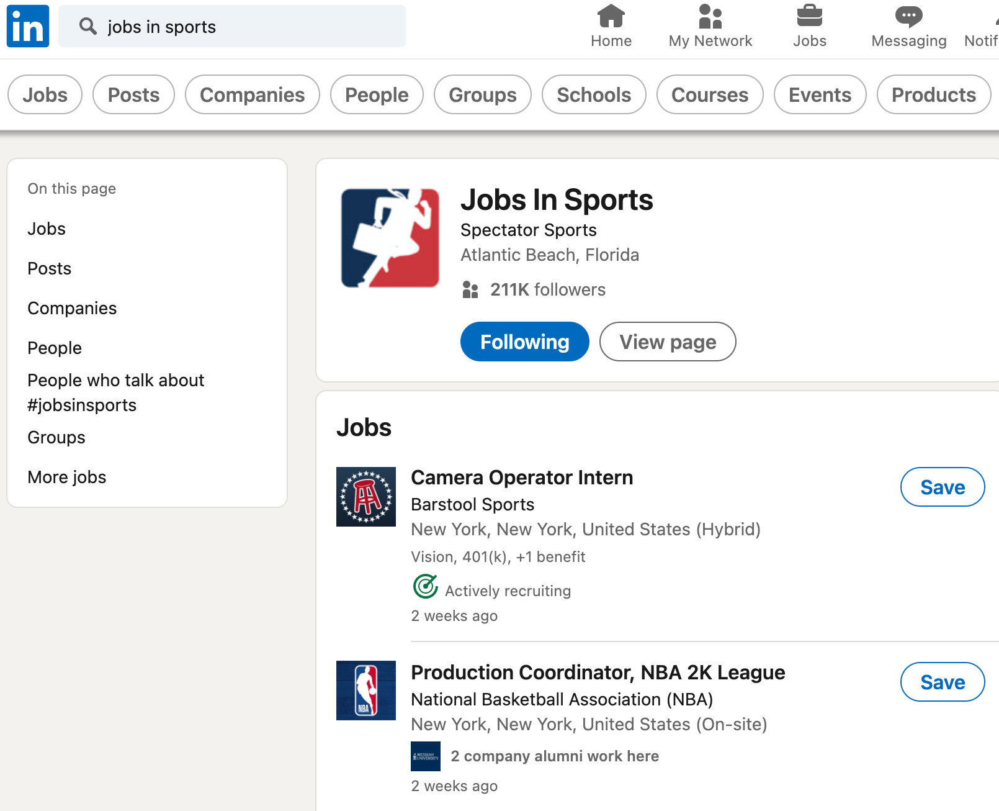

# Lab Report: UX/UI
___
**Course:** CIS 411, Spring 2021  
**Instructor(s):** [Trevor Bunch](https://github.com/trevordbunch)  
**Name:** Emily Baldwin  
**GitHub Handle:** ebaldwin2023
 
**Repository:** https://github.com/ebaldwin2023/cis411_lab3_uiux
**Collaborators:**   
___

# Step 1: Confirm Lab Setup
- [x] I have forked the repository and created my lab report
- [x] If I'm collaborating on this project, I have included their handles on the report and confirm that my report is informed, but not copied from my collaborators.

# Step 2: Evaluate Online Job Search Sites

## 2.1 Summary
| Site | Score | Summary |
|---|---|---|
| LinkedIn | 21 | Overall, this website is easy to navigate, easy to create an account, and easy to find job opportunities. I also appreciate the fact that for user's with specific disabilities, there are work arounds that allow for everyone to navigate the site. |
| Monster | 20 | Overall, I liked Monster. It was new for me to use, which is always a new thing to get over. I appreciate how the website automatically generates an account and therefore allows you to quickly search for the jobs that you are looking for. The ONLY negative that I found, was that while I was searching around, I accidentally clicked a "Quick Apply" button, and my information was automatically sent to that company- which I don't really care for- especially since that was an accident. |

## 2.2 LinkedIn

This is the proof that I already have an account through LinkedIn. The process to get to my profile is simply to input linkedin to the browser, and input my credentials. My profile is already up to date with all that it needs currently.

This is the way you job search in Linked. You simply look up what type of job you are looking for. In this case, I want a job in sports. After simpply searching this, there are many opportunities that come up for you to look further into and possibly apply to.

After finding a position that I found interesting, I clicked on it and it led me to a simple button that I can click to apply. After clicking apply, it is an extremely smooth step that leads you straight to the website that posted the initial job opportunity. 

| Category | Grade (0-3) | Comments / Justification |
|---|---|---|
| 1. **Don't make me think:** How intuitive was this site? | 3  | This site was as simple as creating an account, locating the search bar in the top of the website, and searching for a job of interest. Once finding this, you simply click on the link to apply and it takes you directly to the website that initially posted the job.  |
| 2. **Users are busy:** Did this site value your time?  |  3 |  This site absolutely valued my time. I was able to get this process done in under 3 minutes. It will be faster for anyone that already has an account, but creating one is simple as well. |
| 3. **Good billboard design:** Did this site make the important steps and information clear? How or how not? | 3  |  The steps were very clear. You simply search the job and a multitude of opportunities pop up. |
| 4. **Tell me what to do:** Did this site lead you towards a specific, opinionated path? |  3 |  Yes, I could have applied for a job right then and there after 1 simple search. |
| 5. **Omit Words:** How careful was this site with its use of copy? |  3 |  This site clearly cited where it got the job opportunity from. There is no repetition. |
| 6. **Navigation:** How effective was the workflow / navigation of the site? | 3  |  Extremely effective. No complexity. Job search bar is easy to locate near the top and afterwards, job lists appear. |
| 7. **Accessibility:** How accessible is this site to a screen reader or a mouse-less interface? |  3 | With a simple search, I was able to locate keys that LinkedIn allows to easily navigate their website without a mouse. This is impressive to me, and something that I did not know before I reasearched it.  |
| **TOTAL** |  21 | Overall, this website is easy to navigate, easy to create an account, and easy to find job opportunities. I also appreciate the fact that for user's with specific disabilities, there are work arounds that allow for everyone to navigate the site.  |

## 2.3 Monster

The next site is Monster. I have heard very good things about this site, but I have never used it. To create an account, you simply go to their website and click on "Sign Up." This is the screen that appears.

After creating and inputting my information to create my account through Monster, this is the initial page that comes up. It is very conventient because Monster takes information from my resume and helps me find jobs that are similar to past jobs that I have on my resume. You can simple click on "Quick Apply," and your application will be sent that second. 

| Category | Grade (0-3) | Comments / Justification |
|---|---|---|
| 1. **Don't make me think:** How intuitive was this site? | 3  |  This site is very simple to use. After uploading your resume, Monster takes all of the information on it helps you quickly create your account with what's on your resume. That took a lot of though out of the process.|
| 2. **Users are busy:** Did this site value your time?  | 3  | Becuase this site literally created my account for me by just looking at my resume, I would say that this site is definitely worth anyone's time. After it creates your account, it is as simple as clicking on a job you want, and an application is created and sent over.  |
| 3. **Good billboard design:** Did this site make the important steps and information clear? How or how not? | 3  |  Yes, the steps were clear and self explanatory. |
| 4. **Tell me what to do:** Did this site lead you towards a specific, opinionated path? |  2 | Yes, I was able to quickly locate my job search and I knew right away what I was looking for on the site and how to operate on the site. However, I do not like how it is more difficult to get to the site that has the original job posting. |
| 5. **Omit Words:** How careful was this site with its use of copy? |  3 | This site did not repeat unnecessary information.  |
| 6. **Navigation:** How effective was the workflow / navigation of the site? |  3 |  Very effective. Simply create an account and start applying for jobs that are automatically popping up. |
| 7. **Accessibility:** How accessible is this site to a screen reader or a mouse-less interface? |  3 |  Just like LinkedIn, this website has key navigation made easy, especially for those that cannot use a mouse or have a physical disabilty. |
| **TOTAL** | 20  | Overall, I liked Monster. It was new for me to use, which is always a new thing to get over. I appreciate how the website automatically generates an account and therefore allows you to quickly search for the jobs that you are looking for. The ONLY negative that I found, was that while I was searching around, I accidentally clicked a "Quick Apply" button, and my information was automatically sent to that company- which I don't really care for- especially since that was an accident.  |

# Step 3 Competitive Usability Test

## Step 3.1 Product Use Case

| Use Case #1 | |
|---|---|
| Title | MU Mobile - Student|
| Description / Steps | In order to use the MU Mobile app successfully as a student, I want to be able to quickly navigate throughout the app without being confused with what information is where. Step 1- Click on the MU Mobile app icon and input your student credentials for Messiah University. Step 2- Verify through your Messiah email that you are allowing the account to be created through MU Mobile. This is a safety precaution that must be met so that unnecessary accounts are not created without the student's permission. Step 3- At the bottom of your screen, there are options to click on depending on what you are looking for within the app. If you are looking for chapel attendance, click on chapel attendance. If you are wanting to order at Union, click on Union Online Ordering. Step 4- Once you have clicked on whatever it was that you were trying to navigate to in the app, continue through the steps. |
| Primary Actor | Messiah University Undergraduate Student |
| Preconditions | A student that is looking for all of their information in one easy to use application. Information such as chapel attendence numbers, club opportunities, Union ordering, and more are found here. |
| Postconditions | 1. The first step in the right direction is made my the student inputting their credentials and confirming this account creation through their email. 2. The student now has access to any information that they were looking for before, which was commonly found on Falcon Link- an annoying to use application. |

## Step 3.2 Identifier a competitive product

List of Competitors
1. Competitor 1 [www.gloriafood.com](https://www.gloriafood.com/online-ordering-system-for-college-dining-halls)
2. Competitor 2 [www.leeclarion.com](https://www.leeclarion.com/2020/lee-introduces-new-app-to-track-chapel-attendance)

## Step 3.3 Write a Useability Test

| Step | Tasks | Notes |
|---|---|---|
| 1 |  Click on the app. | Simple.  |
| 2 | Input your Messiah user ID and password.  |  This should be the same as your user ID and password that you use for anything else while at Messiah. |
| 3 |  Go to your email and confirm the account creation through MU Mobile.  |  Need to confirm that an activiation email is sent to the email that is inputted. |
| 4 |  After confirming account creation, go back to app and search around. The goal for this usability test is to check chapel attendance. |  This use test is completely written to JUST check and test how easy it is for a new user to find their chapel requirement numbers. |
| 5 |  Click on the "Chapel Attendance" button within the app. |  This should be on the home screen. |
| 6 | After pressing the button, a simple log of how many chapels you have attended will come up, as well as how many chapels that are required of you - as this varies from student to student. | This should be a simple screen that is easy to view a couple data points. |

## Step 3.4 Observe User Interactions

| Step | Tasks | Observations |
|---|---|---|
| 1 | Click on the app.  |  Easy, simple for the user to test this. It is very simple to click on an app. |
| 2 | Put in my user ID and password  |  Simple. |
| 3 |  I went to my email and pretended to find a confirmation email and clicked on it to confirm account creation.  |  Easy process. |
| 4|  After confirming account creation, go back to app and search around. The goal for this usability test is to check chapel attendance. |  I showed the test student the previous diagrams that our team leader had created for the app, they seemed to think this was an easy to use application. It was not difficult for them to find the chapel attendance button. |
| 5 |  Click on the "Chapel Attendance" button within the app. | This was simple- make sure to have a nice theme or an interesting looking button- not so generic.  |
|  6 |  After pressing the button, a simple log of how many chapels you have attended will come up, as well as how many chapels that are required of you - as this varies from student to student. | This was an easy to look at screen for the student that I tested this on. No issues with this. I also talked to them a bit of how we want to make this app expand upon the clubs that are availabel but nobody knows about at Messiah. He likes this idea and would definitely use the app if that was a thing inside of it.  | 

## Step 3.5 Findings
3 Improvements:
    
    - Better designs would be a good addition. Maybe even actual pictures of Messiah's campus.
    - Less white space within chapel attendance button
    - For the buttons within the app, it would be nicer if they weren't just solid green or blue background.

2 Benefits:
   
    - Having the security benefit of ensuring that the account was purposely being created by having the confirmation email.
    - Simple steps that outlined exactly what the test student user needed to do.
    - I think by keeping the test simple was the best I could have done.
    - Improvements for next time could be having more examples of what the perspective app could look like. Or more information on what other data will be in the MU Mobile app.
    - I enjoyed conducting a usability test on an actual live test student because this did not feel as "fake." After talking with the student, there are actual improvements that could be made. A lot of helpful advice was given through this test.
