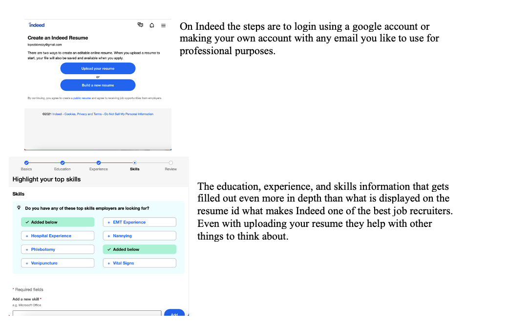
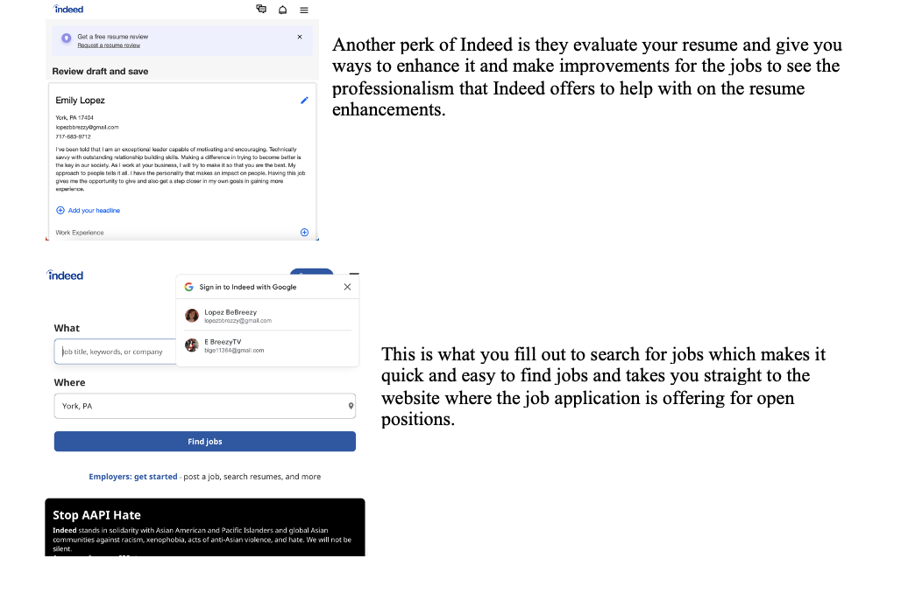
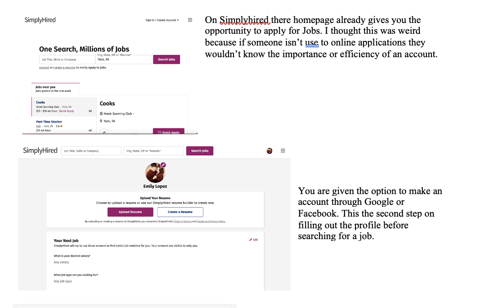
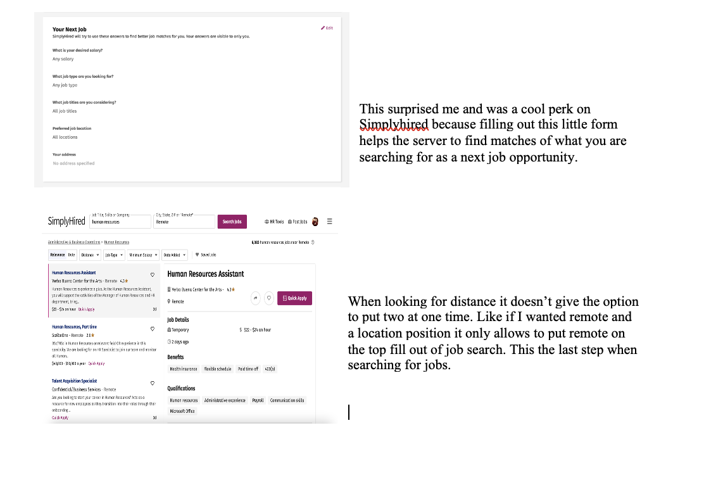

# Lab Report: UX/UI
___
**Course:** CIS 411, Spring 2021  
**Instructor(s):** [Trevor Bunch](https://github.com/trevordbunch)  
**Name:** Emily Lopez 
**GitHub Handle:** el1303  
**Repository:** el1303/cis411_lab3_uiux  
**Collaborators:**  @RomanSearle @felixzrte @Triggum @JoeV22
___

# Step 1: Confirm Lab Setup
- [X] I have forked the repository and created my lab report
- [x] If I'm collaborating on this project, I have included their handles on the report and confirm that my report is informed, but not copied from my collaborators.

# Step 2: Evaluate Online Job Search Sites

## 2.1 Summary
| Site | Score | Summary |
|---|---|---|
| [Indeed](www.indeed.com)| Score: 20 | Summary 1 |
| [Simplyhired](www.simplyhired.com) | Score: 13 | Summary 2 |

## 2.2 Site 1

| Category | Grade (0-3) | Comments / Justification |
|---|---|---|
| 1. **Don't make me think:** How intuitive was this site? | 3  |  Indeed was very detailed on what specifically they needed to complete the profile on their site. |
| 2. **Users are busy:** Did this site value your time?  | 3  |  Yes, it didn't take much to fill out and find a job. |
| 3. **Good billboard design:** Did this site make the important steps and information clear? How or how not? | 3  | On each step that was asked they gave blatant statements on what needed to be filled out. Also they gave sections on what part of the profile was being filled out, giving more details on what needed to be completed. |
| 4. **Tell me what to do:** Did this site lead you towards a specific, opinionated path? | 2  |  After completing the profile it than just brought the user to the page where you can enter what job is being looked for and where you would like to find one. |
| 5. **Omit Words:** How careful was this site with its use of copy? |  3 | This site's use of copy was beneficial for fast pace completion of the profile.  |
| 6. **Navigation:** How effective was the workflow / navigation of the site? |  3 |  The workflow navigation of the site was super easy and simple because of how detailed they are in what to do and where to go. |
| 7. **Accessibility:** How accessible is this site to a screen reader or a mouse-less interface? |  3 |  This site id screen reader and mouse-less friendly. |
| **TOTAL** |  20 |   |

## 2.3 Site 2

| Category | Grade (0-3) | Comments / Justification |
|---|---|---|
| 1. **Don't make me think:** How intuitive was this site? | 1  |  This website pulls more of an effort from the user where they have to read really closely on what is provided. |
| 2. **Users are busy:** Did this site value your time?  | 2 |  This website doesn't take long to process things because all is needed is an upload of the resume but it also doesn't have an beneficial tips like Indeed. |
| 3. **Good billboard design:** Did this site make the important steps and information clear? How or how not? |  2 | Simplyhired made only one step which was upload the resume and that's it. It was clear but they didn't offer anything else to help the applicant.  |
| 4. **Tell me what to do:** Did this site lead you towards a specific, opinionated path? | 2 |  This site was overwhelming because it wasn't as simple to find what specifically was needed. They didn't give an option to search for stay at home jobs or remote option. But it was able to give specific job names similar to ones that are searched. |
| 5. **Omit Words:** How careful was this site with its use of copy? |  2 |   |
| 6. **Navigation:** How effective was the workflow / navigation of the site? | 1  | This site wasn't really effective because of how much was needed to be read in order to navigate through what you wanted to find.  |
| 7. **Accessibility:** How accessible is this site to a screen reader or a mouse-less interface? | 3  |  This site seems like its more effective on mouse-less interface because of how simple and straight to the function of the site. |
| **TOTAL** |  13 |   |

# Step 3 Competitive Usability Test

## Step 3.1 Product Use Case

| Use Case #1 | |
|---|---|
| Title | Register |
| Description / Steps | <ol><li>User goes to landing page to register for an account.</li> <li> User clicks on registration page.</li> <li> User Fills in required information.</li>
<li> Server Stores information.</li></ol> |
| Primary Actor | The User |
| Preconditions |  User is a student at Messiah University.|
| Postconditions | User is able to log in and log out. User is able to sign up for events.|

## Step 3.2 Identifier a competitive product

List of Competitors
1. Competitor 1 [Instagram](www.instagram.com)
2. Competitor 2 [Discord](discord.com)

## Step 3.3 Write a Useability Test

| Step | Tasks | Notes |
|---|---|---|
| 1 |  Go to discord.com/register |   |
| 2 |  Fill out the required field (email, username, password) |   |
| 3 |  Click register once fields completed |   |
| 4 |  Show yourself using the desktop |   |
| n |   |   |

## Step 3.4 Observe User Interactions

| Step | Tasks | Observations |
|---|---|---|
| 1 |  Go to discord.com/register | Needed to download app in order to make an account which isn't much convenient to those who aren't mobile friendly. |
| 2 |  Fill out the required field (email, username, password) | This process was very simple and fast for the User. |
| 3 |  Click register once fields completed |  The questions that were asked were to make a profile linked to the phone number for verification. |
| 4 |  Show yourself using the desktop  |   |

## Step 3.5 Findings
Organize your findings here.
Being able to register with other accounts.

# 4. Your UX Rule (Extra Credit)
If you opt to do extra credit, then include it here.