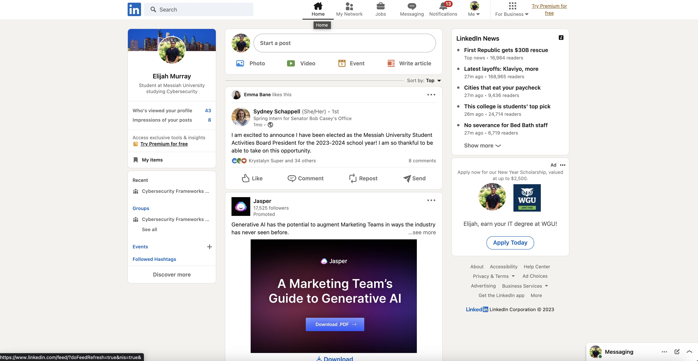
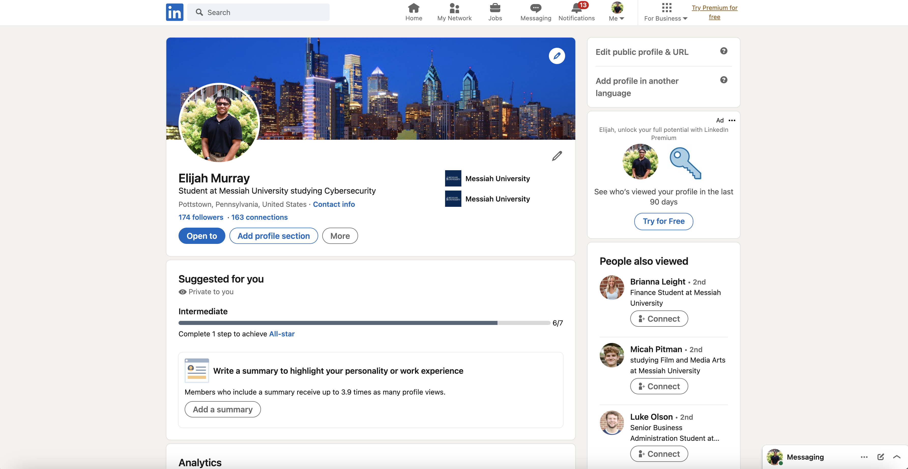
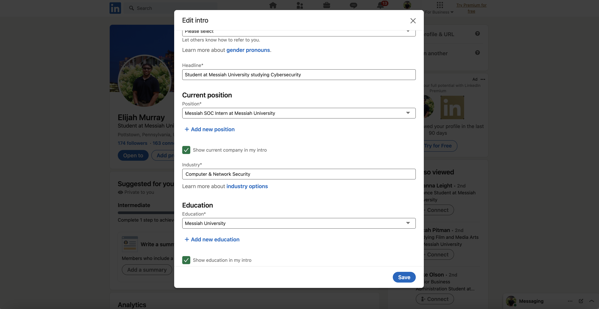
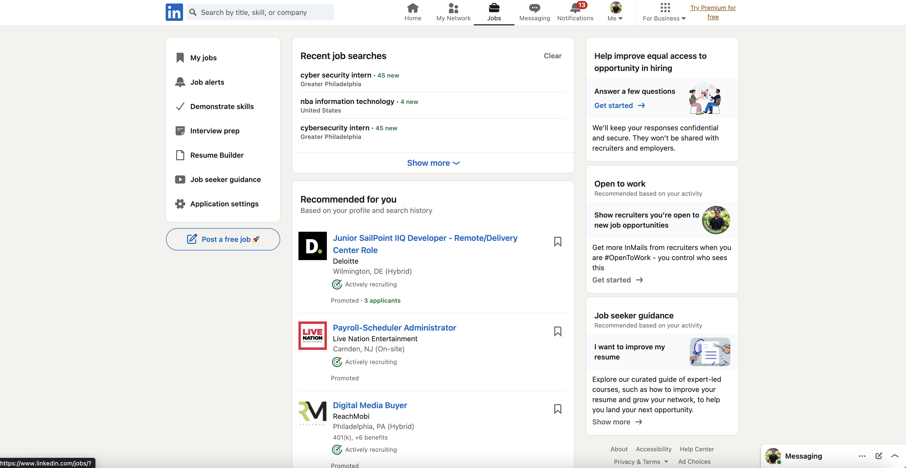
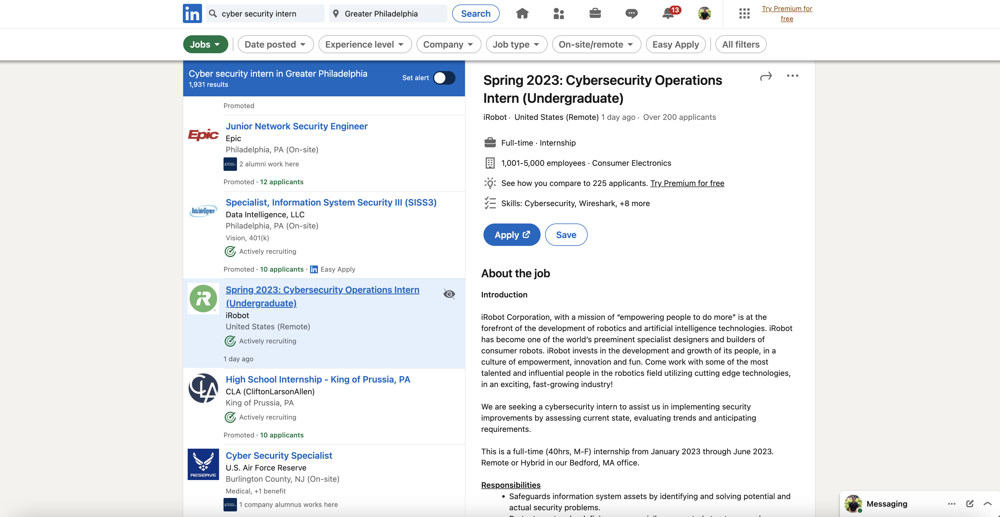
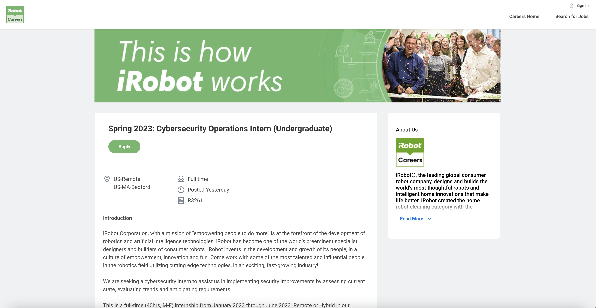
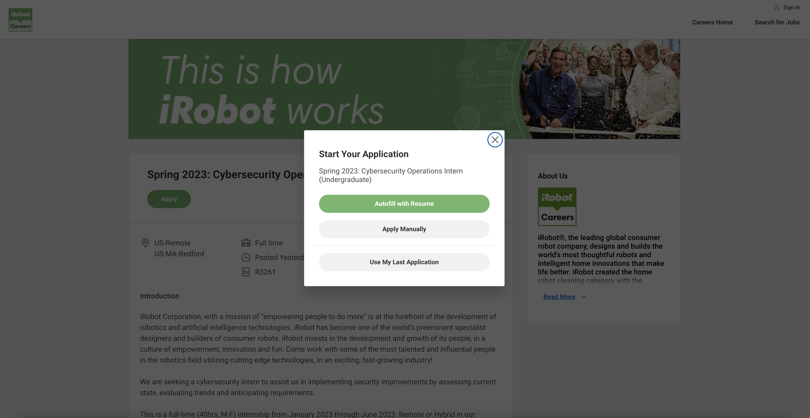
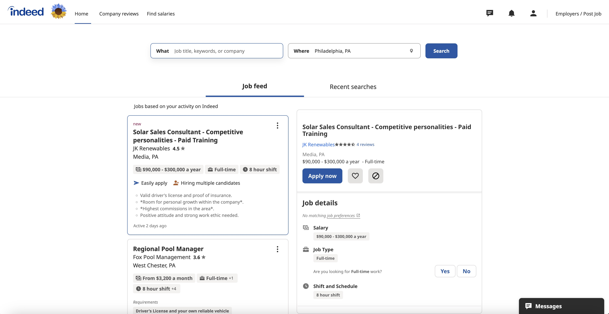
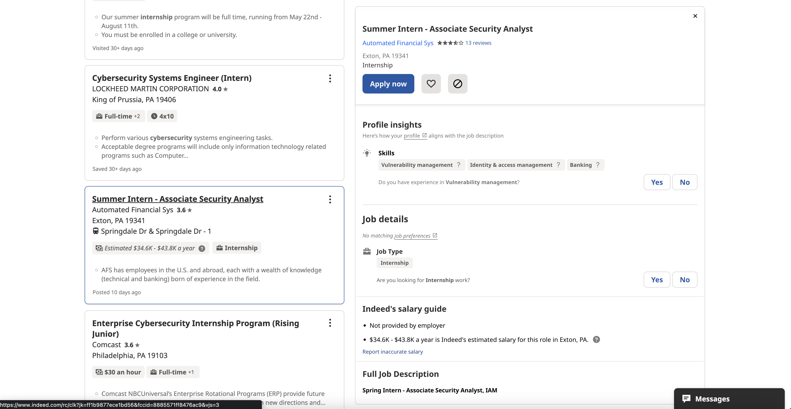
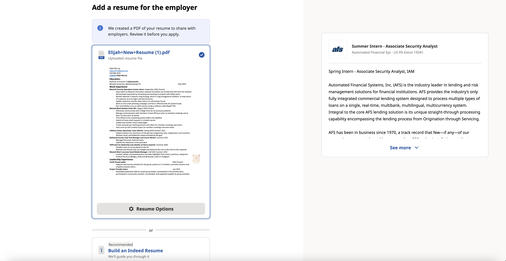

# Lab Report: UX/UI
___
**Course:** CIS 411, Spring 2021  
**Instructor(s):** [Trevor Bunch](https://github.com/trevordbunch)  
**Name:** Elijah Murray  
**GitHub Handle:** eliguy5474  
**Repository:** 
**Collaborators:**   
___

# Step 1: Confirm Lab Setup
- [Y] I have forked the repository and created my lab report
- [ ] If I'm collaborating on this project, I have included their handles on the report and confirm that my report is informed, but not copied from my collaborators.

# Step 2: Evaluate Online Job Search Sites

## 2.1 Summary
| Site | Score | Summary |
|---|---|---|
| LinkedIn | A++ | Easy to navigate, very easy to get what needs to get done. |
| Indeed | D | Can be confusing at times, not as strightforward as Linkedin, takes more thinking and reading to understand sometimes. |

## 2.2 Site 1
Insert Recorded Screenshots with captions and steps.
LinkedIn Screenshots

Step 1: Loaded LinkedIn, took me to the home page where you can see your connections posts, etc.

Step 2:At the top right is the button to access your profile. It directed me to my profile.

Step 3: I clicked the pencil on my profile to edit it and update some of my information there so it can be seen by other people.

Step 4: I then clicked the jobs tab at the top. I then clicked on "cyber security intern" in the greater philadelphia area, in my recnt searches tab at teh top.

Step 5: I found a job that captured my attention. It was for the company iRobot.

Step 6: I clicked the blue apply button and was directed to the iRobot Workday site where i was able to fill out the application.

Step 7: This is the page I was redirected to and was able to apply.

| Category | Grade (0-3) | Comments / Justification |
|---|---|---|
| 1. **Don't make me think:** How intuitive was this site? | 3  | Everything was easy to navigate on the website   |
| 2. **Users are busy:** Did this site value your time?  | 3  |It's nice to see posts and able to search and apply for jobs   |
| 3. **Good billboard design:** Did this site make the important steps and information clear? How or how not? | 3  |The steps were pretty straight forward and the information and the job description was easy to say and read when you selected the job. The apply button was at the top of the job posting and in blue so it was easy to spot out.   |
| 4. **Tell me what to do:** Did this site lead you towards a specific, opinionated path? | 3  |  LinkedIn will find jobs that fit what you post on your profile. Also it will keep history for what you posted before so it is easy to start off where you left off. |
| 5. **Omit Words:** How careful was this site with its use of copy? | 3  | No use of copy  |
| 6. **Navigation:** How effective was the workflow / navigation of the site? |  3 |  The workflow was simple and easy. Reduces stress on finding what you want when using LinkedIn |
| 7. **Accessibility:** How accessible is this site to a screen reader or a mouse-less interface? |  3 |  You are able to use the LinkedIn app. However the website still looks great on other devices that are mouseless |
| **TOTAL** |  21 |  A++ |

## 2.3 Site 2
Insert Recorded Screenshots with captions and steps.
Indeed Screenshots

Step 1: I loaded up Indeed and was taken to the home page which showed me job postings

Step 2: I clicked on the profile tab. I updated my resume pdf

Step 3: I then went back to the home page and searched up "cybersecurity internship" and Philadelphia for the location

Step 4: I found a job that fit my liking and scrolled down to view the job description.

Step 5: I then clicked the apply button and was taken to the application and had the choice to submit my pdf or to make an Indeed resume.

| Category | Grade (0-3) | Comments / Justification |
|---|---|---|
| 1. **Don't make me think:** How intuitive was this site? |3   |It is straight forward and clear to navigate   |
| 2. **Users are busy:** Did this site value your time?  | 2  | No not really. Had to keep scrolling down just to get to the job desription which was annyoing. Also kept asking me to do an Indeed resume.  |
| 3. **Good billboard design:** Did this site make the important steps and information clear? How or how not? | 2  |  Not a good design. A lot of whitespace and a lot of scrolling was invovling just to get to the job description most the time |
| 4. **Tell me what to do:** Did this site lead you towards a specific, opinionated path? | 1  | Gave me the position title but no filtering for other experiences   |
| 5. **Omit Words:** How careful was this site with its use of copy? |  1 | No  |
| 6. **Navigation:** How effective was the workflow / navigation of the site? | 2  | Too much scrolling  |
| 7. **Accessibility:** How accessible is this site to a screen reader or a mouse-less interface? | 3  | Indeed does well with mouse-less devices  |
| **TOTAL** |14   |  D |

# Step 3 Competitive Usability Test

## Step 3.1 Product Use Case

| Use Case #1 | |
|---|---|
| Title |Finding a recipe |
| Description / Steps | The user is hungry and bold, deciding to try something new. They log into their account and search in the query "Grilled Reuben Sandwich". RecipeForSuccess will display a recipe with its skill level(If the skill level is higher than the users, it will warn the user). The user will follow the directions and steps and have the option of leaving a review, sharing the recipe, and taking a photo of their final product.|
| Primary Actor |  User who is hungry and wants to try a new recipe.|
| Preconditions | User has an account and ingredients for desired recipe.|
| Postconditions |User is able to create the recipe. |

## Step 3.2 Identifier a competitive product

List of Competitors
1. Competitor 1 [www.bbcgoodfood.com](www.bbcgoodfood.com)
2. Competitor 2 [www.paprikaapp.com](www.paprikaapp.com)
3. Competitor 3 [tasty.co](tasty.co)

## Step 3.3 Write a Useability Test

| Step | Tasks | Notes |
|---|---|---|
| 1 | Access app  | Access the app  |
| 2 | Understand the icons, navigation through the app  | Have user try to understand icons and what they are supposed to do  |
| 3 | Explore User profile settings  |  Edit profile and explore all options  |
| 4 | Search for recipe, read intrustions and comment on what they see and if they understand or not  | Ask the user  |
| 5 | Interview the user  | Ask what they liked/disliked. What did they learn and see what was helpful  |

## Step 3.4 Observe User Interactions

| Step | Tasks | Observations |
|---|---|---|
| 1 | Access app  |  App is very easy to access. I like how all the options are unique. I like how it offer alternative diets. Being able to go back and select a different option would be nice in case a choice is incorrectly selected or if someone changes their mind (i.e vegetarian or not) |
| 2 | Understand the icons, navigation through the app  |   Layout is designed well and easy to use and follow. The navigation bar on the bottom is really good. The community aspect is an awesome touch to see what recipes people like and reccommend. Being able to add all the ingredients for a specific recipe to a shopping cart is awesome and personalized recipe books is a nice touch.|
| 3 | Explore User profile settings  |  User profile is wasy to understand and navigate. Functional components like being able to change profile picture, username, and even see activity makes the profile page full and feel personalized. |
| 4 | Search for recipe, read intrustions and comment on what they see and if they understand or not  |  I searched intially for a recipe I have made before called pork katsu and did not find it but I made my search less specific and just search pork and was able to find it and many more tasty looking recipes. Each recipe offers written instructions along with videos and pictures of that recipe that other users have made.  Being able to adjust the serving sizes is great and seeing the ingredients adjust. Step-by-step mode which pulls in written and visual guides makes the recipe making process easy and enjoyable.|
| 5 | Interview the user  |  I really liked how interactive and easy to understand the app was. The icons were all easy to figure out and the app has countless options for anything you need recipe related. One thing I disliked would be the icons when you click on a recipe (favorite, save to reciped). If you hold on the icon it would be nice to have them explain what each one does so you don't have to just figure it out by clicking. I learned that this app would be really beneficial for if you have an ingredient and need to find a recipe. You can easily search that item and find useful recipes that can then be filtered by time, type of meal, and more. Overall, this app can replace the need to search the web for recipes and can help recommend new dishes the user may not have thought of and can save to access later. |

## Step 3.5 Findings
I interviewed and had Ricky Provika ineract the app, Tasty, which is one of our competitors.

**What worked** The app was very easy to use for Ricky. He liked seeing all the selections you could choose from and what you were intrested in. The app was also easily navigated as well. Also the community aspect of the app was nice too. The shopping cart also was nice as it was able to grab the users attention with it being more personalized.

**What didn't work** User wasn't able to find specific recipe that they were looking for and had to broaden the search to find it. Another problem was the icons when you click on a recipe (favorite, save to reciped). If you hold on the icon it would be nice to have them explain what each one does so you don't have to just figure it out by clicking.

**Improvement** User said that, if you hold on the icon it would be nice to have them explain what each one does so you don't have to just figure it out by clicking.

# 4. Your UX Rule (Extra Credit)
If you opt to do extra credit, then include it here.