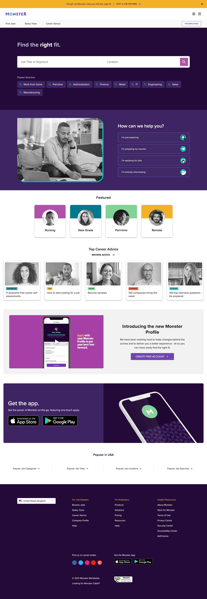

# Lab Report: UX/UI
___
**Course:** CIS 411, Spring 2021  
**Instructor(s):** [Trevor Bunch](https://github.com/trevordbunch)  
**Name:** Felix Zarate  
**GitHub Handle:** felixzrte 
**Repository:** https://github.com/felixzrte/cis411_lab3_uiux  
**Collaborators:** @Triggum @el1303 @RomanSearle @JoeV22  
___

# Step 1: Confirm Lab Setup
- [x] I have forked the repository and created my lab report
- [x] If I'm collaborating on this project, I have included their handles on the report and confirm that my report is informed, but not copied from my collaborators.

# Step 2: Evaluate Online Job Search Sites

## 2.1 Summary
| Site | Score | Summary |
|---|---|---|
| Indeed | 8/10 | Indeed is a very popular job searching site and many employers use it. The website is easy to follow and it is easy to search for jobs. |
| Monster | 9/10 | Monster has a very nice design and I liked them because they had many job listings but they also had many other resources. For example they had resources for people who just graduated to help them find jobs. |

## 2.2 Site 1

This is my profile for Indeed. It has all the basic info needed for a resume

Good landing page and easy to understand what you can do on the site

I searched up Web Designer in Mechanicsburg and there were a lot of results for each job listing. I like that it gives you a lot of info on the job listing, and it looks nice design wise.

I decided to "apply" for a Web Designer job at West Shore Home

They asked me about my web experience

They asked me about more web experience and about relocation.

They gave me the choice to apply with my Indeed resume or my own resume.

| Category | Grade (0-3) | Comments / Justification |
|---|---|---|
| 1. **Don't make me think:** How intuitive was this site? | 3  | It was easy to understand what I was supposed to do  |
| 2. **Users are busy:** Did this site value your time?  | 3  |  Yes and made the process of applying fairly simple |
| 3. **Good billboard design:** Did this site make the important steps and information clear? How or how not? | 3  | The info was clear and made sure I had everything before applying  |
| 4. **Tell me what to do:** Did this site lead you towards a specific, opinionated path? | 2.5  | The user is free to search what jobs they are looking for  |
| 5. **Omit Words:** How careful was this site with its use of copy? |  2 | Since there are many job listings there are copies of words |
| 6. **Navigation:** How effective was the workflow / navigation of the site? | 2.5  | There are a lot of job listings so you can be scrolling for a while  |
| 7. **Accessibility:** How accessible is this site to a screen reader or a mouse-less interface? | 2  | The screen reader works but the site is pretty mouse heavy  |
| **TOTAL** | 18/21  |   |

## 2.3 Site 2

| Category | Grade (0-3) | Comments / Justification |
|---|---|---|
| 1. **Don't make me think:** How intuitive was this site? | 3  | I really liked the design for this site and it made it easy to use  |
| 2. **Users are busy:** Did this site value your time?  | 3  | Yes it was easy to apply for a job  |
| 3. **Good billboard design:** Did this site make the important steps and information clear? How or how not? | 3  | It was clear on what you had to do to apply for a job |
| 4. **Tell me what to do:** Did this site lead you towards a specific, opinionated path? | 2  | User is free to look for their own jobs |
| 5. **Omit Words:** How careful was this site with its use of copy? | 2  |  Since there are many job listings there are copies of words |
| 6. **Navigation:** How effective was the workflow / navigation of the site? | 2 | A lot of loading and not as fast as Indeed   |
| 7. **Accessibility:** How accessible is this site to a screen reader or a mouse-less interface? | 2  | The screen reader works but the site is pretty mouse heavy   |
| **TOTAL** | 17/21  |   |

# Step 3 Competitive Usability Test

## Step 3.1 Product Use Case

| Use Case #1 | |
|---|---|
| Title | Registartion |
| Description / Steps | <ol><li>Go to landing page<li>Click register<li>Enter required fields<li>Click finish registration<li>Server receives information and stores</ol>  |
| Primary Actor | User |
| Preconditions | <ol><li>Database set up<li>Internet Connection<li>Messiah Student</ol> |
| Postconditions | <ol><li>Able to edit and interact with the app<li>Sign in and Sign Out of your account<ol>  |

## Step 3.2 Identifier a competitive product

List of Competitors
1. Competitor 1 [www.instagram.com](www.instagram.com)
2. Competitor 2 [Discord](wwww.discord.com)

## Step 3.3 Write a Useability Test

| Step | Tasks | Notes |
|---|---|---|
| 1 | Go to discord.com/register |   |
| 2 | Fill out the required fields (email, username, password and DOB) |   |
| 3 | Click register once all fields are filled|   |
| 4 | Show yourself using the desktop app |   |
| n |   |   |

## Step 3.4 Observe User Interactions

| Step | Tasks | Observations |
|---|---|---|
| 1 | Go to discord.com/register | They were able to go to the site easily  |
| 2 | Fill out the required fields (email, username, password and DOB) | This step was simple and they had no problem with filling out all the required fields. This step was pretty straight forward  |
| 3 | Click register once all fields are filled| They had no trouble figuring out what to do after filling out all required fields  |
| 4 | Show yourself using the desktop app | This step was simple because after they registered, it brought them right to the desktop app |
| n |   |   |

## Step 3.5 Findings
- Provide at least 3 improvements you believe could be made to the usability of the workflow in question.
1. Have more users test 2. Record their screen 3. Compare with other sites with same test.
- Outline at least 2 experiences in the workflow that you believe were of benefit to the user.
1. Directing them in person 2. Simple test.
- What do you believe your team did well in conducting the usability test?
    - We were able to come up with a simple test for the user
- What could your team improve for next time (hint: there will be a next time)?
    - Communicate with each other more 
- Offer a brief statement (no more than several sentences) about your experience conducting a usability test.
    - This was my first time conducting a usability test so once I have more experience I feel like I will be more confident with them.
# 4. Your UX Rule (Extra Credit)
If you opt to do extra credit, then include it here.