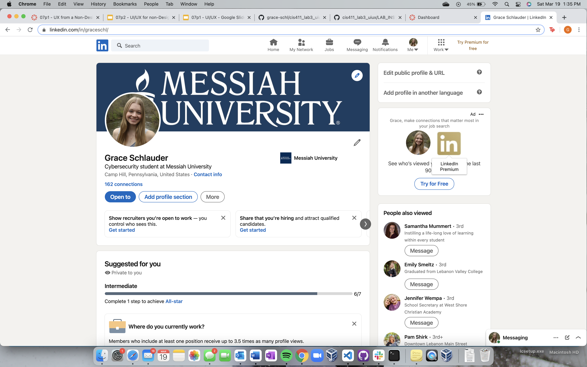

# Lab Report: UX/UI
___
**Course:** CIS 411, Spring 2021  
**Instructor(s):** [Trevor Bunch](https://github.com/trevordbunch)  
**Name:** Grace Schlauder  
**GitHub Handle:** https://github.com/grace-schl  
**Repository:** [Your Forked Repository](https://github.com/grace-schl/cis411_lab3_uiux)  
**Collaborators:**  Michael Mourelatos 
___

# Step 1: Confirm Lab Setup
- [x] I have forked the repository and created my lab report
- [x] If I'm collaborating on this project, I have included their handles on the report and confirm that my report is informed, but not copied from my collaborators.

# Step 2: Evaluate Online Job Search Sites

## 2.1 Summary
| Site | Score | Summary |
|---|---|---|
| LinkedIn | 20 | This site is very easy to use and makes it clear as to where everything is that you might need. I also enjoy the social media aspect of the site because it provides a user with more than just job searches. The user is then able to build connections with people who can help vouch for them when it comes to job recommendations. |
| Indeed | 15 | This application is very simple in that it is solely used for searching for jobs. However, some aspects were confusing like when it came to adding information to your profile.  |

## 2.2 Site 1 - LinkedIn

**Updating Skills on Profile**  
- This account was already created prior to this assignment  

This shows the home feed of my profile.

Click on "profile" and then "view profile" to view your personal user profile.  

This is what I see when viewing my profile.

By scrolling down on my profile, I can see the list of skills that I have already added to my profile.

This is what a user sees when they go to edit their listed skills. 

To add a skill, either select a suggested one or press "Add another skill" and input a skill of your own.

**Searching for a job**

To search for a job, got to the "job" tab. You can search for jobs, view suggested jobs, create job alerts, and view jobs that you have previously saved.

This is what is seen after a job is searched for. The bar across the top allows you to add more specifications to your search to refine it further.

Selecting the "Apply" button redirects the user to the company website where the application is available.  

This job was one that I had previously applied for so after selecting "apply now" on their website, I am told that I have already filled out an application for this job. For a different user, they would just have to log in or create an account and then fillout the application until it is fully completed.  

**Analysis of Website**
| Category | Grade (0-3) | Comments / Justification |
|---|---|---|
| 1. **Don't make me think:** How intuitive was this site? | 3  | It is especially intuitive for me because I have been using the site for a while. Job searching is made easier by the site finding jobs that match your profile and suggesting them to you.  |
| 2. **Users are busy:** Did this site value your time?  |  3 | The site takes a little getting used to, as any site would, but can be easily picked up. The home feed can be easily scrolled through and users are able to quickly add likes to a post. Connecting with another users is also very quick and easy, just the click of a button. If you have a bit more time on your hands, you can add a message along with a connection request. |
| 3. **Good billboard design:** Did this site make the important steps and information clear? How or how not? | 3  | The site will highlight areas of your profile that need improvement. The site also makes it very easy to know how to apply for a job. The "apply" button is highlighted blue and is very obvious on the page, so you can't miss it.   |
| 4. **Tell me what to do:** Did this site lead you towards a specific, opinionated path? | 3  |  When creating an account, it will give you tips on what your next step should be in order to make your profile as comprehensive as possible. The site then uses the information that you input to suggest companies and users to follow or connect with. |
| 5. **Omit Words:** How careful was this site with its use of copy? | 2  | The site is mainly comprised of user input information. The wordiness of posts are depended on the user. For the site itself, there is not an overabundance of words besides what is needed to direct the user. |
| 6. **Navigation:** How effective was the workflow / navigation of the site? | 3  | Anything you are looking for is where you would expect it to be, making navigating the site quick and easy. Some things, like jobs you are interested in, can be saved so that it is easy to come back to later.  |
| 7. **Accessibility:** How accessible is this site to a screen reader or a mouse-less interface? | 3  | I use the mobile app just as much as I use the website and both are very easy to use. The mobile (mouse-less) interface has a very similar set up to the website, so you don't need to relearn where everything is.   |
| **TOTAL** |  20 | I really like using this site and sometimes will go on it just for fun. I am connected with a lot of my professors and classmates and like to see what they post about. I also like searching for jobs randomly because it inspires me to keep moving towards my future.   |

## 2.3 Site 2 - Indeed

**Create Account and Add Skills**

This is what pops up before a user creates an accout or logs in.  

The first thing the site asks for is an email address.

The site next asks for the user to specify if they are seeking for a job or are an employer.

The site then asks for you to create a password for your account.

After the account is created, the user is redirected to their homepage.

The user can then navigate to view their profile.

The site then asks if you want to upload an already created resume or if you want to create a new resume on the site.

After uploading my resume, it had me confirm some of the information that was included on that resume. This included me confirming my skills with the option of adding new ones at that time.

The site then allows you to view your completed profile.

**Applying for a job**

To search for a job, click on the "find jobs" tab at the top of the screen.

This is what appears after a job is searched for. Summaries of the jobs are on the left and further details of the selected job are on the right.

After clicking on the "Apply on company site" button of the desired job, the user is redirected to the company.

Once on the company site, the user selects to apply for the job. They are then prompted with how they would like to apply.  

**Analysis of Website**  

| Category | Grade (0-3) | Comments / Justification |
|---|---|---|
| 1. **Don't make me think:** How intuitive was this site? | 2  | The site uses your resume, skills, and what the job title you said you are looking for to help suggest some jobs. However the suggested jobs are not really a close match to what I am actaully looking for. |
| 2. **Users are busy:** Did this site value your time?  | 3  | It is quick and easy to search for a job. The site gives an overview of the job and then more in-depth information if you are interested.  |
| 3. **Good billboard design:** Did this site make the important steps and information clear? How or how not? | 1 | When creating a profile, the site made it very clear what information needed to be input. However, once the profile was created I am not sure how to futher edit any of that information. There is no spot under my profile that shows me some of the information that I input, such as skills. So if I wanted to change anything later, I have no idea how to do that.  |
| 4. **Tell me what to do:** Did this site lead you towards a specific, opinionated path? | 2  | It leads you in the right direction to help in finding a job you are interested in, but I wouldn't say that the site pushes an opinionated path onto me.  |
| 5. **Omit Words:** How careful was this site with its use of copy? |  2 |  The site contains the minimum amount of information needed in order to find a job. Most of the site contains summaries of job descriptions and then further information provided by the company. However, I don;t know how much of that information is copied from other job search sites or if there is a way to even determine that.  |
| 6. **Navigation:** How effective was the workflow / navigation of the site? | 2  |  The navigation was easy in the sense that the site is very simple and there isn't much to it. For a new user, it should only take a short amout of time to figure out how to almost fully use the site. However, when it comes to the user profile, there is a bit of confusion there. Is the resume the only way that information is being given to the employers? |
| 7. **Accessibility:** How accessible is this site to a screen reader or a mouse-less interface? | 3  | I have not used the mobile version of this site before, however it is very similar to, yet much simpler, than LinkedIn. I would imagine that the mouse-less interface would be just as simple since the main function of this site is simply job seaching.   |
| **TOTAL** | 15  | The site is good for job searching and seems fairly simple to use, however there are certain aspects when it comes to the user profile that I just do not understand. I also prefer how LinkedIn adds a social media aspect to it so that users are able to build connections in the same place that they job search.  |

# Step 3 Competitive Usability Test

## Step 3.1 Product Use Case

| Use Case #1 | |
|---|---|
| Title | Adding a Subscription Service  |
| Description / Steps | The user first selects which subscription service they are adding (i.e. Netflix, Hulu, HBO Max, etc.). The user then provides information on what type of subscription they have to that service. |
| Primary Actor | User |
| Preconditions | User either creates a new account or is logged into their already existing account. |
| Postconditions | The user's account saves the new changes that have been made so when they log back in next time, that service is still attached to their account. |

## Step 3.2 Identify a competitive product

List of Competitors
1. Competitor 1 [TrueBill](https://www.truebill.com/)

## Step 3.3 Write a Useability Test

| Step | Tasks | Notes |
|---|---|---|
| 1 | User creates an account| The user selects "create account" and follows the steps needed (i.e. making a username and password). |
| 2 | User selects to add a service | The user should navigate to the "Add Subscription" button.|
| 3 |  User selects which streaming service they are adding to their account | Users will be presented with popular subscription options that they can select from or can search for a service from a search bar at the top. |
| 4 |  User provides subscription information | The user tells the application what type of subscription they have to that specific service. |
| 5 |  User saves addition | Once the user has input all of the information that they need to provide, they would select a completion button at the bottom of the page. |
| 6 | User logs out of account| User navigates to the log out button and confirms that they want to log out of their account.|

## Step 3.4 Observe User Interactions

| Step | Tasks | Observations |
|---|---|---|
| 1| User creates an account| The user was easily able to find the button for creating an account and the steps were very simple on what information was needed. |
| 2 | User selects to add a service  | The user was able to find the "Add Subscription" button easily and was redirected to the next page.  |
| 3 | User selects which streaming service they are adding to their account |  The user chose one of the popular suggestions, but also recognized that there was a search bar at the top if the option they were looking for was not immediatly listed. |
| 4 |  User provides subscription information | The user was easily able to select the option that applies to their subscription information for the specified streaming service. |
| 5 | User saves addition | When the user was content with the information they had entered, they were able to easily locate the "done" button at the bottom of the page.  |
| 6 | User logs out of account  | The log out option was in a spot where most other service also have this option so it was easy to locate. |

## Step 3.5 Findings
**Pros**  
The set up of the application was similar to that of a lot of other service (i.e. location of "create account" button, location of "sign out" button) which made naviagation easy.  
The best way for this application to be as user friendly as possible is to not alter the organization of it too much from other similar applications. 

When adding information about a new subscription service, the user found it helpful to be prompted on what information they needed to input about their subscription status.  

**Cons**  
For subscription services that provide add-on that cost extra money, the user found it hard to remember exaclty what add on went to which of their subscriptions.  

**Overall**  
The user found the proccess of adding another subscription service to be mostly self-explanitory and easy to follow. 

# 4. Your UX Rule (Extra Credit)
"Change isn't always good"  

Although it can be nice to have a unique application that stands out from the rest, it can also be even better to have an application that doesn't stray too far from the conventional layout. Many applications follow a similar layout which makes it easy for users to naviagte throughout. When the layout is drastically changed, the user is forced to relearn where everything is which can be time consuming and make using the app not as enjoyable. 