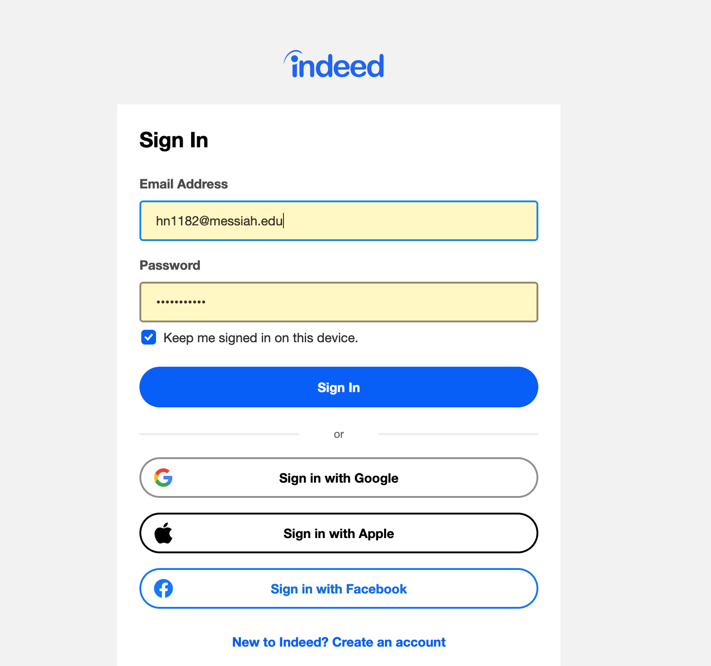
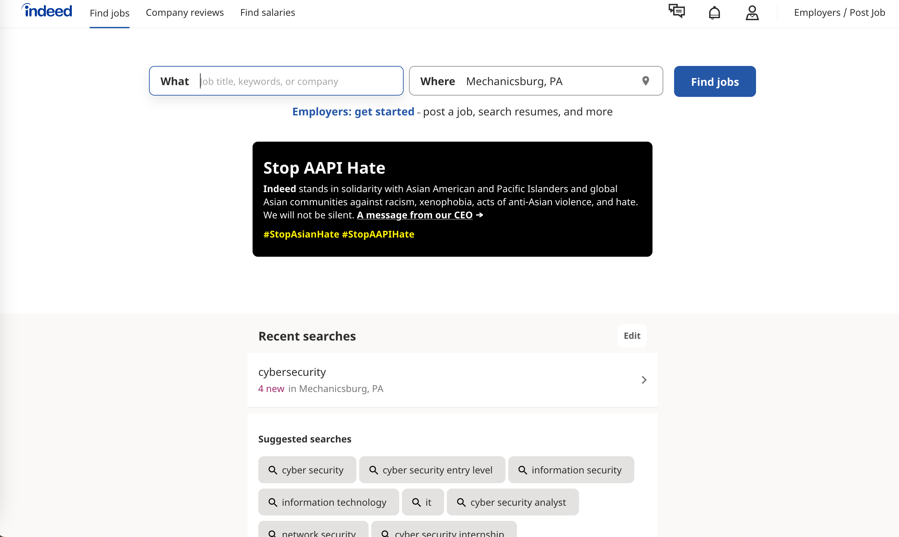
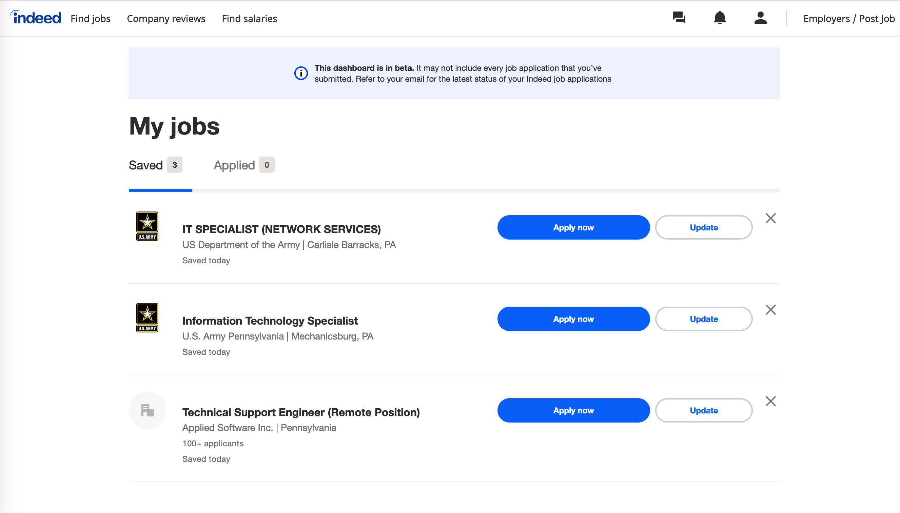
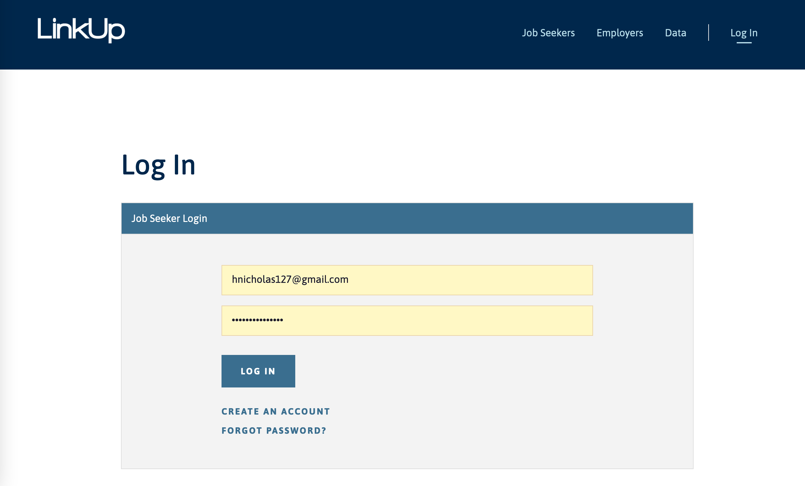
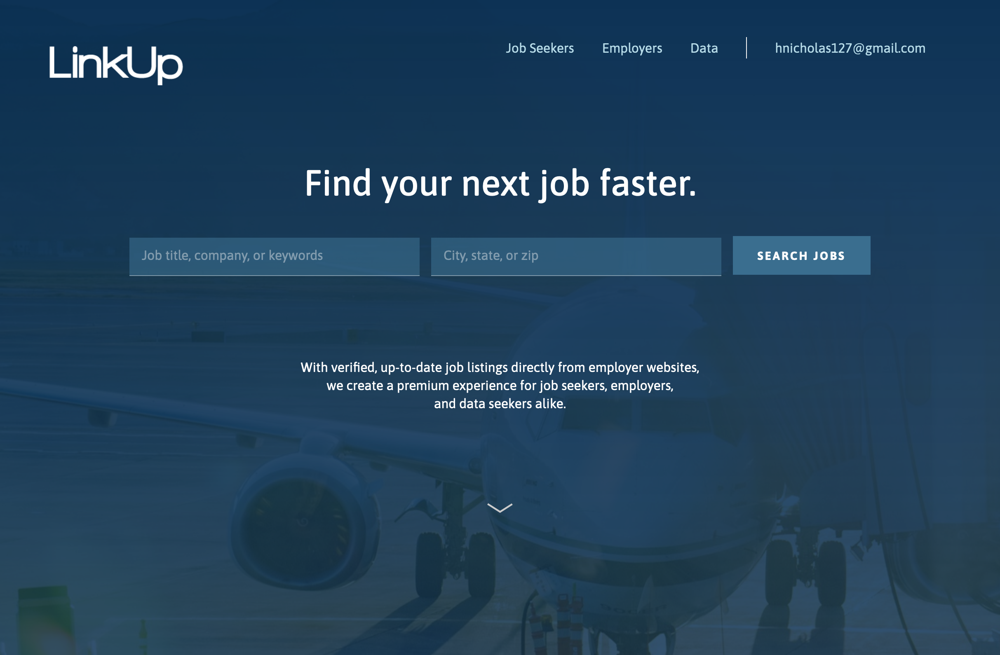
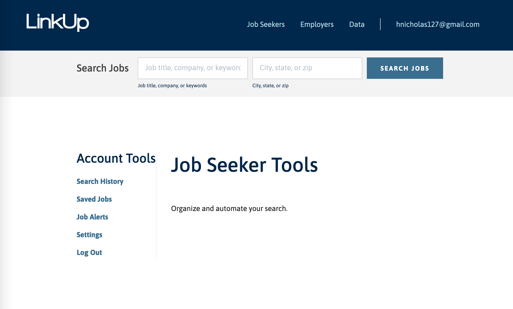
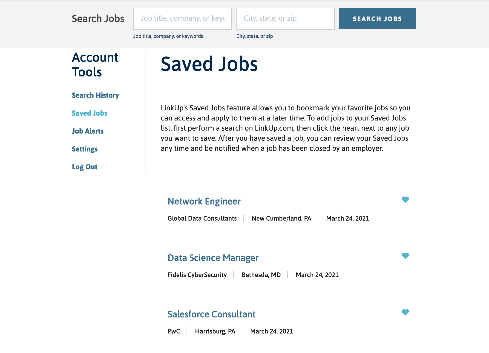
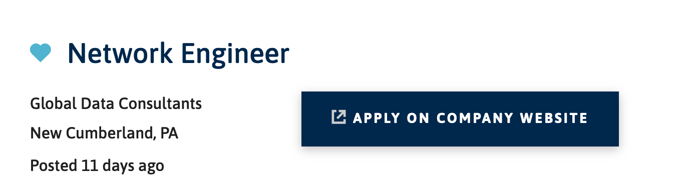
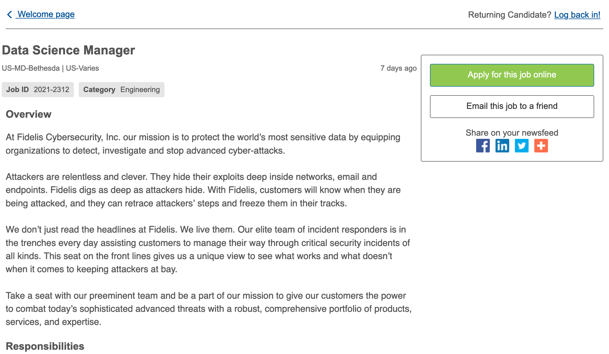

# Lab Report: UX/UI
___
**Course:** CIS 411, Spring 2021  
**Instructor(s):** [Trevor Bunch](https://github.com/trevordbunch)  
**Name:** Hallie Nicholas  
**GitHub Handle:** hallienicholas  
**Repository:** https://github.com/hallienicholas/cis411_lab3_uiux.git
**Collaborators:** 
___

# Step 1: Confirm Lab Setup
- [x] I have forked the repository and created my lab report
- [x] If I'm collaborating on this project, I have included their handles on the report and confirm that my report is informed, but not copied from my collaborators.

# Step 2: Evaluate Online Job Search Sites

## 2.1 Summary
| Site | Score | Summary |
|---|---|---|
| Indeed | 19 | Indeed is a well-known job search site and there is a reason for it. It values the user's time, has a clear and direct purpose which is quickly known by the user, and has set up simple navigation and ample accessibility for an overall enjoyable user experience.|
| LinkUp | 12.5 | LinkUp is an example of a job finding site that is not as well-known, most likely due to its lacking in certain areas of user experience necessities. It still includes many good features and I am sure many have found valuable jobs by searching on this site. However, it has a lot to improve on in order to ensure consistent positive experiences among job-searchers and employers alike.|

## 2.2 Site 1
Insert Recorded Screenshots with captions and steps.
I already had an Indeed profile, but my login process is shown here.

As can be seen in the image above, I used my signin info to log in, but it is a straight-forward process if I had needed to create a profile this time around.

As can be seen in the image above, the home page is extremely user friendly. It has a good amount of navigation, and there is a search tab right where users would look first in order to not waste their time. Below that, you can see my recent searches listed, and then suggested searches based on my history. There is also a way to save jobs which can be accessed by clicking the account icon at the top right. Below is a screenshot of my current saved jobs, and a button on each to quickly access the page where you can apply to the site if you would like to.

These are just a few of the many great features of Indeed. There is a reason this is such a well-known site among many who are searching for jobs, as well as employers looking to hire workers.

| Category | Grade (0-3) | Comments / Justification |
|---|---|---|
| 1. **Don't make me think:** How intuitive was this site? | 3 |  Indeed definitely knows what the user wants. It is easy to use, and the navigation is straight-forward and simple, which allows the users to move around the site seamlessly and do what they came on the site to do in the first place.  |
| 2. **User are busy:** Did this site value your time?  |  3 | This site clearly does value the time of users, as it allows for quick searching right when you open up to the homepage. In addition, almost everywhere else you navigate to on the site provides the search bar in an easily accessible area for the user to make a search whenever is convenient for them. |
| 3. **Good billboard design:** Did this site make the important steps and information clear? How or how not? |  3 |  Indeed does well with informing the user about exactly what each button and text entry box does on the site. There are clear steps for how to get done what the user needs to, and it is easy to use. The site also has a message on the homepage about their stance on AAPI hate, which is currently a hot topic. This definitely is good for their site because it shows users that they are passionate and invokes feeling. |
| 4. **Tell me what to do:** Did this site lead you towards a specific, opinionated path? |  2 |  The site is straight-forward with what they want from you and how the user should navigate. However, with job searching comes a number of factors, and when the user does conduct a search, Indeed shows many different filters one can use. They are all towards the top which could prove difficult to the searcher and overwhelming at times. A better way for them to do this could be to hide the filters so that they can be used when desired, but not all bunched up at the top in a group. |
| 5. **Omit Words:** How careful was this site with its use of copy? |  3 |  Indeed is precise with the words it uses in order to accurately portray what it wants visitors to know and understand. It does not include paragraphs explaining what the site is about or what needs to be done, but is simple and classy.|
| 6. **Navigation:** How effective was the workflow / navigation of the site? |  2 |  As I said earlier, navigation is very well done here. However, one thing they could do differently is have maybe one more navigation icon at the top. Currently, they have many links bundled into the user icon at the top right which lead you to many important things. However, Indeed might want to seperate those to make the workflow smoother and organized so the user doesn't have to go into that user icon first whenever they want something that is hidden inside it. |
| 7. **Accessibility:** How accessible is this site to a screen reader or a mouse-less interface? |  3 |  Indeed seems to be very accomodating regarding accessibility. From what I have observed, the tab order is well layed out to make it easy for users to navigate the site using keys. Also, text entry bars have alternate text that could be read aloud if there were disabilities with sight. In addition to that, there is even an option at the bottom of the page for the spanish version of the website, which is great for visitors who are not english speakers. |
| **TOTAL** |  19 |   |

## 2.3 Site 2
I already had a LinkUp profile as well, but here is the signin process I used.

Upon signing in, the home page is a fairly simple one which seems easily navigable. You can search from jobs straight from here which is great, as that is the main purpose of the site. However, the algorithm is not very intuitive when it comes to showing the user what they want to see. We will get to that in more detail later.

From the home page, if the user clicks their email at the top right, they see their profile and are able to navigate to certain pages from there. There is a saved jobs page where you can see the jobs you 'favorited' and easily access those which is nice.

Below is a screenshot of my saved jobs.

Another nice feature is that whenever you click on the links on the left, the links stay there for simple navigation no matter where you go. You can easily log out from there as well.

All of the jobs that I clicked on included a button linking to the company website if you choose to apply. Below is a screenshot of an 'Apply' button for a specific job.

Next is an image of where that link takes you.

| Category | Grade (0-3) | Comments / Justification |
|---|---|---|
| 1. **Don't make me think:** How intuitive was this site? |  0 |  The search engine used in the site is not very well programmed and you have to search just the right thing in order to get the results you are looking for. |
| 2. **Users are busy:** Did this site value your time?  | 1.5  |  The site is great in the sense that immediately upon entering the home page there is a prompt to search for a job which is what the users are there for. However, the search engine isn't the best, so it might take longer than the user has time for. |
| 3. **Good billboard design:** Did this site make the important steps and information clear? How or how not? |  3 |  Yes, the steps are clear and it is easy to understand how to use the site. For example, the search box tells the user to either input a job title, company or keywords. There are also minimal words |
| 4. **Tell me what to do:** Did this site lead you towards a specific, opinionated path? |  1 |  The site tells the user what to do and is clear about that which is useful, but the search bar in LinkUp is demanding in the sense that it doesn't recognize certain keywords you type in. So, when you start to type a certain job title and it doesn't recognize it, you will be directed to something else it wants you to see.|
| 5. **Omit Words:** How careful was this site with its use of copy? |  2 |  There are not too many words used on most of LinkUp's pages which is a good thing because it is precise, but there are still a couple of spots where they could've omitted some words when giving directions.|
| 6. **Navigation:** How effective was the workflow / navigation of the site? |  2 |  The navigation in this site is very effective and well done. There are not too many links and they are easy to follow, and there is also indication regarding which one you are on so that the user doesn't get confused. However, there could be more links and breadcrumbs in order to help the user get around the site.|
| 7. **Accessibility:** How accessible is this site to a screen reader or a mouse-less interface? |  3 |  There are not many images on this site so it is hard to tell whether it is accessible, but there are explanations/keywords under the search boxes which can easily be read aloud if there were to be a need. There is also a tab order on the site for keyboard accessibility.|
| **TOTAL** |  12.5 |   |

# Step 3 Competitive Usability Test

## Step 3.1 Product Use Case

| Use Case #1 | |
|---|---|
| Title | As a maintenance worker I want to be able to effectively access and manage my assigned pumps.|
| Description / Steps | This use case describes how the maintenance worker gains access to and information about his or her assigned pump(s) through this service.|
| Primary Actor | Maintenance worker|
| Preconditions | 1) Maintenance worker is authorized to view data 2) Worker has created an IWA account|
| Postconditions | 1) Worker is able to sign into his or her account 2) Worker is able to see stats and manage his or her pump 3) Maintenance worker is able to communicate with other workers to get supplies if needed |

## Step 3.2 Identify a competitive product

List of Competitors
1. Competitor 1 [Charity Water](https://www.charitywater.org/)
2. Competitor 2 [World Vision](https://www.worldvision.org/?campaign=400036866&ds_rl=1274668&gclid=CjwKCAjwr_uCBhAFEiwAX8YJgU7ukqX4vKE42NVsl9UL7w71xycTRLFIk7WihWUCZdiS7cX9iGSjgxoCO5oQAvD_BwE&gclsrc=aw.ds)

## Step 3.3 Write a Usability Test

| Step | Tasks | Notes |
|---|---|---|
| 1 | Navigate to [Charity Water's Site](charitywater.org/)  |   |
| 2 |  Begin to make a $50 monthly donation to the foundation. |  Will need to enter "other amount" in the donation box upon entering the home page - pretty simple |
| 3 | Find out how many countries have been served through this foundation.  |  Will need to navigate to "Our Work" tab and read the stats |
| 4 | Find the pump in Rassamtounde and figure out the population of people with access to the water.|  Search that pump and see info about it, viewing the stats |
| 5 |  State what type of system is installed in that same pump from step 4. | The system is named in the top right of the information page for that pump  |
| 6 | Give $150 in my honor, and design a card to print at home | Need to scroll to the bottom to "give in someone's honor" and design a card by following the instructions after choosing an amount. |

## Step 3.4 Observe User Interactions

| Step | Tasks | Observations |
|---|---|---|
| 1 | Navigate to [Charity Water's Site](charitywater.org/) |  User easily accessed site using the url |
| 2 |  Begin to make a $50 monthly donation to the foundation. |  This option is central on home page, so it was quickly found by user |
| 3 |  Find out how many countries have been served through this foundation. |  User had trouble finding the page that would indicate how many have served. |
| 4 | Find the pump in Rassamtounde and figure out the population of people with access to the water.  |  User was able to search for pump and see the pop. without even clicking for more info |
| 5 |  State what type of system is installed in that same pump from step 4. |  User clicked for more info, but was hesitant when giving the answer. |
| 6 |  Give $150 in my honor, and design a card to print at home |  User did this in a different way than I anticipated, but it worked just as well and was easier. |

## Step 3.5 Findings
I wrote those instructions for the usability specifically to see how the user would complete the tasks and also to see where some points of confusion may be throughout the process. I had my roommate, Tori follow these steps; she is a very tech savvy person and is extremely quick when it comes to navigating through online platforms, as she is a graphic design major. So, I wanted to see where she got tripped up or lost on the site, if at all. She had no problem navigating to the site which she did by copying and pasting the url. For step 2, she then proceeded with ease to pretend to make a $50 donation, as the site makes that easily accessible to visitors. Step 3 was where the confusion was; she went to the menu navigation items at the top, but wasn't sure exactly which tab to go to in order to view the countries served. She went through a couple tabs before coming to the "our work" tab where she found the answer. After this, she suggested that maybe if it said "our impact" she would've found the dashboard she was looking for in a quicker way because the wording would be more straight-forward. Next, step 4 involved searching for a pump in a certain place in Burkina Faso which Tori did without hesitation, and didn't even click for more info and was able to see the population of the pump as well as the type of system installed. However, to make sure it was the system she was looking at, she went into more information about that place. She said that it was not clearly marked, and not having an engineering or very tehcnical background made her second guess her ability to define what the system they were stating was. Lastly, Tori ended up going back to the home page in order to donate, where she found a little button at the bottom of the donate box that said "donate in someone's honor". She then made a card and easily donated in my honor. When testing it out myself, I found a different way to do it, but Tori ended up finding an easier way which is great and shows that the designers of the site definitely were thinking of user convenience when they added that feature.

**Three improvements I think could be made for usability:**

* The menu items could be worded differently, especially when it comes to the "Our Work" tab, so that users clearly know what that tab will show them, and donors can more easily get to the dashboard.
* Instead of just naming the type of system, there are a lot of site visitors who don't know much about pumps or technicalities, so they might want to clearly state that that is the system type that they have included there.
* When Tori made the browser window smaller, it was a little bit harder to navigate. So, I think the designers might want to look into making the responsiveness of the website a little better to improve user experience.

**Beneficial experiences to the user: (outlined in more detail above)**

* Having to think beyond what she previously had in mind regarding what certain tabs might mean, and navigating through to find what she was looking for.
* Discovering multiple ways to perform certain tasks on the site.

**What the team did well:**
I think we asked the right questions in order to challenge the user and realistically assess usability of the site.

**Improvements for next time:**
I believe next time my team should take a video of the user performing the tasks and analyze/discuss further what was going through the user's head throughout the test. This would ensure that we are completely putting ourselves in their shoes and making sure we fully understand what the user is expecting and dealing with while they are on the site.

**Brief Statement:**
I had a positive experience while conducting this usability test and was able to gain valuable insight into the user and their experience with the site in question.
# Extra Credit

**"Don't assume."**

There is a famous saying about what assuming does, but I will not say it here in order to maintain professionalism. However, it is not a good thing. Regarding UI/UX design, this statement means not just assuming that you know your audience or what they want from your service or page. You are not the user, you are the designer; therefore, you exist for their benefit and should be putting yourself in their shoes the whole time. Do not forget the vision of the site you are creating and what it will be used for. It is definitely helpful to get advice from others throughout the process, which I learned from performing my first usability test within this lab. Additionally, I would say don't make rash decisions design-wise based on what you are assuming would be good or bad for the site. You should instead use data to back up your decisions collected from tools such as Hotjar.