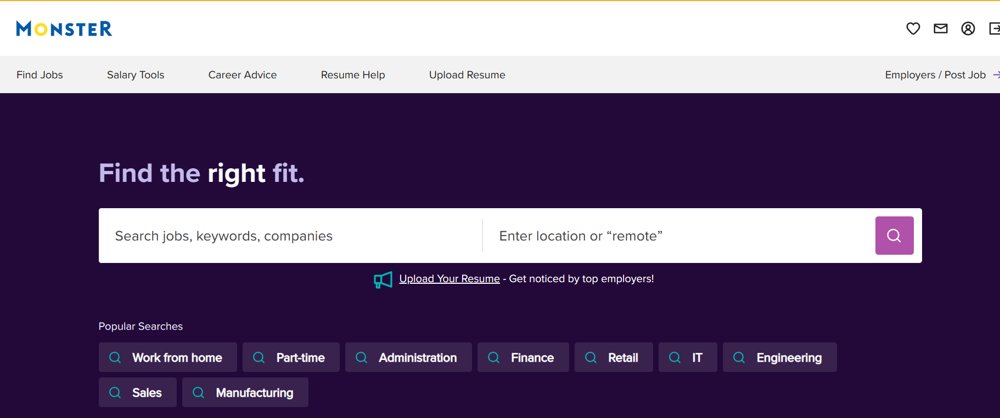

# Lab Report: UX/UI
___
**Course:** CIS 411, Spring 2021  
**Instructor(s):** [Trevor Bunch](https://github.com/trevordbunch)  
**Name:** Hope Tressler  
**GitHub Handle:** hopetressler  
**Repository:** https://github.com/hopetressler/cis411_lab3_uiux.git
**Collaborators:**   eliguy5474, noahcal11, CuriousOcean, NoahBrenneis
___

# Step 1: Confirm Lab Setup
- [X] I have forked the repository and created my lab report
- [X] If I'm collaborating on this project, I have included their handles on the report and confirm that my report is informed, but not copied from my collaborators.

# Step 2: Evaluate Online Job Search Sites

## 2.1 Summary
| Site | Score | Summary |
|---|---|---|
| LinkedIn | 18 | This site was overall very user-friendly and easy to navigate |
| Site 2 | 14 | Overall, this site wasn't the best to use. There were some good qualities to it, however, such as easily finding the job search bar |

## 2.2 Site 1

Site 1: LinkedIn - I had previously created a LinkedIn account

The home page is easy to navigate. There are different options in the bar at the top of the screen, such as Jobs. You can also clearly see your profile.

URL: https://www.linkedin.com/feed/ 
---

It is very easy to add a skill to your profile. You simply click the Add Skills button and some suggested skills will pop up. You can also start entering your own. 

URL: https://www.linkedin.com/in/hope-tressler/details/skills/
---

Searching for a job is simple on LinkedIn. You click the Jobs tab on the navigation bar and have the option to filter out the results. You can add as many filters as you want and the updated results will come in quickly. 

URL: https://www.linkedin.com/jobs/ 
---

After finding and selecting a job you want to apply for, hit the apply button. This will take you to the company's site and allows you to formally apply for the job. You are able to apply with LinkedIn or do it manually. 

URL: https://www.linkedin.com/jobs/view/3511416957/?alternateChannel=search&refId=w2lDg8T35zPBVjpvHKMKYA%3D%3D&trackingId=aTdDrev%2BR7%2FgDn6ILThTQA%3D%3D 

---

| Category | Grade (0-3) | Comments / Justification |
|---|---|---|
| 1. **Don't make me think:** How intuitive was this site? | 3 | I didn't have any difficulties finding what I wanted to find. For example, the job search area. Everything is simple and easy to find. |
| 2. **Users are busy:** Did this site value your time?  | 3 | This site valued my time in the way that it was simple to find job recommendations and gave updated results after you refined your job searching criteria.  |
| 3. **Good billboard design:** Did this site make the important steps and information clear? How or how not? | 2 | I think that LinkedIn is mostly clear, but there is a lot of information immediately given. It may be confusing to find certain things such as the Adding Skills area in the profile section.  |
| 4. **Tell me what to do:** Did this site lead you towards a specific, opinionated path? | 1 | There isn't really a path that this site leads you toward. It just gives you things that are focused on what you want and shows the posts of people you follow. LinkedIn is not only a job search site, but a more formal platform for social media. |
| 5. **Omit Words:** How careful was this site with its use of copy? | 3 | I don't think that this site has unnecessary words. Everything seems to be limited and easy for the user to quickly understand the purpose of every feature. |
| 6. **Navigation:** How effective was the workflow / navigation of the site? | 3 | The workflow seems very effective and this site was easy to navigate. Everything was easy to find, whether it was job searching or posts from connections |
| 7. **Accessibility:** How accessible is this site to a screen reader or a mouse-less interface? | 3 | This site is very accessible to a screen reader. There are no issues from what I can tell and the mobile app is easy to navigate |
| **TOTAL** | 18 | This site was overall very user-friendly and easy to navigate |

## 2.3 Site 2

Site 2: Monster 

The Sign Up process was simple and I was able to fill in my information with Google. I was then prompted to add more personal information. 

URL: https://rb.gy/clqszx

---

The account creation was similar and part of the Sign Up process. You enter in your information and can include personal things such as which school you go to.

URL: https://www.monster.com/profile/complete?redirectUri=%2F&flow=isExternalRegistration&skipped=2

---

On the Home page, there is a clear section where you can already start searching for jobs. You are also able to see your profile on the screen. 

URL: https://www.monster.com/

---

It is easy to find the Add Skills section in my profile. You simply scroll down and find skills you want to add. 

URL: https://www.monster.com/profile/detail/skill

---

The job search bar was easy to find since it is on the Home page. You are able to search for a job and click on job recommendations. 

URL: https://www.monster.com/jobs/

---

The site gives recommendations for jobs based on your skills and preferences. You can select the job you want and hit apply to be taken to the company's external application page.

URL: https://www.monster.com/jobs/search?q=cybersecurity+jobs&where=&page=1&so=m.h.lh 

---

| Category | Grade (0-3) | Comments / Justification |
|---|---|---|
| 1. **Don't make me think:** How intuitive was this site? | 3 | This site was very intuitive. I had no issues figuring out where to go |
| 2. **Users are busy:** Did this site value your time?  | 3 | It was simple to find out how to search for jobs and there were recommendations for jobs that were quickly given |
| 3. **Good billboard design:** Did this site make the important steps and information clear? How or how not? | 1 | I think that this site didn't do a great job making the instructions clear. There are different things that are clear, but there should be more  |
| 4. **Tell me what to do:** Did this site lead you towards a specific, opinionated path? | 1 | It didn't feel like I was being led towards a specific, opinionated path. I had to find out where I wanted to go and figure out how to get there |
| 5. **Omit Words:** How careful was this site with its use of copy? | 1 | This site had some areas where the words could have been limited. There were some times when I had to work harder at understanding what I was seeing |
| 6. **Navigation:** How effective was the workflow / navigation of the site? | 2 | The overall navigation of the site was not bad, but could definitely be better |
| 7. **Accessibility:** How accessible is this site to a screen reader or a mouse-less interface? | 3 | This site seems like it would be accessible to a mouse-less interface |
| **TOTAL** | 14 | Overall, this site wasn't the best to use. There were some good qualities to it, however, such as easily finding the job search bar |

# Step 3 Competitive Usability Test

## Step 3.1 Product Use Case

| Use Case #1 | |
|---|---|
| Title | Recipe Filtering |
| Description / Steps | User finds recipe through filtering |
| Primary Actor | User |
| Preconditions | 1. User logs into their account in the application  2. User clicks on 'Recipes' tab   3. Suggested recipes are listed in accordance with user's tracked skills   4. User clicks on 'Filter by Type' button  5. User specifies the type of recipe they want to complete 6. User clicks on desired recipe and completes their tasks |
| Postconditions | 1. User can sign in at a later time and view their recipe history  2. User can rate their recipe  3. Based on the recipe they completed, a certain skill's level will grow |

## Step 3.2 Identifier a competitive product

List of Competitors
1. Competitor 1:  [Tasty](tasty.co)
2. Competitor 2:  [Paprika App](www.paprikaapp.com)

## Step 3.3 Write a Useability Test

| Step | Tasks | Notes |
|---|---|---|
| 1 | Sign in to the application  | Open the application and hit the sign in button |
| 2 | Click on the Search bar at the top of page  | Click in the search bar for the filters to come up |
| 3 | Observe all of the filters and click the 'Dinner' filter | All of the results will appear  |
| 4 | Select the 'Creamy Chicken Pasta Bake' recipe | User might have to scroll down a bit |
| 5 | Click on the heart button at the top and hit 'Add to Cookbook' | User can pick which cookbook this goes in |
| 6 | Go to your profile at the bottom of the app and click on 'Cookbooks' | This should be the middle option |
| 7 | Click the 'Dinner' cookbook | Once completed, you should see the recipe you just made |

## Step 3.4 Observe User Interactions

| Step | Tasks | Observations |
|---|---|---|
| 1 | Sign in to the application | Easy to sign in. There are some steps you need to go through such as diet preferences |
| 2 | Click on the Search bar at the top of page | User said it was very easy to find the search bar  |
| 3 | Observe all of the filters and click the 'Dinner' filter | User said it was a bit difficult to find the 'Dinner' filter because there were so many filters  |
| 4 | Select the 'Creamy Chicken Pasta Bake' recipe | User said it was easy to find the recipe |
| 5 | Click on the heart button at the top and hit 'Add to Cookbook' | It was easy to find the heart button and click on 'Add to Cookbook'. User was not sure what cookbook to put it in at first, but ultimately decided on the 'Dinner' cookbook |
| 6 | Go to your profile at the bottom of the app and click on 'Cookbooks' | This was also easy to find |
| 7 | Click the 'Dinner' cookbook | User was able to quickly find and click on the desired cookbook |

## Step 3.5 Findings

#### Improvements 
* Add a way for users to see a rating of each recipe. There are no reviews saying if the recipe is good or not.
* Lessen the amount of filters that show up when user hits the search bar. It can be confusing and overwhelming. 
* Add different ways for users to know what certain vocab terms mean. There are no detailed explanations if user needs them.

#### Beneficial Experiences
* Having a recommendation page as the Home page was nice because it had recipes that the company Tasty recommends to each user.
* Since this company is partnering with Walmart, having a way to shop instantly for items needed for a specific recipe is very beneficial.

#### Additional Questions
* For this usability test, it was nice to be able know what would be nice to include and eliminate for our application. The usability test went well because our application will be very similar to this. Users like to be able to use common sense or immediately see what they need to in order to do what they want. 
* Asked user at certain points how they felt about each action.
* For the next usability test, there should be more complex directions in order to make sure users can give feedback for us to make the process as easy as possible for them. 

#### Statement about Conducting the Test
* It was fairly easy to find an application that is similar to what our application is. Conducting the test was beneficial because we now have more feedback about what to do for our application. Conducting usability tests are a great way to find out what the customer wants and what to add in order to have the best ratings for the application. 

# 4. Your UX Rule (Extra Credit)

**Show the Purpose**

Having a clear purpose for the website is important. Your website should guide people down the path that the creator of the application wants. If there isn't a clear path that the creator wants to make, there should be an obvious purpose such as giving people a way to enhance their cooking skills in the easiest and most fun way possible.
