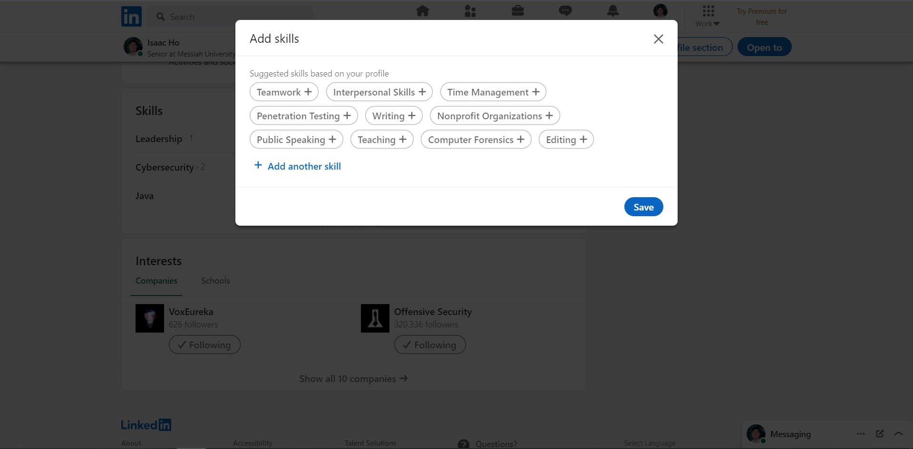
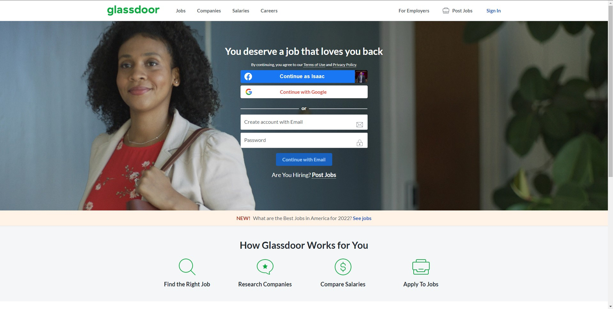
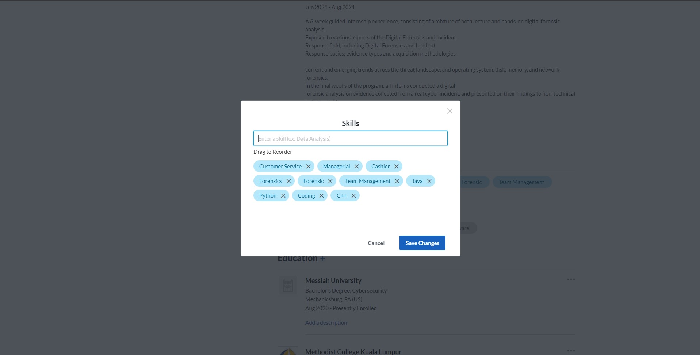

# Lab Report: UX/UI
___
**Course:** CIS 411, Spring 2021  
**Instructor(s):** [Trevor Bunch](https://github.com/trevordbunch)  
**Name:** Isaac Ho    
**GitHub Handle:** isaachhm 
**Repository:** https://github.com/isaachhm/cis411_lab3_uiux.git  
**Collaborators:** Reid Burger, Ammanuel Tamrat, Timothy Lee, Thomas McVey  
___

# Step 1: Confirm Lab Setup
- [x] I have forked the repository and created my lab report
- [x] If I'm collaborating on this project, I have included their handles on the report and confirm that my report is informed, but not copied from my collaborators.

# Step 2: Evaluate Online Job Search Sites

## 2.1 Summary
| Site | Score | Summary |
|---|---|---|
| Linkedin | Score 1 | Summary 1 |
| Glassdoor | Score 2 | Summary 2 |

## 2.2 Site 1 - Linkedin
Insert Recorded Screenshots with captions and steps.

Note: I have a pre-existing account on this website.

## Login to Profile
After logging in, I am brought to my home page that includes the activity of my connections and following. As seen in the image below, there are two evident options that navigate to my profile. One option is to click on my name on the left side of the webpage and the other option is to click on "Me" on the top right corner of the webpage.

## Updating a Skill
As you can see from the image below, Linkedin will suggest the skills you should add based on your preferences, interests, and experience.

## Applying for a Job
Applying for a job is easy and simple. Clicking on the jobs tab will bring you to a different page with all the available jobs hiring. Linkedin will suggest jobs that are related to your interests and skills. Linkedin also provides filters such as, location, type of job, and specific companies you want, to further specify the jobs you're looking for.

When you've finally selected a job that you want to apply for, Linkedin provides all the necessary information in the job description. You can even save the job opening to look at it again later. Clicking on the green apply button will bring you to the company's website to apply for the job.

| Category | Grade (0-3) | Comments / Justification |
|---|---|---|
| 1. **Don't make me think:** How intuitive was this site? | 3 | Linkedin's UI is shows the brand's two main focuses, connecting people and helping the user find a job opening. |
| 2. **Users are busy:** Did this site value your time?  | 3 | Linkedin makes it easy for the user to add details to their profiles and find job openings suited to their interests. |
| 3. **Good billboard design:** Did this site make the important steps and information clear? How or how not? | 3 | When creating your profile, Linkedin will always show the things you are missing on your profile.The program ill not stop suggesting you to add the important details until it is done. |
| 4. **Tell me what to do:** Did this site lead you towards a specific, opinionated path? | 3 | Almost every aspect of Linkedin is catered to the user's interests. |
| 5. **Omit Words:** How careful was this site with its use of copy? | 2 | Linkedin does a great job at limiting the amount of words on the screen. When looking for a job, your screen is not cluttered with words about the job. Instead, you get just the right information to consider looking into the job. |
| 6. **Navigation:** How effective was the workflow / navigation of the site? | 3 | Navigating around the website was straightforward and coherent. I did not need to flip through multiple tabs or webpages to find the information I wanted. |
| 7. **Accessibility:** How accessible is this site to a screen reader or a mouse-less interface? | 2 | Linkedin has a mobile application that is easy to use and has all the same features as the webpage. However, using linkedin on a mobile phone web browser is not optimized and can be difficult to use. |
| **TOTAL** | 19 | Linkedin's user interface experience is easy and simple. It caters to the user's interest which in return, lets the user have a more efficient experience when searching for a job. |

## 2.3 Site 2 - Glassdoor
Insert Recorded Screenshots with captions and steps.

Note: I have a pre-existing account on this website. However, I have not set up my profile.

## Login and Updating my Profile
After logging in, the initial home page is very clean and there is not much information on it. Glassdoor uses the contrast of colors to direct the user to where they should be. This shows me the four most important tabs that I would need as a user; jobs, companies, salaries, and careers. 

When updating my profile with all the information needed, Glassdoor allows the option of uploading my resume to autofill the information needed for my profile. This worked quite well for me but there were a few mistakes on the information inputted. Manually inputting all the information would be better than this ambitious attempt to autofill everything with a resume.

## Adding a Skill
Adding a skill to my profile is an easy task. However, Glassdoor adds a lot of unnecessary skills when I was creating my profile through uploading my resume. I did not have "Cashier" on my resume but glassdoor add it in based on my past work experiences.

## Applying for a Job
Applying for a job in Glassdoor is the same as using Linkedin. However, some job openings allow Glassdoor as a third party site for applying. Glassdoor's "Easy Apply" feature is a great addition that helps the user avoid the stress of navigating through the application process.

Glassdoor also has an ambiguous "Job Alert" feature. The website does not explain what this feature does and I can only assume it shows the user all the job openings related to a certain field. I was a little worried companies would be notified of my profile since I did not want to apply for a job. 

| Category | Grade (0-3) | Comments / Justification |
|---|---|---|
| 1. **Don't make me think:** How intuitive was this site? | 2 | Glassdoor has many useful features that users can benefit from. However, there is not much explaining on how to use these features. |
| 2. **Users are busy:** Did this site value your time?  | 3 | Glassdoor values the user's time by being clear with where all the information is located. |
| 3. **Good billboard design:** Did this site make the important steps and information clear? How or how not? | 2 | Glassdoor tries its best at automating many things for the user which could save a lot of time. However, automation is not always dependable which causes some users to feel uncomfortable using the site. |
| 4. **Tell me what to do:** Did this site lead you towards a specific, opinionated path? | 3 | Glassdoor does a great job at catering to the user's interests. |
| 5. **Omit Words:** How careful was this site with its use of copy? | 1 | Glassdoor's user interface is clean and well organized. However, they have omitted so many words that I tend to get confused on what each feature does. |
| 6. **Navigation:** How effective was the workflow / navigation of the site? | 3 | Glassdoor is easy to navigate through and makes it easy for a user to find the information they need on jobs. |
| 7. **Accessibility:** How accessible is this site to a screen reader or a mouse-less interface? | 2 | Similarly to Linkedin, Glassdoor has its own mobile app which works well. However, on a mobile phone web browser, it is not optimized and can be difficult to use. |
| **TOTAL** | 16 | Glassdoor's user interface is aesthetically pleasing and the contrast of colors guides the user to their desired destination. However, Glassdoor does not do a good job at explaining all the features to the user. |

# Step 3 Competitive Usability Test

## Step 3.1 Product Use Case

| Use Case #1 | Finding the Campus Map |
|---|---|
| Title | User must find the campus map to be able to direct themselves. |
| Description / Steps | 1. User opens the app.  2. User is authenticated with either biometrics or their password.   3. User presses on "Campus Map" tab. |
| Primary Actor |Messiah University Students|
| Preconditions |1. User must be a student at Messiah University.   2. User must have app downloaded.|
| Postconditions |1. The system brings up campus map.   2. The system gives the option to return to the home page when the user wants.|

## Step 3.2 Identifier a competitive product

List of Competitors
1. Competitor 1[Falconlink](https://falconlink.webapps.messiah.edu/?utm_campaign=ug-slate&utm_source=falconlink-intro&utm_medium=email)
2. Competitor 2[Messiah University](https://www.messiah.edu/)

## Step 3.3 Write a Useability Test

| Step | Tasks | Notes |
|---|---|---|
| 1 | Opening the Messiah website.  |   |
| 2 | Searching for the map.  | The user can use the search bar to find the campus map. |
| 3 | Selecting the right result and opens the map.  |   |

## Step 3.4 Observe User Interactions

| Step | Tasks | Observations |
|---|---|---|
| 1 | Opening the Messiah website  | There was a lot of icons and links that the user did not bother looking at. |
| 2 | Searching for the map  | - The user clicked on hyperlinks that sounded like it would bring him to the campus map. - It took awhile but the user ended up scrolling all the way down to the bottom of the webpage and clicked on "Campus Map" under the quick links. |
| 3 | Selecting the right result  | - User did not like the image rendering of the map. - The map does not have any labels - The user says that the search bar does not account for typos |

## Step 3.5 Findings
Navigating around campus is a daily occurence for all students. A new and unfamiliar place can be very daunting to many new students. My group and I realized this and wanted to see how easy it would be to use our phones to find a map of the campus. To our surprise and the user's surprise, it is very difficult to find the campus map on the main Messiah University domain and even on falconlink. Even if a student finds the campus map on their phone, it is very difficult to use the digital map as it is not optimized to be used on a mobile phone browser, and there were no labels on any of the campus buildings.

Our group hopes to improve on these inconveniences in our own app. We would need to have our own design of the campus map and make it easy to see while walking around campus.

# 4. Your UX Rule (Extra Credit)
If you opt to do extra credit, then include it here.