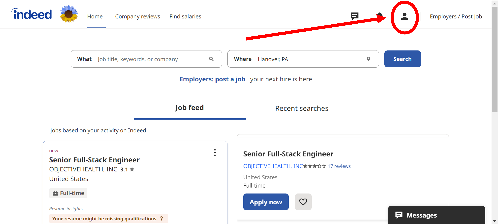
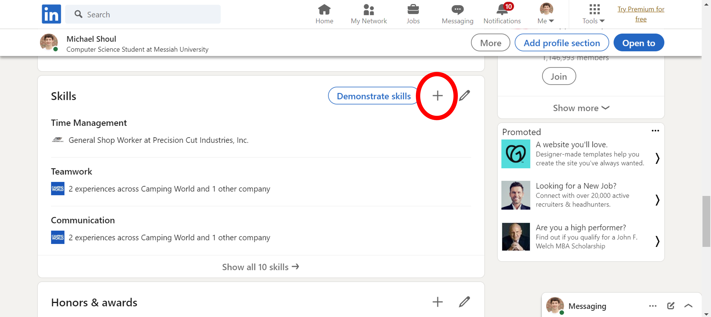
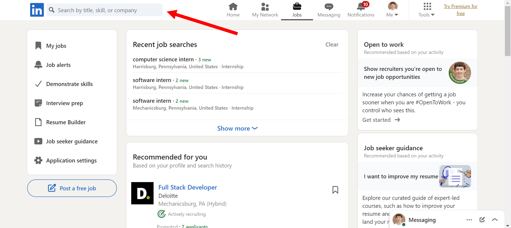

# Lab Report: UX/UI
___
**Course:** CIS 411, Spring 2023  
**Instructor(s):** [Trevor Bunch](https://github.com/trevordbunch)  
**Name:** Michael Shoul  
**GitHub Handle:** [m-shoul](https://github.com/m-shoul)  
**Repository:** [m-shoul / cis411_lab3_uiux](https://github.com/m-shoul/cis411_lab3_uiux)  
**Collaborators:** 
* Ben Clarke - [BenOfTheOneRing](https://github.com/BenOfTheOneRing)
* Josh Phillips - [jp1478](https://github.com/jp1478) 
* Tim Kratz - [timkratz](https://github.com/timkratz)
* Zach Booher - [Sturty75](https://github.com/Sturty75)
* Rachel Beattie - [R-B1509](https://github.com/R-B1509)  
___

# Step 1: Confirm Lab Setup
- [X] I have forked the repository and created my lab report
- [X] If I'm collaborating on this project, I have included their handles on the report and confirm that my report is informed, but not copied from my collaborators.

# Step 2: Evaluate Online Job Search Sites

## 2.1 Summary
| Site | Score | Summary |
|---|---|---|
| [Indeed](https://www.indeed.com/) | 17 | Overall, I like Indeed for a couple of different reasons. The first reason being the simplicity. Users from all demographics are able to utilize and navigate throughout Indeed without much difficulty. This is unlike LinkedIn, where it can be confusing how to navigate throughout the job board. I also like the design layout of Indeed. White space is sometimes overused, but it is not cluttered which I prefer. I felt that I was able to find everything I was looking for on each page I visited. It was easy to update my skills or add experience if I needed to, and the process of searching for a job was also easy. I can search for a job based on keywords and location right from the home page. One drawback of Indeed is that it does not have many images or visuals. It would be helpful to have images and the logos of the companies in the job listings. However, Indeed is what I used to land my first two jobs, so overall I like the site and what it has to offer. |
| [LinkedIn Jobs](https://www.linkedin.com/jobs/) | 14 | LinkedIn jobs is a useful tool when looking for jobs / internships in academia because of the ability to network and connect with others in the field. However, from a design standpoint, this would not be my go to site when searching for a job. LinkedIn Jobs is not as easy to use as some competitors due to the complexity. Also, LinkedIn isn't just for jobs, rather it is more of a social networking platform that is geared toward a younger generation of users. While navigating the site, I knew what I wanted to do, but there were some areas where I felt like I was wasting my time not knowing exactly what to do. Another feature of LinkedIn Jobs that I am not particularly fond of is the *promoted* jobs. Even when specifying the search criteria, the promoted jobs were appearing and I could not find a way to filter them out. I do agree that LinkedIn as a whole is the jack of all trades when it comes to networking and job hunting, but from my experience, LinkedIn Jobs is not what I prefer when searching for a job. |

## 2.2 Site 1 - Indeed

**Note:** I already have an account for [Indeed](https://www.indeed.com/) and when I navigate to the home page of the site from my browser, I am already logged into my account. If I did not have an account or was not logged in prior to accessing the site, I would have had to create a profile and / or log in to my account.  

### Account Actions

**1. Home Page**


This is the home page of [Indeed](https://www.indeed.com/) when I first load up the website. I like the overall layout of the home page, but the color scheme could use one or two more colors.

**2. Navigating to Profile**


Click on the person icon in the upper right hand corner, and a dropdown list will appear with different account actions I am able to quickly manage and / or change. I also like how when I hover over the icon, it changes state to let me know that it is a button I am able to click.


I click on the *profile* option of the dropdown, which will take me to my profile. This option is at the top of the dropdown for easy access. I like that there is no *more* section in the dropdown, so I am not wondering what else I might be trying to navigate to.


My Indeed [profile](https://profile.indeed.com/?hl=en_US&co=US&from=gnav-jobsearch--indeedmobile&_ga=2.262140298.641469766.1678824426-45782787.1666360267) page. The design of the profile page seems too simple and I also do not like the grey circle with my initials. It is not a clickable button and I am not able to add a profile picture.

**3. Update Profile**


To update my profile with refined skills, I scroll down on my profile to where it says *Improve your job matches*. Here I can click on the qualifications section.


This takes me to a [qualifications]() page where I can add any skills, experience, education, certificates, etc.


If I want to add a skill, I click on the *Add skill* and fill out the form with the necessary information. After typing in the skill I wanted to add, I clicked *Save* to have the new skill visible on my account. The process of adding a skill was simple and I have no complaints about my experience.

**4. Update Job Preferences**


To update my job preferences, I would follow the same steps as adding a skill, but click on [job preferences](https://profile.indeed.com/preferences) instead.


Here I am able to add a job title, type, preferred schedule, etc. to whatever I prefer. The process of updating my job preferences was also simple and I have no complaints about my experience.

### Searching For a Job


To search for a job, I navigate to the home page of [Indeed](https://www.indeed.com/). Here I am able to search for the type of job, and the location where I am seeking a job. The two search bars are in the middle of the web page and easily accessible.


When I search for what I am interested in, the relevant results are shown, as well as options to further refine the search by more specific criteria.


Once I am done searching for the desired position, it takes me to a page with the list of jobs. If I find a job I am interested in, then I can apply for it by clicking the *Apply now* or *Apply on company site* to apply for the listing. *Apply now* sends an application through Indeed and *Apply on company site* is linked to the external job application on the company website. Overall, searching for a job was a simple process and I had no questions of what the next steps were during the process.

### Ratings - Indeed
| Category | Grade (0-3) | Comments / Justification |
|---|---|---|
| 1. **Don't make me think:** How intuitive was this site? | 3 | Overall, this site is very intuitive and I always knew exactly where I was and what I needed to do on each page. |
| 2. **Users are busy:** Did this site value your time?  | 3 | Everything was concise, easy to use, and I was able to search for a job or access my profile quickly and efficiently. |
| 3. **Good billboard design:** Did this site make the important steps and information clear? How or how not? | 3 | The site has a good visual hierarchy with not much noise and distraction. I like how the page is broken up into sections, and it is obvious what is clickable and what isn't. I also like the blue and white contrast showing what is important. |
| 4. **Tell me what to do:** Did this site lead you towards a specific, opinionated path? | 3 | The site told me to search for a job by having both search bars in the center of the screen with the blue *search* button just off to the right. Once I found a job, the blue *apply* button told me to apply for the listing. |
| 5. **Omit Words:** How careful was this site with its use of copy? | 2 | The use of copy for this site is decent. What I like is that each listing has just the right amount of information that entices me to click on the job. However, I feel like in some areas there was a bit too much white space and that some pages looked too boring. |
| 6. **Navigation:** How effective was the workflow / navigation of the site? | 1 | It was easy to know where I was in the main navigation bar from the small blue line that underlines what page I am on. However, when navigating through the other various sections of my account, it was hard to know exactly where I was or how to get back. The blue underline was not consistent across the entire site. |
| 7. **Accessibility:** How accessible is this site to a screen reader or a mouse-less interface? | 2 | The accessibility of this sight is about average in comparison of other sites I have come across. It is easy to navigate without a mouse, but there are no features for visually impaired or audio deficient users.|
| **TOTAL** | 17 |   |

## 2.3 Site 2 - LinkedIn Jobs

**Note:** I already have a [LinkedIn](https://www.linkedin.com/in/michaelshoul/) account and when I navigate to the home page of the site from my browser, I am already logged into my account. If I did not have an account or was not logged in prior to accessing the site, I would have had to create a profile and / or log in to my account.

### Account Actions

**1. Home Page**


This is the home page of [LinkedIn Jobs](https://www.linkedin.com/jobs/) when I first load up the website.

**2. Navigating to Profile**


I click on the profile picture on the right hand side of the navigation bar, which will display a dropdown of different account actions I am able to quickly manage and / or change.


I click on *view profile* to navigate to the main page of my [LinkedIn profile](https://www.linkedin.com/in/michaelshoul/). At first glance, there is a lot going on here, so it is a bit overwhelming.


This is my [LinkedIn profile](https://www.linkedin.com/in/michaelshoul/) page with all the information that reflects what I have on my resume. I like how the color scheme allows the important sections to pop out from the background.

**3. Update Profile**


To update my profile with additional experience, while already on my profile I scrolled down to the *experience* section and clicked the ```+``` icon in the upper right.


I had the option to add either a new position or a career break, so I decided I wanted to add a position.


After clicking on *add position*, a form pops up on the screen where I am able to add information including but not limited to the job title, employment type, and company name. I like how this is a simple process and can all be done right from my profile. I also like the placeholder text in the form fields because it provides me with an example of what I should write in the text field. I click *Save* to make the new experience visible on my profile.


Adding skills is similar to adding experience. While on my profile page, I scroll down to the *skills* section and click the ```+``` icon in the upper right.


After clicking on the ```+```, a form pops up on the screen where I am able to add a skill, or choose from a suggested list of skills. I click *Save* to make the new skill visible on my profile. The process of adding a skill is just as simple as adding experience.

### Searching For a Job


To search for a job, I navigate to the home page of [LinkedIn Jobs](https://www.linkedin.com/jobs/) and find the search bar in the upper left hand corner.


When I click on the search bar it splits into two, and I have the option to search by title, skill, company, etc. in one search bar, and search by location in the second search bar. I would prefer if both search bars appeared when the site loaded, so I know that I have the ability to refine my search by location only by looking at the site.


Once I am done searching for the desired position, the site takes me to a page with the list of jobs. If I find a job I am interested in, then I can apply for it by clicking the blue *Apply* button. I like how most of the *Apply* buttons take me to the company site, versus applying through LinkedIn, however there are some exceptions.

### Ratings - LinkedIn Jobs
| Category | Grade (0-3) | Comments / Justification |
|---|---|---|
| 1. **Don't make me think:** How intuitive was this site? | 1 | The site was rather complicated to me when I first tried to use it. The search bar does not stand out to me, and I wasn't sure at first how to search for a job. Otherwise, I did know where I was on the page and how to do what I wanted to do. |
| 2. **Users are busy:** Did this site value your time?  | 3 | The site did value my time and provided me with a lot of options for jobs. It seems like there is a lot of data that is used to provide me with the recent searches and recommended jobs, which allows me to save time not having to search for a job every time I load up the site. |
| 3. **Good billboard design:** Did this site make the important steps and information clear? How or how not? | 1 | From my experience, the site was not very aesthetically pleasing in regards to design. There is a lot of different sections and the data feels crammed in some areas. The visual hierarchy felt off and it was not completely obvious what is clickable or not, even when hovering my mouse over some icons. |
| 4. **Tell me what to do:** Did this site lead you towards a specific, opinionated path? | 2 | I felt that sometimes the site led me a stray and it was not clear on what I was supposed to do. There are a lot of sections on the page with many different options, so at times I was overwhelmed and confused where the important information I am looking for would be. The *Apply* button did pop out to me, but in the job results, there is also a banner above the listings that is the same color as the *Apply* button. It led me to wonder which one was more important. |
| 5. **Omit Words:** How careful was this site with its use of copy? | 3 | This site uses just the right amount of words to display the important information for each job listing. It displays the job title, company, location, and pay (if applicable). Nothing is to wordy and I think LinkedIn did a good job of this. |
| 6. **Navigation:** How effective was the workflow / navigation of the site? | 2 | The workflow for the site was relatively good. At times it was hard to know exactly where I was just by looking at the screen. For example, after searching for a job, the jobs icon was not lit up or underlined at all like it is in the navigation bar on the home page of [LinkedIn Jobs](https://www.linkedin.com/jobs/).|
| 7. **Accessibility:** How accessible is this site to a screen reader or a mouse-less interface? | 2 | There is a lot of content on each page, which might make it hard for a screen reader to go through all of the data. I also could not find accessibility in the settings to modify things for visually impaired or audio deficient users. However, when tabbing through the site, wherever I was on the page was clearly labeled with a black rectangle around it. The contrast and design stood out to me and made it simple to navigate the site without a mouse. |
| **TOTAL** | 14 |   |


# Step 3 Competitive Usability Test

## Step 3.1 Product Use Case

| Use Case #1 |  |
|---|---|
| Title | Listing an Item |
| Description / Steps | 1. The user clicks on the ```Sell``` button. <br> 2. The user selects the type of item they want to sell from a list of categories. <br> 3. The user uploads photos of items they want to sell. <br> 4. The user will add a title, description, and a price of the item they want to sell. <br> 5. The user reviews the listing and clicks ```Post``` to make the item visible to other users. |
| Primary Actor | Messiah Authenticated User |
| Preconditions | 1. Have a Messiah authenticated account. <br> 2. The user must be logged into the application. <br> 3. The user must have an item to list with a photo and description to go along. |
| Postconditions | The user will have an item listed to sell. |

## Step 3.2 Identifier a competitive product

List of Competitors:
1. Competitor 1: [Facebook Marketplace](https://www.facebook.com/marketplace)
2. Competitor 2: [Craigslist](https://harrisburg.craigslist.org/location/harrisburg-pa?lat=40.34800&lon=-76.80700&search_distance=11.00000)
3. Competitor 3: [OfferUp](https://offerup.com/)

* We are going conduct our usability test on the Facebook Marketplace mobile application.

## Step 3.3 Write a Usability Test

| Step | Tasks | Notes |
|---|---|---|
| 1 | Navigate to Facebook Marketplace.  | If the user does not have the app, they will need to download it. Observe how long it takes the user to find the app. |
| 2 | Log in or create an account.  | The user may already have an account that is logged in, so they may need to log out prior to test.  |
| 3 | Find a lawn mower to purchase.  | The user must use the search feature to search for a lawn mower. There are no restrictions on what they are allowed to choose. |
| 4 | Save the listing they are interested in. | The user must figure out how to save a listing. The user is allowed to save multiple listings if they want to. |
| 5 | Go back to the Facebook Marketplace home page.  | This allows the user to test the navigation of the app and make sure they are able to get back to the home page in as little steps as possible. |
| 6 | Navigate to the listing they just saved.  | There are two ways do to this. One way is through a shortcut in the main Facebook menu and the other way is through the profile directly in Facebook Marketplace. |


## Step 3.4 Observe User Interactions


| Step | Tasks | Observations |
|---|---|---|
| 1 | Navigate to Facebook Marketplace.  | I handed my mobile device to the user and he said that he did not know where my app was, so he was going to search for it. This would be a common action if the app was just downloaded or if the user has a lot of apps on his device. He was able to navigate to Facebook and open the app for the next steps. Since Facebook Marketplace is a feature within Facebook, he had to log into the app before landing on the home page of Facebook Marketplace. Logging in was taken care of in the next step. |
| 2 | Log in or create an account.  | I told the user to log in and go to Facebook Marketplace so he logged into his Facebook account. The login process was seamless. Once logged in, the user said, "Now I click on the Marketplace icon". He knew which section of Facebook at the bottom of the app was Facebook Marketplace because the icon looks like a market and the text under the icon says *Marketplace*. The text below the icon was helpful during this process.|
| 3 | Find a lawn mower to purchase.  | When I told the user to find a lawn mower to purchase, he said he would press the search icon (magnifying glass) and type in lawn mower. The search icon was in the upper right hand corner of the screen, so it was easy to access and he did not have trouble finding it. After searching *lawn mower*, he scrolled through while the listings went up the screen like posts in an Instagram feed. Eventually he found a lawn mower at $100 dollars. Each listing displays the price, description, and condition of the item without having to tap on the listing and enlarge it. He liked the lawn mower he chose because he was able to see the brand and price with ease. He tapped on the listing and it enlarged to take up the whole phone screen with the image(s) taking up the upper half of the digital fold. He also took note of the options below the image and description. |
| 4 | Save the listing they are interested in. | When I told him to save the listing, he said "I am pressing the button that says saved". He pressed the button and saved the listing. The saved icon looks like a ribbon and says *Saved* under the icon, similar to the options at the bottom of the Facebook app when it is just loaded up. The user was successful during this step with ease because the app told him exactly what to do and the save option is right below the option where he can send a message to the seller. |
| 5 | Go back to the Facebook Marketplace home page. | He clicked the ```x``` button in the upper left hand corner of the screen to get out of the listing, but suggested that Facebook Marketplace should have a home button on all pages to make it easy to get back home. After exiting the listing, he looked around the screen and clicked on the marketplace icon at the bottom of the screen. This took him back to the home page relatively quickly. |
| 6 | Navigate to the listing they just saved.  | Once I told him to navigate back to the listing he just saved, his initial idea was to click on *more* in the top navigation bar and look for a button that says *saved*. At first he noticed how there was no button that says saved directly on Facebook Marketplace, rather he discovered a way that the saved items are tied to the Facebook user account itself. He clicked on the hamburger icon at the bottom left of the screen that says *Menu* and it took him to some shortcuts. One of the shortcuts is the saved listings, which he was able to locate. I then pointed out another way to get to the saved listings directly in Facebook Marketplace. To find the save listings directly in Facebook Marketplace, he clicked on the person icon in the upper right corner of the screen (next to the search icon) and this took him to a page with information about his commerce profile. He clicked on *Saved Items* and this took him to another page that displays his saved listings. This step was where he became the most frustrated. |

## Step 3.5 Findings

**1. Improvements to Usability**  
* Ensure easy navigation throughout the Facebook Marketplace app by including a dedicated button or option on every page to return to the app's homepage.
* To reduce confusion and improve user orientation within the app, provide a single method for accessing saved listings.
* It would helpful if there was improved search functionality. This would mean that the user would be able to search specific brands, sizes, or colors within the initial search bar.

**2. Beneficial Experiences**  
* By providing descriptive text below the icons on the bottom navigation bar and the icons under the individual listings helps users understand the function of each icon more clearly.
* By requiring an image and price for each listing can help draw attention to the user's desired item and provide an initial idea of the product and its cost.

**3. What did our team do well?**  
* In conducting the usability test, my team chose a good example and listed the basic steps that someone would complete in order to search for a specific listing and save it if they are interested in the item. We also added in a couple of steps to further evaluate the navigation and see if the app provides a positive user experience.

**4. What can our team improve upon?**  
* To improve for next time, my team can do a couple of different things. One focal point for next time would be to focus on testing criteria that we did not test during this initial usability test. Next time, we could thoroughly evaluate the performance and accessibility of the app by adding steps to measure page load times and responsiveness, as well as adding steps to test for the app's ability to cater to users with disabilities or impairments.

**5. Experience conducting a usability test**
* During my experience of conducting a usability test, I was able to point out and become aware of features that I do not necessarily like about Facebook Marketplace. By seeing how a user interacts with an app like Facebook Marketplace, it makes me want to optimize the similar features in my app for a smoother, more enjoyable user experience.

# Step 4: Extra Credit
## Understand the Target Audience
In addition to Steve Krug's 10 rules of UX design, I would one more role to live by that is titled **Understand the Target Audience**. Understanding the target audience when thinking about user experience is important to satisfy the particular elements that fulfill what the customer wants. Under this role, it is important to think about the overall purpose, goal, and what values the audience has when designing the website. A website geared toward sustainability might have shades of green for colors and images of the environment, whereas a website geared toward bodybuilding might have more bold colors and images of ripped bodybuilders. If the design elements of these websites were flipped, it would be confusing for the user to understand the purpose of each site. A good design starts with understanding who the site is for, and without understanding the target audience, it would be hard to choose the right design elements and develop a quality site.