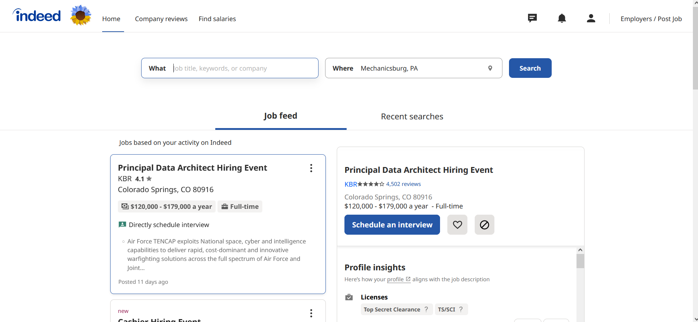
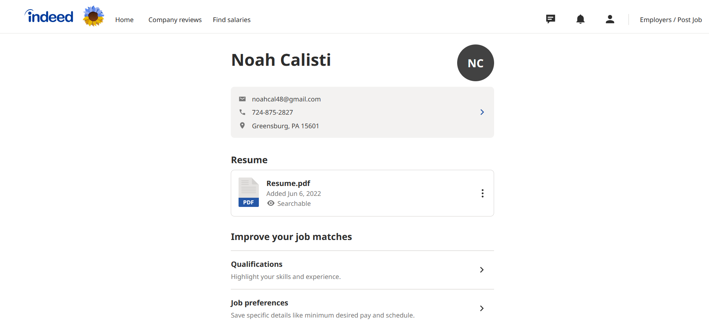
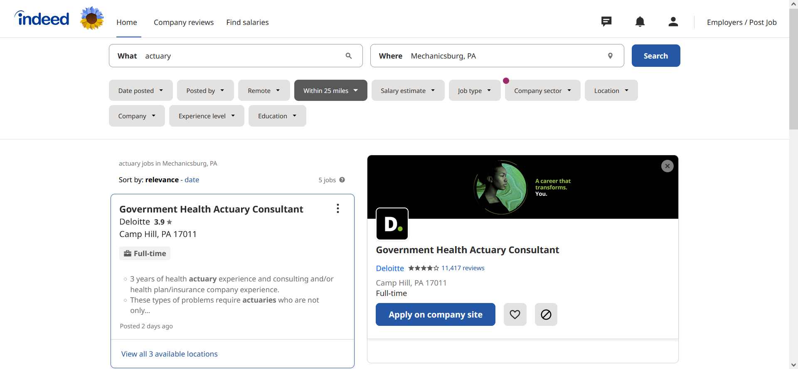
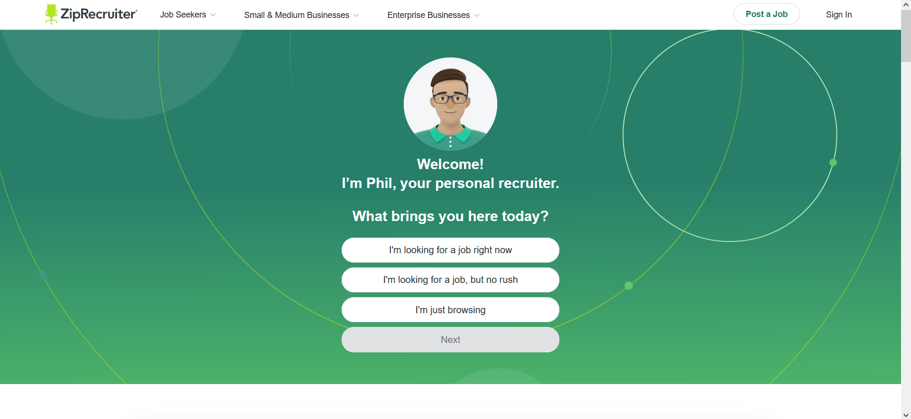
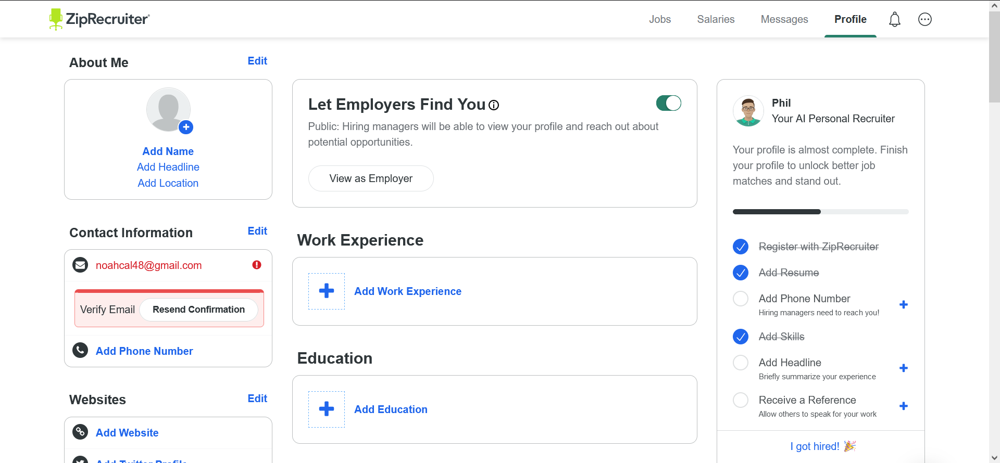

# Lab Report: UX/UI
___
**Course:** CIS 411, Spring 2021  
**Instructor(s):** [Trevor Bunch](https://github.com/trevordbunch)  
**Name:** Noah Calisti  
**GitHub Handle:** noahcal11  
**Repository:** [My Forked Repository](https://github.com/noahcal11/cis411_lab3_uiux.git)  
**Collaborators:**   
___

# Step 1: Confirm Lab Setup
- [ ] I have forked the repository and created my lab report
- [ ] If I'm collaborating on this project, I have included their handles on the report and confirm that my report is informed, but not copied from my collaborators.

# Step 2: Evaluate Online Job Search Sites

## 2.1 Summary
| Site | Score | Summary |
|---|---|---|
| Indeed | 19 | Indeed has a quality job search site. It was easy for me to navigate the website and find the exact kind of jobs I wanted. The company reviews and salaries tabs were not relevant to me but on a brief glance they also seemed like useful, unique options. |
| ZipRecruiter | 18 | ZipRecruiter surpassed my expectations. I was able to find a job almost as easily as Indeed. I had to scroll a bit more, but the AI "Phil" was a nice touch for users looking for direction. |

## 2.2 Indeed

The home page is simple and clean, almost too empty. I love the "What" and "Where" search bars in the upper middle of the page for a job search.

Updating my profile was easy. Indeed had places to add qualifications (skills, experience, etc.), update my job preferences, hide jobs with certain characteristics, and an option to let employers know I am available to work immediately.

It was relatively straightforward to search for a job. I searched from the home page and was given relevant jobs to apply to. I also had many options easily accessible to filter the jobs. Clicking on the job shows information to the right along with a large button to apply on the company site.

| Category | Grade (0-3) | Comments / Justification |
|---|---|---|
| 1. **Don't make me think:** How intuitive was this site? | 3 | The site was very accessible and intuitive. Everything I needed was one click away and clearly labeled. |
| 2. **Users are busy:** Did this site value your time?  | 3 | Like I said above, it took very few clicks to get anywhere important. The search bar on the home page was especially efficent. |
| 3. **Good billboard design:** Did this site make the important steps and information clear? How or how not? | 2 | For the most part, everything was clear. The profile button was small and hidden in the corner for such an important aspect of the platform. |
| 4. **Tell me what to do:** Did this site lead you towards a specific, opinionated path? | 2 | Indeed clearly wants me to search for a job first and foremost. It also offered suggestions on my profile. But it also displays many different options prominently. |
| 5. **Omit Words:** How careful was this site with its use of copy? | 3 | "What" and "Where" are as simple as it gets. Other options have simple names bolded with more description below it. |
| 6. **Navigation:** How effective was the workflow / navigation of the site? | 2 | There was a bit too much whitespace so I had to scroll a lot to get anywhere. Besides that, navigation was easy. |
| 7. **Accessibility:** How accessible is this site to a screen reader or a mouse-less interface? | 3 | I see no problems for either a screen reader or mouse-less interface. |
| **TOTAL** | 19 | Indeed might be the most well-known job search site, and it's for a reason. The site is efficient and intuitive to use and produces quality results. |

## 2.3 ZipRecruiter

ZipRecruiter's home page greeted me with "Phil", an AI personal recruiter designed to navigate me around the website.

I knew what I was doing, so I clicked "Sign In" and made an account with my gmail. It had me upload a resume and then gave me this screen. The checklist on the right was helpful to complete my profile.

| Category | Grade (0-3) | Comments / Justification |
|---|---|---|
| 1. **Don't make me think:** How intuitive was this site? | 3 | The site greeted me with the AI "Phil" who was designed to not make me think. Aside from Phil, the rest of the website was also intuitive to navigate |
| 2. **Users are busy:** Did this site value your time?  | 2 | I tried using Phil after making my profile and it was a bit slow and time consuming. The rest of the site was quick enough, but nothing remarkable. |
| 3. **Good billboard design:** Did this site make the important steps and information clear? How or how not? | 3 | Important or recommended steps were clearly highlighted for me. |
| 4. **Tell me what to do:** Did this site lead you towards a specific, opinionated path? | 3 | Through both Phil and site recommendations, I always had a clear "next thing to do". |
| 5. **Omit Words:** How careful was this site with its use of copy? | 3 | Everything was worded efficiently, there were no unnecessary blocks of text. |
| 6. **Navigation:** How effective was the workflow / navigation of the site? | 1 | As I said before, Phil was a bit time consuming to use. Otherwise, like Indeed, there was a lot of white space and I had to scroll a lot to get through a small amount of information. |
| 7. **Accessibility:** How accessible is this site to a screen reader or a mouse-less interface? | 3 | I see no issues with either of these. |
| **TOTAL** | 18 | ZipRecruiter impressed me more than I expected, but it was a little more time consuming and annoying to use than Indeed. |

# Step 3 Competitive Usability Test

## Step 3.1 Product Use Case

| Use Case #1 | |
|---|---|
| Title | Finding a Recipe |
| Description / Steps | The user is hungry and bold, deciding to try something new. They log into their account and search in the query "Grilled Reuben Sandwich". Recipe For Success will display a recipe along with its skill level (if the skill level is higher than the users, it will warn the user). The user will follow the directions and have the option of leaving a review, sharing the recipe, and taking a photo of their final product. |
| Primary Actor | User who is hungry and wants to try a new recipe. |
| Preconditions | User has an account and ingredients for desired recipe. |
| Postconditions | User is able to create the recipe. |

## Step 3.2 Identifier a competitive product

Competitor:
1. Whisk [https://whisk.com/](https://whisk.com/)
2. Tasty [tasty.co](tasty.co)

## Step 3.3 Write a Useability Test

| Step | Tasks | Notes |
|---|---|---|
| 1 | Access app | Access it  |
| 2 | Understand icons, navigation | Have user try to understand icons and what they are supposed to do |
| 3 | Explore User profile settings | Edit profile and explore all options  |
| 4 | Search for recipe, read instructions and comment on clarity/confusion | Ask user |

## Step 3.4 Observe User Interactions

| Step | Tasks | Observations |
|---|---|---|
| 1 | Access app | Second question (what's most important to you when cooking?) gave user some pause |
| 2 | Understand icons, navigation | Overwhelmed by home screen options & categories. Navigated through tabs relatively intutively. |
| 3 | Explore User profile settings | Vegetarian was the only dietary restriction option. |
| 4 | Search for recipe, read instructions and comment on clarity/confusion | Recipe was well structured and easy to understand. Ratings instead of tips would be nice. |

## Step 3.5 Findings
Organize your findings here.

# 4. Your UX Rule (Extra Credit)
If you opt to do extra credit, then include it here.