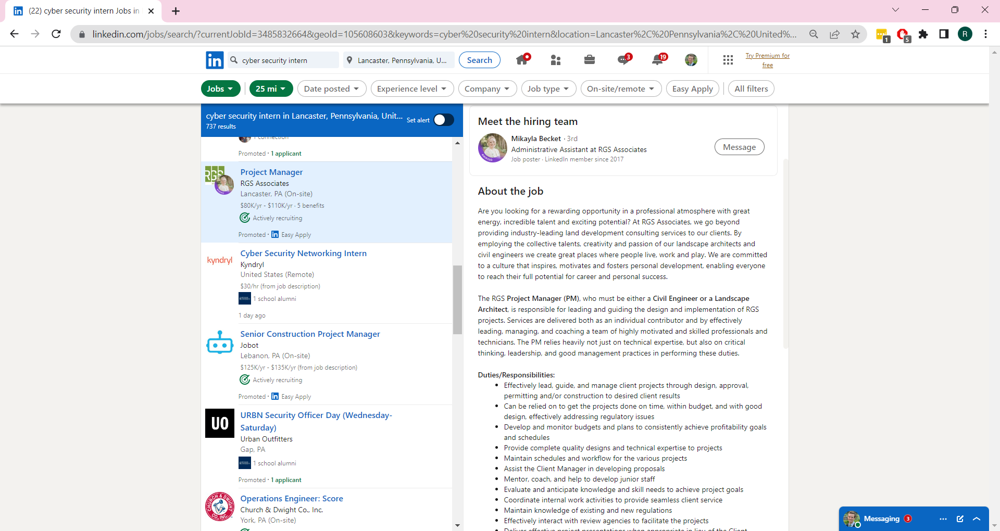

# Lab Report: UX/UI
___
**Course:** CIS 411, Spring 2021  
**Instructor(s):** [Trevor Bunch](https://github.com/trevordbunch)  
**Name:** Ray Truex  
**GitHub Handle:** rt1252  
**Repository:** [Your Forked Repository](https://github.com/rt1252/cis411_lab3_uiux)  
**Collaborators:**   [Grace Taylor](https://github.com/gracet712)
___

# Step 1: Confirm Lab Setup
- [x] I have forked the repository and created my lab report
- [x] If I'm collaborating on this project, I have included their handles on the report and confirm that my report is informed, but not copied from my collaborators.

# Step 2: Evaluate Online Job Search Sites

## 2.1 Summary
| Site | Score | Summary |
|---|---|---|
| Indeed| 18 | I really liked the website other than the fact that I was redirected to another website to actually apply. The website did not have many features other than those necessary to support a job board, so the users were forced to eventually search for jobs. There are not many ways to get lost since the website is so simple. |
| Linkedin | 15| Linkedin's plethora of features is their achilles heel for the user experience. They have many good features but the feed is very busy and has too much going on. The amount of unnecessary information on the home page could easily confuse users and prevent them from getting to their final destination.   Unfortunately after taking total points into consideration Linkedin got a lower score. However in my personal opinion not using the scores, Linkedin is the better site for applying to a job simply because of their easy apply feature. Indeed made me go to an external site with no job listings having the option to easy apply. The majority of Linkedin jobs did not have the easy option, but the fact that the feature exists and prevents the user from having to leave the website makes Linkedin the better website for applying to jobs. No need to go to an external careers website and make another account and resubmit all your information already on your account. |

## 2.2 Site 1 - Indeed
Note I already have an Indeed account.

I. Action 1: Create an account on the site and update your skills or preferred job interests.

1. Navigate to [Indeed homepage](https://www.indeed.com/).
   
2. Click the sign in button in the top right corner.
   
   The login page offers many SSO options, I have an indeed account by email which is autofilled by LastPass.
3. Click continue to be prompted for password.
   
   Pretty simple and intuitive, common username and password prompts.
4. I am brought to a new homepage now that I am logged in
   
   This page shows recommended jobs based on my preferences along with a job search bar.
5. To get to my profile to update my profile with additional skills I am going to click the user icon.
   
   Clicking the icon does not take me to a new page but shows me a list of options.
6. I am going to going to click the top option, profile.
   
   This page shows all of my information that I have previously added, along with options to change that information. 
7. I am going to click qualifications since it skills and experience which is what I want.

It does not look like I have actually added any information here, so lets add skills.
8. Click add skills.

The popup input field has two pieces of information to input, skill which is typed and years of experience which is a dropdown.
9. Click save.

I am brought back to the qualifications page where I will now add a certification to see if the process is any different.
10.   Click add certifications.

The popup input field is almost identical to that which we saw when adding skills. 
11.    Click save.

II. Action 2: Search for a job and take all the necessary steps right up to applying for the job.

1.  Navigate to the [Indeed homepage](https://www.indeed.com/) and insert my search query.

The search bar was very easy to find at the top of the page.
1.  Click search.

There are search result filter dropdowns that I could use to become more granular, however I am not picky and want to see what the initial results show.
1.  Scroll until I find an internship that I will like... it does not take much searching as there are only three results. I have a family friend that does IT for the Hershey company so I will choose the second option. 

There are two scroll bars, one to scroll through the search results and another scroll bar to view the job posting information. 
1. I use the scroll bar for the job listing to scroll until I can see relevant information like responsibilities, qualifications, and education.  

From here I can determine that I am qualified for this internship.
1. Click the blue apply on company site button, I am redirected to the [job on Hershey's career website](https://careers.thehersheycompany.com/job/Hershey-Intern-Cyber-Defense-%28Summer-2023%29-PA-17033/990496400/).

From here I can read the same information that I just read on Indeed, I also have the option to look for more jobs using the prominent search bar.
1. Click the purple apply now button.

The apply button shows me two ways to apply, I am going to select apply now without Linkedin because it always messes up the formatting and I end up having to retype everything anyway.
1. Click apply now without Linkedin. I am now brought to the Hershey career login page, I do not have an account so I will create one by clicking "create an account".

1. I autofill my information with LastPass.

1. I have to click the "read and accept the data privacy statement".

It does not look like it will force me to scroll to the bottom to click accept and I am lazy and do not feel like reading this so I will click accept.
1.  Click the accept blue button and then the create account blue button. I am presented with an email verification.

This step is confusing, as it says they sent me a one-time password even though they just asked me to set a password. It seems that this is more of an email verification check than a otp.
1.  I enter the one-time password and click continue. I am finally brought to an application page.

I am glad all the required application information is presented on one page, I hate when you have to click through multiple pages. There are also buttons to expand and collapse all sections which can make my application process easier. They also have nice easy to find save and apply buttons. 

| Category | Grade (0-3) | Comments / Justification |
|---|---|---|
| 1. **Don't make me think:** How intuitive was this site? |3|The Indeed website is incredibly simple, there was not a single moment where I was confused as to where to go next.|
| 2. **Users are busy:** Did this site value your time?  |1|The Indeed website got me to my destination very quickly, the problem is that all Indeed is a complied job board site that redirects me to another website where I have to create an account all over again. This is typically for job applications but it would be nicer if I never had to leave Indeed's website.|
| 3. **Good billboard design:** Did this site make the important steps and information clear? How or how not? |3| The Indeed website definitely had a visual hierarchy, you could tell what was the most important, you did not even need an account to search for jobs. The areas were very nicely broken up into smaller sections, for example accessing my profile and making changes could have been very complex but it was made easy with nice buttons. The colors of the buttons also help indicate what was the most important. |
| 4. **Tell me what to do:** Did this site lead you towards a specific, opinionated path? |3|There was not a single time were I was annoyed because I did not know where to navigate to next. The websites main goal was to clearly get me to search for a job. This was made clear by the prevalence of the job search bar.|
| 5. **Omit Words:** How careful was this site with its use of copy? |3|This was honestly what the website did best. It made everything else so easy to navigate and find because there was not tons of junk on the page. The pages were so minimalistic that there is no way that you could not get confused about what a page's purpose is.|
| 6. **Navigation:** How effective was the workflow / navigation of the site? |3|The navigation/workflow of the website was so simple, most internet proficient users would have absolutely no problem using this site. From the homepage once signed in you had a few options. In the top left you have discover jobs (what most people come to use), company reviews, and find salaries. In the top left side you had a messaging bubble to view messages, a bell icon to show any notifications, and a user icon to display profile options. This layout could not get not get any simpler.  |
| 7. **Accessibility:** How accessible is this site to a screen reader or a mouse-less interface? |2|This category is a little more difficult for me to score as I am not super knowledgeable in the realm of accessibility. I did not notice any accessibility icons on the page (typically the person with their arms out in a circle), they did have a footer about their accessibility policy. The policy says that their website follows the WCAG standards. However, the only accessibility technology that I see that they support are third party tools and extensions. I also assume that the double scroll bar when searching for jobs could be problematic for certain users.  |
| **TOTAL** |18|  |

## 2.3 Site 2 - Linkedin
Note I already have an Indeed account.

I. Action 1: Create an account on the site and update your skills or preferred job interests.

1. Navigate to [Linkedin homepage](https://www.linkedin.com/home).

My credentials are autofilled by LastPass again, I will click the sign in button.
2. I am brought to my "feed".

Linkedin has a few more social networking features than Indeed, so I am presented with quite a few more options. The home page is a lot more crowded than on Indeed. I do not think this is a bad thing since Indeed has more functionality, just worth noting.
3. To get to my profile to update my profile with additional skills I am going to click the me button that has an image of my profile picture.

This is very similar to the Indeed profile button, it shows a dropdown of options that I have. I really am not sure here where to go to update my skills/experience. I am not 100% sure where to go next, I am going to try clicking view profile.
4. Okay I was right, clicking view profile was the correct option. I am presented with my profile, I will scroll down until I find my experience, education, certifications, and skills.

Note, I have zoomed out to be able to show what the education, certifications, and skills look like.
5. I am going to add a new skill but before I do, I am going to click the show all skills button so I do not accidentally readd a skill that I already have. 

This shows a nice clean listing of all the skills that I have already added sorted chronologically by experience.
6. Click the plus button in the top right corner of the skills section.

After typing in the skill that I want to add there are dropdowns that I can click, I am going to click the top one in hopes that by clicking the listing some more information will be autofilled. 
7. Click the first option from the dropdown.

From here I am given checkboxes where I can select that I learned how to use a skill. I will select the top option since I learned the platform in my current role, I will also select Messiah University. 
8. Click the blue save button in the bottom right corner.

I am presented with this nice message saying that my skill has been added with the option to add more skills. I am not interested in adding more.
9. Click no thanks.

Great the skill has been added and it shows up at the top since it was added most recently. It shows that I used the skill while working as a Cyber Security Operations Center Team Lead at Messiah University along with Messiah University. I know that I chose to select Messiah University since I have used it for both my internship and work study, however this is a bit confusing as it looks like I have Messiah University twice.

II. Action 2: Search for a job and take all the necessary steps right up to applying for the job.

1.  Navigate to the [Linkedin homepage](https://www.linkedin.com/feed/).

I can very easily locate the jobs button on the top menu bar from the homepage.
2. Click jobs.

There are so many more options here than Indeed. Indeed did force me to enter a keyword before displaying any options, Linkedin seems to know me better as it already provides me recommendations without having to enter a search query. I am going to scroll for a little to see what the rest of the page looks like.
3. Scroll down the jobs page.

Here I can see people in my network that I might have a foot in the door with since we are in each other networks along with more jobs for me. This seems to be an endless list that keeps finding results as I keep scrolling. I do not see any internships, Linkedin seems to think I should be a director already. So I will scroll back up to the top and use the search bar.
4. Enter search query using the search bar. 

This worked better than I thought, I was afraid that the search bar would be thinking that I wanted to search my network for people or companies, but since I am on the job page it understands that I want to look for jobs. After I start typing in the keyword search bar the location search bar appears. Both had dropdowns to show suggestions, I clicked the suggestions from the dropdown and the search automatically completes, I do not have to click enter or press a button.
5. View the search results

The search results are plentiful but are not as accurate as Indeed's results were. Almost all of the results are not for internships and there are some jobs for security guards. I will scroll down the page until I find a listing I like.
6. EASY APPLY! 
   
   

   As I am scrolling through the results I find a job listing that say easy apply, this is exactly what I was saying that I wish Indeed had. Unfortunately the majority of the jobs choose not to use the Linkedin easy apply feature. I do not want to actually apply for this job as I am not qualified at all and do not want to be contacted by their HR (but let's be real they would ghost me anyways). With that being said hopefully this button will have a confirmation screen.

7. Review the job listing information. 

The job listing shows me much more than Indeed did, I can seethe typical job information such as responsibilities, benefits, and pay. In addition, I can also see the hiring team and if I scroll down more I can see information about the company and I can view the company profile. One of the problems that I had with Indeed was the double scroll bar. Linkedin also has a double scroll bar, however this is not a scroll bar within a scroll barm in this case the job results are their own scroll bar and the job information is a separate scroll bar. The separated double scroll bar is much easier to use. 
1. Click the easy apply button.

   Okay luckily the application was not a one click submit button as I did not actually want to apply, not that a one click button would not be nice. The easy apply process has a very nice progress bar at the top currently at 0% hopefully it moves along quickly as it is called easy apply.
1. Click next and upload resume. 

Good time to recheck my resume and remember to change it to a PDF. Progress moved to 33% so hopefully only two more pages.
1.  Click next and complete screener questions.

Pretty nice looking user interface to quickly select or type answers.
1.  Click review and quickly discard before I accidentally submit!

I can see my information as a summary here, if I need to change anything I can click the edit buttons. I may have skewed my results choosing to use this instead of the traditional method of jumping to an external career website for the specific company but this process was quick and amazing.

| Category | Grade (0-3) | Comments / Justification |
|---|---|---|
| 1. **Don't make me think:** How intuitive was this site? |3|I did not have to think about how to use the Linkedin website, editing my profile was a little harder to navigate to than applying for jobs. However both tasks were very simple and required minimal brainpower.|
| 2. **Users are busy:** Did this site value your time?  |3|I was able to complete the needed  tasks in a matter of minutes, I was not spending time trying to figure out the website. The processes to do these actions were very easy.|
| 3. **Good billboard design:** Did this site make the important steps and information clear? How or how not? |1|I am going to deduct some points in this category because the landing page that shows the feed is very busy and reminded me of the busy billboard picture seen in class. If I was a new user I imaging that the feed page would overwhelm me and I would become distracted by trying to figure out what everything does. The fact that the messages bar also automatically expanded when I landed on the feed page also made things extra busy. In addition there is so much unnecessary information such as profile stats, recent groups, and all groups on the left navigation bar. There is also news and advertisements on the right side which is covered by the auto-expanded messaging bar, just too much going on the left and right sides of the screen.|
| 4. **Tell me what to do:** Did this site lead you towards a specific, opinionated path? |1|I would not say that Linkedin made me take a specific path. This is understandable as the company is much more than just a job board, they are also a networking and social media website. I would not say I was directed to a specific path as there are so many different things to do. |
| 5. **Omit Words:** How careful was this site with its use of copy? |2|There are a few too many words on the webpage especially  on the left side of my feed it shows my profile statistics, recent groups, and my groups. There is a little too much information in this area.|
| 6. **Navigation:** How effective was the workflow / navigation of the site? |3|Even though I said that there is a lot going on in the Feed section of the page. I was still able to complete the two necessary tasks very easily. I could tell exactly where to go using the navigation bars at the top. The most common options were very easy to find and use.|
| 7. **Accessibility:** How accessible is this site to a screen reader or a mouse-less interface|2|As noted before, I am no accessibility expert. Linkedin had their accessibility policy linked in their footer as well. They also follow the WCAG standards. They also appear to support a third party assistive reader called 'be my eyes'. In addition they have a whole ticketing/helpdesk system dedicated to accessibility needs where they say they will contact you and help you through any problems if you need accommodations. The double scroll bar did not appear to be a problem on Linkedin's website|
| **TOTAL** |15||

# Step 3 Competitive Usability Test

## Step 3.1 Product Use Case

| Use Case #1 | |
|---|---|
| Title |User selects museum exhibit |
| Description / Steps |1. User scans QR code or uses dropdowns to find the exhibit they are looking for.   2. User is brought to the exhibit content page which displays relevant information such as information, pictures, and audio. |
| Primary Actor |Museum attendees with smartphones. |
| Preconditions |Reliable internet connection. |
| Postconditions |NA |

## Step 3.2 Identifier a competitive product

List of Competitors
1. Competitor 1: [PocketSights](https://pocketsights.com/)
2. Competitor 2: [Gettysburg Battle Auto Tour](https://apps.apple.com/us/app/gettysburg-battle-auto-tour/id1505770574)

## Step 3.3 Write a Useability Test

| Step | Tasks | Notes |
|---|---|---|
| 1 |User starts on homepage of an attraction within the application.|Pipestone Commercial Historic District for PocketSights. (see image below)   Gettysburg for Gettysburg Battle Auto Tour. (see image below)|
| 2 |User is provided with a specific exhibit name and is told to navigate to that location/exhibit. They are also told to use standard tour mode not virtual tour mode.|Calumet Inn for Pipestone Commercial Historic District. Virginia Monument for Gettysburg.  |
| 3 |User is told to explore the location/exhibit and comment on what they expected vs what they see along with any other likes or dislikes.   |   |

## Step 3.4 Observe User Interactions

I had my friend Xander Smith try to complete the usability tests.

Pipestone Commercial Historic District - navigate to Calumet Inn: 
[View the screen recording here (no audio)](https://www.youtube.com/shorts/EFGx5NPBiu8)

| Step | Tasks | Observations |
|---|---|---|
|1|The user was instructed to do standard tour mode and locate Calumet Inn.|The user was expecting the prompts to select standard tour.|
|2|The user closed the location services popup.|The user was not expecting the popup but easily closed it.|
|3|The user waited for the map to auto-zoom into the tour location.|The user was not expecting this but waited patiently. They noted that it was a pleasant surprise.|
|4|The user then started clicking through the map pins one by one.|Interestingly enough the user thought the most effective way to find the Inn was by clicking the green pins with location one by one. The user did not attempt to click any options such as skip which would have made the process quicker.|
|5|The user clicked through the pins and continue tour before they eventually ended at Calumet Inn.|The user was successful at getting to the end location. The user was not really frustrated about how slow the experience was, even though there was no dropdown menu they did not attempt to look for one.|

Gettysburg for Gettysburg Battle Auto Tour - navigate to Virginia Monument: 
[View the screen recording here (no audio)](https://youtube.com/shorts/MQba7tBQZHI?feature=share)
| Step | Tasks | Observations |
|---|---|---|
| 1 |The user was instructed to do the demo tour and locate Virginia Monument. ||
| 2 |The user pressed the start button. They quickly pressed the screen again, accidentally clicking the map on the screen.|The user became frustrated with having to click exactly on the play button for the tour which caused them to misclick on the map.|
|3|The user started listening to the audio for the start page.| The user listened to the audio for a little before choosing to click the next button.|
|4|The user then waited a few seconds on the next page for a few seconds. Then they started pressing the next button on the bottom right corner.|Interestingly enough again the user did not choose to even look to press the map/list button.|
|5|The user successfully landed on the Virginia Monument page where they were able to press the page button to read about the location they are at.|The user was once again successful at reaching the end location. The user did express that this tour was not as good as the last one due to not showing the map pins by default.|

## Step 3.5 Findings
- Provide at least 3 improvements you believe could be made to the usability of the workflow in question.
  - The workflow could have been improved by both apps having the option to have a dropdown menu for the locations/attractions.
  - The workflow could have been improved on the Gettysburg app by not having to click in specific locations, such as a certain play button, the whole image should be clickable.
  - The application should start on a dropdown menu of locations or a map, not the first potential location (what if users tour the exhibits out of order).
- Outline at least 2 experiences in the workflow that you believe were of benefit to the user.
  - The map pins on the PocketSights - Pipestone tour were of extreme benefit for the user in reaching the desired location. 
  - The next button on the Gettysburg tour app were not the best option to achieve the desired outcome but they worked for the user.
- What do you believe your team did well in conducting the usability test?
  - The instructions were very clear to the tester, the tester did not have any problem understanding what to do.
- What could your team improve for next time (hint: there will be a next time)?
  - The user should have been better instructed to think out loud and to provide more comments about their feelings. 
- Offer a brief statement (no more than several sentences) about your experience conducting a usability test.
  - The usability test went well, the user was able to accomplish the tasks without any help from the moderators. The test should have been improved by recording audio.

# 4. Your UX Rule (Extra Credit)
<h2>"Design for your users, not for your ego."</h2>

It is important to remember that the end users are the people who will be using your website. Do not follow your own preferences but follow the data (data over feelings) of what users will prefer. Keep the users needs in mind, it is important to create an easy, enjoyable, and effective user experience. Do not design with your ego, designing with your ego might lead to a product that you think is aesthetically pleasing to yourself, but maybe not to your users. Keep in mind the end goals that the users are the reason that they have hired you.