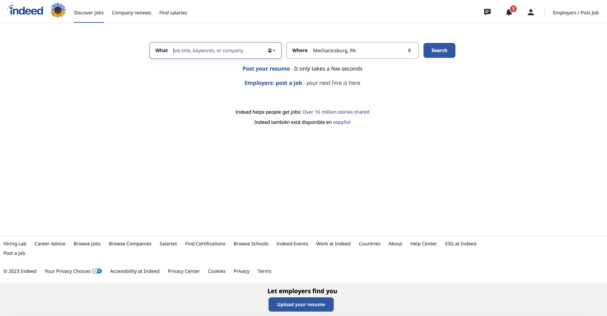

# Lab Report: UX/UI
___
**Course:** CIS 411, Spring 2023  
**Instructor(s):** [Trevor Bunch](https://github.com/trevordbunch)  
**Name:** Tim Kratz  
**GitHub Handle:** timkratz 
**Repository:** https://github.com/timkratz/cis411_lab3_uiux.git 
**Collaborators:** Collaborated with m-shoul, Sturty75, jp1478, BenOfTheOneRing, and R-B1509
___

# Step 1: Confirm Lab Setup
- [x] I have forked the repository and created my lab report
- [x] If I'm collaborating on this project, I have included their handles on the report and confirm that my report is informed, but not copied from my collaborators.

# Step 2: Evaluate Online Job Search Sites

## 2.1 Summary
| Site | Score | Summary |
|---|---|---|
| LinkedIn | 20 | This was a site that was extremely easy to navigate and very simple to use. There were basically no problems that I ran into while navigating through the site and I think it is very effective. Everything that I was looking for was in the correct spot that made it easy to find and it was not too cluttered and hard to figure out.  |
| Indeed | 17 | This was a site that I found somewhat easy to navigate but ran into a few problems when searching for jobs. Nothing was a major inconvenince but there are aspects to the site that could be improved for a better experience. Even still, this is a site that does a pretty good job and works well |

## 2.2 Site 1: LinkedIn
(Updating Skill)

My account was created before this assignment. This is the sign in page


Once you sign in you are directed to the home page


If you click on the tab that says "me" and then the "view profile" tab you will be directed to my profile


This is my account profile page


When you click on the "add profile section" it brings up different options to add to your profile. I then selected "add skills".


This is the add skills page


To add a skill you can search or type for one and then also select areas where you can apply this skill

(Looking For Job)

To look for a job you click on the "jobs" tab


After you search and find a job this is what comes up


When you click on the apply button it directs you to the application of the job that you are applying for and all you have to do is click on apply now to start the application


| Category | Grade (0-3) | Comments / Justification |
|---|---|---|
| 1. **Don't make me think:** How intuitive was this site? |3   |    This is a site that I feel is very intuitive and easy to use. It is very easy to navigate and I do not have to think at all while trying to add skills and look for jobs on this site due to its simple design|
| 2. **Users are busy:** Did this site value your time?  |3   |   This was a site that valued my time by making everything quick to find and access. Everything was to the point and there was not many things to click through to get to where I needed to go. |
| 3. **Good billboard design:** Did this site make the important steps and information clear? How or how not? |3   |   This website does a very good job at making the important steps and information clear by making them pop out on the site. They are easy to identify and read and tell you exactly what they are going to do. |
| 4. **Tell me what to do:** Did this site lead you towards a specific, opinionated path? |   2|   The site tried pointing me in the right direction by assisting with next steps and things to do in order to get my account ready. There are points where it may be a little bit confusing for first time users. |
| 5. **Omit Words:** How careful was this site with its use of copy? |3   |   This site did a great job at maing sure words are not excessive and they are to the point.|
| 6. **Navigation:** How effective was the workflow / navigation of the site? |3   |   Navigation was quick and easy to use. Anything you are looking for is where you figure it would be on the website and is not something you need to spend time figuring out where it is.|
| 7. **Accessibility:** How accessible is this site to a screen reader or a mouse-less interface? |3   |   They have an app that is very simple to use if you are trying to access the site using a mouse-less interface|
| **TOTAL** |20   |   |

## 2.3 Site 2: Indeed
(Updating Skill)

This is what shows up when you first go on Indeed


When you click "sign in" you are taken to this page in which it asks for your email


You are then asked to select if you are either a job seker or employer


This page asks for you to create a password


You are then directed back to the homepage after your account has been created


By clicking the person icon at the top of the page you are then able to click on "profile" to be taken to your profile


Once you are on your profile there is an option to "add skill"

(Looking For Job)

From the homepage or by selecting "discover jobs" you are able to search and look for jobs


This is what shows up once you look up jobs. You then can select "apply on company site" when you find a job you are interested in and it will take you to that companies site


This is the application site that you are taken to in this scenario and in order to apply for this job all you have to do is click on "apply now" to start
| Category | Grade (0-3) | Comments / Justification |
|---|---|---|
| 1. **Don't make me think:** How intuitive was this site? |2   |   There were aspects of this site that were easy to use such as the sign up process, but when looking for jobs I found that it did not always find me similar jobs to what I was looking for.|
| 2. **Users are busy:** Did this site value your time?  |3   |   It was relatively quick to navigate the site and everything that I was expecting was where I thought it would be |
| 3. **Good billboard design:** Did this site make the important steps and information clear? How or how not? |2   |   When signing up I felt the important steps were made clear but once on the site itself I found it sometimes difficult to figure out the important parts to add to my account. |
| 4. **Tell me what to do:** Did this site lead you towards a specific, opinionated path? |2   |   The site tried pointing me in the right direction by making looking up jobs easy but the results and navigating were not always the best which caused some issues along the way|
| 5. **Omit Words:** How careful was this site with its use of copy? |3   |   This site does a good job at limiting the amount of words on each page and keeping it simple|
| 6. **Navigation:** How effective was the workflow / navigation of the site? |2   |   The navigation was fairly simple and easy to figure most of it out but there were a few things such as user profile that took me a little bit to discover|
| 7. **Accessibility:** How accessible is this site to a screen reader or a mouse-less interface? |   3|   I have never used the app, but they have one that is said to work well.|
| **TOTAL** |17   |   |


# Step 3 Competitive Usability Test

## Step 3.1 Product Use Case

| Use Case #1 | |
|---|---|
| Title | Listing an item|
| Description / Steps | 1. The user clicks on the ```sell``` button. <br> 2. The user selects the type of item they want to sell from a list of categories <br> 3. The user uploads photos of items they want to sell <br> 4. The user will add a title, description, and a price of the item they want to sell. <br> 5. The user reviews the listing and clicks ```post``` to make the item visible to other users. |
| Primary Actor | Messiah Student|
| Preconditions | 1. Have a Messiah authenticated account <br> 2. The user must be logged into the app <br> 3. The user must have an item to list with a photo and description to go along. |
| Postconditions | The user will have an item listed to sell|

## Step 3.2 Identifier a competitive product

List of Competitors
1. Competitor 1 [Facebook Marketplace](https://www.facebook.com/marketplace/)
2. Competitor 2 [Craigslist](https://harrisburg.craigslist.org)

## Step 3.3 Write a Useability Test

| Step | Tasks | Notes |
|---|---|---|
| 1 | Navigate to Facebook Marketplace  |   |
| 2 | Log in or create an account  |   |
| 3 | Find a lawn mower to purchase  |   |
| 4 | Save the listing they are interested in  |   |
| 5 | Go back to the home page  |   |
| 6 | Navigate to the listing they just saved  |   |

## Step 3.4 Observe User Interactions

| Step | Tasks | Observations |
|---|---|---|
| 1 | Navigate to Facebook Marketplace  |   The user was able to navigate to facebook marketplace with no issues by simply searching "facebook marketplace" on the internet|
| 2 | Log in or create an account  |   User already had a Facebook account and simply logged in by clicking on the "log in" button and putting in their username and password|
| 3 | Find a lawn mower to purchase  |   The user searched up "lawn mower" in the search bar and when this was searched many lawn mowers that were being sold came up. The user was very easily able to scroll through the options until they found one they were interested in. To get more information about the listing they simply clicked on the image of the item.|
| 4 | Save the listing they are interested in  |   The user was easily able to find the "save" button on the page in order to save the listing that they were interested in and there were no issues in figuring out how to do this|
| 5 | Go back to the home page  |   When trying to navigate back to the home page the user had a little bit of struggle. They first were looking around for where to click and then finally settled on clicking the facebook icon. When they clicked this it took them to the main facebook home page and not the facebook marketplace homepage. After this they were able to figure out that they could get to the Facebook Marketplace homepage by clicking on one of the tabs at the top of the page.|
| 6 | Navigate to the listing they just saved  |   There was a lot of struggle when trying to navigate to the listing that they just saved. The user was looking around the page for a few minutes before they finally found out where this was. It was something that was frustrating for them and was not an easy task for them to accomplish.  |

## Step 3.5 Findings
- One improvement that could help to benifit the workflow would be to add keywords to go along with the tabs at the top of the page. Without these words and just pictures it can be hard to figure out where you are being taken.
- Another improvement that could help to benifit the workflow would be to make the saved listing button more visible and easier to find 
- Another improvement that could help to benefit the workflow would be to make who you are buying the item from more clear and easy to spot
- The search bar made it very easy to understand and search for items you are looking for
- The login process was easy to figure out and understand
- I believe that our team did well at coming up with the main tasks that are required in order to accomplish the main goal
- For next time we could add more detail to the tasks and not use as simple ones
- Overall, I had a good experience conducting the usability test and it was something that opened my eyes to how sites are used. I thought that this was a very useful exercise. 
