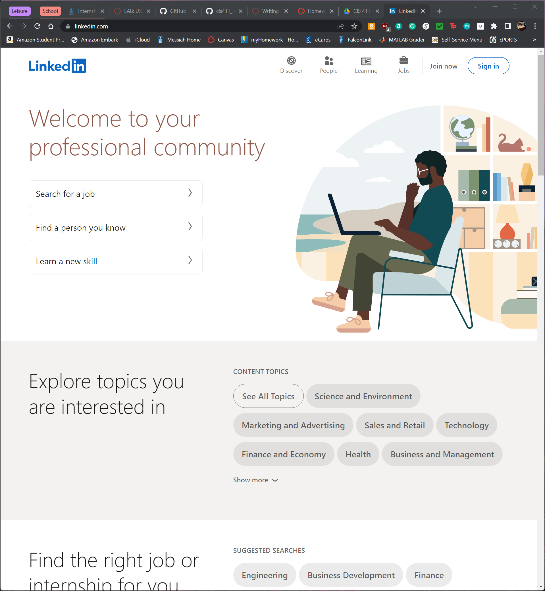

# Lab Report: UX/UI
___
**Course:** CIS 411, Spring 2021  
**Instructor(s):** [Trevor Bunch](https://github.com/trevordbunch)  
**Name:** Timothy Lee 
**GitHub Handle:** timothymlee 
**Repository:** [Forked Repository](https://github.com/timothymlee/cis411_lab3_uiux)  
**Collaborators:** Ammanuel Tamrat(AmmanuelT), Isaac Ho(Isaachhm), Reid Burger(ReidBurger), Thomas McVey(ThomasMcVey)
___

# Step 1: Confirm Lab Setup
- [x] I have forked the repository and created my lab report
- [x] If I'm collaborating on this project, I have included their handles on the report and confirm that my report is informed, but not copied from my collaborators.

# Step 2: Evaluate Online Job Search Sites

## 2.1 Summary
| Site | Score | Summary |
|---|---|---|
| LinkedIn | 19 | LinkedIn had an easy to understand format with clear paths for users to follow to complete an action. The layout of the page could possibly be improved for screen readers and by removing unnecessary content such as ads for premium memberships and reviews. |
| Glassdoor | 14 | Glassdoor had a similar layout to LinkedIn but had a lot more clutter. It was harder to follow due to certain tabs not bringing up the expected page and having a lot of extra content not related to the search. |

## 2.2 Site 1: LinkedIn
### LinkedIn Home Screen
 
The home screen in pretty standard. The "Sign in" page is in the expected location and is made clear with a different color.

### LinkedIn Login Screen
 
The "Sign in" page is, again, pretty standard. Clear path shown on page.

### LinkedIn User Home Screen
 
The social media feed is, again, standard and what is expected. The tabs across the top are clear. I don't like the "Messaging" tab popping up on its own and covering the screen.

### LinkedIn Job Page
 
The jobs page is what I have learned is standard across many websites. I like that everything is seperated into blocks, but don't like the ads. I would have a search bar centered instead of at the top of the page for easier use of that.

### LinkedIn Job Search Results
 
The formatting of the search results is nice. The filter options are clear but out of the way and only information relevant to the selected job is shown on the right, while options are shown on the left.
 
| Category | Grade (0-3) | Comments / Justification |
|---|---|---|
| 1. **Don't make me think:** How intuitive was this site? | 3 | Everything was clearly labeled and the labels took the user to the expected page. |
| 2. **Users are busy:** Did this site value your time?  | 3 | Navigation was clear and easy with a lot of suggestions to guide user quickly to desired pages. |
| 3. **Good billboard design:** Did this site make the important steps and information clear? How or how not? | 3 | Information is formatted clearly with large buttons, often highlighted, to direct user on next steps. |
| 4. **Tell me what to do:** Did this site lead you towards a specific, opinionated path? | 3 | The website highlighted the current section of the website the user is looking at. |
| 5. **Omit Words:** How careful was this site with its use of copy? | 2 | There were lots of extra things on the page that distracted the user from the desired content like ads and requests for reviews. |
| 6. **Navigation:** How effective was the workflow / navigation of the site? | 3 | Work flow was very clear with highlighting of current section of website. |
| 7. **Accessibility:** How accessible is this site to a screen reader or a mouse-less interface? | 2 | Works fine on the phone but they layout seems like it could cause screen reader issues. |
| **TOTAL** | 19 |   |

## 2.3 Site 2: Glassdoor
### Glassdoor Home Screen

The home screen in pretty standard. The Sign in page is in the expected location and is made clear with a different color. I don't like the really large "Sign-Up" part in the middle as a returning user.

### Glassdoor User Home Screen

The user home page is pretty boring but gets the job done. The tabs are clear but the content in the middle of the page isn't helpful.

### Glassdoor Job Page

The job page is not my favorite. It took me a while to figure out how to search for the job, as I was expecting options to immediately show up when I clicked on "Jobs."

### Glassdoor Search Results

I do not like this search engine-esk design that Glassdoor uses. It leads to a lot of information that I don't care about as I search for a job. The irrelevent information is something I would use Google to find instead of Glassdoor. Also, their search suggestions were not helpful.

### Glassdoor Job Search Results

The formatting of the search results is nice. The filter options are clear but out of the way and only information relevant to the selected job is shown on the right, while options are shown on the left. It looks almost identical to LinkedIn but has some nice large graphics like the "Average Base Salary Estimate."

| Category | Grade (0-3) | Comments / Justification |
|---|---|---|
| 1. **Don't make me think:** How intuitive was this site? | 2 | Everything was clearly labeled but some labels took the user to an unexpected page. |
| 2. **Users are busy:** Did this site value your time?  | 1 | The search result for the job search had a lot of irrelevant information that limited search results. |
| 3. **Good billboard design:** Did this site make the important steps and information clear? How or how not? | 2 | Home page had a lot of suggestions after first use for relevant information. |
| 4. **Tell me what to do:** Did this site lead you towards a specific, opinionated path? | 3 | The website highlighted the current section of the website the user is looking at. |
| 5. **Omit Words:** How careful was this site with its use of copy? | 2 | Search suggestions were not really suggestions but categorie selections. |
| 6. **Navigation:** How effective was the workflow / navigation of the site? | 2 | As stated previous, some labels took the user to an unexpected page, but it was mostly clear. |
| 7. **Accessibility:** How accessible is this site to a screen reader or a mouse-less interface? | 2 | Works fine on the phone but they layout seems like it could cause screen reader issues. |
| **TOTAL** | 14 |   |

# Step 3 Competitive Usability Test

## Step 3.1 Product Use Case

| Use Case #1 | Finding the Campus Map |
|---|---|
| Title | User must find the Campus Map |
| Description / Steps | <ol><li>User opens app</li> <li>User is authenticated via biometrics or their password</li><li>User selects "Campus Map" tab</li></ol> |
| Primary Actor | Messiah University Student |
| Preconditions | <ol><li>User must be a student at Messiah University.</li><li>App must be downloaded onto device.</li></ol>|
| Postconditions | <ol><li>The system brings up the campus map.</li><li>The system gives the option to return to the home page.</li></ol> |

## Step 3.2 Identifier a competitive product

List of Competitors
1. [Falcon Link](https://falconlink.webapps.messiah.edu/)
2. [Messiah Website](https://www.messiah.edu)

## Step 3.3 Write a Useability Test

| Step | Tasks | Notes |
|---|---|---|
| 1 | Open [Messiah Website](https://www.messiah.edu) | There are 85 different links that the user could possibly click on on this page. |
| 2 | Find the "Campus Map" | Users can use the search bar or navigate through the pages |
| 3 | Open the correct page | [Campus Map](https://tour.messiah.edu/campus-map/) |

## Step 3.4 Observe User Interactions

| Step | Tasks | Observations |
|---|---|---|
| 1 | Opened Messiah Website | There were lots of icons that the user didn't even bother to look at. |
| 2 | Clicked on "Visit Campus" | Icon looked like a map. User expected a map option to be available. |
| 3 | Clicked on "Virtual Tour" | User though a interactive map would be available to see different parts of campus. |
| 4 | Returned to previous page | Page brought up was not what was expected and as such the user clicked back. |
| 5 | User clicked on menu bar, went to "about" tab, then "Our Campus" subtab. | Link seemed hidden through multiple clicks. |
| 6 | User scrolled down and clicked on "Campus Map." | User had to scroll to bottom of page. |
| 7 | User sees the map and interacts with it. | User doesn't like that the map shifts view while moving around the camera to different zoom levels and the cartoon-ish view. There is also no compass for orientation. The map also does not have a lot of names that are commonly used by Messiah students (North Complex, Fish Bowl vs. Fishbowl). |

## Step 3.5 Findings

### Improvements
<ul>
<li>Icons should better reflect the pages their direct to (a picture of a map should lead to, or close to, a map).</li>
<li>The map could be better designed for mobile users. Currently all actions use two fingers can zooming can often occur when only moving was intended.</li>
<li>Having the sidebar show up in a different format on mobile could have made navigation easier than locating it at the bottom of the page.</li>
</ul>

### Positive Experiences
<ul>
<li>Having the menu bar on the top tab always accessible was helpful to relocate the user.</li>
<li>Large icons on the initial loading of the screen was useful for quick navigation.</li>
</ul>

### Team Usability Testing
The team did a good job in selecting a user who did not already know the path to the end goal. We think we gave clear enough instructions to make the user know what we wanted without giving away how the process. 

### Improvement for Future
I think in the future, having more users perform the test would be more helpful. Having many different uers from different backgrounds could help better tailor the expereince for all users.

### Expereience
I think the useability test was helpful. I often use Google to navigate to where I want to go instead of going through a webpage so it was eye-opening to see how difficult it can be to navigate through unfamiliar apps and websites. I think conistency across websites and familiar patterns is also really helpful for users to navigate a website.

# 4. Your UX Rule (Extra Credit)
If you opt to do extra credit, then include it here.