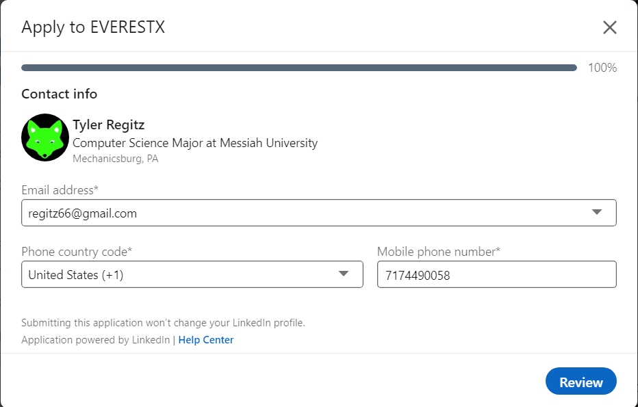
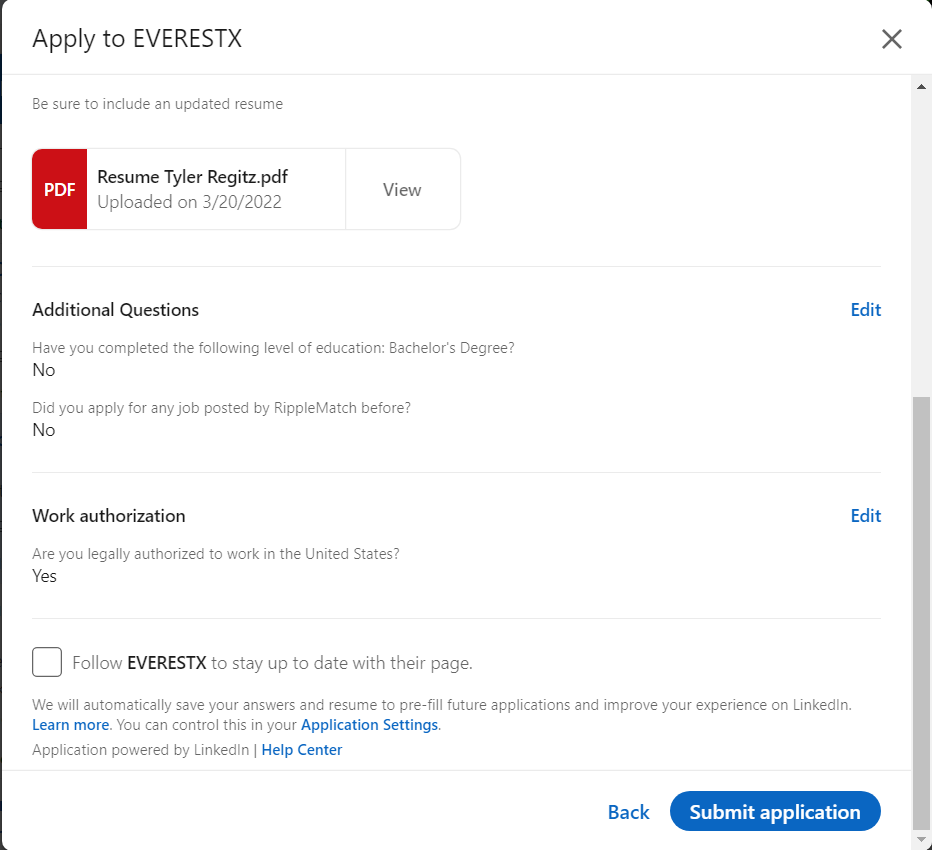

# Lab Report: UX/UI
___
**Course:** CIS 411, Spring 2021  
**Instructor(s):** [Trevor Bunch](https://github.com/trevordbunch)  
**Name:** Your Name  
**GitHub Handle:** Your GitHub Handle  
**Repository:** Your Forked Repository  
**Collaborators:**   
___

# Step 1: Confirm Lab Setup
- [ ] I have forked the repository and created my lab report
- [ ] If I'm collaborating on this project, I have included their handles on the report and confirm that my report is informed, but not copied from my collaborators.

# Step 2: Evaluate Online Job Search Sites

## 2.1 Summary
| Site | Score | Summary |
|---|---|---|
| Site 1 | 19 | Linkedin is a great job search website with an easy to use profile editor and great site navigation. The use of color to highlight important buttons made the task of finding where to go easy. The sites use of pop up windows for edits is nice on a computer sceen but can crowding on a phone screen. |
| Site 2 | 15 | Indeed is a good site for finding a job to apply for but not for applying to the job on that site. There was not an easy way to update my profile on this site. |

## 2.2 Site 1 Linkedin
I have already made a profile on Linkedin

$~$

 
To get to my profile it is two clicks, but the button is very easy to see because it is in a different color.

$~$

 
There is a small + button to add new skills and job experiances. Skills are simple to add with suggestions based off of your profile and the option to add new skills with user input. With job experiances you need to fill in the fields that they provide.

$~$

 
Job tab in the navbar is easily accessed, or you can use the search bar.
Job selection gives a brief overview of the position, at the botton is a button that you can use to apply for the postion.

$~$

 
This job required contact info that was already filled in from my profile which was nice.

$~$

 
Then I needed to upload a resume which I also had in my profile but it did not automatic take that one, so I used one from my computer.

$~$

 
Finally after answering some basic job questions there is a final review of your application and a summit button.

$~$

| Category | Grade (0-3) | Comments / Justification |
|---|---|---|
| 1. **Don't make me think:** How intuitive was this site? | 3 | Easy to find all the steps, follow a basic layout of most sites.  |
| 2. **Users are busy:** Did this site value your time?  | 2  | Someplaces like the resume I had one but it did not use it  |
| 3. **Good billboard design:** Did this site make the important steps and information clear?| 3  | Color blue used for more improtant buttons.  |
| 4. **Tell me what to do:** Did this site lead you towards a specific, opinionated path? | 2  | Recommended jobs come up first which is a way for the site to lead people to jobs they want people to get.  |
| 5. **Omit Words:** How careful was this site with its use of copy? | 3  | High score because it does not always go with what you have in your profile.  |
| 6. **Navigation:** How effective was the workflow / navigation of the site? | 3  | Very easy with the navbar avalible on every page. Also good with the review of your application before submission.  |
| 7. **Accessibility:** How accessible is this site to a screen reader or a mouse-less interface? | 2  | A lot of actions are in pop ups which could be are to use on a phone screen.  |
| **TOTAL** | 19  |   |

## 2.3 Site 2 Indeed
Made a profile with contact information, skills and resume upload

$~$

 
Get to view the profile through account button and then profile button.

$~$

Could not find a way to edit skills or job experiance in the profile.

$~$

 
Used the search bar to look for jobs, aswell as selecting that I am looking for an internship.

$~$

 
No way to apply with Indeed you have to apply on the website so that is where the steps end.

$~$

| Category | Grade (0-3) | Comments / Justification |
|---|---|---|
| 1. **Don't make me think:** How intuitive was this site? | 3  | Easy to navigate, found tabs quickly.  |
| 2. **Users are busy:** Did this site value your time?  | 1  | If the only way to add new skills is by uploading a new resume is a waste of user time.  |
| 3. **Good billboard design:** Did this site make the important steps and information clear?| 1  | Not a lot of color or direction to important information.  |
| 4. **Tell me what to do:** Did this site lead you towards a specific, opinionated path? | 2 | First time going to the job search it suggests jobs that are based off of your resume. |
| 5. **Omit Words:** How careful was this site with its use of copy? | 3  | Yes because the site sends you to another site so it does not give that other site your information.  |
| 6. **Navigation:** How effective was the workflow / navigation of the site? | 3 | Navigation was good like other websites.  |
| 7. **Accessibility:** How accessible is this site to a screen reader or a mouse-less interface? | 2 | a lot of infromation on the job search page that could be crowded on a phone.  |
| **TOTAL** | 15  |   |

# Step 3 Competitive Usability Test

## Step 3.1 Product Use Case

| Use Case #1 | |
|---|---|
| Title | |
| Description / Steps | |
| Primary Actor | |
| Preconditions | |
| Postconditions | |

## Step 3.2 Identifier a competitive product

List of Competitors
1. Competitor 1 [www.awesomesauce.com](www.awesomesauce.com)
2. Competitor 2 [Bangarang Peter](https://www.youtube.com/watch?v=4PNOccSUb1Q)

## Step 3.3 Write a Useability Test

| Step | Tasks | Notes |
|---|---|---|
| 1 |   |   |
| 2 |   |   |
| 3 |   |   |
| ... |   |   |
| n |   |   |

## Step 3.4 Observe User Interactions

| Step | Tasks | Observations |
|---|---|---|
| 1 |   |   |
| 2 |   |   |
| 3 |   |   |
| ... |   |   |
| n |   |   |

## Step 3.5 Findings
Organize your findings here.

# 4. Your UX Rule (Extra Credit)
If you opt to do extra credit, then include it here.