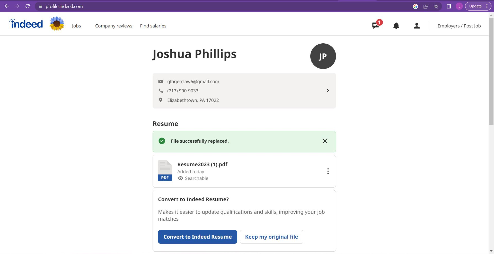
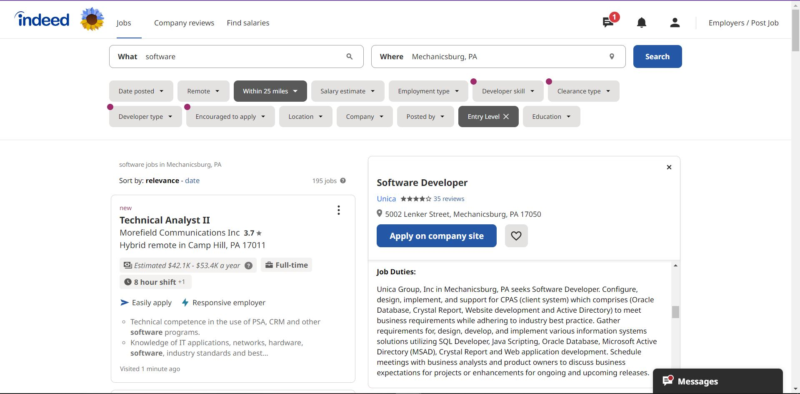
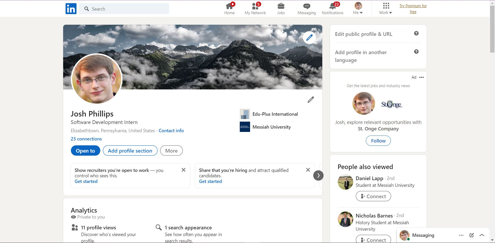
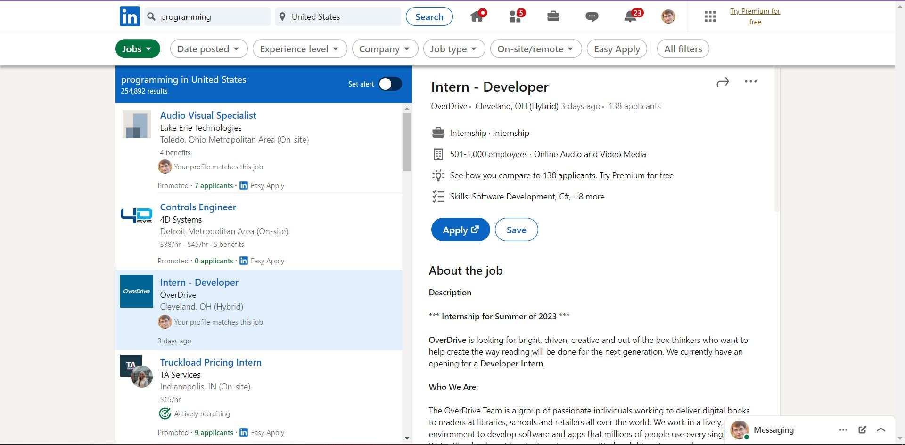

# Lab Report: UX/UI
___
**Course:** CIS 411, Spring 2021  
**Instructor(s):** [Trevor Bunch](https://github.com/trevordbunch)  
**Name:** Joshua Phillips  
**GitHub Handle:** jp1478  
**Repository:** Your Forked Repository  
**Collaborators:** Mike Shoul, Zach Booher, Tim Kratz, Ben Clarke, Rachel Beattie, Nason Allen  
___

# Step 1: Confirm Lab Setup
- [X] I have forked the repository and created my lab report
- [X] If I'm collaborating on this project, I have included their handles on the report and confirm that my report is informed, but not copied from my collaborators.

# Step 2: Evaluate Online Job Search Sites

## 2.1 Summary
| Site | Score | Summary |
|---|---|---|
| Indeed | 19 | Indeed was very straightforward and appealing to use. |
| LinkedIn | 14 | LinkedIn was somewhat confusing and overwhelming to navigate. |

## 2.2 Indeed
  
Indeed has a simple, understandable design, and I was easily able to update my resume. 

  
Indeed provides a wide variety of conditions to help narrow down your search. It has an application page if compatible, 
and a link to the company's site otherwise. 

| Category | Grade (0-3) | Comments / Justification |
|---|---|---|
| 1. **Don't make me think:** How intuitive was this site? | 3 | The site is very intuitive, without any excessive details.  |
| 2. **Users are busy:** Did this site value your time?  | 2 | The list of jobs required a lot of scrolling to view much of, but otherwise it is rather straightforward. |
| 3. **Good billboard design:** Did this site make the important steps and information clear? How or how not? | 2 | Important buttons were large and colorful, but job descriptions required some scrolling to reach. |
| 4. **Tell me what to do:** Did this site lead you towards a specific, opinionated path? | 3 | The site made it easy to find what you were looking for and take action. |
| 5. **Omit Words:** How careful was this site with its use of copy? | 3 | Headings and directives are brief and clear. |
| 6. **Navigation:** How effective was the workflow / navigation of the site? | 3 | There is a small but comprehensive amount of navigation options.  |
| 7. **Accessibility:** How accessible is this site to a screen reader or a mouse-less interface? | 3 | The site is compatible with chrome's screen reader extension and tab/touch selection. |
| **TOTAL** | 19 |   |

## 2.3 LinkedIn
  
LinkedIn has a long profile page where you have to scroll to see most of the relevant information. 
Many of the buttons have unclear labels, making it difficult to navigate. 
I was able to update the banner of my profile easily. 

The search page has a very granular filter system, but it is difficult to use. 
I was unable to give a location, so I got results from all over the country.

| Category | Grade (0-3) | Comments / Justification |
|---|---|---|
| 1. **Don't make me think:** How intuitive was this site? | 1 | The button labels do not make sense and the navigation is complicated. |
| 2. **Users are busy:** Did this site value your time?  | 3 | The apply button is noticeable and allows you to immediately send your resume. |
| 3. **Good billboard design:** Did this site make the important steps and information clear? How or how not? | 1 | It is not immediately obvious where the job listings are, and there are many details in the margins that crowd out the main content. |
| 4. **Tell me what to do:** Did this site lead you towards a specific, opinionated path? | 2 | Once I made it to the job search page, it was difficult to find relevant information. It was easy to see how to apply, though. |
| 5. **Omit Words:** How careful was this site with its use of copy? | 2 | There seems to be a lot of unnecessary text. |
| 6. **Navigation:** How effective was the workflow / navigation of the site? | 2 | The symbols used in the navbar were a bit unclear. |
| 7. **Accessibility:** How accessible is this site to a screen reader or a mouse-less interface? | 3 | The page is compatible with chrome's screen reader and tab/touch selection. |
| **TOTAL** | 14 |   |

# Step 3 Competitive Usability Test

## Step 3.1 Product Use Case

| Use Case #1 | |
|---|---|
| Title | Listing an Item |
| Description / Steps | 1. User navigates to the 'Sell Item' page.   2. The user fills out the Item Listing Form with details including a description, category, and images.   3. The user submits the Item Listing Form. |
| Primary Actor | Messiah Student |
| Preconditions | 1. The user must have a messiah.edu email address.   2. The user must be logged in to the application.   3. The user must have an item they want to sell. |
| Postconditions | The user will have listed an item that can be viewed by other users.  |

## Step 3.2 Identify a competitive product

List of Competitors
1. Facebook [https://www.facebook.com/marketplace/](https://www.facebook.com/marketplace/)
2. Craigslist [https://www.craigslist.org/about/sites](https://www.craigslist.org/about/sites)

## Step 3.3 Write a Useability Test

| Step | Tasks | Notes |
|---|---|---|
| 1 | Navigate to Facebook Marketplace. | Search in browser |
| 2 | Log in or create an account. | If you have an account and have logged in, you will stay logged in when you visit the site again. |
| 3 | Find a listing of a lawn mower. | The search bar is on the landing page. |
| 4 | Save the listing. | The save button is located between the image and information for a listing. |
| 5 | Find the saved listing on the saved posts page. | The saved posts page is somewhat difficult to find, since it is hidden in a submenu. |

## Step 3.4 Observe User Interactions

| Step | Tasks | Observations |
|---|---|---|
| 1 | Navigate to Facebook Marketplace. | The user easily found the site by typing 'facebook marketplace' into the search bar. |
| 2 | Log in or create an account. | The user was automatically logged in. |
| 3 | Find a listing of a lawn mower. | The user easily found the search bar and typed in 'lawn mower'. |
| 4 | Save the listing. | The user easily found the save button and clicked it. |
| 5 | Find the saved listing on the saved posts page. | This step took some time. The user first navigated to the profile page and looked around in submenus for awhile before they eventually found the 'more' tab on the sidebar, which contained the link to the saved posts page. |

## Step 3.5 Findings
The process was straightforward until the user had to locate their saved posts. This took some trial and error, and may have been frustrating for the user. 

# 4. Your UX Rule (Extra Credit)
If you opt to do extra credit, then include it here.