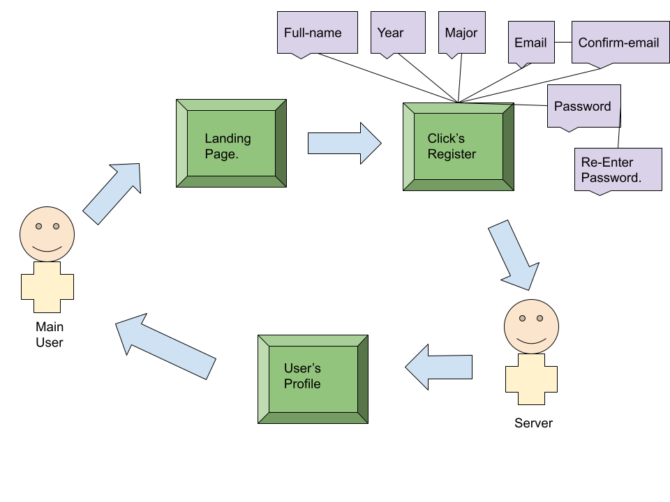

# Lab Report: UX/UI
___
**Course:** CIS 411, Spring 2021  
**Instructor(s):** [Trevor Bunch](https://github.com/trevordbunch)  
**Name:** Joe Vera
**GitHub Handle:** JoeVe22
**Repository:** [Lab Repository.](https://github.com/JoeV22/cis411_lab3_uiux)  
**Collaborators:** @Triggum, @el1303,@felixzrte,@RomanSearle, Alma Vera, Trevor Bunch.
___

# Step 1: Confirm Lab Setup
- [Yes] I have forked the repository and created my lab report
- [Yes] If I'm collaborating on this project, I have included their handles on the report and confirm that my report is informed, but not copied from my collaborators.

# Step 2: Evaluate Online Job Search Sites

## 2.1 Summary
| Site | Score | Summary |
|---|---|---|
| Ziprecruiter | 17/21 | ziprecruiter was the first site that i looked over since it has become one of the primary sites used by employers to find potential candidates. It was intuitive but it did have some issues in certain parts of the site. The good thing was that it did not take very long to fillout. The important steps were clear, but there were details left out that would have been helpfull. The design was good and allowed for the information to be understood. I would not that there were parts that i felt i needed to guess a bit as to what they wanted. The accessiblity was there which allowed for people with disabilities to use the site.   |
| Indeed | 21/21 | I was rather impressed by the site indeed. It did not make people second guess themselves and gave clear instructutions overall. It valued the users time by being very concise and straight to the point. It had good billboard design that supported it's information. It did clearly state what it wanted people to do and allowed them to find exactly the information they needed. It did have accessiblity which allowed disabled people to use the site readily. |

## 2.2 Site 1

| ZipRecruiter Profile Page |   |
|---|---|
| ZipRecruiter Main Page |   |
| ZipRecruiter Search Results |   |
| ZipRecruiter Job#1 |   |
| ZipRecruiter Job#2 |   |

| Category | Grade (0-3) | Comments / Justification |
|---|---|---|
| 1. **Don't make me think:** How intuitive was this site? | 2/3  | The site was intuitive giving instructions. But it had some aspects where it confused the user by not using clear wording.|
| 2. **User are busy:** Did this site value your time?  | 3/3  | It did not take very long to fill out and was made to be concise.  |
| 3. **Good billboard design:** Did this site make the important steps and information clear? How or how not? | 2/3  | Yes it made the important steps clear. There were certain steps that were more difficult to fillout because they were left to interpretation rather than flat out explained. |
| 4. **Tell me what to do:** Did this site lead you towards a specific, opinionated path? | 1/3  |  It Had instruction about what information it needed from you. But there was some confusion with the wording which led to misinterpretation. |
| 5. **Omit Words:** How careful was this site with its use of copy? | 3/3  | It did a good job with the omit words.  |
| 6. **Navigation:** How effective was the workflow / navigation of the site? | 3/3  | The workflow was good. It was very effective and allowed for easy navigation throughout the site.   |
| 7. **Accessibility:** How accessible is this site to a screen reader or a mouse-less interface? |  3/3 |  You are able to navigate the site quite well using a mouse-less interface. |
| **TOTAL** |  17/21 | overall the site was well designed. But it did have some aspects of it where it fell short of ideal. Overall it does have potential, it just needs some work.   |

## 2.3 Site 2
| Indeed Main Page |   |
|---|---|
| Indeed edit Profile Page |   |
| Indeed Job Search |   |
| Indeed Job#1 |   |
| Indeed Job#2 |   |

| Category | Grade (0-3) | Comments / Justification |
|---|---|---|
| 1. **Don't make me think:** How intuitive was this site? |  3/3 |  The site was very intuitive, the design and navigation were clear and precise. |
| 2. **User are busy:** Did this site value your time?  |  3/3 | The rigistration process and search process were quite quick. There was no unnecessary steps and it actively tried to keep all the required steps simple and concise.  |
| 3. **Good billboard design:** Did this site make the important steps and information clear? How or how not?  | 3/3   | It did make the important steps and information clear. It made the directions bold and were the centre of attention. It also had rules for the completion of each step appear to the side so that there would be no issues or confusion.  |
| 4. **Tell me what to do:** Did this site lead you towards a specific, opinionated path? | 3/3  | It did clarify exactly what i needed to do at each step and directed my attention towards looking for exactly what i needed.   |
| 5. **Omit Words:** How careful was this site with its use of copy? | 3/3  | It did a fantastic job of omitting words were it needed and using just the required amount of information, never going overboard with it's use of copy.   |
| 6. **Navigation:** How effective was the workflow / navigation of the site? | 3/3  | The navigation and work flow for the site were great. It felt fast and sleek, the navigation was intuitive and interactive. It allowed the user to really narrow in on what they needed to do.   |
| 7. **Accessibility:** How accessible is this site to a screen reader or a mouse-less interface? | 3/3  | There was accessibility built in to make it easy for someone with a disability to navigate through the site.   |
| **TOTAL** |  21/21 |  This site was genuinely really good for most users and it was designed to be very intuitive, quick and easy to use. |

# Step 3 Competitive Usability Test

## Step 3.1 Product Use Case

| Use Case #1 |   |
|---|---|
| Title | Registration Process |
| Description / Steps | User Registration. <ol><li> The User starts by going to the Landing Page.</li><li> The User Clicks the Registration button</li><li> The User needs to input the required information.  </li><li> Then the User Confirms the information.</li><li>The Server then Stores the Users information.</li></ol>  |
| Primary Actor | Main User|
| Preconditions | <ol><li> The User needs to be a messiah college student.</li></ol> |
| Postconditions | <ol><li> The User will be able to access the entire site.</li><li>The User will be able to signup for events.</li></ol>|

## Step 3.2 Identifier a competitive product

List of Competitors
1. Instagram [www.instagram.com](www.instagram.com)
2. Discord [Discord](www.Discord.com)

## Step 3.3 Write a Useability Test

| Step | Tasks |
|---|---|
| 1 | Go to Instagram.com   |
| 2 |  Click Signup. |
| 3 | Fillout required Fields.(Mobile/Email)(Full Name)(Username)(password) |
| 4 | Fillout birthday field. |
| 5 | Leave page and go to email |
| 6 | Click email confirmation. | 
| 7 | Clicking it opens back instagram to continue rigistration process. | 
| 8 | Look for friends/Contacts. |
| 9 | Pick interests. |
| 10 | Follow different popular instagram accounts. |
| 11 | End at personalized home page. |

## Step 3.4 Observe User Interactions

| Step | Tasks | Observations |
|---|---|---|
| 1 | Go to Instagram.com   | She was able to got the site right off the bat since she knew exactly where to go.|
| 2 |  Click Signup. | She clicked signup right away. |
| 3 | Fillout required Fields.(Mobile/Email)(Full Name)(Username)(password) | She filled out the exact information|
| 4 | Fillout birthday field. | She filled out her birthday field. |
| 5 | Leave page and go to email | she was a bit annoyed at the having to confirm her email before continuing but she went to her email. |
| 6 | Click email confirmation. | She clicked the confirmation email and was redirected back to the site.|
| 7 | Clicking it opens back instagram to continue rigistration process. | She continued the registration process.|
| 8 | Look for friends/Contacts. | She found me and a couple other people online |
| 9 | Pick interests. | She decided to skip this part. |
| 10 | Follow different popular instagram accounts. | She also skipped this part. |
| 11 | End at personalized home page. | She finished the signup process but thought it took a bit too long.|

## Step 3.5 Findings
Overall it went rather well, She was able to go through the motions quite well and the site appeared very natural to her. She did mention that it was similar to a lot of other sites. I believe that this might have infulenced her, since a lot of the information that was required of her was similar to what would be required in other sites. She seemed to find the sight quite intuitive and did not have much issue overall. It seems that she was annoyed over the extra measure of having to leave the site in order to complete the email confirmation. Although this is similar to other sites it seems that she doesn't like that.

The three things that could be improved about the workflow are as follows, inegrating the use of other existing accounts into the creation of an instagram account. Allow for more ease of communication through the use of different languages in the registration process for people who are fluent in other languages. Less requirements for registration.

The two expierences that i found benefited the user was the use of contacts in finding friends. Allowing her to connect with popular accounts that may be within ther interests.

My team did a good job of working together and coming up with a concise usability test that was straight to the point and was very clear. We could improve uppon it by adding more complexity to the usability and coming up with more conditions for it's use. I found it interesting doing the usability tests because i've never done it before. Since i had the technical knowledge to back up what i was testing i felt like i was appart of the process more.

# Extra Credit
A rule that i would create, would be that whatever information is on the page needs to be balanced and supported by the rest of the page.
It can't just be a random part but needs to add to the rest of the page and balance out visually with the rest of the page. If it's too random then it'll throw off the user when they stumble uppon it on the site. If it's not balanced with the rest of the page then it'll literally throw off the rest of the page and make the page look visually disjointed.